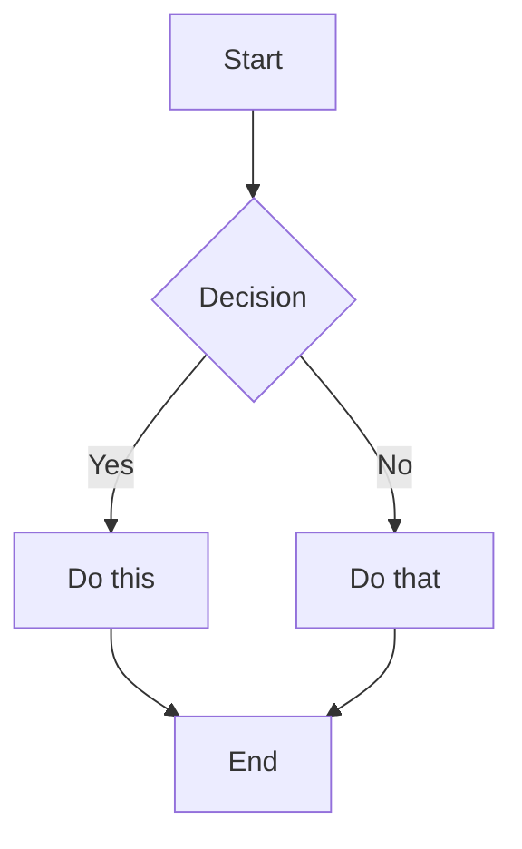
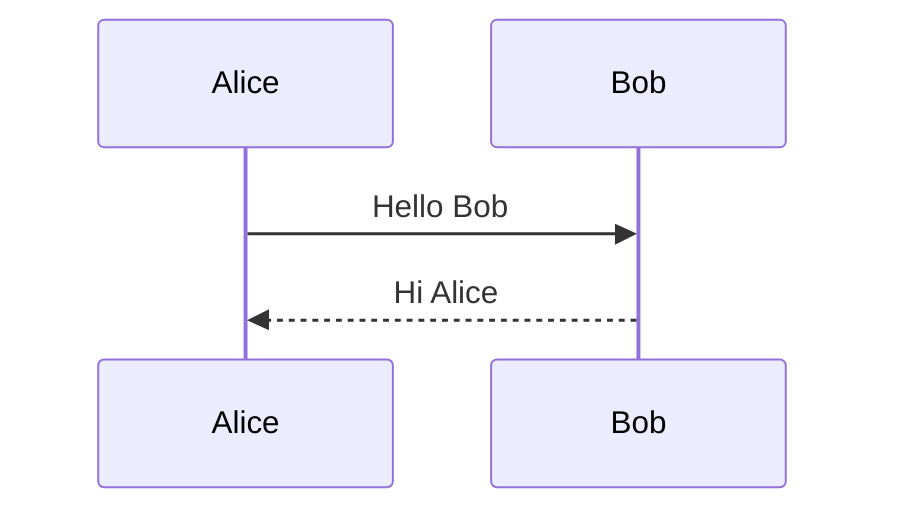
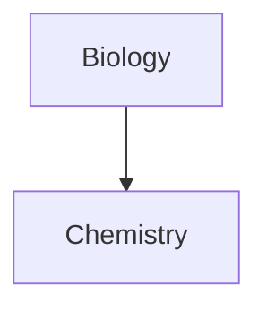
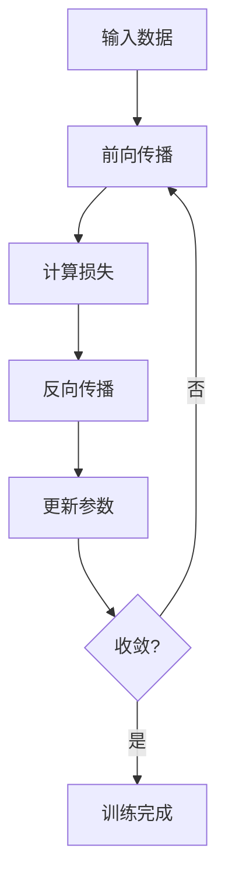

# Obsidian学习笔记Markdown技能

## 核心理念

为学习笔记优化的Obsidian Markdown语法，强调：
- **知识连接性**: 通过wikilinks建立知识网络
- **视觉层次**: 清晰的结构和重点突出
- **内容组织**: 高效的信息整理和检索
- **学习友好**: 适合知识积累和复习的格式

## 语法体系

Obsidian Markdown = 基础Markdown + 知识管理扩展
- **基础**: CommonMark + GitHub Flavored Markdown
- **数学**: LaTeX公式支持
- **扩展**: wikilinks、嵌入、提示框、属性等

## 学习笔记结构模板

### 标准笔记格式
```markdown
---
tags: #机器学习 #概念
aliases: ["神经网络", "NN"]
status: 学习中
created: 2024-01-15
---

# 神经网络基础

## 🎯 学习目标
- 理解神经网络的基本概念
- 掌握前向传播和反向传播
- 实现简单的神经网络

## 📖 核心概念

### 基本定义
神经网络是受生物神经系统启发的计算模型...

### 关键术语
- **神经元**: 基本计算单元
- **权重**: 连接强度参数
- **激活函数**: 非线性变换

## 🧮 数学原理

### 前向传播
$$y = f(Wx + b)$$

### 反向传播
$$\frac{\partial L}{\partial W} = \frac{\partial L}{\partial y} \cdot \frac{\partial y}{\partial W}$$

## 💻 代码实现
```python
import torch
import torch.nn as nn

class SimpleNet(nn.Module):
    def __init__(self):
        super().__init__()
        self.fc1 = nn.Linear(784, 128)
        self.fc2 = nn.Linear(128, 10)
    
    def forward(self, x):
        x = torch.relu(self.fc1(x))
        return self.fc2(x)
```

## 🔗 相关链接
- [[深度学习概述]]
- [[激活函数比较]]
- [[反向传播详解]]

## 📝 学习笔记
> [!note] 重要提醒
> 理解梯度消失问题是掌握深层网络的关键

## ❓ 疑问与思考
- 为什么需要激活函数？
- 如何选择合适的网络结构？

## 📚 参考资料
1. 《深度学习》- Ian Goodfellow
2. CS231n课程笔记
```

## 格式化语法速查

### 文本强调
```markdown
**重点内容** - 粗体强调
*关键词* - 斜体强调
==高亮文本== - 黄色高亮
`代码片段` - 行内代码
~~删除内容~~ - 删除线
```

### 标题层次
```markdown
# 一级标题 - 笔记主题
## 二级标题 - 主要章节  
### 三级标题 - 具体内容
#### 四级标题 - 细节说明
```

### 列表格式
```markdown
## 无序列表
- 主要概念
  - 子概念1
  - 子概念2
- 相关概念

## 有序列表
1. 第一步：理解概念
2. 第二步：实践应用
   1. 子步骤2.1
   2. 子步骤2.2
3. 第三步：总结反思

## 任务列表
- [ ] 理论学习
- [x] 代码实践
- [ ] 项目应用
```

## 🔗 知识连接系统

### Wikilinks基础语法
```markdown
# 基本链接
[[神经网络]]                    # 链接到笔记
[[神经网络|神经网络基础]]        # 自定义显示文本
[[神经网络#前向传播]]           # 链接到特定章节
[[神经网络#^block-id]]          # 链接到代码块
```

### 块级引用和链接
```markdown
# 定义可引用的块
这是重要的概念定义 ^concept-def

> 这是关键引用内容
> 包含多行说明
^key-quote

# 链接到块
[[神经网络#^concept-def|概念定义]]
[[神经网络#^key-quote|关键引用]]
```

### 知识网络构建
```markdown
## 概念关系图
- **神经网络** ← [[深度学习]]的子概念
- **前向传播** → [[反向传播]]的对应过程
- **激活函数** 影响 [[梯度消失]]

## 学习路径
[[数学基础]] → [[机器学习入门]] → [[神经网络]] → [[深度学习进阶]]
```

### 嵌入内容
```markdown
# 嵌入整个笔记
![[神经网络基础]]

# 嵌入特定章节
![[神经网络#数学原理]]

# 嵌入代码块
![[神经网络#Python实现]]

# 嵌入图片
![[神经网络架构图.png|400]]
```

## Markdown-Style Links

```markdown
[Display Text](Note%20Name.md)
[Display Text](Note%20Name.md#Heading)
[Display Text](https://example.com)
[Note](obsidian://open?vault=VaultName&file=Note.md)
```

Note: Spaces must be URL-encoded as `%20` in Markdown links.

## Embeds

### Embed Notes

```markdown
![[Note Name]]
![[Note Name#Heading]]
![[Note Name#^block-id]]
```

### Embed Images

```markdown
![[image.png]]
![[image.png|640x480]]    Width x Height
![[image.png|300]]        Width only (maintains aspect ratio)
```

### External Images

```markdown


```

### Embed Audio

```markdown
![[audio.mp3]]
![[audio.ogg]]
```

### Embed PDF

```markdown
![[document.pdf]]
![[document.pdf#page=3]]
![[document.pdf#height=400]]
```

### Embed Lists

```markdown
![[Note#^list-id]]
```

Where the list has been defined with a block ID:
```markdown
- Item 1
- Item 2
- Item 3

^list-id
```

### Embed Search Results

````markdown
```query
tag:#project status:done
```
````

## 📋 学习提示框系统

### 基础提示框
```markdown
> [!note] 📝 笔记
> 这是重要的学习要点

> [!info] ℹ️ 信息  
> 补充说明和背景知识

> [!tip] 💡 技巧
> 实用的学习方法或技巧

> [!warning] ⚠️ 注意
> 需要特别注意的内容
```

### 学习进度提示框
```markdown
> [!todo] 📋 待办
> - [ ] 理解基本概念
> - [x] 完成代码实践
> - [ ] 进行项目应用

> [!success] ✅ 已掌握
> 这个知识点已经完全理解

> [!question] ❓ 疑问
> 对这个概念还有疑问需要解决
```

### 可折叠提示框
```markdown
> [!abstract]- 📖 概要（默认折叠）
> 简要概述核心内容

> [!abstract]+ 📖 详细说明（默认展开）
> 详细的理论推导和说明
```

### 嵌套提示框
```markdown
> [!example] 💡 示例
> 这里是一个具体的应用示例
> 
> > [!note] 关键点
> > 示例中的关键注意事项
```

### 自定义学习提示框
```markdown
> [!important] 🎯 学习重点
> 这是本章的核心概念

> [!caution] ⚠️ 易错点  
> 常见的错误和误区

> [!help] 🆘 需要帮助
> 遇到困难时的求助方向
```

### Custom Callouts (CSS)

```css
.callout[data-callout="custom-type"] {
  --callout-color: 255, 0, 0;
  --callout-icon: lucide-alert-circle;
}
```

## Lists

### Unordered Lists

```markdown
- Item 1
- Item 2
  - Nested item
  - Another nested
- Item 3

* Also works with asterisks
+ Or plus signs
```

### Ordered Lists

```markdown
1. First item
2. Second item
   1. Nested numbered
   2. Another nested
3. Third item

1) Alternative syntax
2) With parentheses
```

### Task Lists

```markdown
- [ ] Incomplete task
- [x] Completed task
- [ ] Task with sub-tasks
  - [ ] Subtask 1
  - [x] Subtask 2
```

## Quotes

```markdown
> This is a blockquote.
> It can span multiple lines.
>
> And include multiple paragraphs.
>
> > Nested quotes work too.
```

## Code

### Inline Code

```markdown
Use `backticks` for inline code.
Use double backticks for ``code with a ` backtick inside``.
```

### Code Blocks

````markdown
```
Plain code block
```

```javascript
// Syntax highlighted code block
function hello() {
  console.log("Hello, world!");
}
```

```python
# Python example
def greet(name):
    print(f"Hello, {name}!")
```
````

### Nesting Code Blocks

Use more backticks or tildes for the outer block:

`````markdown
````markdown
Here's how to create a code block:
```js
console.log("Hello")
```
````
`````

## Tables

```markdown
| Header 1 | Header 2 | Header 3 |
|----------|----------|----------|
| Cell 1   | Cell 2   | Cell 3   |
| Cell 4   | Cell 5   | Cell 6   |
```

### Alignment

```markdown
| Left     | Center   | Right    |
|:---------|:--------:|---------:|
| Left     | Center   | Right    |
```

### Using Pipes in Tables

Escape pipes with backslash:
```markdown
| Column 1 | Column 2 |
|----------|----------|
| [[Link\|Display]] | ![[Image\|100]] |
```

## Math (LaTeX)

### Inline Math

```markdown
This is inline math: $e^{i\pi} + 1 = 0$
```

### Block Math

```markdown
$$
\begin{vmatrix}
a & b \\
c & d
\end{vmatrix} = ad - bc
$$
```

### Common Math Syntax

```markdown
$x^2$              Superscript
$x_i$              Subscript
$\frac{a}{b}$      Fraction
$\sqrt{x}$         Square root
$\sum_{i=1}^{n}$   Summation
$\int_a^b$         Integral
$\alpha, \beta$    Greek letters
```

## Diagrams (Mermaid)

````markdown

````

### Sequence Diagrams

````markdown

````

### Linking in Diagrams

````markdown

````

## Footnotes

```markdown
This sentence has a footnote[^1].

[^1]: This is the footnote content.

You can also use named footnotes[^note].

[^note]: Named footnotes still appear as numbers.

Inline footnotes are also supported.^[This is an inline footnote.]
```

## Comments

```markdown
This is visible %%but this is hidden%% text.

%%
This entire block is hidden.
It won't appear in reading view.
%%
```

## Horizontal Rules

```markdown
---
***
___
- - -
* * *
```

## 🏷️ 学习笔记属性系统

### 标准学习属性
```yaml
---
# 基础信息
title: "神经网络基础"
created: 2024-01-15
modified: 2024-01-20

# 学习管理
tags: 
  - #机器学习
  - #深度学习
  - #概念
aliases: 
  - "神经网络"
  - "NN基础"
status: 学习中
difficulty: 中等

# 进度跟踪
progress: 60
completed: false
priority: 高
review_count: 3
next_review: 2024-01-25

# 关联信息
prerequisites: "[[数学基础]]"
related: 
  - "[[深度学习概述]]"
  - "[[激活函数]]"
dependencies: "[[线性代数]]"

# 资源链接
resources:
  - "[[CS231n课程笔记]]"
  - "https://example.com/tutorial"

# 个人评分
rating: 4.5
confidence: 3
usefulness: 5

# 样式类
cssclasses:
  - learning-note
  - concept
---
```

### 学习标签体系
```markdown
# 学科分类
#机器学习 #深度学习 #强化学习 #自然语言处理

# 内容类型  
#概念 #算法 #实现 #理论 #实践

# 难度等级
#入门 #进阶 #高级 #专业

# 学习状态
#学习中 #已掌握 #需复习 #有问题

# 重要程度
#核心 #重点 #扩展 #选学

# 资源类型
#课程 #书籍 #论文 #视频 #代码
```

### 属性查询示例
```markdown
```query
table rows
  from #机器学习
  where status = "学习中"
  sort rating desc
```

```query
list
  from #概念
  where difficulty = "中等"
  and priority = "高"
```
```

## HTML Content

Obsidian supports HTML within Markdown:

```markdown
<div class="custom-container">
  <span style="color: red;">Colored text</span>
</div>

<details>
  <summary>Click to expand</summary>
  Hidden content here.
</details>

<kbd>Ctrl</kbd> + <kbd>C</kbd>
```

## 🎓 完整学习笔记示例

````markdown
---
title: "反向传播算法"
tags: 
  - #机器学习
  - #深度学习
  - #算法
aliases: 
  - "BP算法"
  - "Backpropagation"
status: 已掌握
difficulty: 进阶
progress: 100
rating: 5
prerequisites: "[[神经网络基础]]"
related: 
  - "[[梯度下降]]"
  - "[[激活函数]]"
created: 2024-01-15
modified: 2024-01-20
---

# 🧠 反向传播算法

## 🎯 学习目标
- 理解反向传播的数学原理
- 掌握梯度计算过程
- 实现完整的BP算法

## 📖 核心概念

### 算法定义
反向传播（Backpropagation）是训练神经网络的核心算法，通过链式法则计算损失函数对各参数的梯度。

> [!important] 🎯 关键洞察
> 反向传播的本质是**梯度从输出层向输入层传播**的过程

### 数学原理
$$\frac{\partial L}{\partial W^{(l)}} = \delta^{(l)} \cdot (a^{(l-1)})^T$$

其中：
- $\delta^{(l)}$ = 第$l$层的误差项
- $a^{(l-1)}$ = 第$l-1$层的激活值

## 🧮 算法推导

### 前向传播
```python
# 前向传播过程
def forward(X, W1, b1, W2, b2):
    z1 = np.dot(X, W1) + b1
    a1 = sigmoid(z1)
    z2 = np.dot(a1, W2) + b2
    y_hat = sigmoid(z2)
    return z1, a1, z2, y_hat
```

### 反向传播
```python
def backward(X, y, z1, a1, z2, y_hat, W2):
    m = X.shape[0]
    
    # 输出层梯度
    dz2 = y_hat - y
    dW2 = (1/m) * np.dot(a1.T, dz2)
    db2 = (1/m) * np.sum(dz2, axis=0, keepdims=True)
    
    # 隐藏层梯度
    dz1 = np.dot(dz2, W2.T) * sigmoid_derivative(z1)
    dW1 = (1/m) * np.dot(X.T, dz1)
    db1 = (1/m) * np.sum(dz1, axis=0, keepdims=True)
    
    return dW1, db1, dW2, db2
```

## 🔄 算法流程图



## 💡 实现技巧

> [!tip] 🚀 性能优化
> 使用向量化运算可以显著提升训练速度

### 梯度消失问题
```python
# 使用ReLU激活函数缓解梯度消失
def relu(x):
    return np.maximum(0, x)

def relu_derivative(x):
    return (x > 0).astype(float)
```

## 🔗 知识关联

### 前置知识
- ![[神经网络基础#数学原理]]
- ![[微积分基础#链式法则]]

### 相关概念
- [[梯度下降算法]] - 参数优化方法
- [[激活函数比较]] - 不同激活函数的特性
- [[优化算法进阶]] - Adam、RMSprop等

### 应用扩展
- [[卷积神经网络]] - CNN中的反向传播
- [[循环神经网络]] - RNN中的BPTT算法

## 📝 学习笔记

> [!note] 📝 重要理解
> 反向传播不是新的学习算法，而是**高效计算梯度的方法**

### 常见误区
1. ❌ 反向传播是学习算法
   ✅ 反向传播是梯度计算方法
2. ❌ 梯度总是指向最优解
   ✅ 可能陷入局部最优

### 关键要点
- [x] 理解链式法则的应用
- [x] 掌握梯度计算过程
- [x] 实现完整代码
- [ ] 分析收敛性质
- [ ] 比较不同优化器

## 🧪 实验验证

```python
# 简单实验验证
import numpy as np

# 创建测试数据
X = np.array([[0,0], [0,1], [1,0], [1,1]])
y = np.array([[0], [1], [1], [0]])

# 训练网络
W1, b1, W2, b2 = train_network(X, y, epochs=1000)

# 测试结果
predictions = predict(X, W1, b1, W2, b2)
print(f"准确率: {accuracy(y, predictions):.2f}")
```

## 📚 参考资源

### 经典论文
1. **Rumelhart et al., 1986** - 原始反向传播论文
2. **LeCun et al., 1998** - 梯度-based学习理论

### 在线资源
- [CS231n反向传播笔记](https://cs231n.github.io/optimization-2/)
- [Michael Nielsen的神经网络书籍](http://neuralnetworksanddeeplearning.com/chap2.html)

### 代码实现
- ![[BP算法完整实现.py]]
- ![[NumPy版神经网络示例.ipynb]]

## ❓ 思考题

1. 为什么反向传播被称为"反向"？
2. 如何理解链式法则在神经网络中的应用？
3. 梯度消失和梯度爆炸的成因是什么？

---
*最后复习: 2024-01-20 | 下次复习: 2024-01-27*
````

## References

- [Basic formatting syntax](https://help.obsidian.md/syntax)
- [Advanced formatting syntax](https://help.obsidian.md/advanced-syntax)
- [Obsidian Flavored Markdown](https://help.obsidian.md/obsidian-flavored-markdown)
- [Internal links](https://help.obsidian.md/links)
- [Embed files](https://help.obsidian.md/embeds)
- [Callouts](https://help.obsidian.md/callouts)
- [Properties](https://help.obsidian.md/properties)
