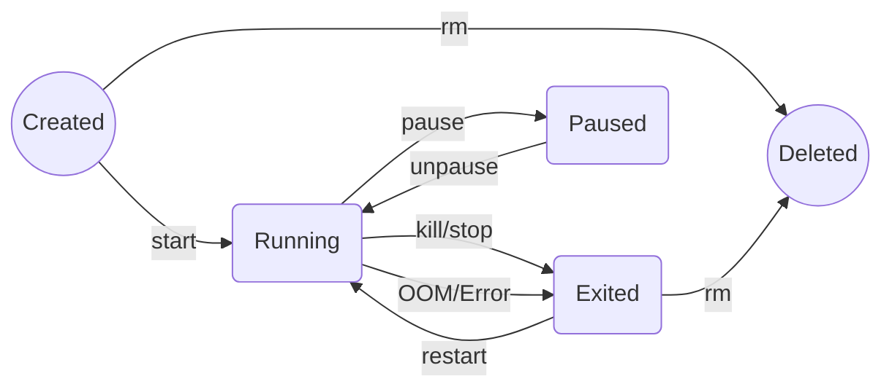

# 容器生命周期与状态机

## 适用场景
- 理解容器为什么会“挂掉”以及如何自动恢复。
- 为长期运行的服务（如 JupyterLab、TensorBoard、推理服务）配置自动重启。
- 识别训练任务因 OOM（内存溢出）被系统杀死的迹象。

## 1. 容器状态机
容器在生命周期中会在不同状态间流转。理解这些状态有助于排查“容器起不来”或“莫名退出”的问题。



- **Created**: 容器已创建但未启动（`docker create`）。
- **Running**: 进程正在运行。
- **Paused**: 所有进程被挂起（CPU 暂停调度，内存保留）。
- **Exited**: 主进程结束（正常退出或异常崩溃）。
- **Dead**: 僵尸状态，通常需要手动清理。

## 2. 重启策略 (`--restart`)
在深度学习任务中，重启策略非常重要。例如，你希望 TensorBoard 在服务器重启后自动拉起，但不希望一个因代码错误崩溃的训练脚本无限重启。

| 策略 | 描述 | 适用场景 |
| :--- | :--- | :--- |
| `no` | 默认值。容器退出后不重启。 | 一次性脚本、调试任务。 |
| `on-failure[:max-retries]` | 仅在非 0 状态码退出时重启。可限制重试次数。 | **模型训练任务**。防止因临时硬件故障中断，但避免代码错误导致的死循环。 |
| `always` | 无论如何退出，总是重启（手动 stop 除外，但重启 Docker 守护进程后会再次启动）。 | **基础服务**（SSH, 监控 agent）。 |
| `unless-stopped` | 类似 always，但如果容器被手动 stop 过，重启 Docker 后不会自动启动。 | **开发环境**（JupyterLab, TensorBoard）。 |

#### 示例
- 启动一个长期运行的 JupyterLab 开发环境：
```bash
docker run -d --gpus all \
  --restart unless-stopped \
  -p 8888:8888 \
  my-dl-env:latest
```

- 启动一个训练任务（失败重试 3 次）：
```bash
docker run -d --gpus all \
  --restart on-failure:3 \
  my-training-job:v1
```

## 3. 健康检查 (`HEALTHCHECK`)
对于推理服务（如 TorchServe, Triton, FastAPI），仅仅“进程存在”不代表“服务可用”（可能模型还在加载中）。`HEALTHCHECK` 指令可以让 Docker 定期检查服务状态。

#### Dockerfile 写法
```dockerfile
# 每 30 秒检查一次，超时 30 秒，连续 3 次失败则标记为 unhealthy
HEALTHCHECK --interval=30s --timeout=30s --start-period=60s --retries=3 \
  CMD curl -f http://localhost:8000/health || exit 1
```

#### 查看健康状态
```bash
docker ps
# 输出中 STATUS 一栏会显示 (healthy) 或 (unhealthy)
```

## 4. 常见退出码 (Exit Codes)
当容器异常退出（Exited）时，通过 `docker ps -a` 可以看到 Exit Code，这是排查问题的关键线索。

| 退出码 | 含义 | 常见原因 (DL 场景) | 解决方案 |
| :--- | :--- | :--- | :--- |
| **0** | 正常退出 | 训练脚本跑完了；手动执行了 `exit`。 | 无需处理。 |
| **1** | 应用错误 | Python 抛出未捕获异常；依赖缺失。 | 查看 `docker logs` 找 traceback。 |
| **137** | **SIGKILL (9)** | **OOM (Out Of Memory)**。宿主机内存不足，Linux OOM Killer 杀死了容器进程。 | **检查内存使用**；减小 Batch Size；限制容器内存 (`--memory`)。 |
| **139** | SIGSEGV (11) | 段错误 (Segmentation Fault)。 | 通常是 C++ 库冲突（如 PyTorch 与 CUDA 版本不匹配，或 OpenCV 问题）。 |
| **143** | SIGTERM (15) | 容器被 `docker stop` 优雅停止。 | 正常现象。 |

> [!TIP] 调试 OOM
> 如果退出码是 137，首先检查 `dmesg` 或 `docker inspect`：
> ```bash
> docker inspect --format='{{.State.OOMKilled}}' <container_id>
> ```
> 如果输出 `true`，说明确实是内存溢出。

