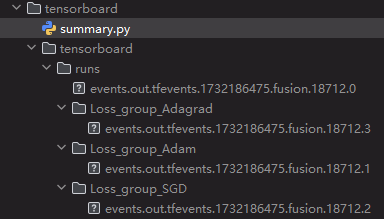

### 单一标量 writer.add_scalar

```python
from torch.utils.tensorboard import SummaryWriter

writer = SummaryWriter("logs/runs/test/1") 		# 在当前运行的地址处创建一个这样的路径目录
for x in range(10):
    writer.add_scalar("y=x", x, x)				# ""是图像的标量名称、X^2是纵轴、x是横轴
    writer.add_scalar("y=x^2", x**2, x)
    writer.add_scalar("y=x^3", x**3, x)

writer.close()
```

- 不同的标量会有不同的图像展现出来。

- 使用相同的标量会在同一张图像中展示。

### 多个标量writer.add_scalars

```python
from torch.utils.tensorboard import SummaryWriter
writer = SummaryWriter("tensorboard/runs")
for step in range(100):
    writer.add_scalars("Loss_group", {"Adam": 0.1 * step, "SGD": 0.2 * step,"Adagrad":0.3*step}, step)
writer.close()
```

- 会生成add_scalars第二个参数tag_scalar_dict字典中相应的标量图

- 同时会生成由add_scalars第一个参数$\text{main\_tag}$使用下划线“\_”同后面字典的键所构成的新路径下放着对应键对应值的log文件

  
