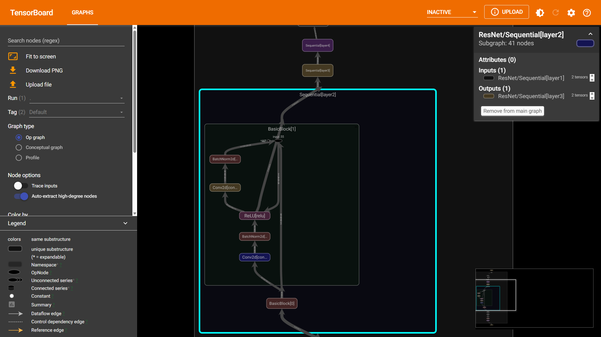

##### writer.add_graph

```python
import torch
from torchvision.models import resnet18
from torch.utils.tensorboard import SummaryWriter

writer = SummaryWriter("tensorboard/runs")
model = resnet18()
dummy_input = torch.randn(1, 3, 224, 224)
writer.add_graph(model, dummy_input)
```

$\text{.add\_graph}$可以实现可视化模型的计算图。效果还是很不错的。


 