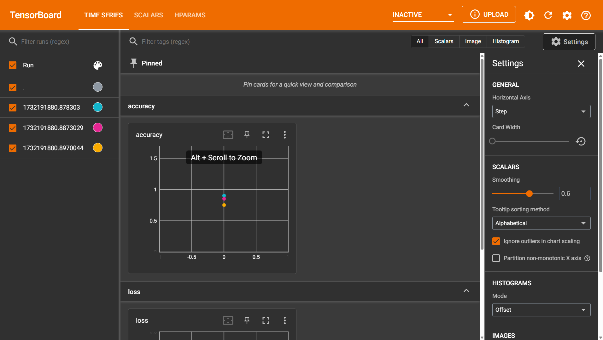
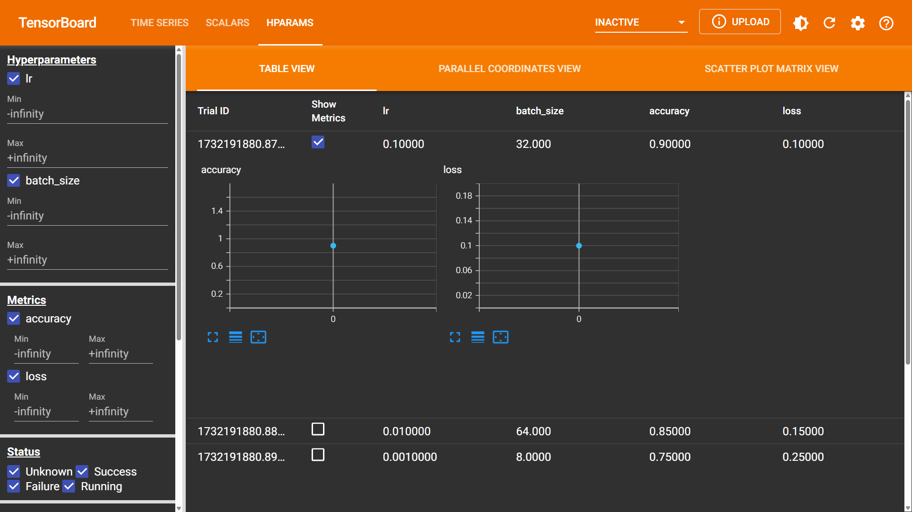

```python
from torch.utils.tensorboard import SummaryWriter
writer = SummaryWriter("tensorboard/runs")
hparams1 = {'lr': 0.1, 'batch_size': 32}
metrics1 = {'accuracy': 0.9, 'loss': 0.1}
writer.add_hparams(hparams1, metrics1)

hparams2 = {'lr': 0.01, 'batch_size': 64}
metrics2 = {'accuracy': 0.85, 'loss': 0.15}
writer.add_hparams(hparams2, metrics2)

hparams3 = {'lr': 0.001, 'batch_size': 8}
metrics3 = {'accuracy': 0.75, 'loss':  0.25}
writer.add_hparams(hparams3, metrics3)
writer.close()
```

这和多个标量针对于log路径作用的效果是一致。

这会展示不同的超参数下，准确度和损失值之间的指标对比。



点击$\text{HPARAMS}$菜单栏，可选中指定的超参数下的复选框进一步查看


