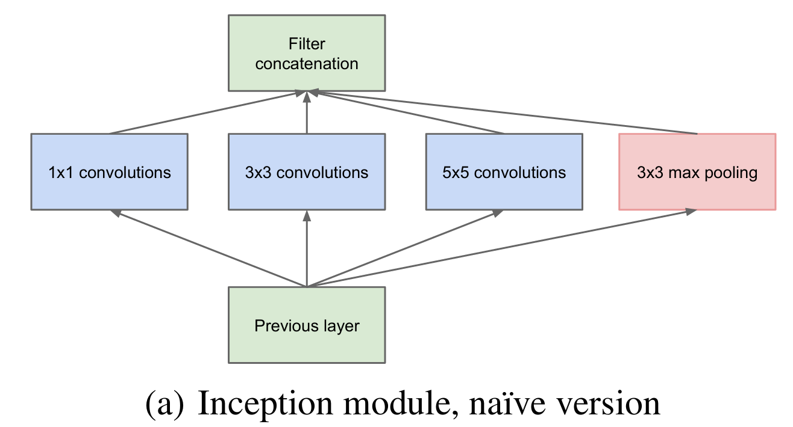
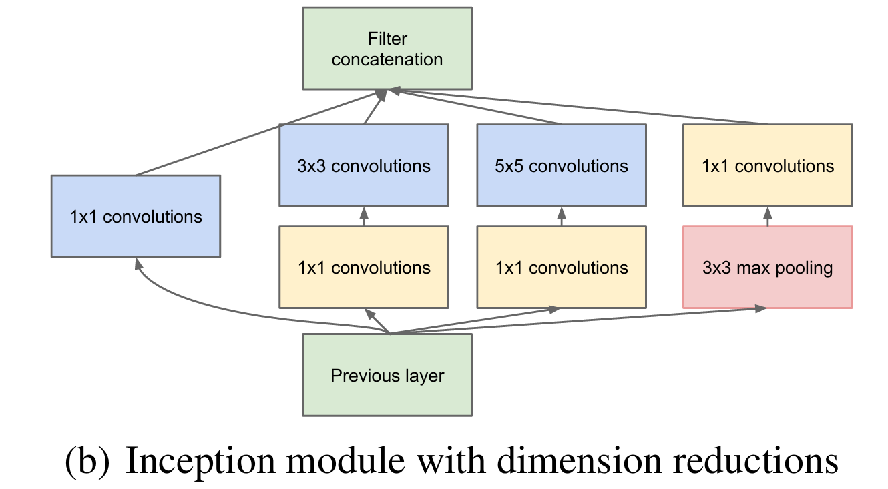

**GoogLeNet**网络有时又称为Inception-v1网络，其中使用了大量的Inception模块

在VGG的最后一层， 1×1 ， 3×3 和 5×5 卷积的感受野分别是196，228，260。我们根据感受野的计算公式也可以知道，网络的层数越深，不同大小的卷积对应在原图的感受野的大小差距越大，这也就是为什么Inception通常在越深的层次中效果越明显。

Inception模块的核心思想就是将**不同大小的卷积层**通过**并联**的方式结合在一起，经过不同卷积层处理的结果矩阵在**通道**这个深度维度拼接起来，形成一个更深的矩阵。Inception模块可以反复叠堆形成更大的网络，它可以对网络的深度和宽度进行高效的扩充，在提升深度学习网络准确率的同时防止过拟合现象的发生。Inception模块的优点是可以对尺寸较大的矩阵先进行降维处理(参数少了)的同时，在不同尺寸上对视觉信息进行聚合，方便从不同尺度对特征进行提取。

Inception-v1中使用了多个1×1卷积核，其作用：

1. ​	在大小相同的感受野上叠加更多的卷积核，可以让模型学习到更加丰富的特征。传统的卷积层的输入数据只和一种尺寸的卷积核进行运算，而Inception-v1结构是Network in Network(NIN)，就是先进行一次普通的卷积运算(比如5×5)，经过激活函数(比如ReLU)输出之后，然后再进行一次1×1的卷积运算，这个后面也跟着一个激活函数。1×1的卷积操作可以理解为feature maps个神经元都进行了一个全连接运算。
2. ​        使用1×1的卷积核可以对模型进行降维，减少运算量。当一个卷积层输入了很多feature maps的时候，这个时候进行卷积运算计算量会非常大，如果先对输入进行降维操作，feature maps减少之后再进行卷积运算，运算量会大幅减少。