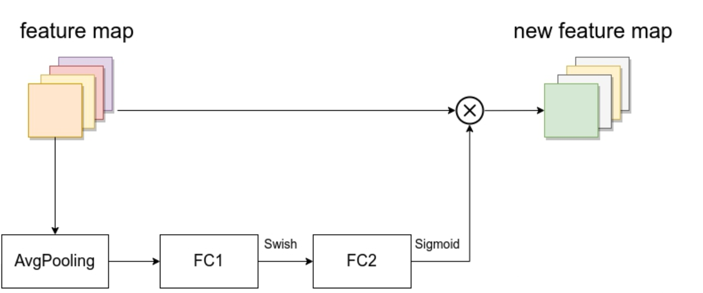

- 由一个全局平均池化(global average pooling)， 两个全连接层组成。 
- 第一个全连接层的节点个数是**输入MBConv模块**的特征矩阵channels的**1/4**，不像MobileNet-v3针对于**输入SE模块**的特征矩阵
- 第一个激活函数，**EfficientNet中的SE模块使用Swish激活函数**。提出SE模块的论文与MobileNet-v3中均用的是ReLu激活函数
- 第二个全连接层的节点个数等于Depthwise Conv层输出的特征矩阵channels， 且使用Sigmoid激活函数。 
- 注意两个分支之间是相乘关系