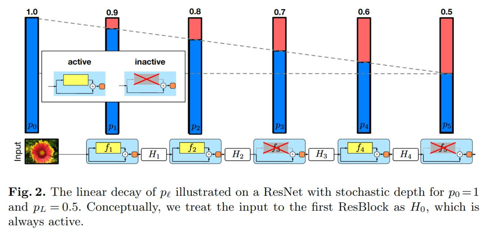

随机深度（Stochastic Depth）由 Huang et al.（2016）提出，是一种用于深度残差网络的正则化技术。

---

## 一、核心思想

在**训练阶段**，以一定概率随机跳过（丢弃）残差块的主分支，仅保留捷径分支（恒等映射）；**测试阶段**使用完整网络。

---

## 二、数学形式

### 2.1 标准残差块

$$H_l = \text{ReLU}(f_l(H_{l-1}) + H_{l-1})$$

其中 $f_l$ 是第 $l$ 层残差块的主分支变换。

### 2.2 随机深度残差块

引入伯努利随机变量 $b_l \in \{0, 1\}$：

$$H_l = \text{ReLU}(b_l \cdot f_l(H_{l-1}) + H_{l-1})$$

- $b_l = 1$：正常执行残差块
- $b_l = 0$：跳过主分支，仅保留恒等映射 $H_l = H_{l-1}$

### 2.3 存活概率

采用**线性衰减**策略，浅层保留概率高，深层保留概率低：

$$p_l = 1 - \frac{l}{L}(1 - p_L)$$

其中：
- $L$：网络总层数
- $p_L$：最后一层的存活概率（通常 $p_L = 0.5$）
- $p_l$：第 $l$ 层的存活概率

**示例**：对于 $L=20, p_L=0.5$：
- 第 1 层：$p_1 = 1 - \frac{1}{20} \times 0.5 = 0.975$
- 第 10 层：$p_{10} = 1 - \frac{10}{20} \times 0.5 = 0.75$
- 第 20 层：$p_{20} = 0.5$

---

## 三、测试阶段

测试时使用全部残差块，但需对主分支输出进行**期望校正**：

$$H_l = \text{ReLU}(p_l \cdot f_l(H_{l-1}) + H_{l-1})$$

这确保训练和测试时的期望输出一致。

---

## 四、优势

| **优势**         | **说明**                                         |
| ---------------- | ------------------------------------------------ |
| **加速训练**     | 随机跳过层减少前向/反向传播计算量                |
| **正则化效果**   | 类似 Dropout，减少过拟合                         |
| **梯度流改善**   | 缩短有效深度，缓解梯度消失                       |
| **隐式集成**     | 训练时采样不同深度的子网络，测试时相当于集成     |

---

## 五、结构示意图

图中展示了存活概率从 1.0（浅层）线性衰减至 0.5（深层）的渐变存活策略。
