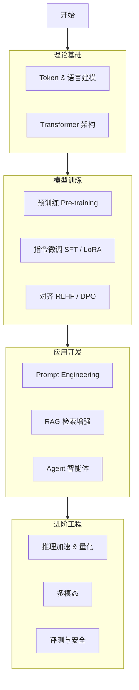

# 学习路线：从入门到精通

本学习路线旨在为你提供一个结构化、分阶段的 LLM 学习指南。本章的目录结构正是按照此逻辑编排的。

## 第一阶段：理论基础 (Foundation)
**目标**：理解 LLM 是如何工作的，掌握核心架构和基本原理。

*   **01 概览与学习路线**：建立宏观认知，了解 LLM 能做什么、不能做什么。（当前章节）
*   **02 发展史与关键里程碑**：从 N-gram 到 RNN，再到 Transformer 和 GPT-4。了解技术演进的脉络，知道为什么 Decoder-only 胜出了。
*   **03 语言建模与 Token 基础**：
    *   理解什么是 Token（词元），BPE 分词算法。
    *   理解语言模型的核心任务：$P(w_t | w_{1:t-1})$。
*   **04 Transformer 核心结构**：
    *   复习 Attention 机制。
    *   深入理解 Decoder-only 架构（GPT 风格）。
    *   掌握位置编码（RoPE, ALiBi）和 KV Cache 等 LLM 特有的细节。

## 第二阶段：模型训练 (Training Pipeline)
**目标**：掌握从无到有训练一个 LLM 的全流程，包括预训练、微调和对齐。

*   **05 预训练 (Pre-training)**：
    *   数据工程：清洗、去重、配比。
    *   Scaling Laws：参数量、数据量与计算量的关系。
    *   分布式训练基础：如何训练千亿参数模型。
*   **06 指令微调 (SFT) 与 PEFT**：
    *   SFT (Supervised Fine-Tuning)：如何让模型听懂指令。
    *   PEFT (Parameter-Efficient Fine-Tuning)：LoRA, QLoRA, P-Tuning。如何在消费级显卡上微调大模型。
*   **07 对齐与偏好学习 (Alignment)**：
    *   RLHF (Reinforcement Learning from Human Feedback)：PPO 算法。
    *   DPO (Direct Preference Optimization)：更稳定的非强化学习对齐方法。

## 第三阶段：推理与应用 (Inference & Application)
**目标**：学会如何高效地运行模型，并利用模型构建实际应用。

*   **08 推理与解码**：
    *   解码策略：Greedy, Beam Search, Top-k, Top-p, Temperature。
    *   长序列处理：Long Context 技术。
*   **09 RAG (检索增强生成)**：
    *   解决幻觉和知识过时的核心技术。
    *   向量数据库、检索策略、重排序。
*   **10 Agent 与工具调用**：
    *   ReAct 框架、Function Calling。
    *   让 LLM 操控外部世界。

## 第四阶段：进阶与工程 (Advanced & Engineering)
**目标**：关注前沿方向、系统优化和落地部署。

*   **11 多模态 (Multimodal)**：
    *   **视觉 (Vision)**: LLaVA, GPT-4V。如何让 LLM 看懂图片。
    *   **语音 (Audio)**: Whisper, VALL-E, GPT-4o。
        *   音频 Token 化 (AudioCodec)。
        *   语音识别 (ASR) 与合成 (TTS) 的大模型化。
        *   端到端语音交互。
*   **12 评测与安全**：
    *   Benchmarks (MMLU, GSM8K)。
    *   Prompt Injection 攻击与防御。
*   **13 系统工程与 MLOps**：
    *   推理加速：vLLM, TensorRT-LLM。
    *   量化技术：GPTQ, AWQ。
    *   模型部署与服务化。

## 学习建议

1.  **动手实践**：不要只看论文。尝试跑通一个开源模型（如 Llama 3, Qwen），试着微调它（使用 LLaMA-Factory 等工具）。
2.  **关注开源**：Hugging Face 是你的好朋友。关注最新的开源模型和数据集。
3.  **由浅入深**：先学会用（Prompt Engineering, API 调用），再学会调（Fine-tuning），最后再研究怎么训（Pre-training）。

---

## 路线图可视化

