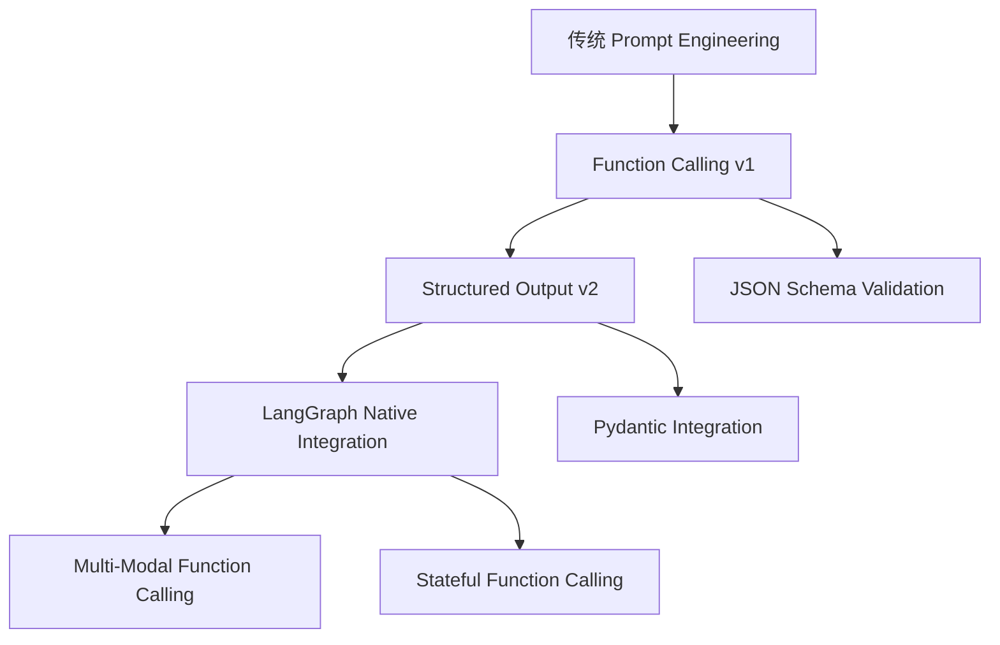

# LangGraph 函数调用与 JSON Schema

## 概述

LangGraph 提供了强大的函数调用机制，结合 JSON Schema 可以实现结构化的数据提取和处理。这是构建可靠 AI 应用的核心技术。

## 前沿技术路线

### 1. 函数调用架构演进



### 2. 核心技术栈

- **LangGraph**: 状态图执行引擎
- **JSON Schema**: 数据结构定义和验证
- **Pydantic**: Python 数据验证库
- **Tool Calling**: 工具调用机制

## 函数调用基础

### 1. 基本函数定义

```python
from langgraph.prebuilt import create_react_agent
from langchain_core.tools import tool
from langchain_core.messages import HumanMessage
import json

# 定义工具函数
@tool
def get_weather(location: str, unit: str = "celsius") -> str:
    """获取指定地点的天气信息
    
    Args:
        location: 城市名称
        unit: 温度单位 (celsius 或 fahrenheit)
    """
    # 模拟天气数据
    weather_data = {
        "北京": {"temp": 25, "condition": "晴朗"},
        "上海": {"temp": 28, "condition": "多云"},
        "广州": {"temp": 32, "condition": "小雨"}
    }
    
    if location not in weather_data:
        return f"抱歉，无法获取 {location} 的天气信息"
    
    data = weather_data[location]
    temp = data["temp"]
    condition = data["condition"]
    
    if unit == "fahrenheit":
        temp = temp * 9/5 + 32
    
    return f"{location} 当前温度: {temp}°{unit[0].upper()}, 天气: {condition}"

# 创建 Agent
agent = create_react_agent(
    model="gpt-4o-mini",
    tools=[get_weather],
    debug=True
)

# 执行查询
response = agent.invoke({
    "messages": [HumanMessage(content="北京今天天气怎么样？")]
})

print(response["messages"][-1].content)
```

### 2. JSON Schema 集成

```python
from pydantic import BaseModel, Field
from typing import List, Optional
from langchain_core.output_parsers import PydanticOutputParser

# 定义数据模型
class WeatherInfo(BaseModel):
    location: str = Field(description="城市名称")
    temperature: float = Field(description="温度")
    unit: str = Field(description="温度单位")
    condition: str = Field(description="天气状况")
    humidity: Optional[float] = Field(description="湿度百分比", default=None)
    wind_speed: Optional[float] = Field(description="风速 km/h", default=None)

class WeatherForecast(BaseModel):
    current: WeatherInfo = Field(description="当前天气")
    forecast: List[WeatherInfo] = Field(description="未来天气预报")
    location: str = Field(description="查询地点")

# 创建解析器
parser = PydanticOutputParser(pydantic_object=WeatherForecast)

# 构建带格式要求的 Prompt
prompt_template = """
你是一个专业的天气助手。请根据用户查询提供详细的天气信息。

用户查询: {query}

{format_instructions}

请提供准确、详细的天气信息。
"""

from langchain_core.prompts import ChatPromptTemplate

prompt = ChatPromptTemplate.from_template(prompt_template)

# 使用示例
formatted_prompt = prompt.format(
    query="北京今天和未来三天的天气",
    format_instructions=parser.get_format_instructions()
)

print("格式化 Prompt:")
print(formatted_prompt)
```

## 高级函数调用模式

### 1. 多函数协同调用

```python
from langgraph.prebuilt import create_react_agent
from langchain_core.tools import tool
from typing import Dict, Any

@tool
def search_flights(origin: str, destination: str, date: str) -> Dict[str, Any]:
    """搜索航班信息
    
    Args:
        origin: 出发城市
        destination: 目的地城市  
        date: 出发日期 (YYYY-MM-DD)
    """
    # 模拟航班数据
    flights = [
        {
            "flight_id": "CA1234",
            "airline": "中国国航",
            "departure": "08:00",
            "arrival": "10:30",
            "price": 1280,
            "available_seats": 45
        },
        {
            "flight_id": "MU5678", 
            "airline": "东方航空",
            "departure": "14:00",
            "arrival": "16:20",
            "price": 980,
            "available_seats": 12
        }
    ]
    
    return {
        "origin": origin,
        "destination": destination,
        "date": date,
        "flights": flights
    }

@tool
def book_flight(flight_id: str, passenger_name: str, seats: int) -> Dict[str, Any]:
    """预订航班
    
    Args:
        flight_id: 航班ID
        passenger_name: 乘客姓名
        seats: 预订座位数
    """
    # 模拟预订逻辑
    booking_id = f"BK{flight_id[-4:]}{hash(passenger_name) % 10000:04d}"
    
    return {
        "booking_id": booking_id,
        "flight_id": flight_id,
        "passenger_name": passenger_name,
        "seats": seats,
        "status": "confirmed",
        "total_price": seats * 1200  # 模拟价格
    }

@tool
def get_booking_details(booking_id: str) -> Dict[str, Any]:
    """获取预订详情
    
    Args:
        booking_id: 预订ID
    """
    # 模拟查询预订信息
    return {
        "booking_id": booking_id,
        "flight_id": "CA1234",
        "passenger_name": "张三",
        "seats": 2,
        "departure": "2024-02-15 08:00",
        "arrival": "2024-02-15 10:30",
        "gate": "A12",
        "status": "confirmed"
    }

# 创建多工具 Agent
travel_agent = create_react_agent(
    model="gpt-4o-mini",
    tools=[search_flights, book_flight, get_booking_details],
    debug=True
)

# 复杂查询示例
response = travel_agent.invoke({
    "messages": [HumanMessage(content="""
    我想预订从北京到上海的机票，明天出发，需要2个座位。
    请帮我搜索可用航班并完成预订。
    """)]
})

print(response["messages"][-1].content)
```

### 2. 条件函数调用

```python
from langgraph import StateGraph, START, END
from langchain_core.messages import BaseMessage, HumanMessage, AIMessage
from typing import TypedDict, List
import json

# 定义状态
class AgentState(TypedDict):
    messages: List[BaseMessage]
    current_step: str
    context: dict

# 条件判断函数
def should_call_tool(state: AgentState) -> str:
    """判断是否需要调用工具"""
    last_message = state["messages"][-1]
    
    # 检查是否包含特定关键词
    if "天气" in last_message.content or "温度" in last_message.content:
        return "weather_tool"
    elif "航班" in last_message.content or "机票" in last_message.content:
        return "flight_tool"
    else:
        return "direct_response"

def call_weather_tool(state: AgentState) -> AgentState:
    """调用天气工具"""
    last_message = state["messages"][-1]
    
    # 提取城市信息
    cities = ["北京", "上海", "广州", "深圳"]
    found_city = None
    for city in cities:
        if city in last_message.content:
            found_city = city
            break
    
    if found_city:
        # 调用天气工具
        weather_result = get_weather.invoke({"location": found_city})
        
        # 添加工具调用结果
        tool_message = AIMessage(
            content=f"天气查询结果: {weather_result}",
            name="get_weather"
        )
        state["messages"].append(tool_message)
        state["context"]["weather"] = weather_result
    
    return state

def call_flight_tool(state: AgentState) -> AgentState:
    """调用航班工具"""
    last_message = state["messages"][-1]
    
    # 提取航班信息
    # 这里简化处理，实际应用中需要更复杂的 NLP 解析
    flight_result = search_flights.invoke({
        "origin": "北京",
        "destination": "上海", 
        "date": "2024-02-15"
    })
    
    tool_message = AIMessage(
        content=f"航班查询结果: {json.dumps(flight_result, ensure_ascii=False)}",
        name="search_flights"
    )
    state["messages"].append(tool_message)
    state["context"]["flights"] = flight_result
    
    return state

def direct_response(state: AgentState) -> AgentState:
    """直接响应"""
    last_message = state["messages"][-1]
    
    response = AIMessage(
        content="我理解您的问题，但我需要更多信息来帮助您。请告诉我您想查询天气还是航班信息？"
    )
    state["messages"].append(response)
    
    return state

# 构建状态图
workflow = StateGraph(AgentState)

# 添加节点
workflow.add_node("should_call_tool", should_call_tool)
workflow.add_node("call_weather_tool", call_weather_tool)
workflow.add_node("call_flight_tool", call_flight_tool)
workflow.add_node("direct_response", direct_response)

# 添加边
workflow.add_edge(START, "should_call_tool")
workflow.add_conditional_edges(
    "should_call_tool",
    lambda state: state["messages"][-1].content,
    {
        "weather_tool": "call_weather_tool",
        "flight_tool": "call_flight_tool", 
        "direct_response": "direct_response"
    }
)
workflow.add_edge("call_weather_tool", END)
workflow.add_edge("call_flight_tool", END)
workflow.add_edge("direct_response", END)

# 编译图
app = workflow.compile()

# 执行示例
initial_state = {
    "messages": [HumanMessage(content="北京今天天气怎么样？")],
    "current_step": "start",
    "context": {}
}

result = app.invoke(initial_state)
print(result["messages"][-1].content)
```

## 结构化输出最佳实践

### 1. Pydantic 模型设计

```python
from pydantic import BaseModel, Field, validator
from typing import List, Optional, Union
from datetime import datetime
from enum import Enum

class WeatherCondition(str, Enum):
    SUNNY = "sunny"
    CLOUDY = "cloudy"
    RAINY = "rainy"
    SNOWY = "snowy"
    FOGGY = "foggy"

class TemperatureUnit(str, Enum):
    CELSIUS = "celsius"
    FAHRENHEIT = "fahrenheit"

class WeatherAlert(BaseModel):
    level: str = Field(description="预警级别: low, medium, high, extreme")
    type: str = Field(description="预警类型: heat, cold, rain, wind, fog")
    message: str = Field(description="预警信息")
    start_time: Optional[datetime] = Field(description="开始时间")
    end_time: Optional[datetime] = Field(description="结束时间")

class WeatherInfo(BaseModel):
    location: str = Field(..., description="城市名称", min_length=1, max_length=50)
    temperature: float = Field(..., description="温度", ge=-50, le=60)
    unit: TemperatureUnit = Field(default=TemperatureUnit.CELSIUS, description="温度单位")
    condition: WeatherCondition = Field(..., description="天气状况")
    humidity: Optional[float] = Field(None, description="湿度百分比", ge=0, le=100)
    wind_speed: Optional[float] = Field(None, description="风速 km/h", ge=0)
    visibility: Optional[float] = Field(None, description="能见度 km", ge=0)
    uv_index: Optional[int] = Field(None, description="紫外线指数", ge=0, le=11)
    alerts: List[WeatherAlert] = Field(default_factory=list, description="天气预警")
    
    @validator('temperature')
    def validate_temperature(cls, v, values):
        """温度验证"""
        if 'unit' in values and values['unit'] == TemperatureUnit.FAHRENHEIT:
            if v < -58 or v > 140:  # 华氏度合理范围
                raise ValueError('华氏度温度超出合理范围')
        else:
            if v < -50 or v > 60:  # 摄氏度合理范围
                raise ValueError('摄氏度温度超出合理范围')
        return v
    
    @validator('humidity')
    def validate_humidity(cls, v):
        """湿度验证"""
        if v is not None and (v < 0 or v > 100):
            raise ValueError('湿度必须在 0-100% 之间')
        return v

class WeatherForecast(BaseModel):
    location: str = Field(..., description="查询地点")
    current: WeatherInfo = Field(..., description="当前天气")
    hourly: List[WeatherInfo] = Field(default_factory=list, description="24小时预报")
    daily: List[WeatherInfo] = Field(default_factory=list, description="7天预报")
    generated_at: datetime = Field(default_factory=datetime.now, description="生成时间")
    
    @validator('hourly')
    def validate_hourly_forecast(cls, v):
        """小时预报验证"""
        if len(v) > 24:
            raise ValueError('小时预报不能超过24小时')
        return v
    
    @validator('daily')
    def validate_daily_forecast(cls, v):
        """日预报验证"""
        if len(v) > 7:
            raise ValueError('日预报不能超过7天')
        return v

# 使用示例
def create_sample_weather():
    """创建示例天气数据"""
    current_weather = WeatherInfo(
        location="北京",
        temperature=25.5,
        unit=TemperatureUnit.CELSIUS,
        condition=WeatherCondition.SUNNY,
        humidity=65.0,
        wind_speed=12.5,
        visibility=10.0,
        uv_index=6
    )
    
    # 添加预警
    heat_alert = WeatherAlert(
        level="medium",
        type="heat",
        message="今日高温预警，请注意防暑降温",
        start_time=datetime.now(),
        end_time=datetime.now().replace(hour=18, minute=0)
    )
    
    current_weather.alerts.append(heat_alert)
    
    forecast = WeatherForecast(
        location="北京",
        current=current_weather
    )
    
    return forecast

# 验证和输出
sample_weather = create_sample_weather()
print("JSON Schema:")
print(sample_weather.model_json_schema())
print("\n示例数据:")
print(sample_weather.model_dump_json(indent=2, ensure_ascii=False))
```

### 2. 错误处理和重试机制

```python
from langchain_core.tools import tool
from langchain_core.exceptions import OutputParserException
from typing import Dict, Any
import time
import random

class ToolCallError(Exception):
    """工具调用错误"""
    pass

def retry_tool_call(max_retries: int = 3, delay: float = 1.0):
    """工具调用重试装饰器"""
    def decorator(func):
        def wrapper(*args, **kwargs):
            last_error = None
            
            for attempt in range(max_retries):
                try:
                    return func(*args, **kwargs)
                except Exception as e:
                    last_error = e
                    if attempt < max_retries - 1:
                        # 指数退避
                        sleep_time = delay * (2 ** attempt) + random.uniform(0, 0.5)
                        time.sleep(sleep_time)
                        continue
                    else:
                        raise ToolCallError(f"工具调用失败，已重试 {max_retries} 次: {str(last_error)}")
            
            return None
        return wrapper
    return decorator

@tool
@retry_tool_call(max_retries=3, delay=1.0)
def reliable_weather_api(location: str) -> Dict[str, Any]:
    """可靠的天气 API 调用
    
    Args:
        location: 城市名称
    """
    # 模拟 API 调用可能失败
    if random.random() < 0.3:  # 30% 失败率
        raise Exception("API 调用失败: 网络超时")
    
    # 正常返回
    return {
        "location": location,
        "temperature": random.uniform(15, 35),
        "condition": random.choice(["sunny", "cloudy", "rainy"]),
        "humidity": random.uniform(40, 80)
    }

# 错误处理 Agent
def handle_tool_errors(state: AgentState) -> AgentState:
    """处理工具调用错误"""
    last_message = state["messages"][-1]
    
    if isinstance(last_message, AIMessage) and "error" in last_message.content.lower():
        # 提取错误信息
        error_info = last_message.content
        
        # 生成友好的错误响应
        error_response = AIMessage(
            content=f"抱歉，在处理您的请求时遇到了问题: {error_info}\n\n"
                   f"请稍后再试，或者尝试重新表述您的问题。"
        )
        state["messages"].append(error_response)
        
        # 记录错误到上下文
        state["context"]["last_error"] = error_info
    
    return state
```

## 实际应用案例

### 1. 智能客服系统

```python
from langgraph.prebuilt import create_react_agent
from langchain_core.tools import tool
from pydantic import BaseModel, Field
from typing import List, Optional

# 定义客服数据模型
class CustomerInfo(BaseModel):
    customer_id: str = Field(..., description="客户ID")
    name: str = Field(..., description="客户姓名")
    email: str = Field(..., description="客户邮箱")
    phone: Optional[str] = Field(None, description="客户电话")
    vip_level: str = Field(default="normal", description="VIP等级")

class OrderInfo(BaseModel):
    order_id: str = Field(..., description="订单ID")
    customer_id: str = Field(..., description="客户ID")
    product_name: str = Field(..., description="产品名称")
    amount: float = Field(..., description="订单金额")
    status: str = Field(..., description="订单状态")
    order_date: str = Field(..., description="下单日期")

class ServiceRequest(BaseModel):
    request_id: str = Field(..., description="请求ID")
    customer_id: str = Field(..., description="客户ID")
    request_type: str = Field(..., description="请求类型")
    description: str = Field(..., description="问题描述")
    priority: str = Field(default="medium", description="优先级")
    status: str = Field(default="pending", description="处理状态")

# 客服工具
@tool
def get_customer_info(customer_id: str) -> Dict[str, Any]:
    """获取客户信息
    
    Args:
        customer_id: 客户ID
    """
    # 模拟数据库查询
    customers = {
        "C001": {
            "customer_id": "C001",
            "name": "张三",
            "email": "zhangsan@example.com",
            "phone": "13800138000",
            "vip_level": "gold"
        },
        "C002": {
            "customer_id": "C002", 
            "name": "李四",
            "email": "lisi@example.com",
            "phone": "13900139000",
            "vip_level": "silver"
        }
    }
    
    if customer_id not in customers:
        return {"error": f"客户 {customer_id} 不存在"}
    
    return customers[customer_id]

@tool
def get_order_info(order_id: str) -> Dict[str, Any]:
    """获取订单信息
    
    Args:
        order_id: 订单ID
    """
    # 模拟订单数据
    orders = {
        "O202401001": {
            "order_id": "O202401001",
            "customer_id": "C001",
            "product_name": "iPhone 15 Pro",
            "amount": 8999.0,
            "status": "shipped",
            "order_date": "2024-01-15"
        },
        "O202401002": {
            "order_id": "O202401002",
            "customer_id": "C002",
            "product_name": "MacBook Pro",
            "amount": 15999.0,
            "status": "processing",
            "order_date": "2024-01-16"
        }
    }
    
    if order_id not in orders:
        return {"error": f"订单 {order_id} 不存在"}
    
    return orders[order_id]

@tool
def create_service_request(customer_id: str, request_type: str, description: str) -> Dict[str, Any]:
    """创建服务请求
    
    Args:
        customer_id: 客户ID
        request_type: 请求类型
        description: 问题描述
    """
    # 生成请求ID
    request_id = f"SR{int(time.time() * 1000)}"
    
    # 创建服务请求
    service_request = {
        "request_id": request_id,
        "customer_id": customer_id,
        "request_type": request_type,
        "description": description,
        "priority": "medium",
        "status": "pending",
        "created_at": datetime.now().isoformat()
    }
    
    return service_request

# 创建客服 Agent
customer_service_agent = create_react_agent(
    model="gpt-4o-mini",
    tools=[get_customer_info, get_order_info, create_service_request],
    debug=True
)

# 客服对话示例
def customer_service_example():
    """客服对话示例"""
    
    queries = [
        "我想查询订单 O202401001 的状态",
        "我是客户 C001，想了解我的VIP权益",
        "我要投诉，我的订单 O202401002 处理太慢了"
    ]
    
    for query in queries:
        print(f"\n客户查询: {query}")
        print("-" * 50)
        
        response = customer_service_agent.invoke({
            "messages": [HumanMessage(content=query)]
        })
        
        print(f"客服回复: {response['messages'][-1].content}")

# 执行示例
customer_service_example()
```

## 性能优化建议

### 1. 缓存机制

```python
from functools import lru_cache
from typing import Dict, Any
import hashlib

class ToolCache:
    """工具调用缓存"""
    
    def __init__(self, max_size: int = 100):
        self.cache = {}
        self.max_size = max_size
    
    def _generate_key(self, func_name: str, kwargs: Dict[str, Any]) -> str:
        """生成缓存键"""
        key_data = f"{func_name}:{sorted(kwargs.items())}"
        return hashlib.md5(key_data.encode()).hexdigest()
    
    def get(self, func_name: str, kwargs: Dict[str, Any]) -> Any:
        """获取缓存"""
        key = self._generate_key(func_name, kwargs)
        return self.cache.get(key)
    
    def set(self, func_name: str, kwargs: Dict[str, Any], result: Any):
        """设置缓存"""
        key = self._generate_key(func_name, kwargs)
        
        # 如果缓存已满，删除最旧的条目
        if len(self.cache) >= self.max_size:
            oldest_key = next(iter(self.cache))
            del self.cache[oldest_key]
        
        self.cache[key] = result

# 全局缓存实例
tool_cache = ToolCache(max_size=100)

def cached_tool(func):
    """缓存工具装饰器"""
    def wrapper(*args, **kwargs):
        cache_key = func.__name__
        
        # 尝试从缓存获取
        cached_result = tool_cache.get(cache_key, kwargs)
        if cached_result is not None:
            print(f"从缓存获取 {cache_key} 的结果")
            return cached_result
        
        # 执行函数并缓存结果
        result = func(*args, **kwargs)
        tool_cache.set(cache_key, kwargs, result)
        
        return result
    
    return wrapper

@tool
@cached_tool
def cached_weather_search(location: str) -> Dict[str, Any]:
    """带缓存的天气搜索"""
    print(f"执行天气搜索: {location}")
    
    # 模拟 API 调用
    time.sleep(0.5)  # 模拟网络延迟
    
    return {
        "location": location,
        "temperature": random.uniform(15, 35),
        "condition": random.choice(["sunny", "cloudy", "rainy"])
    }
```

### 2. 并发处理

```python
import asyncio
from concurrent.futures import ThreadPoolExecutor
from typing import List, Dict, Any

async def parallel_tool_calls(locations: List[str]) -> List[Dict[str, Any]]:
    """并行调用工具"""
    
    async def call_weather_tool(location: str) -> Dict[str, Any]:
        """异步调用天气工具"""
        loop = asyncio.get_event_loop()
        
        # 在线程池中执行同步函数
        with ThreadPoolExecutor() as executor:
            result = await loop.run_executor(
                executor, 
                get_weather, 
                {"location": location}
            )
            return result
    
    # 并发执行所有工具调用
    tasks = [call_weather_tool(location) for location in locations]
    results = await asyncio.gather(*tasks)
    
    return results

# 使用示例
async def batch_weather_query():
    """批量天气查询"""
    locations = ["北京", "上海", "广州", "深圳"]
    
    print("开始批量查询天气...")
    start_time = time.time()
    
    results = await parallel_tool_calls(locations)
    
    end_time = time.time()
    print(f"查询完成，耗时: {end_time - start_time:.2f} 秒")
    
    for result in results:
        print(f"{result['location']}: {result}")

# 执行异步示例
# asyncio.run(batch_weather_query())
```

## 总结

LangGraph 的函数调用与 JSON Schema 集成提供了：

1. **强大的数据验证**: 通过 JSON Schema 和 Pydantic 确保数据结构正确
2. **灵活的工具调用**: 支持条件调用、并发调用、重试机制
3. **优秀的错误处理**: 完善的异常处理和用户友好的错误信息
4. **高性能**: 缓存机制和并发处理提升响应速度
5. **可扩展性**: 易于添加新工具和扩展功能

这些技术为构建生产级的 AI 应用提供了坚实的基础。

## 相关链接

- [[LangGraph 官方文档]]
- [[JSON Schema 规范]]
- [[Pydantic 数据验证]]
- [[Agent 设计模式]]