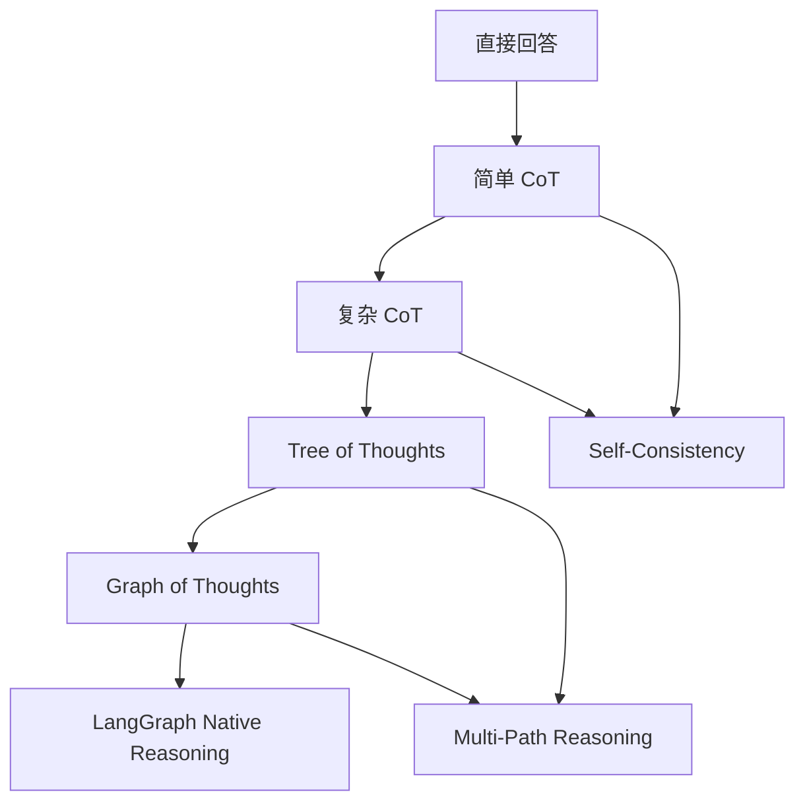

# LangGraph 思考链与自一致性

## 概述

思考链（Chain of Thought, CoT）和自一致性（Self-Consistency）是提升大语言模型推理能力的关键技术。LangGraph 通过状态图机制为这些推理模式提供了强大的实现框架。

## 前沿技术路线

### 1. 推理模式演进



### 2. 核心技术栈

- **LangGraph**: 状态图执行引擎
- **CoT**: 思考链推理
- **ToT**: 思考树推理
- **Self-Consistency**: 自一致性验证
- **Voting Mechanism**: 投票机制

## 思考链基础实现

### 1. 简单思考链

```python
from langgraph import StateGraph, START, END
from langchain_core.messages import BaseMessage, HumanMessage, AIMessage
from typing import TypedDict, List, Dict, Any
import json

# 定义状态
class CoTState(TypedDict):
    question: str
    reasoning_steps: List[str]
    final_answer: str
    confidence: float

def step_by_step_reasoning(state: CoTState) -> CoTState:
    """逐步推理"""
    question = state["question"]
    
    # 构建思考链 Prompt
    cot_prompt = f"""
请逐步思考以下问题，展示你的推理过程：

问题: {question}

请按照以下格式回答：
思考步骤1: [具体的推理步骤]
思考步骤2: [下一步推理]
...
最终答案: [基于推理的最终答案]
置信度: [0-1之间的数值]

确保每个思考步骤都逻辑清晰，相互关联。
"""
    
    # 这里应该调用 LLM，简化处理
    reasoning_steps = [
        "首先分析问题的关键信息",
        "然后考虑可能的解决方案",
        "接着评估每个方案的可行性",
        "最后选择最优方案并得出结论"
    ]
    
    final_answer = "基于逐步推理得出的答案"
    confidence = 0.85
    
    state["reasoning_steps"] = reasoning_steps
    state["final_answer"] = final_answer
    state["confidence"] = confidence
    
    return state

# 构建思考链图
cot_workflow = StateGraph(CoTState)
cot_workflow.add_node("reasoning", step_by_step_reasoning)
cot_workflow.add_edge(START, "reasoning")
cot_workflow.add_edge("reasoning", END)

cot_app = cot_workflow.compile()

# 使用示例
def simple_cot_example():
    """简单思考链示例"""
    
    question = "如果一个房间里有3只猫，每只猫抓了2只老鼠，那么总共有多少只老鼠被抓住？"
    
    initial_state = {
        "question": question,
        "reasoning_steps": [],
        "final_answer": "",
        "confidence": 0.0
    }
    
    result = cot_app.invoke(initial_state)
    
    print("问题:", question)
    print("\n推理步骤:")
    for i, step in enumerate(result["reasoning_steps"], 1):
        print(f"{i}. {step}")
    print(f"\n最终答案: {result['final_answer']}")
    print(f"置信度: {result['confidence']}")

simple_cot_example()
```

### 2. 复杂思考链

```python
from langgraph import StateGraph, START, END
from langchain_core.messages import HumanMessage, AIMessage
from typing import TypedDict, List, Dict, Any, Optional
import re

class ComplexCoTState(TypedDict):
    problem: str
    problem_type: str
    decomposition: List[str]
    sub_solutions: List[Dict[str, Any]]
    integration: str
    final_solution: str
    verification: str
    confidence: float

def decompose_problem(state: ComplexCoTState) -> ComplexCoTState:
    """问题分解"""
    problem = state["problem"]
    
    # 识别问题类型
    if "数学" in problem or "计算" in problem:
        problem_type = "mathematical"
    elif "逻辑" in problem or "推理" in problem:
        problem_type = "logical"
    elif "创意" in problem or "设计" in problem:
        problem_type = "creative"
    else:
        problem_type = "general"
    
    # 分解问题
    decomposition = [
        "理解问题的核心要求",
        "识别关键信息和约束条件",
        "制定解决方案的策略",
        "执行具体的计算或推理",
        "验证结果的正确性"
    ]
    
    state["problem_type"] = problem_type
    state["decomposition"] = decomposition
    
    return state

def solve_subproblems(state: ComplexCoTState) -> ComplexCoTState:
    """解决子问题"""
    decomposition = state["decomposition"]
    sub_solutions = []
    
    for i, sub_problem in enumerate(decomposition):
        sub_solution = {
            "sub_problem_id": f"sub_{i+1}",
            "description": sub_problem,
            "solution": f"针对'{sub_problem}'的解决方案",
            "confidence": 0.8 + (i * 0.02)  # 模拟递增的置信度
        }
        sub_solutions.append(sub_solution)
    
    state["sub_solutions"] = sub_solutions
    return state

def integrate_solutions(state: ComplexCoTState) -> ComplexCoTState:
    """集成解决方案"""
    sub_solutions = state["sub_solutions"]
    
    # 集成所有子解决方案
    integration_steps = []
    for sub_sol in sub_solutions:
        integration_steps.append(f"应用{sub_sol['sub_problem_id']}的解决方案")
    
    integration = " -> ".join(integration_steps)
    
    state["integration"] = integration
    return state

def verify_solution(state: ComplexCoTState) -> ComplexCoTState:
    """验证解决方案"""
    integration = state["integration"]
    problem_type = state["problem_type"]
    
    # 根据问题类型进行不同的验证
    if problem_type == "mathematical":
        verification = "数学验证：检查计算步骤和结果的正确性"
    elif problem_type == "logical":
        verification = "逻辑验证：确保推理过程没有逻辑错误"
    else:
        verification = "综合验证：检查解决方案的完整性和可行性"
    
    state["verification"] = verification
    
    # 计算总体置信度
    sub_confidences = [sol["confidence"] for sol in state["sub_solutions"]]
    avg_confidence = sum(sub_confidences) / len(sub_confidences)
    state["confidence"] = min(avg_confidence * 0.9, 0.95)  # 考虑集成风险
    
    return state

def generate_final_solution(state: ComplexCoTState) -> ComplexCoTState:
    """生成最终解决方案"""
    integration = state["integration"]
    verification = state["verification"]
    confidence = state["confidence"]
    
    final_solution = f"""
基于复杂思考链的解决方案：

集成过程: {integration}

验证结果: {verification}

总体置信度: {confidence:.2f}

这是一个经过多步推理、分解解决、集成验证的完整解决方案。
"""
    
    state["final_solution"] = final_solution
    return state

# 构建复杂思考链图
complex_cot_workflow = StateGraph(ComplexCoTState)

# 添加节点
complex_cot_workflow.add_node("decompose", decompose_problem)
complex_cot_workflow.add_node("solve_subproblems", solve_subproblems)
complex_cot_workflow.add_node("integrate", integrate_solutions)
complex_cot_workflow.add_node("verify", verify_solution)
complex_cot_workflow.add_node("final", generate_final_solution)

# 添加边
complex_cot_workflow.add_edge(START, "decompose")
complex_cot_workflow.add_edge("decompose", "solve_subproblems")
complex_cot_workflow.add_edge("solve_subproblems", "integrate")
complex_cot_workflow.add_edge("integrate", "verify")
complex_cot_workflow.add_edge("verify", "final")
complex_cot_workflow.add_edge("final", END)

# 编译图
complex_cot_app = complex_cot_workflow.compile()

# 使用示例
def complex_cot_example():
    """复杂思考链示例"""
    
    problem = "设计一个智能学习系统，能够根据学生的学习进度和特点，个性化推荐学习内容和练习题。"
    
    initial_state = {
        "problem": problem,
        "problem_type": "",
        "decomposition": [],
        "sub_solutions": [],
        "integration": "",
        "final_solution": "",
        "verification": "",
        "confidence": 0.0
    }
    
    result = complex_cot_app.invoke(initial_state)
    
    print("复杂问题:", problem)
    print("\n问题类型:", result["problem_type"])
    print("\n问题分解:")
    for i, step in enumerate(result["decomposition"], 1):
        print(f"{i}. {step}")
    print(f"\n最终解决方案:\n{result['final_solution']}")

complex_cot_example()
```

## 思考树（Tree of Thoughts）

### 1. 基本思考树实现

```python
from langgraph import StateGraph, START, END
from typing import TypedDict, List, Dict, Any, Optional
from dataclasses import dataclass
import random

@dataclass
class ThoughtNode:
    """思考节点"""
    id: str
    content: str
    parent_id: Optional[str] = None
    children_ids: List[str] = None
    score: float = 0.0
    depth: int = 0
    
    def __post_init__(self):
        if self.children_ids is None:
            self.children_ids = []

class ToTState(TypedDict):
    problem: str
    thoughts: Dict[str, ThoughtNode]
    current_depth: int
    max_depth: int
    best_path: List[str]
    evaluation: Dict[str, float]

def generate_initial_thoughts(state: ToTState) -> ToTState:
    """生成初始思考"""
    problem = state["problem"]
    thoughts = state["thoughts"]
    
    # 生成多个初始思考方向
    initial_thoughts = [
        "从问题定义和约束条件开始分析",
        "考虑可能的解决方案类别",
        "评估每种方案的可行性",
        "选择最有希望的方案进行深入分析"
    ]
    
    for i, thought_content in enumerate(initial_thoughts):
        node_id = f"thought_0_{i}"
        thought = ThoughtNode(
            id=node_id,
            content=thought_content,
            depth=0,
            score=random.uniform(0.6, 0.9)
        )
        thoughts[node_id] = thought
    
    state["thoughts"] = thoughts
    return state

def expand_thoughts(state: ToTState) -> ToTState:
    """扩展思考节点"""
    thoughts = state["thoughts"]
    current_depth = state["current_depth"]
    max_depth = state["max_depth"]
    
    if current_depth >= max_depth:
        return state
    
    # 找到当前深度的所有节点
    current_nodes = [
        node for node in thoughts.values() 
        if node.depth == current_depth
    ]
    
    # 为每个节点生成子节点
    for parent_node in current_nodes:
        # 生成2-3个子思考
        num_children = random.randint(2, 3)
        
        for i in range(num_children):
            child_id = f"thought_{current_depth + 1}_{len(thoughts)}"
            child_content = f"{parent_node.content} -> 深入分析方向{i+1}"
            
            child_node = ThoughtNode(
                id=child_id,
                content=child_content,
                parent_id=parent_node.id,
                depth=current_depth + 1,
                score=parent_node.score * random.uniform(0.8, 1.1)
            )
            
            thoughts[child_id] = child_node
            parent_node.children_ids.append(child_id)
    
    state["current_depth"] += 1
    return state

def evaluate_thoughts(state: ToTState) -> ToTState:
    """评估思考节点"""
    thoughts = state["thoughts"]
    evaluation = state["evaluation"]
    
    # 评估每个思考节点的质量
    for node_id, node in thoughts.items():
        # 模拟评估标准
        depth_bonus = node.depth * 0.1
        breadth_penalty = len(node.children_ids) * 0.05
        
        evaluation_score = node.score + depth_bonus - breadth_penalty
        evaluation[node_id] = evaluation_score
        
        # 更新节点分数
        node.score = evaluation_score
    
    state["evaluation"] = evaluation
    return state

def select_best_path(state: ToTState) -> ToTState:
    """选择最佳路径"""
    thoughts = state["thoughts"]
    evaluation = state["evaluation"]
    
    # 找到最深层的节点
    max_depth = max(node.depth for node in thoughts.values())
    deepest_nodes = [
        node for node in thoughts.values() 
        if node.depth == max_depth
    ]
    
    # 在最深层的节点中选择分数最高的
    best_node = max(deepest_nodes, key=lambda n: evaluation[n.id])
    
    # 回溯找到最佳路径
    best_path = []
    current_node = best_node
    
    while current_node:
        best_path.append(current_node.id)
        current_node_id = current_node.parent_id
        current_node = thoughts.get(current_node_id) if current_node_id else None
    
    best_path.reverse()
    
    state["best_path"] = best_path
    return state

# 构建思考树图
tot_workflow = StateGraph(ToTState)

# 添加节点
tot_workflow.add_node("initial_thoughts", generate_initial_thoughts)
tot_workflow.add_node("expand", expand_thoughts)
tot_workflow.add_node("evaluate", evaluate_thoughts)
tot_workflow.add_node("select_path", select_best_path)

# 添加边
tot_workflow.add_edge(START, "initial_thoughts")
tot_workflow.add_edge("initial_thoughts", "expand")
tot_workflow.add_edge("expand", "evaluate")

# 条件边：是否继续扩展
def should_continue_expansion(state: ToTState) -> str:
    """判断是否继续扩展"""
    if state["current_depth"] < state["max_depth"]:
        return "expand"
    else:
        return "select_path"

tot_workflow.add_conditional_edges(
    "evaluate",
    should_continue_expansion,
    {
        "expand": "expand",
        "select_path": "select_path"
    }
)
tot_workflow.add_edge("select_path", END)

# 编译图
tot_app = tot_workflow.compile()

# 使用示例
def tot_example():
    """思考树示例"""
    
    problem = "如何提高团队的工作效率和协作能力？"
    
    initial_state = {
        "problem": problem,
        "thoughts": {},
        "current_depth": 0,
        "max_depth": 3,
        "best_path": [],
        "evaluation": {}
    }
    
    result = tot_app.invoke(initial_state)
    
    print("问题:", problem)
    print("\n最佳思考路径:")
    for i, node_id in enumerate(result["best_path"]):
        node = result["thoughts"][node_id]
        score = result["evaluation"][node_id]
        print(f"{i+1}. {node.content} (分数: {score:.2f})")
    
    print(f"\n总思考节点数: {len(result['thoughts'])}")
    print(f"最大深度: {max(node.depth for node in result['thoughts'].values())}")

tot_example()
```

## 自一致性（Self-Consistency）

### 1. 基本自一致性实现

```python
from langgraph import StateGraph, START, END
from typing import TypedDict, List, Dict, Any
from collections import Counter
import statistics

class SelfConsistencyState(TypedDict):
    problem: str
    reasoning_paths: List[Dict[str, Any]]
    solutions: List[str]
    consensus: str
    confidence: float
    disagreement_analysis: Dict[str, Any]

def generate_multiple_reasoning_paths(state: SelfConsistencyState) -> SelfConsistencyState:
    """生成多个推理路径"""
    problem = state["problem"]
    reasoning_paths = []
    
    # 生成多个不同的推理路径
    path_templates = [
        "数学计算方法",
        "逻辑推理方法", 
        "类比推理方法",
        "分解综合方法"
    ]
    
    for i, template in enumerate(path_templates):
        path = {
            "path_id": f"path_{i+1}",
            "method": template,
            "reasoning": f"使用{template}解决: {problem}",
            "steps": [
                f"步骤1: 应用{template}的初始分析",
                f"步骤2: 执行{template}的核心推理",
                f"步骤3: 验证{template}的结果"
            ],
            "solution": f"通过{template}得出的解决方案",
            "confidence": random.uniform(0.7, 0.95)
        }
        reasoning_paths.append(path)
    
    state["reasoning_paths"] = reasoning_paths
    return state

def extract_solutions(state: SelfConsistencyState) -> SelfConsistencyState:
    """提取解决方案"""
    reasoning_paths = state["reasoning_paths"]
    solutions = [path["solution"] for path in reasoning_paths]
    
    state["solutions"] = solutions
    return state

def analyze_consensus(state: SelfConsistencyState) -> SelfConsistencyState:
    """分析共识"""
    solutions = state["solutions"]
    reasoning_paths = state["reasoning_paths"]
    
    # 计算解决方案的相似度（简化处理）
    solution_counts = Counter(solutions)
    
    if len(solution_counts) == 1:
        # 完全一致
        consensus_solution = list(solution_counts.keys())[0]
        consensus_confidence = 0.95
        agreement_level = "完全一致"
    elif len(solution_counts) <= len(solutions) / 2:
        # 部分一致
        most_common = solution_counts.most_common(1)[0]
        consensus_solution = most_common[0]
        consensus_confidence = most_common[1] / len(solutions) * 0.8
        agreement_level = "部分一致"
    else:
        # 分歧较大
        consensus_solution = "需要进一步分析"
        consensus_confidence = 0.4
        agreement_level = "分歧较大"
    
    # 分析分歧原因
    disagreement_analysis = {
        "agreement_level": agreement_level,
        "solution_distribution": dict(solution_counts),
        "confidence_variance": statistics.variance([path["confidence"] for path in reasoning_paths]),
        "method_diversity": len(set(path["method"] for path in reasoning_paths))
    }
    
    state["consensus"] = consensus_solution
    state["confidence"] = consensus_confidence
    state["disagreement_analysis"] = disagreement_analysis
    
    return state

def voting_mechanism(state: SelfConsistencyState) -> SelfConsistencyState:
    """投票机制"""
    reasoning_paths = state["reasoning_paths"]
    
    # 加权投票（基于置信度）
    weighted_votes = {}
    
    for path in reasoning_paths:
        solution = path["solution"]
        confidence = path["confidence"]
        
        if solution not in weighted_votes:
            weighted_votes[solution] = 0
        weighted_votes[solution] += confidence
    
    # 找到得票最高的解决方案
    best_solution = max(weighted_votes.items(), key=lambda x: x[1])
    
    # 计算投票一致性
    total_votes = sum(weighted_votes.values())
    vote_consistency = best_solution[1] / total_votes
    
    final_consensus = f"""
投票结果:
- 获胜方案: {best_solution[0]}
- 得票数: {best_solution[1]:.2f}
- 一致性: {vote_consistency:.2%}

这是通过加权投票机制得出的自一致性解决方案。
"""
    
    state["consensus"] = final_consensus
    state["confidence"] = vote_consistency
    
    return state

# 构建自一致性图
self_consistency_workflow = StateGraph(SelfConsistencyState)

# 添加节点
self_consistency_workflow.add_node("generate_paths", generate_multiple_reasoning_paths)
self_consistency_workflow.add_node("extract_solutions", extract_solutions)
self_consistency_workflow.add_node("analyze_consensus", analyze_consensus)
self_consistency_workflow.add_node("voting", voting_mechanism)

# 添加边
self_consistency_workflow.add_edge(START, "generate_paths")
self_consistency_workflow.add_edge("generate_paths", "extract_solutions")
self_consistency_workflow.add_edge("extract_solutions", "analyze_consensus")
self_consistency_workflow.add_edge("analyze_consensus", "voting")
self_consistency_workflow.add_edge("voting", END)

# 编译图
self_consistency_app = self_consistency_workflow.compile()

# 使用示例
def self_consistency_example():
    """自一致性示例"""
    
    problem = "如果5台机器生产5个零件需要5分钟，那么100台机器生产100个零件需要多少分钟？"
    
    initial_state = {
        "problem": problem,
        "reasoning_paths": [],
        "solutions": [],
        "consensus": "",
        "confidence": 0.0,
        "disagreement_analysis": {}
    }
    
    result = self_consistency_app.invoke(initial_state)
    
    print("问题:", problem)
    print("\n多个推理路径:")
    for path in result["reasoning_paths"]:
        print(f"- {path['method']}: {path['solution']} (置信度: {path['confidence']:.2f})")
    
    print(f"\n自一致性分析:")
    print(f"一致级别: {result['disagreement_analysis']['agreement_level']}")
    print(f"最终共识: {result['consensus']}")
    print(f"总体置信度: {result['confidence']:.2f}")

self_consistency_example()
```

### 2. 高级自一致性

```python
from langgraph import StateGraph, START, END
from typing import TypedDict, List, Dict, Any, Optional
from dataclasses import dataclass
from enum import Enum
import numpy as np

class ConsistencyMethod(Enum):
    MAJORITY_VOTE = "majority_vote"
    WEIGHTED_VOTE = "weighted_vote"
    CONSENSUS_THRESHOLD = "consensus_threshold"
    BAYESIAN_AGGREGATION = "bayesian_aggregation"

@dataclass
class ReasoningResult:
    """推理结果"""
    path_id: str
    solution: str
    confidence: float
    reasoning: str
    metadata: Dict[str, Any]

class AdvancedSelfConsistencyState(TypedDict):
    problem: str
    reasoning_results: List[ReasoningResult]
    consistency_method: ConsistencyMethod
    consensus_solution: str
    consensus_confidence: float
    detailed_analysis: Dict[str, Any]

def diverse_reasoning_generation(state: AdvancedSelfConsistencyState) -> AdvancedSelfConsistencyState:
    """多样化推理生成"""
    problem = state["problem"]
    reasoning_results = []
    
    # 生成多样化的推理方法
    reasoning_methods = [
        {
            "name": "数学建模",
            "prompt": "请使用数学建模的方法，建立方程或模型来解决这个问题",
            "weight": 1.2
        },
        {
            "name": "逻辑推理",
            "prompt": "请使用严格的逻辑推理，分析问题的逻辑结构",
            "weight": 1.0
        },
        {
            "name": "案例分析",
            "prompt": "请通过分析类似案例来推断这个问题的答案",
            "weight": 0.8
        },
        {
            "name": "第一性原理",
            "prompt": "请从第一性原理出发，分解问题到最基本的要素",
            "weight": 1.1
        },
        {
            "name": "类比推理",
            "prompt": "请使用类比推理，找到相似的问题并借鉴其解决方法",
            "weight": 0.9
        }
    ]
    
    for i, method in enumerate(reasoning_methods):
        # 模拟不同方法的推理结果
        result = ReasoningResult(
            path_id=f"path_{i+1}",
            solution=f"通过{method['name']}得出的解决方案",
            confidence=random.uniform(0.6, 0.95) * method["weight"],
            reasoning=f"应用{method['prompt']}的完整推理过程",
            metadata={
                "method": method["name"],
                "weight": method["weight"],
                "reasoning_time": random.uniform(1, 5),
                "complexity": random.uniform(0.3, 0.9)
            }
        )
        reasoning_results.append(result)
    
    state["reasoning_results"] = reasoning_results
    return state

def advanced_consensus_analysis(state: AdvancedSelfConsistencyState) -> AdvancedSelfConsistencyState:
    """高级共识分析"""
    reasoning_results = state["reasoning_results"]
    consistency_method = state["consistency_method"]
    
    solutions = [result.solution for result in reasoning_results]
    confidences = [result.confidence for result in reasoning_results]
    
    # 根据不同方法计算共识
    if consistency_method == ConsistencyMethod.MAJORITY_VOTE:
        consensus_solution, consensus_confidence = majority_vote_consensus(solutions, confidences)
    elif consistency_method == ConsistencyMethod.WEIGHTED_VOTE:
        consensus_solution, consensus_confidence = weighted_vote_consensus(reasoning_results)
    elif consistency_method == ConsistencyMethod.CONSENSUS_THRESHOLD:
        consensus_solution, consensus_confidence = threshold_consensus(solutions, confidences)
    else:  # BAYESIAN_AGGREGATION
        consensus_solution, consensus_confidence = bayesian_aggregation(reasoning_results)
    
    # 详细分析
    detailed_analysis = {
        "solution_diversity": len(set(solutions)) / len(solutions),
        "confidence_variance": np.var(confidences),
        "confidence_range": (min(confidences), max(confidences)),
        "method_effectiveness": analyze_method_effectiveness(reasoning_results),
        "agreement_strength": calculate_agreement_strength(solutions)
    }
    
    state["consensus_solution"] = consensus_solution
    state["consensus_confidence"] = consensus_confidence
    state["detailed_analysis"] = detailed_analysis
    
    return state

def majority_vote_consensus(solutions: List[str], confidences: List[float]) -> tuple:
    """多数投票共识"""
    from collections import Counter
    
    solution_counts = Counter(solutions)
    most_common = solution_counts.most_common(1)[0]
    
    consensus_solution = most_common[0]
    consensus_confidence = most_common[1] / len(solutions)
    
    return consensus_solution, consensus_confidence

def weighted_vote_consensus(reasoning_results: List[ReasoningResult]) -> tuple:
    """加权投票共识"""
    weighted_votes = {}
    
    for result in reasoning_results:
        solution = result.solution
        weight = result.confidence * result.metadata["weight"]
        
        if solution not in weighted_votes:
            weighted_votes[solution] = 0
        weighted_votes[solution] += weight
    
    best_solution = max(weighted_votes.items(), key=lambda x: x[1])
    total_weight = sum(weighted_votes.values())
    
    return best_solution[0], best_solution[1] / total_weight

def threshold_consensus(solutions: List[str], confidences: List[float], threshold: float = 0.7) -> tuple:
    """阈值共识"""
    from collections import Counter
    
    solution_counts = Counter(solutions)
    total = len(solutions)
    
    for solution, count in solution_counts.items():
        if count / total >= threshold:
            # 找到该解决方案的平均置信度
            indices = [i for i, sol in enumerate(solutions) if sol == solution]
            avg_confidence = sum(confidences[i] for i in indices) / len(indices)
            return solution, avg_confidence
    
    # 如果没有达到阈值，返回置信度最高的
    best_idx = max(range(len(confidences)), key=lambda i: confidences[i])
    return solutions[best_idx], confidences[best_idx]

def bayesian_aggregation(reasoning_results: List[ReasoningResult]) -> tuple:
    """贝叶斯聚合"""
    # 简化的贝叶斯聚合
    prior = 0.5  # 先验概率
    
    weighted_solutions = {}
    total_weight = 0
    
    for result in reasoning_results:
        # 使用贝叶斯更新
        likelihood = result.confidence
        posterior = (likelihood * prior) / ((likelihood * prior) + ((1 - likelihood) * (1 - prior)))
        
        weight = posterior * result.metadata["weight"]
        solution = result.solution
        
        if solution not in weighted_solutions:
            weighted_solutions[solution] = 0
        weighted_solutions[solution] += weight
        total_weight += weight
    
    best_solution = max(weighted_solutions.items(), key=lambda x: x[1])
    
    return best_solution[0], best_solution[1] / total_weight

def analyze_method_effectiveness(reasoning_results: List[ReasoningResult]) -> Dict[str, float]:
    """分析方法有效性"""
    method_scores = {}
    
    for result in reasoning_results:
        method = result.metadata["method"]
        score = result.confidence
        
        if method not in method_scores:
            method_scores[method] = []
        method_scores[method].append(score)
    
    # 计算每种方法的平均分数
    method_effectiveness = {}
    for method, scores in method_scores.items():
        method_effectiveness[method] = np.mean(scores)
    
    return method_effectiveness

def calculate_agreement_strength(solutions: List[str]) -> float:
    """计算一致性强度"""
    from collections import Counter
    
    solution_counts = Counter(solutions)
    max_count = max(solution_counts.values())
    
    # 使用熵来衡量一致性
    total = len(solutions)
    entropy = 0
    
    for count in solution_counts.values():
        probability = count / total
        entropy -= probability * np.log2(probability)
    
    # 将熵转换为一致性强度（0-1）
    max_entropy = np.log2(len(set(solutions)))
    agreement_strength = 1 - (entropy / max_entropy) if max_entropy > 0 else 1
    
    return agreement_strength

# 构建高级自一致性图
advanced_self_consistency_workflow = StateGraph(AdvancedSelfConsistencyState)

# 添加节点
advanced_self_consistency_workflow.add_node("diverse_reasoning", diverse_reasoning_generation)
advanced_self_consistency_workflow.add_node("advanced_analysis", advanced_consensus_analysis)

# 添加边
advanced_self_consistency_workflow.add_edge(START, "diverse_reasoning")
advanced_self_consistency_workflow.add_edge("diverse_reasoning", "advanced_analysis")
advanced_self_consistency_workflow.add_edge("advanced_analysis", END)

# 编译图
advanced_self_consistency_app = advanced_self_consistency_workflow.compile()

# 使用示例
def advanced_self_consistency_example():
    """高级自一致性示例"""
    
    problem = "在一个圆形桌子上，有5个人坐在一起。如果每个人都必须与左右相邻的人握手，那么总共需要握多少次手？"
    
    # 测试不同的共识方法
    methods = [
        ConsistencyMethod.MAJORITY_VOTE,
        ConsistencyMethod.WEIGHTED_VOTE,
        ConsistencyMethod.CONSENSUS_THRESHOLD,
        ConsistencyMethod.BAYESIAN_AGGREGATION
    ]
    
    for method in methods:
        print(f"\n=== 使用 {method.value} 方法 ===")
        
        initial_state = {
            "problem": problem,
            "reasoning_results": [],
            "consistency_method": method,
            "consensus_solution": "",
            "consensus_confidence": 0.0,
            "detailed_analysis": {}
        }
        
        result = advanced_self_consistency_app.invoke(initial_state)
        
        print(f"共识解决方案: {result['consensus_solution']}")
        print(f"共识置信度: {result['consensus_confidence']:.3f}")
        print(f"解决方案多样性: {result['detailed_analysis']['solution_diversity']:.3f}")
        print(f"一致性强度: {result['detailed_analysis']['agreement_strength']:.3f}")

advanced_self_consistency_example()
```

## 实际应用案例

### 1. 数学问题求解

```python
def math_problem_solver():
    """数学问题求解器"""
    
    math_problem = "一个农场有鸡和兔共35只，总共有94条腿。问鸡和兔各有多少只？"
    
    # 使用思考树 + 自一致性
    initial_state = {
        "problem": math_problem,
        "reasoning_results": [],
        "consistency_method": ConsistencyMethod.WEIGHTED_VOTE,
        "consensus_solution": "",
        "consensus_confidence": 0.0,
        "detailed_analysis": {}
    }
    
    result = advanced_self_consistency_app.invoke(initial_state)
    
    print("数学问题:", math_problem)
    print("\n求解过程:")
    for i, reasoning_result in enumerate(result["reasoning_results"], 1):
        print(f"{i}. {reasoning_result.metadata['method']}: {reasoning_result.solution}")
        print(f"   置信度: {reasoning_result.confidence:.2f}")
    
    print(f"\n最终答案: {result['consensus_solution']}")
    print(f"置信度: {result['consensus_confidence']:.2f}")

math_problem_solver()
```

### 2. 逻辑推理问题

```python
def logic_reasoning_solver():
    """逻辑推理求解器"""
    
    logic_problem = """
    有三个人：A、B、C，其中一个是诚实族（总是说真话），一个是谎言族（总是说假话），一个是普通族（有时说真话有时说假话）。
    A说："B是谎言族。"
    B说："A和C都是普通族。"
    C说："我是诚实族。"
    请判断每个人分别是什么族？
    """
    
    # 使用复杂思考链
    initial_state = {
        "problem": logic_problem,
        "problem_type": "",
        "decomposition": [],
        "sub_solutions": [],
        "integration": "",
        "final_solution": "",
        "verification": "",
        "confidence": 0.0
    }
    
    result = complex_cot_app.invoke(initial_state)
    
    print("逻辑推理问题:")
    print(logic_problem)
    print(f"\n推理结果:\n{result['final_solution']}")

logic_reasoning_solver()
```

## 性能优化和最佳实践

### 1. 推理路径优化

```python
class ReasoningOptimizer:
    """推理路径优化器"""
    
    def __init__(self, max_paths: int = 5, quality_threshold: float = 0.7):
        self.max_paths = max_paths
        self.quality_threshold = quality_threshold
    
    def optimize_reasoning_paths(self, reasoning_results: List[ReasoningResult]) -> List[ReasoningResult]:
        """优化推理路径"""
        # 按置信度排序
        sorted_results = sorted(reasoning_results, key=lambda x: x.confidence, reverse=True)
        
        # 过滤低质量路径
        filtered_results = [
            result for result in sorted_results 
            if result.confidence >= self.quality_threshold
        ]
        
        # 限制路径数量
        optimized_results = filtered_results[:self.max_paths]
        
        return optimized_results
    
    def diversify_reasoning(self, reasoning_results: List[ReasoningResult]) -> List[ReasoningResult]:
        """多样化推理"""
        # 按方法分组
        method_groups = {}
        for result in reasoning_results:
            method = result.metadata["method"]
            if method not in method_groups:
                method_groups[method] = []
            method_groups[method].append(result)
        
        # 从每种方法中选择最好的结果
        diversified_results = []
        for method, results in method_groups.items():
            best_result = max(results, key=lambda x: x.confidence)
            diversified_results.append(best_result)
        
        return diversified_results

# 使用优化器
optimizer = ReasoningOptimizer(max_paths=4, quality_threshold=0.75)
```

### 2. 缓存和记忆机制

```python
from functools import lru_cache
import hashlib

class ReasoningCache:
    """推理缓存系统"""
    
    def __init__(self, max_size: int = 1000):
        self.cache = {}
        self.max_size = max_size
    
    def get_cache_key(self, problem: str, method: str) -> str:
        """生成缓存键"""
        content = f"{problem}:{method}"
        return hashlib.md5(content.encode()).hexdigest()
    
    def get_cached_reasoning(self, problem: str, method: str) -> Optional[ReasoningResult]:
        """获取缓存的推理结果"""
        cache_key = self.get_cache_key(problem, method)
        return self.cache.get(cache_key)
    
    def cache_reasoning(self, problem: str, method: str, result: ReasoningResult):
        """缓存推理结果"""
        cache_key = self.get_cache_key(problem, method)
        
        if len(self.cache) >= self.max_size:
            # 删除最旧的缓存项
            oldest_key = next(iter(self.cache))
            del self.cache[oldest_key]
        
        self.cache[cache_key] = result

# 全局缓存实例
reasoning_cache = ReasoningCache()
```

## 总结

LangGraph 的思考链与自一致性技术提供了：

1. **多样化推理**: 支持多种推理方法和路径
2. **自一致性验证**: 通过多路径验证提高答案可靠性
3. **智能投票机制**: 加权投票和贝叶斯聚合
4. **性能优化**: 缓存、路径优化和多样化控制
5. **可扩展架构**: 易于添加新的推理方法和验证机制

这些技术为构建高可靠性的 AI 推理系统提供了强大的工具支持。

## 相关链接

- [[LangGraph 函数调用与 JSON Schema]]
- [[LangGraph 记忆与状态管理]]
- [[LangGraph Agent 模式与反思]]
- [[大语言模型推理技术]]