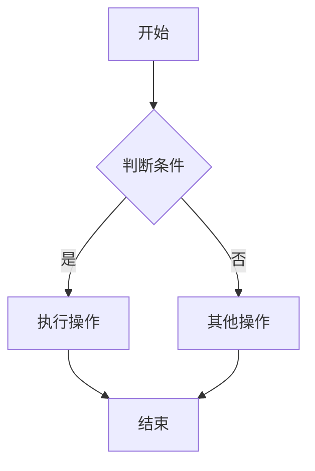

# AGENTS.md - Obsidian学习笔记项目指南

## 项目概述

这是一个基于Obsidian的个人学习笔记仓库。项目使用中文进行笔记记录，采用Obsidian特有的Markdown语法进行知识管理。

## 代码风格指南

### 文件命名规范
- **笔记文件**: 使用中文描述性名称，如 `50系显卡conda环境设置.md`
- **目录结构**: 按主题分类，使用数字前缀排序，如 `01工具/`、`02模型/`
- **资源文件**: 放入 `assets/` 目录，使用描述性名称

### Markdown语法规范

#### 1. 标题层级
```markdown
# 一级标题 - 笔记主题
## 二级标题 - 主要章节
### 三级标题 - 具体内容
#### 四级标题 - 细节说明
```

#### 2. 内部链接规范
```markdown
# 基本链接
[[相关笔记名称]]

# 带描述文本的链接
[[相关笔记名称|显示文本]]

# 链接到特定标题
[[笔记名称#标题名称]]

# 嵌入其他笔记内容
![[被嵌入的笔记名称]]
```

#### 3. 列表规范
```markdown
## 无序列表
- 主要内容
  - 子内容1
  - 子内容2
- 另一个主要内容

## 有序列表
1. 第一步操作
2. 第二步操作
   1. 子步骤2.1
   2. 子步骤2.2
3. 第三步操作

## 任务列表
- [ ] 待完成任务
- [x] 已完成任务
```

#### 4. 强调和格式
```markdown
**重要内容** - 粗体强调
*关键词* - 斜体强调
==高亮文本== - 黄色高亮
`代码片段` - 行内代码
~~删除内容~~ - 删除线
```

#### 5. 引用和提示框
```markdown
# 普通引用
> 这是引用内容

# 提示框（Callouts）
> [!note] 注意事项
> 这是一个重要提示

> [!warning] 警告
> 需要特别注意的内容

> [!tip] 小技巧
> 实用的技巧或方法
```

### 内容组织规范

#### 1. 笔记结构模板
```markdown
# 主题名称

## 概述
简要介绍主题内容和目的

## 前置条件
- 需要的基础知识
- 必要的环境准备

## 主要内容
### 步骤一
详细说明和代码示例

### 步骤二
继续详细说明

## 常见问题
解答可能遇到的问题

## 相关链接
- [[相关笔记1]]
- [[相关笔记2]]

## 参考资料
外部文档或链接
```

#### 2. 代码示例规范
- 提供完整的可执行代码
- 包含必要的注释说明
- 显示预期输出结果
- 标注运行环境要求

#### 3. 链接维护
- 确保所有内部链接指向存在的笔记
- 使用描述性的链接文本
- 定期检查链接的有效性

### 特殊语法使用

#### 1. 数学公式
```markdown
# 行内公式
欧拉公式：$e^{i\pi} + 1 = 0$

# 块级公式
$$
\begin{align}
\nabla \times \vec{E} &= -\frac{\partial \vec{B}}{\partial t} \\
\nabla \times \vec{B} &= \mu_0\vec{J} + \mu_0\epsilon_0\frac{\partial \vec{E}}{\partial t}
\end{align}
$$
```

#### 2. 图表和流程图
```markdown

```

#### 3. 表格规范
```markdown
| 参数名 | 类型 | 说明 | 示例值 |
|--------|------|------|--------|
| learning_rate | float | 学习率 | 0.001 |
| batch_size | int | 批次大小 | 32 |
| epochs | int | 训练轮数 | 100 |
```

### 最佳实践

1. **知识连接**: 积极使用内部链接建立知识网络
2. **标签使用**: 合理使用标签分类，如 `#机器学习` `#工具`
3. **定期维护**: 定期检查和更新过时的内容
4. **代码验证**: 确保代码示例的可执行性
5. **结构清晰**: 保持良好的文档层次结构

### 工具和插件

本项目使用的Obsidian插件：
- `dataview`: 数据查询和展示
- `mermaid-tools`: 图表渲染
- `table-editor-obsidian`: 表格编辑
- `obsidian-icon-folder`: 文件夹图标
- `ai-agent`: AI助手集成

### 注意事项

1. 所有笔记使用中文编写
2. 保持代码示例的实用性和可复制性
3. 重视知识的关联性和系统性
4. 定期备份重要的笔记内容
5. 遵循Obsidian的最佳实践进行知识管理

---

*此文档为AI代理提供项目指导，确保代码和内容的一致性。*