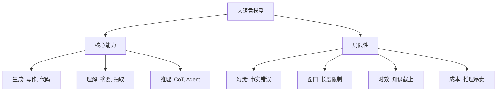

# LLM 任务全景与能力边界

大语言模型（LLM）不再是单一任务的专家，而是通用的文本处理引擎。理解它“能做什么”以及“不能做什么”，是使用和开发 LLM 的前提。

## 1. 任务全景：LLM 能做什么？

LLM 的核心能力是**Next Token Prediction（预测下一个词）**。基于这一简单目标，它衍生出了处理多种复杂任务的能力。

### 1.1 生成式任务 (Generative Tasks)
这是 LLM 最擅长的领域，也是其区别于 BERT 等判别式模型的特征。
*   **文本创作**：撰写邮件、博客、故事、剧本。
*   **代码生成**：根据自然语言描述生成 Python/C++ 代码（如 GitHub Copilot）。
*   **对话系统**：多轮对话、角色扮演（Chatbot）。
*   **数据增强**：生成用于训练小模型的合成数据。

### 1.2 理解与转换任务 (Understanding & Transformation)
虽然是生成模型，但可以通过 Prompt 将理解任务转化为生成任务。
*   **摘要 (Summarization)**：输入长文档，输出简短摘要。
*   **翻译 (Translation)**：多语言互译，尤其擅长低资源语言。
*   **信息抽取 (Information Extraction)**：从非结构化文本中提取实体、关系、表格数据。
*   **改写与润色**：改变文本的语气、风格或纠正语法错误。

### 1.3 推理与规划 (Reasoning & Planning)
这是大模型涌现出的高级能力。
*   **逻辑推理**：解决数学应用题、逻辑谜题。
*   **常识推理**：回答需要世界知识的问题。
*   **任务规划 (Agent)**：将复杂目标拆解为子步骤，并调用工具（搜索、计算器）完成。

### 1.4 语音与多模态交互 (Audio & Multimodal Interaction)
随着 GPT-4o 等原生多模态模型的出现，LLM 的能力延伸到了听觉领域。
*   **语音识别 (ASR)**：将语音转录为文本，支持多语种和方言。
*   **语音合成 (TTS)**：根据文本生成逼真、带有情感的语音。
*   **语音对话 (Speech-to-Speech)**：端到端的语音交互，能够感知语气、语调，并以极低延迟（毫秒级）进行打断和响应。
*   **语音理解 (Audio Understanding)**：理解非语音音频（如鸟叫、警笛、音乐）并回答相关问题。

---

## 2. 核心能力模式

LLM 解决问题的方式与传统模型不同，主要依赖以下几种模式：

### 2.1 Zero-shot (零样本)
直接给出指令，不提供示例。
> **Prompt**: "将这句话翻译成法语：你好，世界。"
> **Output**: "Bonjour le monde."

### 2.2 Few-shot / In-Context Learning (少样本/上下文学习)
在 Prompt 中提供几个示例（Demonstrations），让模型“照猫画虎”。模型不需要更新参数，只是利用上下文中的模式。
> **Prompt**:
> "苹果 -> 红色
> 香蕉 -> 黄色
> 葡萄 -> "
> **Output**: "紫色"

### 2.3 Chain-of-Thought (CoT, 思维链)
对于复杂推理，要求模型“一步步思考”，能显著提高准确率。
> **Prompt**: "小明有5个苹果，吃了2个，又买了3个，现在有几个？请一步步思考。"
> **Output**: "起初有5个。吃了2个，剩下 5-2=3 个。买了3个，现在是 3+3=6 个。答案是6。"

---

## 3. 能力边界与局限性：LLM 不能做什么？

尽管 LLM 很强大，但它不是全知全能的，存在明显的缺陷。

### 3.1 幻觉 (Hallucination)
*   **现象**：模型一本正经地胡说八道，捏造事实、文献或代码库。
*   **原因**：模型本质是概率预测，它关注的是“语言的流畅性”而非“事实的真实性”。
*   **对策**：使用 RAG（检索增强生成）引入外部知识库。

### 3.2 上下文窗口限制 (Context Window)
*   **限制**：模型一次能处理的 Token 数量是有限的（如 4k, 32k, 128k）。
*   **影响**：无法一次性读取整本书或超长代码库；多轮对话过长会“遗忘”前面的内容。
*   **对策**：长上下文模型（Long Context）、向量数据库检索、摘要压缩。

### 3.3 知识截止 (Knowledge Cutoff)
*   **限制**：模型的知识来源于训练数据，训练结束后发生的事情它不知道。
*   **影响**：无法回答最新的新闻、股价或新发布的 API。
*   **对策**：RAG、联网搜索工具。

### 3.4 逻辑与数学缺陷
*   **限制**：虽然有 CoT，但 LLM 在进行精确的算术运算（如大数乘法）或复杂的符号逻辑推演时经常出错。
*   **原因**：Token 化方式破坏了数字的结构，且神经网络不擅长离散符号计算。
*   **对策**：调用外部工具（Code Interpreter, Calculator）。

### 3.5 灾难性遗忘 (Catastrophic Forgetting)
*   **现象**：在微调新知识时，可能会忘记预训练中已有的通用能力。

## 4. 总结图谱

理解这些边界，能帮助我们更好地设计 Prompt，选择合适的技术路线（如 RAG vs 微调），并对模型输出保持合理的预期。

