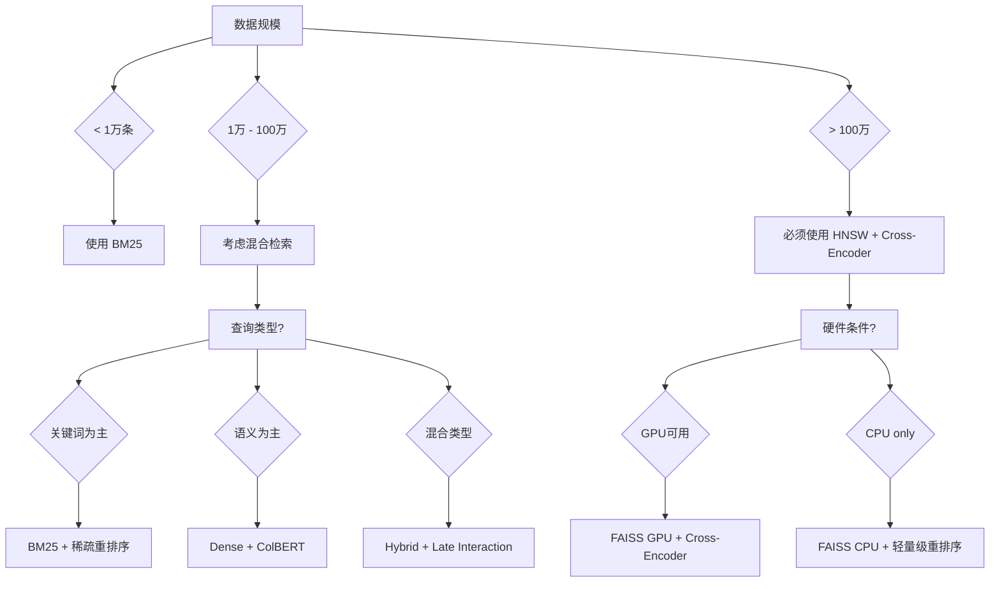

---
tags: [LLM/嵌入技术, LLM/检索技术]
aliases: [检索表示方法, 多路召回, 混合检索]
created: 2025-01-01
updated: 2026-03-28
---

# 检索视角的五类表示：从词袋到混合检索

> [!abstract] 摘要
> 从检索系统的视角出发，系统介绍五种不同的表示方法：词袋模型、语义嵌入、混合检索、重排序模型和多路召回。这些方法代表了检索技术从传统关键词匹配到语义理解的演进历程，各有其适用场景和优势互补关系。

## 知识地图

```
检索视角的五类表示
├── 词袋模型 — BM25 及改进
│   ├── BM25 算法详解
│   ├── IDF 权重策略
│   └── BM42/BM43 扩展
├── 语义嵌入 — Dense 向量表示
│   ├── 双塔架构原理
│   ├── 向量检索流程
│   └── ANN 优化策略
├── 混合检索 — Dense + Sparse 融合
│   ├── ColBERT 实现方案
│   ├── SPLADE 预训练范式
│   └── BGE-M3 统一框架
├── 重排序模型 — Cross-Encoder 优化
│   ├── BERT 重排序架构
│   ├── Cosine 相似度计算
│   └── 实时推理优化
└── 多路召回 — 多策略互补
    ├── 硬召回（Hard）
    ├── 软召回（Soft）
    └── 异构召回（Hybrid）
```

## 1. 词袋模型：基于词频的精确匹配

### 1.1 BM25 算法详解  #LLM/检索技术

#BM25 (Best Match 25) 是最经典的基于词频的检索算法，改进了传统的 TF-IDF 方法。

> [!important] BM25 核心公式
> $$\text{BM25}(q, d) = \sum_{i=1}^{n} \text{IDF}(q_i) \cdot \frac{f(q_i, d) \cdot (k_1 + 1)}{f(q_i, d) + k_1 \cdot (1 - b + b \cdot \frac{|d|}{\text{avgdl}})}$$

其中：
- $f(q_i, d)$：查询词 $q_i$ 在文档 $d$ 中的出现频率
- $k_1$：频率饱和参数，控制词频影响的饱和程度
- $b$：文档长度归一化参数，通常取 0.75
- $|d|$：文档 $d$ 的长度（词数）
- $\text{avgdl}$：平均文档长度

```python
class BM25:
    def __init__(self, documents, k1=1.2, b=0.75):
        self.documents = documents
        self.k1 = k1
        self.b = b
        self.avgdl = sum(len(doc.split()) for doc in documents) / len(documents)
        self.idf = self._calculate_idf()

    def _calculate_idf(self):
        """计算 IDF 权重"""
        idf = {}
        total_docs = len(self.documents)

        # 扫描所有文档收集词频
        df = {}
        for doc in self.documents:
            for word in set(doc.split()):
                df[word] = df.get(word, 0) + 1

        # 计算 IDF
        for word, freq in df.items():
            idf[word] = log((total_docs - freq + 0.5) / (freq + 0.5) + 1)

        return idf

    def score(self, query, document):
        """计算查询与文档的 BM25 分数"""
        query_words = query.lower().split()
        doc_words = document.lower().split()
        doc_len = len(doc_words)

        score = 0.0

        for word in query_words:
            if word in doc_words:
                # 词频
                f = doc_words.count(word)
                # BM25 评分
                numerator = f * (self.k1 + 1)
                denominator = f + self.k1 * (1 - self.b + self.b * doc_len / self.avgdl)
                score += self.idf.get(word, 0) * numerator / denominator

        return score

# BM25F 扩展：多字段加权 BM25
class BM25F:
    def __init__(self, field_weights):
        """
        field_weights: {'title': 0.5, 'content': 0.3, 'anchor': 0.2}
        """
        self.field_weights = field_weights
        self.bm25s = {}

        for field, weight in field_weights.items():
            self.bm25s[field] = BM25(documents, k1=1.2, b=0.75)

    def score(self, query, document):
        """多字段加权 BM25 评分"""
        total_score = 0.0

        for field, bm25 in self.bm25s.items():
            field_content = document.get(field, "")
            field_score = bm25.score(query, field_content)
            total_score += self.field_weights[field] * field_score

        return total_score
```

### 1.2 BM25 参数调优策略

| 参数 | 推荐值 | 影响分析 | 适用场景 |
|------|--------|----------|----------|
| **$k_1$** | 1.2-2.0 | 控制词频饱和 | 新闻检索：2.0；学术论文：1.2 |
| **$b$** | 0.75 | 文档长度归一化 | 长文档：0.6；短文档：0.9 |
| **扩展 $k_3$** | 7-20 | 查询词长权重 | 短查询：20；长查询：7 |

### 1.3 BM25 与其他词袋模型对比

| 模型 | 公式特点 | 优势 | 劣势 |
|------|----------|------|------|
| **TF-IDF** | $\text{TF} \times \text{IDF}$ | 简单易懂 | 未考虑文档长度饱和 |
| **BM25** | 饱和函数 + 长度归一化 | 性能稳定 | 计算开销较大 |
| **BM42** | 修正 IDF 计算方式 | 更准确的 IDF | 需要更多文档统计 |
| **PL2** | 平方增长词频 | 适合高频词 | 容易被高频词主导 |

## 2. 语义嵌入：基于内容的检索

### 2.1 双塔架构原理

> [!note] 双塔架构解释
> 双塔架构将编码器和查询分离，用两个独立的塔（encoder）分别处理文档和查询，通过向量相似度实现检索。

```python
# 双塔架构实现示例
class DualEncoder:
    def __init__(self, document_encoder, query_encoder, similarity='cosine'):
        self.document_encoder = document_encoder  # 文档编码器
        self.query_encoder = query_encoder        # 查询编码器
        self.similarity = similarity
        self.index = None
        self.doc_embeddings = None

    def build_index(self, documents):
        """构建文档索引"""
        print("构建文档嵌入索引...")

        # 编码所有文档
        self.doc_embeddings = []
        for doc in tqdm(documents, desc="编码文档"):
            embedding = self.document_encoder.encode(doc)
            self.doc_embeddings.append(embedding)

        # 构建 FAISS 索引
        self.index = faiss.IndexFlatIP(768)  # 内积相似度
        # 归一化向量以使用余弦相似度
        normalized_embeddings = np.array(self.doc_embeddings)
        normalized_embeddings = normalized_embeddings / np.linalg.norm(normalized_embeddings, axis=1, keepdims=True)
        self.index.add(normalized_embeddings.astype('float32'))

    def search(self, query, top_k=10):
        """执行检索"""
        # 编码查询
        query_embedding = self.query_encoder.encode(query)
        query_embedding = query_embedding / np.linalg.norm(query_embedding)

        # 检索
        query_embedding = query_embedding.reshape(1, -1).astype('float32')
        D, I = self.index.search(query_embedding, top_k)

        # 返回结果
        results = []
        for i, (score, idx) in enumerate(zip(D[0], I[0])):
            results.append({
                'doc_id': idx,
                'score': float(score),
                'document': documents[idx]
            })

        return results
```

### 2.2 向量检索算法对比

| 算法 | 时间复杂度 | 查询延迟 | 内存占用 | 适用场景 |
|------|------------|----------|----------|----------|
| **暴力搜索** | $O(nd)$ | 高 | 中等 | 小规模数据（<10万） |
| **IVF** | $O(n + m \log k)$ | 中 | 低 | 中等规模（100万-1亿） |
| **HNSW** | $O(\log n)$ | 极低 | 高 | 大规模（>1亿） |
| **PQ** | $O(n/k)$ | 极低 | 极低 | 内存敏感场景 |

### 2.3 语义嵌入与词袋模型对比

| 维度 | 词袋模型 (BM25) | 语义嵌入 (BERT) |
|------|-----------------|-----------------|
| **匹配粒度** | 词级匹配 | 语义级匹配 |
| **同义词处理** | ❌ 无法识别 | ✅ 自动识别 |
| **语义理解** | ❌ 无语义理解 | ✅ 深度语义 |
| **查询扩展** | 手工控制 | 自动隐式扩展 |
| **计算效率** | ⚡ 极快 | ⏳ 较慢 |
| **可解释性** | ✅ 高（词频可见） | ❌ 低（黑盒） |

## 3. 混合检索：Dense + Sparse 融合

### 3.1 ColBERT 实现方案  #LLM/多模态

> [!example] ColBERT 核心思想
> ColBERT (Contextualized Late Interaction) 通过双塔架构实现 Late Interaction，每个 token 都有自己的向量表示。

```python
# ColBERT 简化实现
class ColBERT:
    def __init__(self, bert_model, max_length=128, dim=768):
        self.tokenizer = AutoTokenizer.from_pretrained(bert_model)
        self.model = AutoModel.from_pretrained(bert_model)
        self.max_length = max_length
        self.dim = dim

    def encode_documents(self, documents):
        """编码文档 - 返回所有 token 的向量"""
        doc_vectors = []

        for doc in documents:
            inputs = self.tokenizer(
                doc,
                padding=True,
                truncation=True,
                max_length=self.max_length,
                return_tensors="pt"
            )

            with torch.no_grad():
                outputs = self.model(**inputs)
                # 使用 [CLS] token 作为文档向量聚合
                doc_vector = outputs.last_hidden_state.mean(dim=1)
                doc_vectors.append(doc_vector.cpu().numpy())

        return np.vstack(doc_vectors)

    def encode_query(self, query):
        """编码查询 - 返回 token 向量"""
        inputs = self.tokenizer(
            query,
            padding=True,
            truncation=True,
            max_length=self.max_length,
            return_tensors="pt"
        )

        with torch.no_grad():
            outputs = self.model(**inputs)
            query_vectors = outputs.last_hidden_state  # [1, seq_len, dim]

        return query_vectors.cpu().numpy()

    def score(self, query_vectors, doc_vectors):
        """Late Interaction 评分"""
        # query_vectors: [1, q_len, dim]
        # doc_vectors: [n, d_len, dim]

        # 扩展维度并计算点积
        scores = np.einsum('qld,ndl->qnl', query_vectors, doc_vectors)
        # 取最大值并求和
        max_scores = np.max(scores, axis=-1)  # [q, n]
        final_scores = np.sum(max_scores, axis=0)  # [n]

        return final_scores
```

### 3.2 SPLADE 预训练范式

> [!important] SPLADE 核心创新
> SPLADE (SParse Lexical and Dense Expansion) 使用自监督学习预训练，生成稀疏向量来改进传统词袋模型。

```python
# SPLADE 训练目标示例
class SPLADE:
    def __init__(self, vocab_size, temperature=0.1):
        self.vocab_size = vocab_size
        self.temperature = temperature
        self.idf_weights = np.ones(vocab_size)  # 预计算的 IDF 权重

    def sparse_vector_loss(self, logits, target_terms):
        """
        logits: 模型输出的 logit，shape [batch, vocab_size]
        target_terms: 目标稀疏表示，shape [batch, vocab_size]
        """
        # 计算 P(w|D) 的概率分布
        probs = F.softmax(logits / self.temperature, dim=-1)

        # 标签平滑: 使用目标词的 IDF 作为正样本权重
        smooth_target = target_terms * self.idf_weights.unsqueeze(0)

        # 计算 KL 散度
        loss = F.kl_div(
            F.log_softmax(logits / self.temperature, dim=-1),
            smooth_target,
            reduction='batchmean'
        )

        return loss

    def generate_sparse_embedding(self, dense_vector):
        """将密集向量转换为稀疏向量"""
        # 使用阈值和 top-k 截断
        threshold = np.percentile(dense_vector, 95)
        sparse_vector = np.zeros_like(dense_vector)
        sparse_vector[dense_vector > threshold] = dense_vector[dense_vector > threshold]

        # 归一化
        norm = np.linalg.norm(sparse_vector)
        if norm > 0:
            sparse_vector = sparse_vector / norm

        return sparse_vector
```

### 3.3 BGE-M3 统一框架

> [!tip] BGE-M3 特性
> BGE-M3 (BGE Multimodal Model M3) 支持 768 维向量、8192 上下文、8 种嵌入任务、15360 词表。

```python
# BGE-M3 多任务嵌入示例
class BGE_M3:
    def __init__(self, model_name="bge-m3"):
        self.tokenizer = AutoTokenizer.from_pretrained(model_name)
        self.model = AutoModel.from_pretrained(model_name)
        self.device = torch.device("cuda" if torch.cuda.is_available() else "cpu")
        self.model.to(self.device)

        # 支持的任务类型
        self.tasks = {
            'dense': self._dense_embedding,
            'colbert': self._colbert_embedding,
            'sparse': self._sparse_embedding,
            'multi_vec': self._multi_vector
        }

    def _dense_embedding(self, texts):
        """密集向量嵌入"""
        embeddings = self.model.get_dense_embedding(texts)
        return embeddings.cpu().numpy()

    def _colbert_embedding(self, texts):
        """ColBERT 风格 Late Interaction"""
        # 返回所有 token 的向量
        embeddings = self.model.get_colbert_embedding(texts)
        return embeddings.cpu().numpy()

    def _sparse_embedding(self, texts):
        """稀疏向量嵌入"""
        sparse_vecs = self.model.get_sparse_embedding(texts)
        return sparse_vecs['values'], sparse_vecs['indices']

    def encode(self, texts, tasks=['dense'], batch_size=32):
        """多任务编码"""
        results = {}

        for task in tasks:
            if task in self.tasks:
                results[task] = self.tasks[task](texts)

        return results
```

## 4. 重排序模型：Cross-Encoder 优化

### 4.1 BERT 重排序架构

> [!warning] 计算复杂度注意
> Cross-Encoder 架构复杂度为 $O(n)$，不适合大规模检索，仅用于重排序候选结果。

```python
# Cross-Encoder 重排序器
class CrossEncoderReranker:
    def __init__(self, model_name='cross-encoder/ms-marco-MiniLM-L-4-v2'):
        self.tokenizer = AutoTokenizer.from_pretrained(model_name)
        self.model = AutoModelForSequenceClassification.from_pretrained(model_name)
        self.device = torch.device("cuda" if torch.cuda.is_available() else "cpu")
        self.model.to(self.device)

    def predict(self, query, documents):
        """预测查询与文档的相关度"""
        pairs = [[query, doc] for doc in documents]

        # 批量编码
        inputs = self.tokenizer(
            pairs,
            padding=True,
            truncation=True,
            max_length=512,
            return_tensors="pt"
        ).to(self.device)

        # 预测
        with torch.no_grad():
            outputs = self.model(**inputs)
            scores = F.softmax(outputs.logits, dim=-1)[:, 1]  # 取正样本概率

        return scores.cpu().numpy()

    def rerank(self, query, candidate_docs, top_k=10):
        """重排序候选文档"""
        if len(candidate_docs) <= top_k:
            return candidate_docs

        # 预测相关性分数
        scores = self.predict(query, candidate_docs)

        # 排序并返回 top_k
        ranked_indices = np.argsort(scores)[::-1][:top_k]
        reranked_docs = [candidate_docs[i] for i in ranked_indices]

        return reranked_docs
```

### 4.2 重排序策略对比

| 策略 | 准确率 | 速度 | 适用场景 |
|------|--------|------|----------|
| **稀疏重排序** (BM25) | 低 | ⚡ 极快 | 快速筛选 |
| **密集重排序** (BERT) | 中等 | ⏳ 中等 | 精度要求 |
| **Late Interaction** | 高 | ⏳ 慢 | 高精度需求 |
| **Cross-Encoder** | 最高 | 🔴 最慢 | 最终排序 |

### 4.3 重排序优化技术

```python
# 实时重排序优化
class OptimizedCrossEncoder:
    def __init__(self, model, cache_size=1000):
        self.model = model
        self.query_cache = {}
        self.score_cache = {}
        self.cache_size = cache_size

    def batch_predict(self, query, documents):
        """批量预测优化"""
        # 检查缓存
        query_hash = hash(query)
        if query_hash in self.query_cache:
            cached_scores = self.query_cache[query_hash]
            # 更新缓存
            self._update_cache(query_hash, cached_scores)
            return cached_scores

        # 分批处理
        batch_size = 32
        all_scores = []

        for i in range(0, len(documents), batch_size):
            batch_docs = documents[i:i+batch_size]
            batch_scores = self.model.predict(query, batch_docs)
            all_scores.extend(batch_scores)

        # 缓存结果
        self.query_cache[query_hash] = all_scores
        self._limit_cache_size()

        return all_scores

    def _update_cache(self, query_hash, scores):
        """更新缓存访问时间"""
        if query_hash in self.score_cache:
            self.score_cache[query_hash] = time.time()
        else:
            self.score_cache[query_hash] = time.time()

    def _limit_cache_size(self):
        """限制缓存大小"""
        if len(self.query_cache) > self.cache_size:
            # 删除最旧的缓存
            oldest_key = min(self.score_cache.keys(),
                           key=lambda k: self.score_cache[k])
            del self.query_cache[oldest_key]
            del self.score_cache[oldest_key]
```

## 5. 多路召回：多策略互补

### 5.1 硬召回（Hard Recall）

> [!summary] 硬召回特点
> 基于严格的关键词匹配，返回结果精确但覆盖面窄。

```python
class HardRecall:
    def __init__(self, documents):
        self.documents = documents
        self.inverted_index = self._build_inverted_index()

    def _build_inverted_index(self):
        """构建倒排索引"""
        index = defaultdict(list)

        for doc_id, doc in enumerate(self.documents):
            for term in doc.lower().split():
                index[term].append(doc_id)

        return index

    def search(self, query, top_k=10):
        """硬召回搜索"""
        query_terms = set(query.lower().split())
        candidate_docs = set()

        # 查找包含所有查询词的文档
        for term in query_terms:
            if term in self.inverted_index:
                candidate_docs.update(self.inverted_index[term])

        # 计算分并排序
        results = []
        for doc_id in candidate_docs:
            score = len(query_terms.intersection(set(self.documents[doc_id].lower().split())))
            results.append((doc_id, score))

        # 排序并返回
        results.sort(key=lambda x: x[1], reverse=True)
        return results[:top_k]
```

### 5.2 软召回（Soft Recall）

> [!important] 软召回优势
> 基于语义相似度，能处理同义词和语义相关表达。

```python
class SoftRecall:
    def __init__(self, model, documents):
        self.model = model
        self.documents = documents
        self.doc_embeddings = model.encode_documents(documents)

    def search(self, query, top_k=10):
        """软召回搜索"""
        # 编码查询
        query_embedding = self.model.encode(query)

        # 计算相似度
        similarities = cosine_similarity(
            query_embedding.reshape(1, -1),
            self.doc_embeddings
        )[0]

        # 排序并返回
        top_indices = np.argsort(similarities)[::-1][:top_k]

        results = []
        for idx in top_indices:
            results.append({
                'doc_id': idx,
                'score': similarities[idx],
                'document': self.documents[idx]
            })

        return results
```

### 5.3 异构召回（Hybrid Recall）

> [!tip] 异构召回架构
> 结合多种召回策略，提高整体召回率和准确率。

```python
class HybridRecall:
    def __init__(self, strategies, weights=None):
        """
        strategies: {
            'bm25': BM25(),
            'dense': SoftRecall(dense_model),
            'sparse': SoftRecall(sparse_model)
        }
        weights: {'bm25': 0.3, 'dense': 0.4, 'sparse': 0.3}
        """
        self.strategies = strategies
        self.weights = weights or {name: 1.0/len(strategies) for name in strategies}

        # 确保权重总和为 1
        total_weight = sum(self.weights.values())
        self.weights = {name: weight/total_weight for name, weight in self.weights.items()}

    def search(self, query, top_k=10):
        """异构召回搜索"""
        # 并行执行多种召回策略
        all_results = {}

        for name, strategy in self.strategies.items():
            results = strategy.search(query, top_k * 2)  # 获取更多候选
            all_results[name] = results

        # 融合结果
        fused_scores = defaultdict(float)
        doc_docs = {}

        # 收集所有候选文档
        for name, results in all_results.items():
            for result in results:
                doc_id = result['doc_id']
                if doc_id not in doc_docs:
                    doc_docs[doc_id] = result['document']

                # 加权分数
                fused_scores[doc_id] += result['score'] * self.weights[name]

        # 排序并返回
        ranked_docs = sorted(fused_scores.items(), key=lambda x: x[1], reverse=True)

        final_results = []
        for doc_id, score in ranked_docs[:top_k]:
            final_results.append({
                'doc_id': doc_id,
                'score': score,
                'document': doc_docs[doc_id]
            })

        return final_results
```

### 5.4 多路召回优化策略

```python
class OptimizedHybridRecall(HybridRecall):
    def __init__(self, strategies, weights, cascade_threshold=0.7):
        super().__init__(strategies, weights)
        self.cascade_threshold = cascade_threshold

    def cascade_search(self, query, top_k=10):
        """级联回收策略"""
        # 第一阶段：快速召回
        fast_results = self.strategies['bm25'].search(query, top_k * 3)

        # 过滤低分结果
        filtered_docs = [
            r for r in fast_results
            if r['score'] > self.cascade_threshold
        ]

        if len(filtered_docs) == 0:
            return fast_results[:top_k]

        # 第二阶段：精细召回
        doc_ids = [r['doc_id'] for r in filtered_docs]
        doc_texts = [r['document'] for r in filtered_docs]

        # 使用语义模型重排序
        dense_results = self.strategies['dense'].search_by_ids(query, doc_ids, doc_texts)

        # 融合结果
        final_results = self._fuse_results(filtered_docs, dense_results, top_k)

        return final_results

    def search_by_ids(self, query, doc_ids, doc_texts):
        """通过 ID 搜索（用于重排序）"""
        query_embedding = self.strategies['dense'].model.encode(query)
        doc_embeddings = self.strategies['dense'].model.encode_documents(doc_texts)

        similarities = cosine_similarity(
            query_embedding.reshape(1, -1),
            doc_embeddings
        )[0]

        results = []
        for i, (doc_id, doc_text) in enumerate(zip(doc_ids, doc_texts)):
            results.append({
                'doc_id': doc_id,
                'score': similarities[i],
                'document': doc_text
            })

        return results
```

## 实践应用：完整检索流水线

```python
class FullRetrievalPipeline:
    def __init__(self):
        # 初始化各种检索组件
        self.bm25_retriever = BM25(corpus_documents)
        self.dense_retriever = DenseRetriever(bge_m3_model)
        self.reranker = CrossEncoderReranker()
        self.hybrid_retriever = HybridRecall({
            'bm25': self.bm25_retriever,
            'dense': self.dense_retriever
        }, weights={'bm25': 0.3, 'dense': 0.7})

        # 缓存
        self.cache = LRUCache(maxsize=1000)

    def search(self, query, top_k=10, use_hybrid=True):
        """完整检索流水线"""
        # 检查缓存
        cache_key = hash((query, top_k, use_hybrid))
        if cache_key in self.cache:
            return self.cache[cache_key]

        # 1. 多路召回
        if use_hybrid:
            candidates = self.hybrid_retriever.search(query, top_k * 3)
        else:
            candidates = self.dense_retriever.search(query, top_k * 3)

        # 2. 重排序
        reranked = self.reranker.rerank(
            query,
            [c['document'] for c in candidates],
            top_k
        )

        # 3. 重新格式化结果
        final_results = []
        for doc in reranked:
            # 在候选中找到对应的分数和 ID
            for candidate in candidates:
                if candidate['document'] == doc:
                    final_results.append(candidate)
                    break

        # 缓存结果
        self.cache[cache_key] = final_results

        return final_results

    def evaluate(self, test_queries, relevant_docs):
        """评估检索系统"""
        results = {
            'map': 0,
            'ndcg': 0,
            'mrr': 0,
            'total_queries': len(test_queries)
        }

        for query in test_queries:
            # 执行检索
            retrieval_results = self.search(query)

            # 计算 MAP
            ap = self._calculate_ap(retrieval_results, relevant_docs[query])
            results['map'] += ap

            # 计算 NDCG
            ndcg = self._calculate_ndcg(retrieval_results, relevant_docs[query], k=10)
            results['ndcg'] += ndcg

            # 计算 MRR
            rr = self._calculate_rr(retrieval_results, relevant_docs[query])
            results['mrr'] += rr

        # 计算平均值
        for metric in ['map', 'ndcg', 'mrr']:
            results[metric] /= len(test_queries)

        return results

    def _calculate_ap(self, results, relevant_ids, k=10):
        """计算平均精度"""
        retrieved = [r['doc_id'] for r in results[:k]]
        relevant = set(relevant_ids)

        precision = 0
        relevant_count = 0

        for i, doc_id in enumerate(retrieved):
            if doc_id in relevant:
                relevant_count += 1
                precision += relevant_count / (i + 1)

        if relevant_count == 0:
            return 0

        return precision / relevant_count

    def _calculate_ndcg(self, results, relevant_ids, k=10):
        """计算归一化折损累计增益"""
        # 理想 DCG
        ideal_relevance = sorted([1 if doc_id in relevant_ids else 0
                                for doc_id in [r['doc_id'] for r in results]], reverse=True)

        dcg_ideal = sum(ideal_relevance[i] / math.log2(i + 2)
                       for i in range(min(len(ideal_relevance), k)))

        if dcg_ideal == 0:
            return 0

        # 实际 DCG
        actual_relevance = [1 if doc_id in relevant_ids else 0
                          for doc_id in [r['doc_id'] for r in results[:k]]]

        dcg_actual = sum(actual_relevance[i] / math.log2(i + 2)
                         for i in range(len(actual_relevance)))

        return dcg_actual / dcg_ideal

    def _calculate_rr(self, results, relevant_ids):
        """计算倒数排名"""
        for i, r in enumerate(results):
            if r['doc_id'] in relevant_ids:
                return 1.0 / (i + 1)
        return 0
```

## 性能对比与选型建议

### 6.1 检索技术性能对比

| 技术 | 召回率 | 准确率 | 速度 | 资源消耗 | 适用场景 |
|------|--------|--------|------|----------|----------|
| **BM25** | 中 | 中 | ⚡ 极快 | 低 | 短文本、精确匹配 |
| **Dense** | 高 | 高 | ⏳ 慢 | 高 | 语义相似、长文本 |
| **ColBERT** | 高 | 高 | ⏳ 中等 | 中等 | Late Interaction |
| **SPLADE** | 高 | 中高 | ⚡ 快 | 低 | 词袋增强 |
| **Hybrid** | 最高 | 高 | 中等 | 中等 | 综合优化 |

### 6.2 选型决策树



## 相关链接

**所属模块**：[[索引_向量嵌入技术核心]]

**前置知识**：
- [[../1_表示层与距离度量|表示层与距离度量]] — 理解向量空间和距离度量
- [[../2_训练范式详解|训练范式详解]] — 理解嵌入模型的训练方法

**相关主题**：
- [[../4_评测体系|评测体系]] — 了解检索系统的评估指标
- [[../../4向量数据库与检索引擎|向量数据库与检索引擎]] — 工程实现基础

**延伸阅读**：
[[00_缩放点积注意力_为什么是点积_为什么要除以根号dk|注意力机制]]]] — Late Interaction 的基础
- [[../../../Embedding应用/RAG/index_RAG|检索增强生成]] — 完整的 RAG 应用案例

