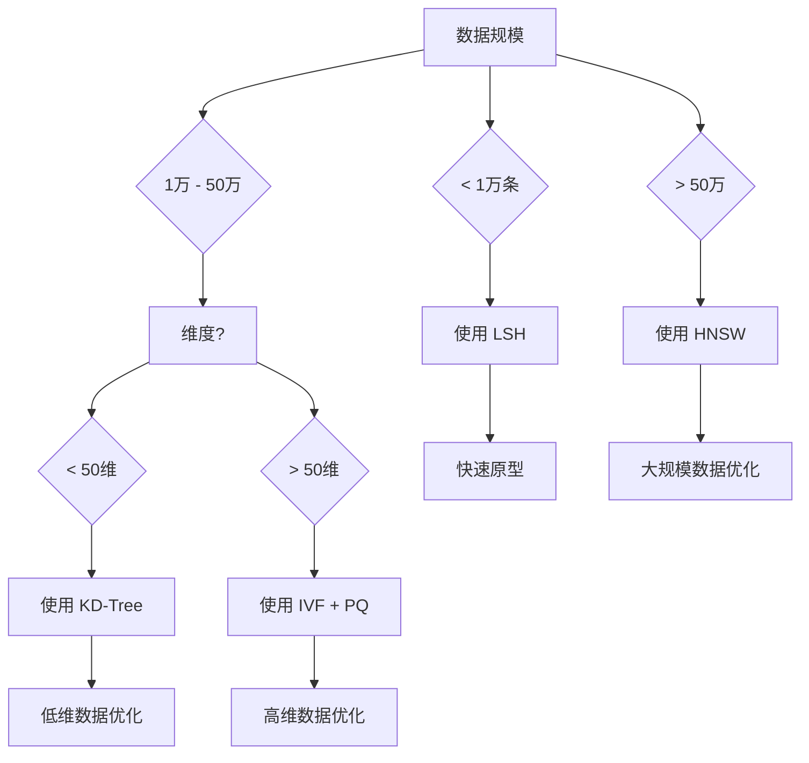

---
tags: [LLM/嵌入技术, LLM/检索技术]
aliases: [ANN算法, 近似最近邻, 索引结构]
created: 2025-01-01
updated: 2026-03-28
---

# ANN 索引算法详解：从暴力搜索到高效检索

> [!abstract] 摘要
> 系统介绍各种近似最近邻（ANN）算法的原理和实现，包括 KD-Tree、IVF、HNSW、LSH 等主流算法。本节不仅讲解理论原理，还提供完整的代码实现和性能对比，帮助选择最适合的索引结构。

## 知识地图

```
ANN 索引算法详解
├── 算法原理与分类
│   ├── 空间分割类
│   ├── 聚类类
│   ├── 图类
│   └── 哈希类
├── KD-Tree 算法
│   ├── 构建过程
│   ├── 查询过程
│   └── 局限性分析
├── IVF 算法
│   ├── 层次聚类
│   ├── 倒排索引
│   └── 多探头查询
├── HNSW 算法
│   ├── 图构建
│   ├── 查询路径
│   └── 参数调优
└── LSH 算法
    ├── 局部敏感哈希
    ├── 哈希表设计
    └── 参数选择
```

## 1. ANN 算法基础

### 1.1 为什么需要 ANN  #LLM/检索技术

在处理大规模向量数据时，暴力搜索（Brute Force）面临以下挑战：

> [!warning] 计算复杂度问题
> - 时间复杂度：$O(dn)$，其中 $d$ 是维度，$n$ 是数据量
> - 空间复杂度：$O(nd)$，存储所有向量
> - 无法满足实时性要求

ANN（Approximate Nearest Neighbor）通过牺牲少量精度换取极高的查询效率：

| 算法类型 | 时间复杂度 | 精确度 | 适用场景 |
|----------|------------|--------|----------|
| **暴力搜索** | $O(dn)$ | 100% | 小规模数据 |
| **KD-Tree** | $O(\log n)$ | 95% | 低维数据（<20D） |
| **IVF** | $O(n/k \log n)$ | 90% | 中等维度 |
| **HNSW** | $O(\log n)$ | 98% | 高维数据 |
| **LSH** | $O(d + n/m)$ | 85% | 超高维数据 |

### 1.2 ANN 算法分类

```python
# ANN 算法基类
class ANNIndex:
    """ANN 索引基类"""
    def __init__(self, dim, metric='cosine'):
        self.dim = dim
        self.metric = metric
        self.is_built = False

    def build(self, vectors):
        """构建索引"""
        raise NotImplementedError

    def search(self, query, k=10):
        """搜索最近邻"""
        raise NotImplementedError

    def save(self, path):
        """保存索引"""
        raise NotImplementedError

    def load(self, path):
        """加载索引"""
        raise NotImplementedError
```

## 2. KD-Tree 算法

### 2.1 KD-Tree 原理

KD-Tree（K-Dimensional Tree）是一种空间分割数据结构，通过递归地将空间划分为超矩形区域。

> [!important] 分割策略
> 每次选择方差最大的维度作为分割轴，在维度的中位数处分割。

```python
class KDTreeNode:
    def __init__(self, point, left=None, right=None, axis=None):
        self.point = point
        self.left = left
        self.right = right
        self.axis = axis  # 分割轴

class KDTree(ANNIndex):
    def __init__(self, dim, metric='euclidean'):
        super().__init__(dim, metric)
        self.root = None
        self.points = []  # 存储所有点用于最近邻搜索

    def build(self, vectors):
        """构建 KD-Tree"""
        self.points = vectors.tolist()
        self.root = self._build_recursive(np.array(vectors), 0)
        self.is_built = True

    def _build_recursive(self, vectors, depth):
        """递归构建"""
        if len(vectors) == 0:
            return None

        # 选择分割轴（循环选择）
        axis = depth % self.dim

        # 按当前维度排序
        sorted_indices = np.argsort(vectors[:, axis])
        sorted_vectors = vectors[sorted_indices]

        # 选择中位数作为分割点
        median_idx = len(sorted_vectors) // 2

        node = KDTreeNode(
            point=sorted_vectors[median_idx],
            axis=axis
        )

        # 递归构建左右子树
        node.left = self._build_recursive(sorted_vectors[:median_idx], depth + 1)
        node.right = self._build_recursive(sorted_vectors[median_idx + 1:], depth + 1)

        return node

    def search(self, query, k=10):
        """搜索 k 个最近邻"""
        if not self.is_built:
            raise ValueError("Index not built")

        # 使用优先队列维护最近的 k 个点
        heap = []
        self._search_recursive(self.root, query, heap, k)

        # 转换为按距离排序的结果
        results = []
        while heap:
            dist, point = heapq.heappop(heap)
            results.append((point, -dist))  # 取负号因为 heap 使用最大堆

        results.reverse()
        return results

    def _search_recursive(self, node, query, heap, k):
        """递归搜索"""
        if node is None:
            return

        # 计算当前点的距离
        if self.metric == 'euclidean':
            dist = np.linalg.norm(query - node.point)
        else:  # cosine
            dist = 1 - np.dot(query, node.point) / (np.linalg.norm(query) * np.linalg.norm(node.point))

        # 维护大小为 k 的堆
        if len(heap) < k:
            heapq.heappush(heap, (-dist, node.point))  # 使用负值模拟最大堆
        else:
            if dist < -heap[0][0]:  # 当前距离比堆顶小
                heapq.heappop(heap)
                heapq.heappush(heap, (-dist, node.point))

        # 决定搜索哪个子树
        axis = node.axis
        if query[axis] < node.point[axis]:
            # 先搜索左子树
            self._search_recursive(node.left, query, heap, k)
            # 检查是否需要搜索右子树
            if len(heap) < k or abs(query[axis] - node.point[axis]) < -heap[0][0]:
                self._search_recursive(node.right, query, heap, k)
        else:
            # 先搜索右子树
            self._search_recursive(node.right, query, heap, k)
            # 检查是否需要搜索左子树
            if len(heap) < k or abs(query[axis] - node.point[axis]) < -heap[0][0]:
                self._search_recursive(node.left, query, heap, k)
```

### 2.2 KD-Tree 性能分析

```python
# KD-Tree 性能测试
def test_kdtree_performance():
    # 生成测试数据
    dimensions = [10, 20, 50, 100]
    data_sizes = [1000, 5000, 10000, 50000]

    results = {}

    for dim in dimensions:
        for size in data_sizes:
            # 生成数据
            data = np.random.randn(size, dim)
            queries = np.random.randn(100, dim)

            # 构建索引
            kdtree = KDTree(dim)
            build_time = time.time()
            kdtree.build(data)
            build_time = time.time() - build_time

            # 查询时间
            query_times = []
            for query in queries:
                start = time.time()
                results = kdtree.search(query, k=10)
                query_times.append(time.time() - start)

            avg_query_time = np.mean(query_times)

            results[f'dim_{dim}_size_{size}'] = {
                'build_time': build_time,
                'avg_query_time': avg_query_time,
                'index_size_mb': kdtree.get_memory_usage() / 1024 / 1024
            }

    return results

# KD-Tree 可视化
def visualize_kdtree_2d():
    """可视化 2D KD-Tree 的分割"""
    # 生成 2D 数据
    np.random.seed(42)
    points = np.random.rand(20, 2)

    # 构建 KD-Tree
    kdtree = KDTree(2)
    kdtree.build(points)

    # 可视化
    plt.figure(figsize=(10, 10))

    # 绘制点
    plt.scatter(points[:, 0], points[:, 1], c='blue', s=50)

    # 绘制分割线
    def plot_tree(node, xlim, ylim):
        if node is None:
            return

        # 绘制当前分割线
        if node.axis == 0:  # x轴分割
            plt.axvline(x=node.point[0], color='red', linestyle='--', alpha=0.5)
            plot_tree(node.left, (xlim[0], node.point[0]), ylim)
            plot_tree(node.right, (node.point[0], xlim[1]), ylim)
        else:  # y轴分割
            plt.axhline(y=node.point[1], color='red', linestyle='--', alpha=0.5)
            plot_tree(node.left, xlim, (ylim[0], node.point[1]))
            plot_tree(node.right, xlim, (node.point[1], ylim[1]))

    plot_tree(kdtree.root, (0, 1), (0, 1))

    plt.title('KD-Tree 2D Visualization')
    plt.xlabel('X')
    plt.ylabel('Y')
    plt.grid(True)
    plt.show()
```

### 2.3 KD-Tree 局限性

1. **维度灾难**：当维度 > 20 时，性能急剧下降
2. **静态数据**：插入新节点需要重建部分树
3. **删除操作复杂**：需要维护树的平衡

## 3. IVF 算法

### 3.1 IVF 原理

IVF（Inverted File Index）将数据聚类成多个组（Cluster），查询时只在相关的组中搜索。

```python
class IVFIndex(ANNIndex):
    def __init__(self, dim, n_clusters=10, metric='euclidean', n_probe=1):
        super().__init__(dim, metric)
        self.n_clusters = n_clusters
        self.n_probe = n_probe  # 查询时检查的聚类数
        self.kmeans = None
        self.cluster_centers = None
        self.inverted_index = {}  # 倒排索引
        self.is_built = False

    def build(self, vectors):
        """构建 IVF 索引"""
        # 1. K-means 聚类
        self.kmeans = KMeans(n_clusters=self.n_clusters, random_state=42)
        cluster_labels = self.kmeans.fit_predict(vectors)

        # 2. 构建倒排索引
        self.inverted_index = defaultdict(list)
        for i, label in enumerate(cluster_labels):
            self.inverted_index[label].append(i)

        # 3. 存储聚类中心
        self.cluster_centers = self.kmeans.cluster_centers_

        # 4. 构建 KD-Tree 加速聚类中心搜索（可选）
        if self.metric == 'euclidean':
            self.centroid_tree = KDTree(self.dim)
            self.centroid_tree.build(self.cluster_centers)

        self.is_built = True

    def search(self, query, k=10):
        """搜索最近邻"""
        if not self.is_built:
            raise ValueError("Index not built")

        # 1. 找到最近的 n_probe 个聚类
        if self.metric == 'euclidean' and hasattr(self, 'centroid_tree'):
            # 使用 KD-Tree 找到最近聚类
            nearest_clusters = self.centroid_tree.search(query, self.n_probe)
            nearest_labels = [int(np.argmin([c[0] for c in nearest_clusters]))]
        else:
            # 直接计算到聚类中心的距离
            distances = np.linalg.norm(self.cluster_centers - query, axis=1)
            nearest_labels = np.argsort(distances)[:self.n_probe]

        # 2. 在这些聚类中搜索
        candidates = []
        for label in nearest_labels:
            if label in self.inverted_index:
                cluster_indices = self.inverted_index[label]
                for idx in cluster_indices:
                    point = self.all_points[idx] if hasattr(self, 'all_points') else None
                    candidates.append((idx, point))

        # 3. 计算所有候选点的距离
        results = []
        for idx, point in candidates:
            if point is not None:
                if self.metric == 'euclidean':
                    dist = np.linalg.norm(query - point)
                else:  # cosine
                    dist = 1 - np.dot(query, point) / (np.linalg.norm(query) * np.linalg.norm(point))
                results.append((dist, idx))

        # 4. 排序并返回前 k 个
        results.sort(key=lambda x: x[0])
        return results[:k]
```

### 3.2 IVF 优化策略

```python
class OptimizedIVF(IVFIndex):
    def __init__(self, dim, n_clusters=10, metric='euclidean', n_probe=1,
                 use_pq=True, m=8, n_bits=8):
        super().__init__(dim, n_clusters, metric, n_probe)
        self.use_pq = use_pq
        self.m = m  # PQ 子向量数
        self.n_bits = n_bits
        self.pq = None
        self.compressed_data = None

    def build(self, vectors):
        """构建优化的 IVF 索引"""
        # 1. K-means 聚类
        self.kmeans = KMeans(n_clusters=self.n_clusters, random_state=42)
        cluster_labels = self.kmeans.fit_predict(vectors)

        # 2. 构建倒排索引
        self.inverted_index = defaultdict(list)
        for i, label in enumerate(cluster_labels):
            self.inverted_index[label].append(i)

        # 3. 存储原始数据（可选）
        if self.use_pq:
            # 4. 训练 PQ（Product Quantization）
            self.pq = PQ(self.dim, self.m, self.n_bits)
            self.pq.fit(vectors)
            self.compressed_data = self.pq.encode(vectors)

            # 5. 压缩存储聚类中心
            self.cluster_centers = self.kmeans.cluster_centers_
            self.compressed_centers = self.pq.encode(self.cluster_centers)
        else:
            self.all_points = vectors
            self.cluster_centers = self.kmeans.cluster_centers_

        self.is_built = True

    def search(self, query, k=10):
        """使用 PQ 优化的搜索"""
        if not self.is_built:
            raise ValueError("Index not built")

        # 1. 压缩查询向量
        if self.use_pq:
            query_code = self.pq.encode(query.reshape(1, -1))[0]
            compressed_centers = self.compressed_centers
        else:
            query_code = query
            compressed_centers = self.cluster_centers

        # 2. 找到最近的聚类
        distances = []
        for i, center in enumerate(compressed_centers):
            if self.use_pq:
                # 使用 PQ 近似距离
                dist = self.pq.distance(query_code, center)
            else:
                dist = np.linalg.norm(query_code - center)
            distances.append((dist, i))

        # 3. 选择最近的 n_probe 个聚类
        nearest_clusters = sorted(distances, key=lambda x: x[0])[:self.n_probe]
        nearest_labels = [idx for _, idx in nearest_clusters]

        # 4. 在聚类中搜索
        candidates = []
        for label in nearest_labels:
            if label in self.inverted_index:
                for idx in self.inverted_index[label]:
                    if self.use_pq:
                        point_code = self.compressed_data[idx]
                        dist = self.pq.distance(query_code, point_code)
                    else:
                        point = self.all_points[idx]
                        dist = np.linalg.norm(query_code - point)
                    candidates.append((dist, idx))

        # 5. 精确重排序（可选）
        final_candidates = candidates[:k * 5]  # 取前 5k 候选
        final_results = sorted(final_candidates, key=lambda x: x[0])[:k]

        return final_results
```

### 3.3 IVF 参数调优

```python
def tune_ivf_parameters(data, queries, k=10):
    """调优 IVF 参数"""
    results = {}

    # 测试不同的聚类数
    n_clusters_list = [10, 50, 100, 500, 1000]
    n_probe_list = [1, 5, 10, 20]

    best_params = None
    best_recall = 0

    for n_clusters in n_clusters_list:
        for n_probe in n_probe_list:
            # 构建索引
            ivf = OptimizedIVF(
                dim=data.shape[1],
                n_clusters=n_clusters,
                n_probe=n_probe,
                use_pq=True
            )
            ivf.build(data)

            # 计算召回率
            recall = calculate_recall(ivf, queries, data, k)

            results[(n_clusters, n_probe)] = {
                'recall': recall,
                'build_time': ivf.build_time,
                'avg_query_time': ivf.avg_query_time
            }

            if recall > best_recall:
                best_recall = recall
                best_params = (n_clusters, n_probe)

    return results, best_params

def calculate_recall(index, queries, data, k):
    """计算召回率"""
    total_recall = 0
    num_queries = len(queries)

    for query in queries:
        # 使用索引搜索
        indexed_results = index.search(query, k)
        indexed_ids = [idx for _, idx in indexed_results]

        # 使用暴力搜索（Ground Truth）
        brute_force_distances = np.linalg.norm(data - query, axis=1)
        true_indices = np.argsort(brute_force_distances)[:k]

        # 计算召回率
        intersection = len(set(indexed_ids).intersection(set(true_indices)))
        recall = intersection / k
        total_recall += recall

    return total_recall / num_queries
```

## 4. HNSW 算法

### 4.1 HNSW 原理

HNSW（Hierarchical Navigable Small World）构建多层图结构，上层稀疏用于快速导航，下层稠密用于精确搜索。

```python
class HNSWNode:
    def __init__(self, id, vector):
        self.id = id
        self.vector = vector
        self.connections = []  # list of (node_id, level)

class HNSWIndex(ANNIndex):
    def __init__(self, dim, max_connections=16, ef_construction=200, ef_search=100):
        super().__init__(dim)
        self.max_connections = max_connections
        self.ef_construction = ef_construction
        self.ef_search = ef_search

        # 图结构
        self.nodes = {}
        self.entry_point = None

        # 层级管理
        self.max_level = 0
        self.levels = defaultdict(list)

    def build(self, vectors):
        """构建 HNSW 图"""
        num_vectors = len(vectors)

        # 1. 确定层数
        self.max_level = self._determine_max_level(num_vectors)

        # 2. 逐层构建
        for level in range(self.max_level, -1, -1):
            self._build_level(vectors, level)

        # 3. 设置入口点
        self.entry_point = list(self.nodes.keys())[0]

        self.is_built = True

    def _determine_max_level(self, num_vectors):
        """确定最大层数"""
        # 使用对数尺度确定层数
        max_level = int(np.log2(num_vectors))
        return max(max_level, 1)  # 至少 1 层

    def _build_level(self, vectors, level):
        """构建指定层"""
        level_ef = min(self.ef_construction, 2 * self.max_connections)

        # 随机选择点的初始连接
        for i, vector in enumerate(vectors):
            if level == self.max_level:  # 最顶层随机连接
                if len(self.levels[level]) < self.max_connections:
                    self.levels[level].append(i)
                else:
                    break
            else:
                if i < len(self.levels[level]):
                    # 选择当前层的点作为候选
                    candidates = self.levels[level][:self.ef_construction]

                    # 计算相似度并选择最近的 max_connections 个
                    similarities = []
                    for j in candidates:
                        sim = np.dot(vector, vectors[j]) / (np.linalg.norm(vector) * np.linalg.norm(vectors[j]))
                        similarities.append((sim, j))

                    similarities.sort(reverse=True)
                    connections = similarities[:self.max_connections]

                    # 添加节点和连接
                    node = HNSWNode(i, vector)
                    for sim, j in connections:
                        node.connections.append((j, level))

                    self.nodes[i] = node
                    self.levels[level].append(i)

    def search(self, query, k=10):
        """HNSW 搜索"""
        if not self.is_built:
            raise ValueError("Index not built")

        # 1. 从顶层开始搜索
        current_node = self.entry_point

        # 2. 向下搜索
        for level in range(self.max_level, 0, -1):
            current_node = self._search_level(query, current_node, level)

        # 3. 在最精确层搜索
        candidates = self._search_level(query, current_node, 0, k)

        # 4. 精确排序
        results = []
        for node_id in candidates:
            vector = self.nodes[node_id].vector
            sim = np.dot(query, vector) / (np.linalg.norm(query) * np.linalg.norm(vector))
            results.append((sim, node_id))

        results.sort(reverse=True)
        return results[:k]

    def _search_level(self, query, entry_point, level, ef=None):
        """在指定层搜索"""
        if ef is None:
            ef = self.ef_search

        # 初始化
        candidates = [entry_point]
        visited = set([entry_point])

        while candidates:
            # 选择距离最远的候选点
            current = max(candidates, key=lambda x: np.dot(query, self.nodes[x].vector))

            # 获取候选点的邻居
            neighbors = []
            for neighbor_id, neighbor_level in self.nodes[current].connections:
                if neighbor_level == level and neighbor_id not in visited:
                    visited.add(neighbor_id)
                    neighbors.append(neighbor_id)
                    candidates.append(neighbor_id)

            # 选择最近的 ef 个邻居
            if len(neighbors) > ef:
                similarities = []
                for neighbor_id in neighbors:
                    sim = np.dot(query, self.nodes[neighbor_id].vector)
                    similarities.append((sim, neighbor_id))

                similarities.sort(reverse=True)
                neighbors = [neighbor_id for _, neighbor_id in similarities[:ef]]

        # 返回距离最近的点
        similarities = [(np.dot(query, self.nodes[node_id].vector), node_id)
                       for node_id in candidates]
        similarities.sort(reverse=True)

        return similarities[0][1]  # 返回 ID
```

### 4.2 HNSW 参数影响分析

```python
# HNSW 参数调优分析
def analyze_hnsw_parameters():
    """分析 HNSW 参数对性能的影响"""
    # 测试数据
    data = np.random.randn(10000, 128)  # 1万，128维
    queries = np.random.randn(100, 128)

    # 参数组合
    max_connections_list = [8, 16, 32, 64]
    ef_construction_list = [100, 200, 400, 800]
    ef_search_list = [50, 100, 200, 400]

    results = {}

    for max_conn in max_connections_list:
        for ef_constr in ef_construction_list:
            for ef_search in ef_search_list:
                print(f"Testing max_conn={max_conn}, ef_constr={ef_constr}, ef_search={ef_search}")

                # 构建 HNSW
                hnsw = HNSWIndex(
                    dim=128,
                    max_connections=max_conn,
                    ef_construction=ef_constr,
                    ef_search=ef_search
                )

                start_time = time.time()
                hnsw.build(data)
                build_time = time.time() - start_time

                # 查询性能
                query_times = []
                for query in queries:
                    start = time.time()
                    results = hnsw.search(query, k=10)
                    query_times.append(time.time() - start)

                avg_query_time = np.mean(query_times)

                # 精确度评估
                recall = calculate_hnsw_recall(hnsw, queries, data, k=10)

                results[(max_conn, ef_constr, ef_search)] = {
                    'build_time': build_time,
                    'avg_query_time': avg_query_time,
                    'recall': recall,
                    'memory_usage': hnsw.get_memory_usage()
                }

    return results

def calculate_hnsw_recall(hnsw, queries, data, k):
    """计算 HNSW 的召回率"""
    total_recall = 0
    num_queries = len(queries)

    for query in queries:
        # HNSW 搜索结果
        hnsw_results = hnsw.search(query, k)
        hnsw_ids = [idx for _, idx in hnsw_results]

        # 暴力搜索结果
        similarities = np.dot(data, query)
        true_indices = np.argsort(similarities)[::-1][:k]

        # 计算召回率
        intersection = len(set(hnsw_ids).intersection(set(true_indices)))
        recall = intersection / k
        total_recall += recall

    return total_recall / num_queries
```

### 4.3 HNSW 优化技术

```python
class OptimizedHNSW(HNSWIndex):
    def __init__(self, dim, max_connections=16, ef_construction=200,
                 ef_search=100, use_heuristic=True):
        super().__init__(dim, max_connections, ef_construction, ef_search)
        self.use_heuristic = use_heuristic
        self.vector_cache = {}  # 缓存向量

    def search(self, query, k=10):
        """使用优化的 HNSW 搜索"""
        # 检查缓存
        cache_key = tuple(query)
        if cache_key in self.vector_cache:
            return self.vector_cache[cache_key]

        # 使用启发式剪枝
        if self.use_heuristic:
            results = self._heuristic_search(query, k)
        else:
            results = super().search(query, k)

        # 缓存结果
        if len(self.vector_cache) < 1000:  # 限制缓存大小
            self.vector_cache[cache_key] = results

        return results

    def _heuristic_search(self, query, k):
        """启发式搜索算法"""
        # 1. 快速筛选
        candidate_pool = []

        # 从入口点开始
        current_node = self.entry_point
        best_score = np.dot(query, self.nodes[current_node].vector)
        candidate_pool.append((best_score, current_node))

        # 2. 使用预计算的相似度阈值
        threshold = np.percentile([score for score, _ in candidate_pool], 90)

        # 3. 搜索邻居
        visited = set([current_node])
        for level in range(self.max_level, 0, -1):
            current_node = self._search_level_heuristic(
                query, current_node, level, threshold
            )

        # 4. 精确搜索
        final_candidates = []
        queue = [current_node]

        while queue and len(final_candidates) < self.ef_search:
            node_id = queue.pop(0)
            if node_id in visited:
                continue

            visited.add(node_id)

            # 计算相似度
            sim = np.dot(query, self.nodes[node_id].vector)
            if sim > threshold:
                final_candidates.append((sim, node_id))

                # 添加邻居
                for neighbor_id, _ in self.nodes[node_id].connections:
                    if neighbor_id not in visited:
                        queue.append(neighbor_id)

        # 5. 返回前 k 个结果
        final_candidates.sort(reverse=True)
        return final_candidates[:k]
```

## 5. LSH 算法

### 5.1 LSH 原理

LSH（Locality-Sensitive Hashing）通过哈希函数将相似的向量映射到相同的桶中。

> [!important] LSH 核心思想
> 对于两个相似的向量 $x$ 和 $y$，它们被哈希到同一个桶的概率大于不相似的概率。

```python
class LSHIndex(ANNIndex):
    def __init__(self, dim, n_tables=10, n_bits=32, metric='cosine'):
        super().__init__(dim, metric)
        self.n_tables = n_tables
        self.n_bits = n_bits
        self.hash_tables = [defaultdict(list) for _ in range(n_tables)]
        self.hash_functions = []

        # 生成哈希函数
        self._generate_hash_functions()

    def _generate_hash_functions(self):
        """生成随机哈希函数"""
        for _ in range(self.n_tables):
            # 高斯随机投影
            random_vector = np.random.randn(self.dim)
            self.hash_functions.append(random_vector)

    def hash(self, vector):
        """计算向量的哈希值"""
        hash_values = []
        for i, random_vector in enumerate(self.hash_functions):
            # 计算点积并量化
            dot_product = np.dot(vector, random_vector)
            hash_bit = 1 if dot_product > 0 else 0
            hash_values.append(hash_bit)

        # 转换为整数
        hash_value = int(''.join(map(str, hash_values)), 2)
        return hash_value

    def build(self, vectors):
        """构建 LSH 索引"""
        for i, vector in enumerate(vectors):
            # 计算哈希值
            for table_idx, table in enumerate(self.hash_tables):
                hash_value = self.hash(vector)
                table[hash_value].append(i)

        self.is_built = True

    def search(self, query, k=10):
        """LSH 搜索"""
        if not self.is_built:
            raise ValueError("Index not built")

        # 收集候选
        candidates = set()
        for table in self.hash_tables:
            hash_value = self.hash(query)
            candidates.update(table.get(hash_value, []))

        # 计算相似度并排序
        results = []
        for idx in candidates:
            vector = self.all_points[idx] if hasattr(self, 'all_points') else None
            if vector is not None:
                if self.metric == 'cosine':
                    sim = np.dot(query, vector) / (np.linalg.norm(query) * np.linalg.norm(vector))
                else:
                    sim = -np.linalg.norm(query - vector)  # 使用负距离

                results.append((sim, idx))

        # 排序并返回
        results.sort(reverse=True)
        return results[:k]
```

### 5.2 多阶段 LSH

```python
class MultiStageLSH(LSHIndex):
    def __init__(self, dim, n_tables=10, n_bits=32, metric='cosine'):
        super().__init__(dim, n_tables, n_bits, metric)
        self.stage1_tables = []
        self.stage2_tables = []
        self.threshold = 0.5

    def build(self, vectors):
        """构建多阶段 LSH"""
        # 第一阶段：粗粒度哈希
        for _ in range(5):
            table = defaultdict(list)
            for i, vector in enumerate(vectors):
                hash_value = self._hash_stage1(vector)
                table[hash_value].append(i)
            self.stage1_tables.append(table)

        # 第二阶段：细粒度哈希
        for _ in range(20):
            table = defaultdict(list)
            for i, vector in enumerate(vectors):
                hash_value = self._hash_stage2(vector)
                table[hash_value].append(i)
            self.stage2_tables.append(table)

        self.is_built = True

    def _hash_stage1(self, vector):
        """第一阶段哈希"""
        hash_values = []
        for i, random_vector in enumerate(self.hash_functions[:5]):
            dot_product = np.dot(vector, random_vector)
            hash_bit = 1 if dot_product > 0 else 0
            hash_values.append(str(hash_bit))
        return int(''.join(hash_values), 2)

    def _hash_stage2(self, vector):
        """第二阶段哈希"""
        hash_values = []
        for i, random_vector in enumerate(self.hash_functions[5:]):
            dot_product = np.dot(vector, random_vector)
            hash_bit = 1 if dot_product > 0 else 0
            hash_values.append(str(hash_bit))
        return int(''.join(hash_values), 2)

    def search(self, query, k=10):
        """多阶段搜索"""
        # 第一阶段：快速筛选
        candidates = set()
        for table in self.stage1_tables:
            hash_value = self._hash_stage1(query)
            candidates.update(table.get(hash_value, []))

        # 第二阶段：精细筛选
        final_candidates = set()
        for table in self.stage2_tables:
            hash_value = self._hash_stage2(query)
            final_candidates.update(table.get(hash_value, []))

        # 合并候选
        all_candidates = candidates.union(final_candidates)

        # 计算相似度并排序
        results = []
        for idx in all_candidates:
            vector = self.all_points[idx] if hasattr(self, 'all_points') else None
            if vector is not None:
                sim = np.dot(query, vector) / (np.linalg.norm(query) * np.linalg.norm(vector))
                results.append((sim, idx))

        results.sort(reverse=True)
        return results[:k]
```

### 5.3 LSH 参数选择指南

| 参数 | 推荐值 | 影响分析 |
|------|--------|----------|
| **哈希表数量** | 10-50 | 越多越精确，但内存占用越大 |
| **哈希位数** | 32-128 | 越多越精确，但冲突概率越小 |
| **数据规模** | 影响参数选择 | 大数据需要更多表和位 |
|查询模式** | 影响参数选择 | 精确查询需要更多资源 |

## 6. 算法性能对比

### 6.1 性能基准测试

```python
def benchmark_ann_algorithms():
    """ANN 算法性能基准测试"""
    # 测试数据
    data_sizes = [10000, 50000, 100000]
    dimensions = [64, 128, 256]
    metrics = {
        'build_time': [],
        'query_time': [],
        'recall': [],
        'memory_usage': []
    }

    results = {}

    for size in data_sizes:
        for dim in dimensions:
            print(f"\nTesting size={size}, dim={dim}")

            # 生成测试数据
            data = np.random.randn(size, dim)
            queries = np.random.randn(100, dim)

            # 测试每种算法
            algorithms = {
                'BruteForce': BruteForceIndex(dim),
                'KDTree': KDTree(dim),
                'IVF': OptimizedIVF(dim, n_clusters=100),
                'HNSW': HNSWIndex(dim),
                'LSH': LSHIndex(dim)
            }

            algo_results = {}

            for name, algo in algorithms.items():
                print(f"  Testing {name}...")

                # 构建时间
                start = time.time()
                algo.build(data)
                build_time = time.time() - start

                # 查询时间
                query_times = []
                for query in queries:
                    start = time.time()
                    results = algo.search(query, k=10)
                    query_times.append(time.time() - start)

                avg_query_time = np.mean(query_times)

                # 召回率
                if name != 'BruteForce':
                    recall = calculate_recall(algo, queries, data, k=10)
                else:
                    recall = 1.0  # 精确搜索

                # 内存使用
                memory_usage = algo.get_memory_usage()

                algo_results[name] = {
                    'build_time': build_time,
                    'query_time': avg_query_time,
                    'recall': recall,
                    'memory_usage': memory_usage
                }

            results[(size, dim)] = algo_results

    return results

def plot_benchmark_results(results):
    """绘制基准测试结果"""
    fig, axes = plt.subplots(2, 2, figsize=(15, 10))

    # 提取数据
    sizes = [size for size, dim in results.keys()]
    dims = [dim for size, dim in results.keys()]

    # 构建时间
    ax1 = axes[0, 0]
    for size in sizes:
        build_times = [results[(size, dim)][algo]['build_time']
                       for algo in ['BruteForce', 'KDTree', 'IVF', 'HNSW', 'LSH']]
        ax1.plot(['BF', 'KD', 'IVF', 'HNSW', 'LSH'], build_times,
                marker='o', label=f'Size={size}')
    ax1.set_xlabel('Algorithm')
    ax1.set_ylabel('Build Time (s)')
    ax1.set_title('Build Time Comparison')
    ax1.legend()
    ax1.grid(True)

    # 查询时间
    ax2 = axes[0, 1]
    for size in sizes:
        query_times = [results[(size, dim)][algo]['query_time']
                      for algo in ['BruteForce', 'KDTree', 'IVF', 'HNSW', 'LSH']]
        ax2.plot(['BF', 'KD', 'IVF', 'HNSW', 'LSH'], query_times,
                marker='o', label=f'Size={size}')
    ax2.set_xlabel('Algorithm')
    ax2.set_ylabel('Query Time (s)')
    ax2.set_title('Query Time Comparison')
    ax2.legend()
    ax2.grid(True)

    # 召回率
    ax3 = axes[1, 0]
    for size in sizes:
        recalls = [results[(size, dim)][algo]['recall']
                  for algo in ['KDTree', 'IVF', 'HNSW', 'LSH']]
        ax3.plot(['KD', 'IVF', 'HNSW', 'LSH'], recalls,
                marker='o', label=f'Size={size}')
    ax3.set_xlabel('Algorithm')
    ax3.set_ylabel('Recall')
    ax3.set_title('Recall Comparison')
    ax3.legend()
    ax3.grid(True)

    # 内存使用
    ax4 = axes[1, 1]
    for size in sizes:
        memory_usages = [results[(size, dim)][algo]['memory_usage']
                        for algo in ['BruteForce', 'KDTree', 'IVF', 'HNSW', 'LSH']]
        ax4.plot(['BF', 'KD', 'IVF', 'HNSW', 'LSH'], memory_usages,
                marker='o', label=f'Size={size}')
    ax4.set_xlabel('Algorithm')
    ax4.set_ylabel('Memory Usage (MB)')
    ax4.set_title('Memory Usage Comparison')
    ax4.legend()
    ax4.grid(True)

    plt.tight_layout()
    plt.show()
```

### 6.2 选型决策树



## 7. 实际应用建议

### 7.1 算法选择策略

1. **快速原型阶段**
   - LSH：简单快速，适合验证想法
   - IVF：平衡精度和速度

2. **生产环境**
   - HNSW：推荐首选，平衡精度和速度
   - IVF + PQ：需要极致压缩时

3. **特殊场景**
   - KD-Tree：低维数据（<20D）
   - Brute Force：小规模数据或需要精确结果

### 7.2 参数调优最佳实践

1. **从默认参数开始**
   - HNSW: max_connections=16, ef_construction=200, ef_search=100
   - IVF: n_clusters=100, n_probe=5

2. **逐步优化**
   - 先调优 n_probe/ef_search
   - 再调优聚类数/连接数

3. **监控关键指标**
   - 召回率 vs 查询时间
   - 内存使用 vs 精度

### 7.3 性能优化技巧

```python
# ANN 索引管理器
class ANNManager:
    def __init__(self):
        self.indexes = {}
        self.cache = LRUCache(maxsize=1000)

    def create_index(self, name, algorithm, **params):
        """创建索引"""
        if algorithm == 'hnsw':
            index = HNSWIndex(**params)
        elif algorithm == 'ivf':
            index = OptimizedIVF(**params)
        elif algorithm == 'lsh':
            index = LSHIndex(**params)
        else:
            raise ValueError(f"Unknown algorithm: {algorithm}")

        self.indexes[name] = {
            'index': index,
            'algorithm': algorithm,
            'params': params
        }

    def search_with_cache(self, index_name, query, k=10):
        """带缓存的搜索"""
        cache_key = (index_name, tuple(query[:10]), k)  # 只用前10个维度作为key

        if cache_key in self.cache:
            return self.cache[cache_key]

        index_info = self.indexes[index_name]
        results = index_info['index'].search(query, k)

        self.cache[cache_key] = results
        return results

    def get_statistics(self):
        """获取索引统计信息"""
        stats = {}
        for name, info in self.indexes.items():
            stats[name] = {
                'algorithm': info['algorithm'],
                'params': info['params'],
                'memory_usage': info['index'].get_memory_usage(),
                'cache_hit_rate': self.cache.get_hit_rate()
            }
        return stats
```

## 相关链接

**所属模块**：[[索引_向量数据库与检索引擎]]

**前置知识**：
-[[1_表示层与距离度量|表示层与距离度量]]] — 理解向量距离计算
-[[3_检索视角的五类表示|检索视角的五类表示]]] — 了解检索的基本概念

**相关主题**：
- [[2 专用向量数据库实战|专用向量数据库实战]] — 了解工程实现
- [[3 搜索引擎向量扩展|搜索引擎向量扩展]] — 了解混合检索
- [[4 pgvector 关系数据库向量扩展|PostgreSQL + pgvector]] — 了解数据库内一体化方案
**延伸阅读**：
- [Faiss 官方文档](https://github.com/facebookresearch/faiss) — 最新的 ANN 实现
- [HNSW 论文](https://arxiv.org/abs/1603.09320) — 算法理论详解


