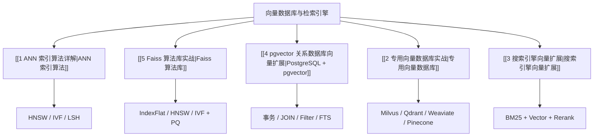

---
tags:
  - LLM/嵌入技术
  - LLM/数据库
  - LLM/检索技术
aliases:
  - 向量数据库
  - 向量检索系统
  - Vector Database
created: 2025-01-01
updated: 2026-03-28
---

# 向量数据库与检索引擎：索引

> [!abstract] 模块概览
> 这一组笔记讨论“向量如何被真正存起来、建索引并检索出来”。推荐按 [[1 ANN 索引算法详解|ANN 算法]] -> [[5 Faiss 算法库实战|算法库]] -> [[4 pgvector 关系数据库向量扩展|PostgreSQL + pgvector]] -> [[2 专用向量数据库实战|专用向量数据库]] -> [[3 搜索引擎向量扩展|搜索引擎扩展]] 的顺序阅读。

## 知识地图

## 先建立选型框架

> [!tip] 先问四个问题
> 1. 你的检索结果是否必须和业务表做 `JOIN`、事务写入、权限过滤一起落在一套库里？
> 2. 你是否已经有成熟的 Elasticsearch / OpenSearch / Vespa 搜索栈？
> 3. 数据规模、写入频率、多租户隔离是否已经逼近独立检索服务？
> 4. 你现在是在做算法实验，还是在搭可运维的生产系统？

| 路线 | 最适合解决的问题 | 代表笔记 | 典型边界 |
| --- | --- | --- | --- |
| 算法层 | 先理解 recall / latency / memory 三角关系 | [[1 ANN 索引算法详解]] | 不直接提供服务化能力 |
| 算法库层 | 自建索引、做离线评测、做自有召回服务 | [[5 Faiss 算法库实战]] | 需要自己管理存储、过滤、部署 |
| 关系数据库层 | 业务数据与向量数据强耦合，需要 SQL、事务与过滤 | [[4 pgvector 关系数据库向量扩展]] | 单机或单库扩展能力优先 |
| 专用向量数据库层 | 检索系统本身是主角，需要独立扩缩容 | [[2 专用向量数据库实战]] | 系统组件和运维复杂度更高 |
| 搜索引擎层 | 已有全文检索栈，需要 lexical + semantic 一体化 | [[3 搜索引擎向量扩展]] | 向量性能通常不是唯一优化目标 |

## 子主题导航

### [[1 ANN 索引算法详解|ANN 索引算法详解]]
这一篇负责回答“为什么检索不能暴力扫全库”。如果不先理解 HNSW、IVF、LSH 的速度与召回权衡，后面的产品选型只会停留在名词层面。

### [[5 Faiss 算法库实战|Faiss 算法库实战]]
Faiss 是算法库，不是数据库。适合先把索引训练、压缩、GPU 加速这些“底层能力”单独看清楚，再回头理解上层数据库为什么会做出不同工程取舍。

### [[4 pgvector 关系数据库向量扩展|pgvector 关系数据库扩展]]
这一篇重点补充 PostgreSQL 路线。`pgvector` 让 PostgreSQL 同时承担事务数据、元数据过滤、全文检索和向量召回，是当前工程实践里非常常见的一条路径。

> [!note] 为什么 PostgreSQL 要单独拿出来讲
> 它不是“顺手加一个向量字段”这么简单，而是把一致性写入、`JOIN`、权限过滤、全文检索和向量检索放进同一个 SQL 边界内。对知识库、客服问答、SaaS 多租户检索尤其常见。

### [[2 专用向量数据库实战|专用向量数据库实战]]
Milvus、Qdrant、Weaviate、Pinecone 这类系统更像“检索平台”，适合把索引、过滤、扩缩容、服务治理独立出来。

### [[3 搜索引擎向量扩展|搜索引擎向量扩展]]
如果系统已经建立在 Elasticsearch / OpenSearch / Vespa 上，向量检索最自然的演化路径通常不是新增一套检索基础设施，而是直接把 semantic retrieval 融进现有搜索链路。

## 技术选型矩阵

| 方案 | 主要优势 | 主要代价 | 适用场景 |
| --- | --- | --- | --- |
| [[4 pgvector 关系数据库向量扩展|PostgreSQL + pgvector]] | 一套库内完成事务、过滤、`JOIN`、向量检索、全文检索 | 超大规模与分布式弹性不如专用引擎 | 知识库、后台系统、SaaS、多租户检索 |
| [[2 专用向量数据库实战|专用向量数据库]] | 检索能力最完整，服务化、分布式、向量优先 | 需要新增组件和运维体系 | 独立召回服务、海量向量、多集群部署 |
| [[3 搜索引擎向量扩展|搜索引擎向量扩展]] | BM25、filter、aggregation、向量召回同层完成 | 索引体系和评分逻辑更偏搜索引擎思维 | 站内搜索、商品搜索、内容搜索 |
| [[5 Faiss 算法库实战|Faiss]] | 控制力最强，适合实验与自研底座 | 需要自己补齐存储、过滤、服务化 | 研究、离线评测、自建 ANN 服务 |

## 推荐学习路径

1. 先读 [[1 ANN 索引算法详解|ANN 索引算法详解]]，建立“为什么要近似搜索”的算法心智。
2. 再读 [[5 Faiss 算法库实战|Faiss 算法库实战]]，理解索引是如何被真正训练、加载和查询的。
3. 如果业务数据和检索数据天然耦合，优先读 [[4 pgvector 关系数据库向量扩展|PostgreSQL + pgvector]]。
4. 如果要构建独立召回平台，再读 [[2 专用向量数据库实战|专用向量数据库实战]]。
5. 如果已有搜索栈，则对照 [[3 搜索引擎向量扩展|搜索引擎向量扩展]] 理解 hybrid retrieval。

## 前置与延伸

**所属模块**：
-[[索引_Embedding与位置编码|Embedding 与位置编码]]]

**前置知识**：
-[[1_表示层与距离度量|表示层与距离度量]]] — 先理解距离函数和相似度。
-[[3_检索视角的五类表示|检索视角的五类表示]]] — 先区分 dense、sparse、late interaction。
[[00_缩放点积注意力_为什么是点积_为什么要除以根号dk|注意力机制]]]] — 理解向量相似度计算的基础。

**相关主题**：
- [[../../../09_RAG_检索增强生成/RAG总体架构_数据流|RAG 总体架构]] — 看召回层如何接进生成链路。
- [[../../../09_RAG_检索增强生成/RAG核心模块/2检索召回/检索召回（Retrieval）|检索召回（Retrieval）]] — 看检索在 RAG 中的角色。
- [[../../../09_RAG_检索增强生成/RAG方案/3Hybrid RAG|Hybrid RAG]] — 看稀疏与稠密如何融合。

## 参考资料

- [pgvector README](https://github.com/pgvector/pgvector)
- [PostgreSQL Full Text Search](https://www.postgresql.org/docs/current/textsearch-intro.html)
- [Elasticsearch kNN Search](https://www.elastic.co/docs/solutions/search/vector/knn)
- [Qdrant Filtering](https://qdrant.tech/documentation/concepts/filtering/)
- [Milvus Filtered Search](https://milvus.io/docs/filtered-search.md)
- [Faiss Getting Started](https://github.com/facebookresearch/faiss/wiki/Getting-started)

