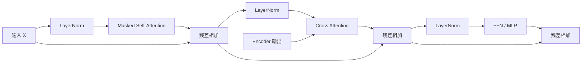

---
tags:
  - LLM/Transformer
  - 模块/DecoderBlock
  - 架构/EncoderDecoder
aliases:
  - Decoder Block
  - 解码器块
updated: 2026-03-29
---

# Decoder Block（解码器块）

> [!abstract]
> Decoder Block 比 Encoder Block 多了一件关键的事：它不仅要看目标前缀内部的信息，还要按需读取 Encoder 提供的条件信息。

## 标准结构

在经典 Encoder-Decoder Transformer 中，Decoder Block 通常包含三个子层：

$$
H_1 = X + \text{MHA}_{\text{masked}}(\text{LN}(X))
$$

$$
H_2 = H_1 + \text{CrossAttn}(\text{LN}(H_1), K^{enc}, V^{enc})
$$

$$
H_3 = H_2 + \text{FFN}(\text{LN}(H_2))
$$

流程可以画成：

## 三个子层分别在做什么

| 子层 | 核心问题 | 作用 |
| --- | --- | --- |
| Masked Self-Attention | 我已经生成过什么 | 只能看目标前缀，保证自回归 |
| Cross Attention | 我应该从源端读取什么 | 让生成受源序列或条件约束 |
| FFN | 我如何重组当前位置特征 | 做逐位置非线性变换 |

## 为什么 Decoder 一定要先做 masked self-attention

因为 Decoder 是自回归生成的。  
在预测第 $t$ 个 token 时，它只能依赖：

- 已经生成的目标前缀
- 源端或条件端提供的信息

如果不加 causal mask，训练阶段就会出现“偷看未来 token”的问题。

## 为什么 cross-attention 放在中间

先做 masked self-attention，得到的是“当前生成进度下的内部状态”；  
再做 cross-attention，才能用这个状态去源端查询最相关的信息。

这和真实生成过程很一致：

1. 我先知道自己已经说到哪里
2. 然后再去源句子里找下一步该补什么

## Decoder Block 与 Encoder Block 的关键区别

| 维度 | Encoder Block | Decoder Block |
| --- | --- | --- |
| 自注意力 | 无因果约束 | 必须带 causal mask |
| 是否读取外部条件 | 否 | 是，通过 cross-attention |
| 典型任务 | 编码、理解 | 生成、翻译、摘要 |

## 推理时为什么特别依赖 KV cache

自回归生成时，Decoder 每一步都只新增一个 token。  
如果每次都把历史前缀重新算一遍，成本会非常高。

因此实际推理通常会：

- 缓存 masked self-attention 的历史 $K/V$
- Encoder 输出的 $K^{enc},V^{enc}$ 只计算一次
- 每一步只增量计算当前 Query

> [!tip]
> 这也是为什么 Decoder 侧的优化，常常和 [[00_KVCache_Prefill_Decode_PagedAttention|KV Cache]]、[[05_多查询注意力MQA]]、[[06_分组注意力GQA]] 一起讨论。

## 变体怎么理解

### 1. Decoder-only 模型

如果是 GPT 类 Decoder-only 架构，那么中间的 cross-attention 会被拿掉，只保留 masked self-attention + FFN。

### 2. 轻量化 cross-attention

为了降低解码成本，可以压缩 cross-attention 的头数、KV 维度，或只在部分层保留 cross-attention。

### 3. 门控 FFN / MoE

很多现代模型会把标准 FFN 替换成 Gated-FFN 或 Mixture-of-Experts，以提升容量。

## 相关双链

- [[01_Encoder_Block]]
- [[03_掩码与因果性]]
- [[04_交叉注意力Cross Attention]]
- [[03_Encoder_Decoder_transformer流程]]
- [[02_EncoderDecoder数据流与CrossAttention位置|Encoder-Decoder 数据流与 Cross-Attention 位置]]
- [[00_KVCache_Prefill_Decode_PagedAttention|KV Cache 总览]]
