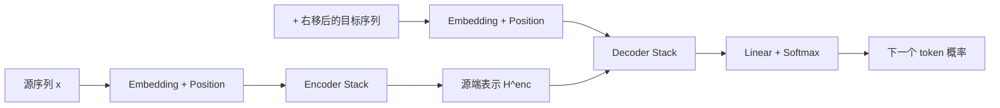

---
tags:
  - LLM/Transformer
  - 架构/EncoderDecoder
  - 训练/TeacherForcing
aliases:
  - Encoder-Decoder Transformer
  - Seq2Seq Transformer
updated: 2026-03-29
---

# Encoder-Decoder Transformer 流程

> [!abstract]
> 标准 Encoder-Decoder Transformer 不是“整个模型都自回归”，而是 Encoder 负责把源序列编码好，Decoder 再在因果约束下逐步生成目标序列。

![[Pasted image 20260109094448.png|800]]

## 先看整条数据流

这条链路可以分成两个部分：

1. Encoder 把源序列变成上下文化表示 $H^{enc}$
2. Decoder 在看目标前缀的同时，反复读取 $H^{enc}$ 来生成下一个 token

## 为什么训练时要“右移”

训练 Decoder 时，目标序列不能原样喂进去，否则模型会直接看到当前时刻的正确答案。  
所以标准做法是把目标序列整体右移一位，在开头补一个起始符 `<bos>`。

### 一个最直观的表格

| 时间步 | 解码器输入（右移后） | 模型要预测的输出 | 含义 |
| --- | --- | --- | --- |
| Step 1 | `<Start>` | 我 | 只给起始符，预测第一个词 |
| Step 2 | `<Start> 我` | 爱 | 用前缀预测下一个词 |
| Step 3 | `<Start> 我 爱` | AI | 继续根据历史前缀预测 |
| Step 4 | `<Start> 我 爱 AI` | `<End>` | 预测句子结束 |

> [!warning]
> “Shifted Right” 的目的不是对齐格式，而是避免训练时泄露答案。

## Encoder 在做什么

源序列经过：

1. 分词
2. 词嵌入与位置编码
3. 多层 [[01_Encoder_Block]]

最终得到：

$$
H^{enc} \in \mathbb{R}^{L_{src} \times d_{model}}
$$

这个表示不是简单的词向量堆叠，而是已经融合了整个源句上下文的信息。

## Decoder 在做什么

Decoder 每层内部依次做三件事：

1. 用 masked self-attention 看目标前缀
2. 用 [[04_交叉注意力Cross Attention]] 读取 $H^{enc}$
3. 用 FFN 继续变换当前位置表示

因此 Decoder 的任务不是“凭空生成”，而是：

- 一边维护当前生成状态
- 一边从源端不断检索最相关的信息

## 为什么说 cross-attention 是翻译的灵魂

假设 Encoder 编码的是 `I love AI`，Decoder 当前已经生成了“我”。

此时 Decoder 的 Query 代表的是：

> “我已经生成到主语了，下一步应该去源句子里找哪个位置最相关？”

于是：

- 与 `I` 对应的表示可能相关，但不一定最相关
- 与 `love` 对应的表示更可能提供下一步生成“爱”所需的语义

这就是 cross-attention 的意义：  
**让 Decoder 可以把“当前生成进度”与“源序列内容”对齐起来。**

## 训练路径 vs 推理路径

| 阶段 | Encoder | Decoder | 特点 |
| --- | --- | --- | --- |
| 训练 | 整句编码一次 | 整个右移目标序列并行训练 | 用 causal mask 防止偷看未来 |
| 推理 | 整句编码一次 | 逐 token 自回归生成 | 使用 KV cache 复用历史 |

## 一句话理解标准 Encoder-Decoder

> [!note]
> Encoder-Decoder Transformer = `先把源信息编码成可检索表示，再让 Decoder 在不能偷看未来的前提下，一边读源端、一边逐步生成目标序列`。

## 相关双链

- [[00_Transformer整体数据流_张量形状_EncoderDecoder|Transformer 整体数据流与张量形状]]
- [[02_EncoderDecoder数据流与CrossAttention位置|Encoder-Decoder 数据流与 Cross-Attention 位置]]
- [[01_Encoder_Block]]
- [[02_Decoder_Block]]
- [[04_交叉注意力Cross Attention]]
- [[03_掩码与因果性]]
