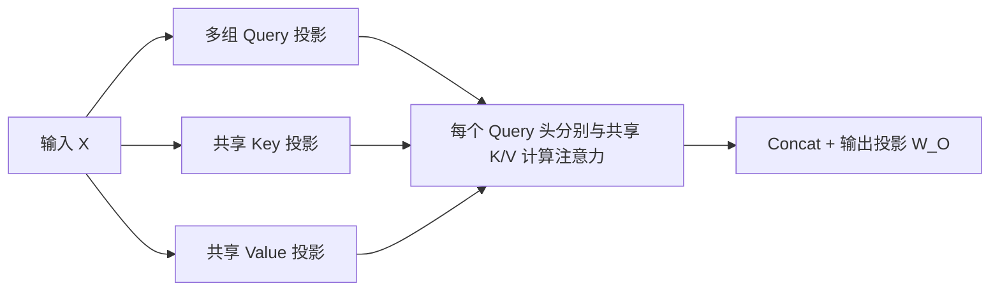

---
tags:
  - LLM/Transformer
  - 注意力机制/MQA
  - 推理/KVCache
aliases:
  - Multi-Query Attention
  - MQA
updated: 2026-03-29
---

# 多查询注意力（Multi-Query Attention, MQA）

> [!abstract]
> MQA 的核心思想是：保留多个 Query 头，但让所有头共享同一组 Key/Value，从而显著降低解码阶段的 KV cache 成本。

## 为什么会有 MQA

标准 [[02_多头自注意力MHA|MHA]] 在推理时的主要痛点，不是“算不出”，而是 **KV cache 读写太重**。

原因在于：

- 每个 Query 头都有自己对应的 Key/Value 头
- 自回归解码时，每步都要从缓存中读取所有历史 $K/V$
- 当层数、序列长度、batch size 同时上来时，带宽很容易成为瓶颈

于是就有了 MQA：  
**Query 仍然多头，Key 和 Value 改成共享。**

## 结构一眼看懂

## 数学形式

设输入为

$$
X \in \mathbb{R}^{B \times L \times d_{model}}
$$

有 $h$ 个 Query 头，单头维度记为 $d_h$。

### 1. Query 仍然是多头

$$
Q_i = XW_i^Q,\quad i \in [1,h]
$$

其中

$$
Q_i \in \mathbb{R}^{B \times L \times d_h}
$$

### 2. Key 和 Value 改成共享

$$
K = XW^K,\quad V = XW^V
$$

其中

$$
K, V \in \mathbb{R}^{B \times L \times d_h}
$$

### 3. 每个 Query 头都与同一组 K/V 交互

$$
A_i = \text{softmax}\left(\frac{Q_i K^\top}{\sqrt{d_h}}\right)
$$

$$
\text{head}_i = A_i V
$$

### 4. 最后再拼接并投影

$$
\text{MQA}(X) = \text{Concat}(\text{head}_1,\dots,\text{head}_h)W_O
$$

## MQA 真正省在哪里

> [!tip]
> MQA 的主要收益集中在 **推理时的 KV cache 内存与带宽**，而不是把全局注意力直接变成线性复杂度。

如果单头维度为 $d_h$，则每层每个 token 的 KV cache 大小大致为：

| 方案 | K/V 头数 | 每个 token 的 KV cache 规模 |
| --- | --- | --- |
| MHA | $h$ | $2hd_h$ |
| MQA | $1$ | $2d_h$ |

也就是说，MQA 相比 MHA，KV cache 可以近似减少到原来的 `1 / h`。

## 但它没有解决什么

### 1. 没有消除全局注意力的二次打分

训练或全序列计算时，每个 Query 头仍然要和长度为 $L$ 的 Key 序列交互，所以主导项依然保留全局注意力特征。

### 2. 可能牺牲部分表达能力

所有 Query 头都共享一组 Key/Value，意味着“取信息的通道”被压缩了。  
这会让不同头之间的多样性下降。

### 3. 并不总是训练最优

MQA 是一个明显偏向“推理效率”的设计。  
如果目标主要是极致表达能力，标准 MHA 往往更自然。

## 它适合什么场景

- 长上下文自回归生成
- 推理带宽敏感的部署环境
- Decoder 侧 KV cache 成本明显高于计算成本的场景

## 与 [[06_分组注意力GQA|GQA]] 的关系

如果你觉得 MHA 太贵、MQA 又压得太狠，就会自然走到 [[06_分组注意力GQA]]：

- MHA：每个头都有独立 $K/V$
- MQA：所有头共享同一组 $K/V$
- [[06_分组注意力GQA|GQA]]：若干个 Query 头共享同一组 $K/V$

如果你还想进一步压缩历史状态，但又不满足于“只是减少 K/V 头数”，那么下一步通常就会看到 [[08_多头潜变量注意力MLA|MLA（多头潜变量注意力）]]：它尝试缓存 K/V 的潜表示，而不是继续显式缓存完整 K/V。

## 相关双链

- [[索引_注意力机制]]
- [[02_多头自注意力MHA]]
- [[06_分组注意力GQA]]
- [[08_多头潜变量注意力MLA|MLA（多头潜变量注意力）]]
- [[03_MQA_GQA_MLA如何做带宽折中|MQA、GQA、MLA 如何做带宽折中]]
- [[00_KVCache_Prefill_Decode_PagedAttention|KV Cache 总览]]
- [[02_为什么只缓存K和V不缓存Q|为什么只缓存 K 和 V，不缓存 Q]]
