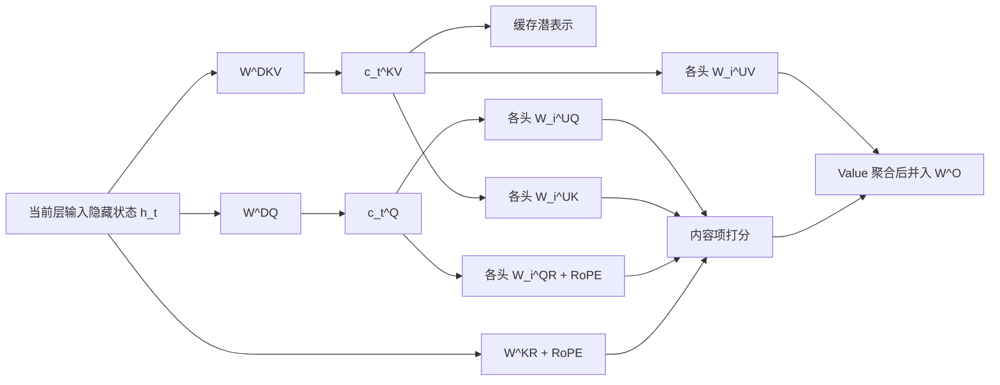

---
tags:
  - LLM/Transformer
  - 注意力机制/MLA
  - 推理/KVCache
  - 数学/低秩分解
  - 模型/DeepSeek
aliases:
  - MLA
  - Multi-Head Latent Attention
  - 多头潜变量注意力
updated: 2026-03-29
---

# MLA（多头潜变量注意力）

> [!abstract]
> MLA 的关键不是“少存几组显式 K/V”，而是把历史 $K/V$ 改写成“共享潜表示 + 小型位置分支”的结构化参数化。  
> 从数学上看，它等价于把标准注意力里的大投影矩阵改写成低秩分解；从工程上看，它的目标是显著降低推理时的 KV cache 与带宽压力。

> [!info]
> 本笔记统一采用**列向量**记号。  
> 因此我们写 $W^{DKV} h_t$、$W^{DQ} h_t$，而不是 $h_t W$。如果你平时习惯行向量写法，公式右侧的乘法顺序会相反，但本质相同。

## 记号约定与维度表

为避免符号混乱，这里固定如下记号。为简洁起见，层号 $l$ 先省略，默认都发生在**某一层的 MLA 子层内部**。

| 符号 | 含义 | 类型 | 维度 |
| --- | --- | --- | --- |
| $h_t$ | 第 $l$ 层、位置 $t$、进入 MLA 子层前的隐藏状态 | 激活 | $\mathbb{R}^{d}$ |
| $W^{DKV}$ | K/V 联合降维矩阵 | 可学习参数 | $\mathbb{R}^{d_c \times d}$ |
| $c_t^{KV}$ | K/V 共享潜表示，也是推理时核心缓存对象 | 激活 / cache | $\mathbb{R}^{d_c}$ |
| $W_i^{UK}$ | 第 $i$ 个头的内容 Key 上投影矩阵 | 可学习参数 | $\mathbb{R}^{d_h^C \times d_c}$ |
| $k_{t,i}^C$ | 第 $i$ 个头的内容 Key | 中间激活 | $\mathbb{R}^{d_h^C}$ |
| $W_i^{UV}$ | 第 $i$ 个头的内容 Value 上投影矩阵 | 可学习参数 | $\mathbb{R}^{d_h^V \times d_c}$ |
| $v_{t,i}^C$ | 第 $i$ 个头的内容 Value | 中间激活 | $\mathbb{R}^{d_h^V}$ |
| $W^{DQ}$ | Query 降维矩阵 | 可学习参数 | $\mathbb{R}^{d_c' \times d}$ |
| $c_t^{Q}$ | Query 侧潜表示 | 中间激活 | $\mathbb{R}^{d_c'}$ |
| $W_i^{UQ}$ | 第 $i$ 个头的内容 Query 上投影矩阵 | 可学习参数 | $\mathbb{R}^{d_h^C \times d_c'}$ |
| $q_{t,i}^C$ | 第 $i$ 个头的内容 Query | 中间激活 | $\mathbb{R}^{d_h^C}$ |
| $W_i^{QR}$ | 第 $i$ 个头的 RoPE Query 投影矩阵 | 可学习参数 | $\mathbb{R}^{d_h^R \times d_c'}$ |
| $q_{t,i}^R$ | 第 $i$ 个头的位置 Query 分支 | 中间激活 | $\mathbb{R}^{d_h^R}$ |
| $W^{KR}$ | 共享的 RoPE Key 投影矩阵 | 可学习参数 | $\mathbb{R}^{d_h^R \times d}$ |
| $k_t^R$ | 共享的位置 Key 分支 | 激活 / cache | $\mathbb{R}^{d_h^R}$ |
| $W^O$ | 多头输出投影矩阵 | 可学习参数 | 依模型而定 |

> [!note]
> - 上标 `C` 表示 **content** 分支，也就是承载语义内容的分支。  
> - 上标 `R` 表示 **RoPE / rotary** 分支，也就是专门承载位置信息的分支。  
> - $d_c, d_c'$ 都是潜空间维度，通常远小于隐藏维度 $d$。

## $h_t$ 的来源

很多人第一次看 MLA 会卡在第一步：  
“当前 token 在某层的输入表示为 $h_t$” 到底是什么意思？

这里的 $h_t$ **不是原始词向量 embedding**，也不是整个模型最开头的输入。  
它表示的是：

- 当前处理位置是第 $t$ 个 token
- 当前正在看第 $l$ 层 Transformer block
- 这个 token 在进入该层注意力子层前的隐藏状态，记作 $h_t \in \mathbb{R}^d$

如果模型是常见的 **Pre-LN** 结构，那么更精确地说，$h_t$ 往往就是：

$$
h_t = \operatorname{LN}(x_t^{(l-1)})
$$

其中 $x_t^{(l-1)}$ 是上一层残差流在位置 $t$ 的表示，$\operatorname{LN}$ 是层归一化。

也就是说，MLA 里的所有投影矩阵，本质上都在回答同一个问题：

> 给定这一层当前 token 的隐藏状态 $h_t$，怎样把它变成 Query、Key、Value 所需的表示？

## 从标准 MHA 的 K/V 投影写起

在标准 [[02_多头自注意力MHA|多头自注意力]] 中，如果把所有头的 Key / Value 拼接后统一记号写出来，通常是：

$$
k_t = W^K h_t, \qquad v_t = W^V h_t
$$

其中：

- $W^K \in \mathbb{R}^{(n_h d_h^C) \times d}$
- $W^V \in \mathbb{R}^{(n_h d_h^V) \times d}$

如果按头写，则是：

$$
k_{t,i} = W_i^K h_t, \qquad v_{t,i} = W_i^V h_t, \qquad i=1,\dots,n_h
$$

MLA 的核心改写是：不再直接学习完整的 $W^K, W^V$，而是把它们改写成共享潜变量的两段式映射：

$$
c_t^{KV} = W^{DKV} h_t
$$

$$
k_{t,i}^C = W_i^{UK} c_t^{KV}, \qquad v_{t,i}^C = W_i^{UV} c_t^{KV}
$$

合起来看，就是：

$$
k_{t,i}^C = W_i^{UK} W^{DKV} h_t, \qquad v_{t,i}^C = W_i^{UV} W^{DKV} h_t
$$

因此从数学上，MLA 相当于把标准 MHA 里的

$$
W_i^K \;\text{改写为}\; W_i^{UK} W^{DKV}, \qquad
W_i^V \;\text{改写为}\; W_i^{UV} W^{DKV}
$$

> [!tip]
> $W^{DKV}, W_i^{UK}, W_i^{UV}$ **都不是先做一次 SVD 再塞进模型**，而是这个 MLA 层本来就定义好的可学习参数，和普通线性层参数一样，在训练中由反向传播共同学习得到。  
> 它们的“来源”是**模型参数化方式的改变**，不是训练后再额外分解。

## 为什么 $W^{DKV}$ 可以叫降维投影

先只看这一步：

$$
c_t^{KV} = W^{DKV} h_t, \qquad W^{DKV} \in \mathbb{R}^{d_c \times d}
$$

因为 $d_c < d$，所以它把原本位于 $\mathbb{R}^d$ 的隐藏状态，映射到了更小的潜空间 $\mathbb{R}^{d_c}$。  
这就是“降维”的直接含义。

更细一点地看，第 $r$ 个潜变量分量满足：

$$
[c_t^{KV}]_r = \sum_{j=1}^{d} W^{DKV}_{rj} [h_t]_j
$$

这说明：

- $h_t$ 是输入向量
- $W^{DKV}$ 是线性映射
- $c_t^{KV}$ 是映射后的低维坐标

所以它和 $h_t$ 的关系非常直接：  
$W^{DKV}$ 不是“从 $h_t$ 推导出来的规则”，而是“拿来作用在 $h_t$ 上的可学习矩阵”。

> [!note]
> 深度学习语境里的 “projection” 常常只是指 **learned linear projection**。  
> 它不要求像线性代数教材里的“正交投影”那样满足幂等性或正交性。  
> 因此这里的“投影”更接近“线性映射到另一个子空间”的工程表述。

### 为何可以拆成“降维 -> 上投影”

因为原本的一次大线性映射，可以被改写成两次小线性映射的复合：

$$
W_i^K \approx W_i^{UK} W^{DKV}, \qquad W_i^V \approx W_i^{UV} W^{DKV}
$$

从维度上检查：

$$
W_i^{UK} W^{DKV}
\in \mathbb{R}^{d_h^C \times d_c} \cdot \mathbb{R}^{d_c \times d}
= \mathbb{R}^{d_h^C \times d}
$$

这与原始 $W_i^K \in \mathbb{R}^{d_h^C \times d}$ 完全同型；  
同理，$W_i^{UV} W^{DKV}$ 与原始 $W_i^V$ 同型。

所以“可以拆分”不是拍脑袋的技巧，而是一个严格的线性代数事实：  
只要中间插入一个维度为 $d_c$ 的瓶颈层，就得到一个**内维为 $d_c$ 的双矩阵分解**。

## 低秩分解为何成立

设

$$
A \in \mathbb{R}^{m \times r}, \qquad B \in \mathbb{R}^{r \times d}
$$

那么线性代数里有一个基本结论：

$$
\operatorname{rank}(AB) \le r
$$

把它套到 MLA 上：

$$
W_i^{UK} W^{DKV} \in \mathbb{R}^{d_h^C \times d}, \qquad
\operatorname{rank}(W_i^{UK} W^{DKV}) \le d_c
$$

$$
W_i^{UV} W^{DKV} \in \mathbb{R}^{d_h^V \times d}, \qquad
\operatorname{rank}(W_i^{UV} W^{DKV}) \le d_c
$$

因此当 $d_c \ll d$ 时，MLA 实际上把原本大的 Key / Value 投影矩阵，约束成了**秩至多为 $d_c$ 的结构化分解**。

这就是“低秩”的精确定义来源。

> [!important]
> MLA 的 `joint compression` 不是说“所有头直接共享同一个显式 Key / Value”。  
> 更准确地说，它是：
> - 所有头共享同一个低维潜表示 $c_t^{KV}$
> - 每个头再通过自己的 $W_i^{UK}, W_i^{UV}$ 去恢复各自的内容 Key / Value
>
> 所以它共享的是**潜表示**，不是把多头完全压成单头。

## Query 的低秩压缩

标准 Query 投影本来是：

$$
q_{t,i} = W_i^Q h_t
$$

MLA 把它的内容分支也改写成两段式：

$$
c_t^Q = W^{DQ} h_t
$$

$$
q_{t,i}^C = W_i^{UQ} c_t^Q
$$

合起来就是：

$$
q_{t,i}^C = W_i^{UQ} W^{DQ} h_t
$$

其中：

- $W^{DQ} \in \mathbb{R}^{d_c' \times d}$ 是 Query 侧降维矩阵
- $W_i^{UQ} \in \mathbb{R}^{d_h^C \times d_c'}$ 是第 $i$ 个头的 Query 上投影矩阵

这和 K/V 侧完全同构。  
因此你问的“$W^{DQ}$ 是什么、怎么来的”，答案也是一样的：

- 它是这层 MLA 的一个**可学习参数矩阵**
- 它在训练开始时被初始化
- 训练过程中通过梯度更新学出来
- 它不是从 $h_t$ 临时算出来的，而是拿来作用在 $h_t$ 上的线性变换

> [!note]
> Query 低秩压缩当然也能减少投影与激活开销，但 **MLA 真正决定推理 KV cache 大小的，仍然是 K/V 侧的联合压缩**。  
> 因为自回归解码时，历史 Query 不需要长期缓存，历史 Key / Value 才需要。

## 为什么推理时能只缓存 $c_t^{KV}$

这是 MLA 真正有工程价值的地方。

### 第一步：概念上，完整内容 Key / Value 仍然可恢复

对任意历史位置 $j$，我们当然可以显式恢复：

$$
k_{j,i}^C = W_i^{UK} c_j^{KV}, \qquad v_{j,i}^C = W_i^{UV} c_j^{KV}
$$

所以从“表达能力”角度看，MLA 不是把 Key / Value 删掉了，而是把它们改成了**按需可恢复**的形式。

### 第二步：实现上，推理不必真的把它们恢复出来

先看内容打分项：

$$
(q_{t,i}^C)^\top k_{j,i}^C
= (W_i^{UQ} c_t^Q)^\top (W_i^{UK} c_j^{KV})
= (c_t^Q)^\top (W_i^{UQ})^\top W_i^{UK} c_j^{KV}
$$

这里出现的关键点是：  
$W_i^{UK}$ 不一定需要在推理时显式先乘到每个历史 token 的 $c_j^{KV}$ 上。  
它可以先和 Query 侧矩阵合成一个新的等效矩阵。

再看 Value 聚合项：

$$
o_{t,i}^C
= \sum_j \alpha_{t,j}^{(i)} v_{j,i}^C
= \sum_j \alpha_{t,j}^{(i)} W_i^{UV} c_j^{KV}
= W_i^{UV} \left(\sum_j \alpha_{t,j}^{(i)} c_j^{KV}\right)
$$

这意味着 $W_i^{UV}$ 可以被并到后续输出投影 $W^O$ 中。

> [!tip]
> 论文里的说法是：  
> - $W^{UK}$ 可以吸收到 Query 侧  
> - $W^{UV}$ 可以吸收到输出侧  
> 而且这种吸收是**离线的参数重写**，不是每步解码时额外做一次大计算。

所以需要明确区分两件事：

| 层面 | 结论 |
| --- | --- |
| 数学表达 | 完整 $k_{j,i}^C, v_{j,i}^C$ 始终可以由 $c_j^{KV}$ 恢复 |
| 推理实现 | 为了省 cache 与省带宽，通常不必显式物化完整内容 K/V |

这就是“只缓存 $c_t^{KV}$”背后的严格含义。

## 为什么普通 RoPE 会破坏这个结构

如果直接把普通 RoPE 施加在恢复后的内容 Key 上，那么会得到：

$$
\hat q_{t,i} = R_t q_{t,i}^C, \qquad \hat k_{j,i} = R_j k_{j,i}^C
$$

也就是：

$$
\hat q_{t,i}^\top \hat k_{j,i}
= (W_i^{UQ} c_t^Q)^\top R_t^\top R_j (W_i^{UK} c_j^{KV})
$$

问题在于：

- $R_t^\top R_j$ 与位置 $(t,j)$ 有关
- 它夹在 Query 侧和 Key 侧的上投影之间
- 矩阵乘法不交换，所以不能把 $W_i^{UK}$ 简单吸收到 Query 侧后就一劳永逸

于是原本“只存潜表示”的简洁结构会被破坏。  
更糟的是，前缀 Key 可能需要重算或显式恢复，推理效率就会明显下降。

> [!warning]
> 这就是为什么 MLA 不能直接把“普通 MHA + RoPE”生搬硬套到低秩 K/V 上。  
> 真正卡住它的不是注意力公式本身，而是 **RoPE 与矩阵吸收不兼容**。

## decoupled RoPE：把内容匹配与位置建模拆开

DeepSeek-V2 给出的解决方案是：  
不要把所有位置信息都塞进低秩恢复后的内容 Key，而是额外分出一条小型位置分支。

论文对应的核心式子可以写成：

$$
q_{t,i}^R = \operatorname{RoPE}(W_i^{QR} c_t^Q)
$$

$$
k_t^R = \operatorname{RoPE}(W^{KR} h_t)
$$

并把总打分写成“内容项 + 位置项”：

$$
s_{t,j}^{(i)}
= (q_{t,i}^C)^\top k_{j,i}^C + (q_{t,i}^R)^\top k_j^R
$$

相应地，softmax 里常见的缩放可以写成：

$$
\alpha_{t,j}^{(i)}
= \operatorname{softmax}\!\left(
\frac{(q_{t,i}^C)^\top k_{j,i}^C + (q_{t,i}^R)^\top k_j^R}{\sqrt{d_h^C + d_h^R}}
\right)
$$

这里有两个关键点：

1. $q_{t,i}^R$ 来自 Query 潜表示 $c_t^Q$ 的一个额外投影
2. $k_t^R$ 不是从 $c_t^{KV}$ 恢复，而是直接由 $h_t$ 走一条单独的小分支得到

这样做的好处是：

- 内容分支仍然保持低秩 K/V 压缩与矩阵吸收
- 位置分支单独承载 RoPE，不去破坏内容分支的可吸收结构

## 一个维度级别的数值例子

> [!example]
> 下面的数字只是教学例子，用来帮助理解量级，不代表论文真实超参数。

假设：

- 隐藏维度 $d = 5120$
- 头数 $n_h = 40$
- 每头内容维度 $d_h^C = d_h^V = 128$
- K/V 潜维度 $d_c = 512$
- RoPE 分支维度 $d_h^R = 64$

那么：

### 标准 MHA

每层、每个 token 需要缓存的内容 K/V 维度近似是：

$$
2 n_h d_h = 2 \times 40 \times 128 = 10240
$$

### MLA

如果只缓存：

- 一个 $c_t^{KV} \in \mathbb{R}^{512}$
- 一个共享 $k_t^R \in \mathbb{R}^{64}$

那么每层、每个 token 的核心缓存量级大约是：

$$
512 + 64 = 576
$$

也就是说，在这个教学例子里，MLA 的缓存对象量级大约只有标准 MHA 的：

$$
\frac{576}{10240} \approx 5.6\%
$$

这正是 MLA 值得单独学习的原因：  
它不是只在头数上做一点折中，而是在**缓存对象本身**上重写了表示方式。

## 结构图

## MLA 与 MHA / [[05_多查询注意力MQA|MQA]] / GQA 的区别

| 机制 | 历史缓存对象 | 主要节省点 | 直觉 |
| --- | --- | --- | --- |
| MHA | 每头显式 K/V | 无 | 表达最直接，缓存最重 |
| [[05_多查询注意力|MQA]] | 共享后的显式 K/V | 减少 K/V 头数 | 少存几组 K/V |
| [[06_分组注意力|GQA]] | 分组共享后的显式 K/V | 头数与质量折中 | 按组共享 K/V |
| MLA | 潜表示 $c_t^{KV}$ 加小型位置分支 | 重写缓存对象本身 | 不直接存完整 K/V |

如果你想从“多头折中”的角度看 MLA，可以继续读：  
[[03_MQA_GQA_MLA如何做带宽折中|MQA、GQA、MLA 如何做带宽折中]]

## 相关双链

- [[索引_注意力机制]]
- [[02_多头自注意力MHA]]
- [[05_多查询注意力MQA]]
- [[06_分组注意力GQA]]
- [[03_MQA_GQA_MLA如何做带宽折中|MQA、GQA、MLA 如何做带宽折中]]
- [[00_KVCache_Prefill_Decode_PagedAttention|KV Cache 总览]]
- [[02_为什么只缓存K和V不缓存Q|为什么只缓存 K 和 V，不缓存 Q]]

## 参考资料

> [!quote]
> 本笔记的符号与结构主要依据 DeepSeek-V2 论文第 2.1 节与附录 C；  
> 其中“为什么叫降维投影”“为什么可以拆成低秩分解”“为什么要区分概念恢复与实现物化”等中文段落，属于教学化解释。

- DeepSeek-AI, [DeepSeek-V2: A Strong, Economical, and Efficient Mixture-of-Experts Language Model](https://arxiv.org/abs/2405.04434)
- ar5iv 版可读 HTML: <https://ar5iv.org/html/2405.04434v5>
