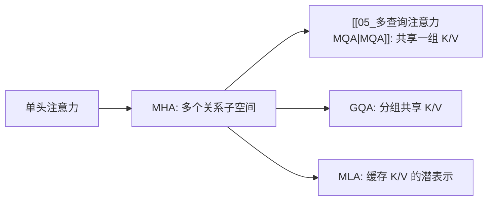

---
tags:
  - LLM/Transformer
  - 注意力机制/多头注意力
  - 专题/多头注意力
aliases:
  - 多头注意力总览
  - MHA_MQA_GQA_MLA
created: 2026-03-28
updated: 2026-03-29
---

# 多头注意力为什么有效：MHA、[[05_多查询注意力MQA|MQA]]、GQA、MLA

> [!abstract]
> 多头注意力的价值不在“把一个大 attention 切成很多小块”，而在“让模型在多个投影子空间里并行学习不同关系”。问题是，头越多，历史 K/V 往往越重，于是推理阶段又会被 KV cache 和带宽反向约束。

## 这组专题要回答什么

> [!question]
> - 为什么多头不是简单参数复制？
> - 固定总维度时，头数和单头维度到底在权衡什么？
> - 为什么现代大模型在推理优化时，先动 K/V，而不是先砍 Query？
> - MHA、[[05_多查询注意力MQA|MQA]]、GQA、MLA 分别是在什么层面做折中？

## 一张表先把全局框架抓住

| 机制 | 关键做法 | 优势 | 代价 |
| --- | --- | --- | --- |
| MHA | 每个头都有独立 Q/K/V | 表达最直接，多子空间最充分 | KV cache 最重 |
| [[05_多查询注意力MQA|MQA]] | 多个 Query 头共享一组 K/V | 推理最省带宽 | K/V 多样性压缩最明显 |
| GQA | 多个 Query 头按组共享 K/V | 质量和成本折中较稳 | 仍然是显式 K/V 共享 |
| MLA | 不直接缓存完整 K/V，而缓存潜表示 | 更进一步压缩历史状态 | 结构复杂，实现要求高 |

> [!tip]
> 最短理解：
> - MHA 解决“怎么把关系学丰富”
> - MQA / GQA / MLA 解决“怎么把历史状态存便宜”

## 为什么多头会带来表达收益

如果只有一个头，模型必须在同一个投影空间里同时处理：

- 局部搭配
- 长距离指代
- 分隔符与结构边界
- 语义对齐与句法依赖

而多头会让不同头各自学习不同的 $W_Q, W_K, W_V$，于是模型可以在多个子空间里并行建模这些关系。

这意味着多头的本质不是“多算几次同样的事”，而是把“关系建模”分解成多个并行视角。

## 但为什么多头又会带来系统压力

训练时，多头的主要代价常常还能被算力吞掉。  
到了自回归推理阶段，问题变了：

- Query 只在当前步生成一次
- 历史 K/V 却要被整个前缀反复读取

所以真正持续膨胀的，不是 Q，而是 K/V 的历史存储与读取成本。  
这也是为什么现代模型的优化重点，逐渐从“如何设计更多头”转向“如何让 K/V 更轻”。

## 这组专题的阅读顺序

1. [[01_多头为何不是简单参数复制|多头为何不是简单参数复制]]
2. [[02_头数_头维度与表达子空间|头数、头维度与表达子空间]]
3. [[03_MQA_GQA_MLA如何做带宽折中|MQA、GQA、MLA 如何做带宽折中]]
4. 回到 [[02_多头自注意力MHA]]、[[05_多查询注意力MQA]]、[[06_分组注意力GQA]]、[[08_多头潜变量注意力MLA]] 对照阅读

## 一个更完整的理解框架

这条线的逻辑不是“后者一定比前者先进”，而是：

- MHA 更偏表达设计
- [[05_多查询注意力MQA|MQA]] / GQA 更偏显式 K/V 压缩
- MLA 更偏表示瓶颈和推理系统的联合设计

## 先记住这三个结论

> [!note]
> - 多头的收益来自多个投影子空间，而不是重复同一个 attention。
> - 固定总维度时，头数增加一定伴随单头维度缩小。
> - 真正拖慢长上下文推理的，常常不是 Q 的计算，而是历史 K/V 的缓存与带宽。

## 相关双链

- [[02_多头自注意力MHA]]
- [[05_多查询注意力MQA]]
- [[06_分组注意力GQA]]
- [[08_多头潜变量注意力MLA]]
- [[03_MQA_GQA_MLA如何做带宽折中|MQA、GQA、MLA 如何做带宽折中]]
- [[00_KVCache_Prefill_Decode_PagedAttention|KV Cache 总览]]
