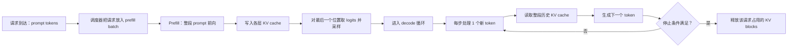

---
tags:
  - LLM/架构
  - KVCache
  - 推理/PrefillDecode
  - 推理/调度
aliases:
  - Prefill vs Decode
updated: 2026-03-29
---

# Prefill 与 Decode 为什么成本完全不同

> [!abstract]
> 自回归推理不是一个单一阶段，而是两种性质完全不同的工作负载：
> - **Prefill**：把整段提示词一次性编码进模型，并把历史 $K/V$ 写入 cache
> - **Decode**：每次只追加一个新 token，但必须反复读取整段历史 $K/V$
>
> 这就是为什么同一个模型在 prefill 更像“大矩阵批处理”，在 decode 更像“被显存带宽和调度卡住的串行循环”。

## 先给出最短定义

### Prefill 是什么

给定一段输入 prompt，长度为 $P$。  
Prefill 阶段会把这 $P$ 个 token 一次性送入模型，完成：

- embedding / position encoding
- 每一层的 Q/K/V 投影
- prompt 内部的因果 attention
- 各层历史 Key / Value 的写入

它的结果通常有两部分：

1. 得到 prompt 各层对应的 KV cache
2. 得到最后一个位置的 logits，用于采样第一个生成 token

### Decode 是什么

当第一个输出 token 产生后，后续推理进入 decode 循环。  
第 $t$ 个 decode 步通常只处理**一个新 token**，但是必须：

- 为这个新 token 计算 Q/K/V
- 把新的 K/V 追加到 cache
- 用这个新 Query 去读取全部历史 K/V
- 得到下一个 token 的 logits

> [!tip]
> 一句话记忆：
> - Prefill：**一次性写入整段历史**
> - Decode：**每次只追加一点，但每次都要回头读整段历史**

## 它们不是对立关系，而是同一请求的前后阶段

> [!important]
> 对于一条正常的自回归生成请求，Prefill 和 Decode 通常不是“二选一”的两种执行路线，而是**按先后顺序出现的两个阶段**。

最典型的执行顺序是：

1. 用户给出 prompt
2. 系统先做 Prefill
3. 得到第一个可采样的 logits
4. 采样出第一个输出 token
5. 之后进入 Decode 循环
6. 一步一步继续生成后续 token

所以不要把它们理解成：

- “一个请求可以只做 prefill，不做 decode”
- “prefill 和 decode 是互相替代的方案”

更准确的理解是：

- **Prefill 负责建立历史**
- **Decode 负责消费历史并继续增长历史**

### 真正的“取舍”发生在哪里

真正有工程取舍的地方，不在“单条请求内部到底选哪一个阶段”，而在：

- 多请求并发时，调度器是优先照顾新请求的 prefill
- 还是优先照顾老请求的 decode

这时才会出现典型权衡：

- 优先 prefill：新请求更快开始出字，TTFT 更好
- 优先 decode：老请求的持续出字更稳定，ITL 更好

## TTFT 到底是什么

`TTFT` 是 **Time To First Token**，中文通常可理解为“首 token 延迟”。

它的定义是：

> 从请求发出，到用户看到第一个生成 token 为止的总时间。

### TTFT 不是只等于模型前向时间

更严谨地说，TTFT 往往近似由下面几部分组成：

$$
\text{TTFT}
\approx
\text{排队等待}
+
\text{前处理}
+
\text{Prefill}
+
\text{首次采样与返回}
$$

其中可能包括：

- 请求进入系统后的排队
- tokenization 等前处理
- prompt 的 prefill 前向
- 首次采样
- 网络 flush / streaming 输出

所以当我们说“prefill 更影响 TTFT”时，更准确的意思是：

- 在模型执行路径里，TTFT 的主要计算部分通常来自 prefill
- 但 TTFT 作为端到端指标，不只包含模型计算

### 为什么 Prefill 更影响 TTFT

因为标准自回归生成必须先把 prompt 编进模型，并建立可用的历史状态；在这之前，系统通常还不能稳定地产生第一个输出 token。

所以：

- prompt 越长，prefill 往往越重
- prefill 排队越久，TTFT 往往越差

### ITL 又是什么

与 TTFT 经常一起讨论的另一个指标是 `ITL`，即 **Inter-Token Latency**：

> 第一个 token 出来之后，相邻两个输出 token 之间的时间间隔。

可以把两者简单区分为：

| 指标 | 用户感受到什么 |
| --- | --- |
| TTFT | “多久开始出字” |
| ITL | “出字是否流畅” |

## 一次完整请求在工程上怎么执行

## Prefill 在工程上到底做了什么

设当前 prompt 长度为 $P$，隐藏维度为 $d$。

### 数学上

Prefill 会同时处理整个序列：

$$
H \in \mathbb{R}^{P \times d}
$$

对每一层，计算：

$$
Q = H W^Q,\qquad K = H W^K,\qquad V = H W^V
$$

随后对整段 prompt 做因果 attention。  
如果忽略头的细节，注意力得分矩阵大致是：

$$
QK^\top \in \mathbb{R}^{P \times P}
$$

这意味着 prefill 在 attention 部分的理论复杂度包含典型的 $O(P^2)$ 项。

### 运行时

真正的工程执行顺序通常更接近下面这样：

1. 调度器把若干个新请求组成 prefill batch
2. GPU 对整段 prompt 做一轮大前向
3. 每层把 prompt 上所有 token 的 K/V 写入 cache
4. 只保留最后一个位置的 logits 进入采样
5. 生成出第一个输出 token 后，请求切换到 decode 队列

### 为什么 prefill 常常更吃算力

因为这时 GPU 看到的是：

- 较大的矩阵乘法
- 大批量的 token 并行
- 更高的算子利用率
- 更容易被 FlashAttention 这类 tiled kernel 高效覆盖

也就是说，prefill 虽然 FLOPs 很大，但它是**适合 GPU 的大块工作负载**。

## Decode 在工程上到底做了什么

设 prompt 长度为 $P$，当前已经生成了 $g$ 个 token。  
那么第 $g+1$ 次 decode 时，历史长度大约是：

$$
L = P + g
$$

### 数学上

这一步只会产生一个新 Query：

$$
q_t \in \mathbb{R}^{d}
$$

但它要和整段历史 Key 交互：

$$
q_t K_{1:L}^\top \in \mathbb{R}^{1 \times L}
$$

然后再用这些权重去聚合历史 Value。

### 运行时

第 $t$ 步 decode 通常会执行：

1. 把上一步采样出的 token 送入模型
2. 仅对这个 token 做一层层前向
3. 每层计算这个 token 的 Q/K/V
4. 把新的 K/V 写到 cache 末尾
5. 读取该请求当前全部历史 K/V 做 attention
6. 输出下一个 token 的 logits
7. 采样后继续下一步

### 为什么 decode 常常更吃带宽

因为 decode 的每一步只有一个新 Query，计算量不大，但要反复读取：

- 所有层的历史 K/V
- 当前 batch 中多个请求各自不同长度的历史 K/V

此时 GPU 往往不是算不过来，而是：

- 读取历史 cache 的代价越来越大
- 单步 batch 形状很小，算力难以完全吃满
- 调度器还要不断在“谁先 decode、谁先 prefill”之间做平衡

所以 decode 的典型瓶颈更像是**HBM 带宽 + KV cache 管理 + 调度开销**。

## 为什么理论复杂度不能直接解释真实延迟

> [!important]
> 很多人会说：“Prefill 是 $O(P^2)$，Decode 单步只是 $O(P)$，所以 decode 应该更轻。”
>
> 这在纸面复杂度上没错，但在 GPU 服务里不够用。

原因是：

1. Prefill 的 $O(P^2)$ 工作可以高度并行
2. Decode 虽然单步只处理一个 Query，但必须串行地做很多步
3. 每步 decode 都要读长历史，而不是只做一点点乘加就结束

因此，真实系统里更常见的现象是：

- **Prefill 决定 TTFT**（time to first token）
- **Decode 决定 ITL**（inter-token latency）和长期吞吐

> [!note]
> 这里的“决定”应理解为“主要影响”，不是“唯一决定”。  
> TTFT 还受排队与前处理影响，ITL 还受调度、batch 形状、KV cache 布局和采样实现影响。

## 一个量级直觉例子

> [!example]
> 下面只是教学量级，不代表某个具体模型的真实配置。

假设：

- prompt 长度 $P = 4000$
- 计划生成 $G = 200$

那么：

### Prefill

Prefill 只做一次，处理 4000 个 prompt token，并把这 4000 个位置的 K/V 全部写入 cache。

### Decode

Decode 要做 200 步。  
第 1 步大约读 4000 个历史 token 的 K/V，第 200 步大约读 4199 个历史 token 的 K/V。

如果只按“历史长度总和”做一个粗略量级估计：

$$
\sum_{g=0}^{199} (4000 + g)
= 200 \times 4000 + \frac{199 \times 200}{2}
= 819900
$$

也就是说，decode 阶段会反复读取一个接近 **82 万 token-历史长度量级** 的缓存总量。  
这就是为什么长上下文下，decode 常常比你直觉里更慢。

## 调度层面到底会发生什么

### 默认调度为什么常优先 prefill

在线服务里，系统通常会关心 TTFT。  
如果一个新请求迟迟进不了 prefill，它连第一个输出 token 都出不来，所以很多系统默认会优先安排 prefill。

这会带来一个典型张力：

- 优先 prefill：TTFT 更好
- 优先 decode：老请求的 ITL 更好

### 什么是 chunked prefill

在 vLLM 的官方文档里，`chunked prefill` 的思路是：

- 不把一个很长的 prompt 一口气 prefill 完
- 而是把它切成若干 token chunk
- 在调度时与 decode 请求交替混合

这样做的直接目标是：

- 避免超长 prefill 长时间阻塞正在进行的 decode
- 提高 decode 的 ITL
- 让 compute-bound 的 prefill 与 memory-bound 的 decode 更好地混合

> [!note]
> 这也是一个很重要的工程点：  
> Prefill 和 decode 的成本画像不同，所以现代 serving 系统常常不是只优化 kernel，而是连**调度策略**也一起改。

## 避免误入歧途：你应该怎样理解 Prefill 与 Decode

> [!warning]
> 最容易走偏的理解，是把 Prefill 和 Decode 当成“两个并列算法”，然后问“系统到底该选哪个”。

更好的理解框架是：

### 1. 从单请求视角看

它们是**先后发生的两个阶段**：

- Prefill 先发生
- Decode 后发生

### 2. 从系统性能视角看

它们是**两种完全不同的负载画像**：

- Prefill 更像计算密集型批处理
- Decode 更像内存带宽密集型循环

### 3. 从调度视角看

系统真正要平衡的是：

- 新请求的 TTFT
- 老请求的 ITL
- 整体吞吐

所以“Prefill/Decode 的不同”不是哲学上的概念区分，而是会直接决定：

- kernel 该怎么写
- batch 该怎么拼
- 调度器该怎么排
- KV cache 该怎么存

## Prefill 和 Decode 的工程画像对比

| 维度 | Prefill | Decode |
| --- | --- | --- |
| 输入 token 数 | 一次一整段 prompt | 每步通常 1 个新 token |
| 主要工作 | 批量前向、生成整段 K/V | 追加新 K/V、读取整段历史 |
| cache 行为 | 主要是写入 | 主要是读取，外加少量追加写入 |
| GPU 特征 | 更像大矩阵计算 | 更像长历史访存循环 |
| 典型瓶颈 | 算力、kernel 利用率 | HBM 带宽、cache 管理、调度 |
| 指标影响 | 更影响 TTFT | 更影响 ITL 和持续吞吐 |

## 常见误解

> [!warning]
> - “推理就是训练的缩小版。” 不对。prefill 和 decode 是两类完全不同的工作负载。
> - “只要 FLOPs 降了，decode 就一定更快。” 不对。decode 经常先被带宽和缓存管理卡住。
> - “prefill 更重，所以系统只要优化 prefill 就行。” 不对。在线生成体验通常更受 decode 的 ITL 影响。
> - “PagedAttention 只和 decode 有关，和 prefill 无关。” 不严谨。prefill 也会把 K/V 写进 paged cache，只是 decode 对页式缓存的长期读取更敏感。

## 相关双链

- [[00_KVCache_Prefill_Decode_PagedAttention|KV Cache：Prefill、Decode 与 PagedAttention]]
- [[02_为什么只缓存K和V不缓存Q|为什么只缓存 K 和 V，不缓存 Q]]
- [[03_PagedAttention如何解决KV内存碎片|PagedAttention 如何解决 KV 内存碎片]]
- [[00_FlashAttention1_2_3_为什么瓶颈是IO不是FLOPs|FlashAttention]]

## 参考资料

- vLLM Team, [Performance and Tuning: Chunked Prefill](https://docs.vllm.ai/en/v0.4.2/models/performance.html)
- vLLM Team, [Welcome to vLLM](https://docs.vllm.ai/en/latest/)
