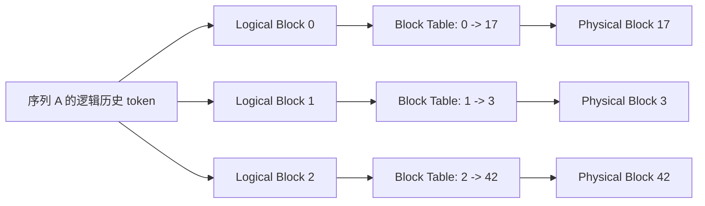

---
tags:
  - LLM/架构
  - KVCache
  - 推理/PagedAttention
  - 推理/内存管理
aliases:
  - PagedAttention
updated: 2026-03-29
---

# PagedAttention 如何解决 KV 内存碎片

> [!abstract]
> PagedAttention 不是新的注意力公式，而是**面向 KV cache 的页式内存管理 + 配套 attention kernel**。  
> 它解决的问题不是“attention 怎么算”，而是“长上下文、多请求在线服务里，KV cache 怎么存、怎么长、怎么回收、怎么共享”。

## 先说结论

> [!tip]
> PagedAttention 的核心思想可以压缩成一句话：
>
> 把“逻辑上连续的历史 token”映射到“物理上不必连续的固定大小 block”，再通过 block table 在运行时把它们找回来。

这和操作系统里的虚拟内存分页非常像：

- 逻辑地址连续
- 物理页可以离散
- 通过页表查找

## 为什么“KV cache 很大”还不足以解释问题

只说“KV cache 很大”是不够的，因为在线服务里的麻烦通常来自三件事同时存在：

1. 请求长度不一样
2. 请求生命周期不一样
3. cache 会动态增长和释放

如果系统按“每个请求一整块连续内存”去管理，就会出现两类典型浪费。

为了把浪费说清楚，先统一一个记号：

- 记 $m_{\text{tok}}$ 为“**一个 token 的完整 KV cache 大小**”
- 这里的“完整”指的是：把该 token 在**所有层、所有 K/V heads、K 和 V 两部分**都算进去后的总占用
- 如果一个请求当前历史长度为 $L$，那么它真正需要承载的有效 KV 数据量是：

$$
L \cdot m_{\text{tok}}
$$

后面讨论“浪费多少”，都可以理解为：  
“比这部分真正有效数据多占了多少显存”。

### 1. 外部碎片

多个请求不断进入、结束、追加后，显存里会出现很多小空洞。  
虽然总空闲显存可能足够，但因为找不到足够大的连续区域，新的大请求仍然可能分配失败。

### 外部碎片到底浪费在哪里

外部碎片的关键不是“空闲显存不存在”，而是：

- 空闲显存存在
- 但被切成了很多互不相邻的小段
- 对“需要一整段连续空间”的分配请求来说，这些小段不能直接拼起来使用

设某一时刻空闲区间长度分别为：

$$
s_1, s_2, \dots, s_k
$$

那么：

- 总空闲空间是 $\sum_i s_i$
- 最大连续空闲块是 $\max_i s_i$

如果新请求需要一段连续空间 $R$，且满足：

$$
\sum_i s_i \ge R \quad \text{但} \quad \max_i s_i < R
$$

那么这个请求就会**因为外部碎片而分配失败**。

> [!example]
> 假设当前空闲区间分别是：
>
> $$
> 30 m_{\text{tok}} \quad \text{和} \quad 25 m_{\text{tok}}
> $$
>
> 则总空闲量是：
>
> $$
> 55 m_{\text{tok}}
> $$
>
> 但最大连续空闲块只有：
>
> $$
> 30 m_{\text{tok}}
> $$
>
> 如果一个新请求需要：
>
> $$
> 35 m_{\text{tok}}
> $$
>
> 那么虽然系统“总共空着 55”，它仍然无法分配成功。  
> 对这个请求而言，有至少
>
> $$
> 55 - 30 = 25 \; m_{\text{tok}}
> $$
>
> 的空闲显存处于“看得见但拼不起来”的状态。

这就是外部碎片的本质浪费。

### 2. 内部浪费

如果为了避免频繁扩容，给每个请求预留一大块连续区域，那么很多请求实际上根本用不到那么长，预留部分就被白白浪费。

### 内部浪费到底怎么计算

假设某个请求：

- 最终真实长度是 $L$
- 系统为了避免它不断扩容，提前连续预留了容量 $C$
- 其中 $C \ge L$

那么它的内部浪费就是：

$$
(C - L)\, m_{\text{tok}}
$$

> [!example]
> 假设一个请求最终只生成了 $L=35$ 个 token，  
> 但系统为了保险，提前给它预留了 $C=64$ 个 token 的连续 KV 空间。
>
> 那么真正有效数据只占：
>
> $$
> 35\, m_{\text{tok}}
> $$
>
> 被预留但始终没用上的部分是：
>
> $$
> (64 - 35)\,m_{\text{tok}} = 29\,m_{\text{tok}}
> $$
>
> 也就是说，这个请求自己内部就白占了 29 个 token 的 KV 容量。

> [!warning]
> 这也是为什么“给每个请求一次性预留最大长度”听起来简单，但在线服务里会非常浪费。  
> 请求的最终输出长度高度不确定，而这些预留空间在请求生命周期内通常不能被别的请求复用。

## 先做一个严格比较：连续预留 vs PagedAttention

设：

- 真实长度为 $L$
- 连续预留容量为 $C$
- PagedAttention 的 block size 为 $B$

那么三种情况要区分清楚：

### 情况 A：理想化的精确连续分配

如果系统一开始就神谕式地知道最终长度，直接给出恰好长度为 $L$ 的连续区域，那么：

$$
\text{浪费} = 0
$$

但这在真实在线生成里通常做不到，因为系统事先不知道会生成多长。

### 情况 B：连续预留

$$
\text{浪费} = (C - L) m_{\text{tok}}
$$

这避免了频繁搬迁，但会带来明显的内部浪费。

### 情况 C：PagedAttention

PagedAttention 会分配：

$$
\left\lceil \frac{L}{B} \right\rceil
$$

个 block，总容量是：

$$
\left\lceil \frac{L}{B} \right\rceil B
$$

因此它在**单个请求**上的尾部浪费是：

$$
\left(\left\lceil \frac{L}{B} \right\rceil B - L\right)m_{\text{tok}} < B\,m_{\text{tok}}
$$

也就是说，单个请求的块内尾部浪费，上界被限制为：

$$
< B\,m_{\text{tok}}
$$

## “最多浪费最后一个 block 的尾部空间”到底是什么意思

你这里的理解方向是对的，但还需要补两层细节。

### 第一层：它确实指“切成多个 block 后，最后一个 block 可能没填满”

如果一个请求当前历史长度为 $L$，用 block size $B$ 切分后：

- 前面的 block 都会被顺序填满
- 只有最后一个 block 可能是不满的

这是因为 token 是按顺序追加的。  
当第 0 块满了才会开第 1 块，第 1 块满了才会开第 2 块，所以除了最后一块之外，前面的块都一定是满的。

### 第二层：这不只是“请求结束后”的结论，还是“请求进行中任意时刻”的结论

更精确地说：

- 对于一个正在生成中的活跃序列
- 在任意时刻，它都至多只有**一个当前尾块**可能部分填充

因此对单个活跃序列来说，PagedAttention 的块内浪费始终满足：

$$
\text{tail waste} < B\,m_{\text{tok}}
$$

如果系统当前有 $N$ 个活跃序列，那么所有序列的尾部浪费总和满足：

$$
\text{total tail waste} < N \cdot B \cdot m_{\text{tok}}
$$

这就是它和连续预留策略最容易比较的地方：

- 连续预留的浪费，可能随着每个请求的预留长度严重膨胀
- PagedAttention 的浪费，被压在“每个序列至多一个尾块”的量级上

> [!example]
> 假设：
> - $L=35$
> - $B=16$
>
> 那么需要的 block 数是：
>
> $$
> \left\lceil \frac{35}{16} \right\rceil = 3
> $$
>
> 总可容纳 token 数是：
>
> $$
> 3 \times 16 = 48
> $$
>
> 因此尾部浪费是：
>
> $$
> 48 - 35 = 13
> $$
>
> 这 13 个 token 的容量，全部都集中在**最后一个 block 的空余位置**；  
> 前两个 block 一定是满的，不会在中间再冒出零散空洞。

## 为什么这样才能和前面的两种浪费做比较

现在可以把三种“浪费来源”严格区分开：

| 浪费类型 | 来自哪里 | 单请求量级 | 多请求系统里会怎样 |
| --- | --- | --- | --- |
| 外部碎片 | 连续空闲空间被切碎 | 不好只看单请求，要看整个显存布局 | 可能出现“总空闲够，但大请求仍然分配失败” |
| 内部浪费（连续预留） | 给请求预留过大的连续区域 | $(C-L)m_{\text{tok}}$ | 请求越多、预留越保守，浪费越大 |
| 块尾浪费（PagedAttention） | 最后一个 block 未填满 | $< B\,m_{\text{tok}}$ | 每个活跃序列至多一个尾块，整体上界可控 |

> [!important]
> 所以 PagedAttention 真正厉害的点，不是“任何单个请求都一定比所有连续策略更省”，而是：
>
> 1. 在 KV cache 管理层，几乎消除了“必须找大块连续空间”的外部碎片问题  
> 2. 把单请求的内部浪费上界压缩成“最多一个尾块”

这两个性质一起成立，才使它在**动态、多请求、长度不可预测**的在线服务里特别有效。

> [!warning]
> 这就是在线 LLM 服务的关键区别：  
> 内存浪费并不只来自“总量不够”，还来自**动态长度 + 连续分配策略**。

## PagedAttention 的核心抽象

PagedAttention 会把 KV cache 切成固定大小的 **block**。  
这里的 block 指的是 **KV cache block**，不是 CUDA 里的 thread block。

### 关键对象

| 对象 | 含义 |
| --- | --- |
| logical block | 序列逻辑上的第几个 cache 块 |
| physical block | GPU 上真实分配到的物理块 |
| block size $B$ | 每个 block 能容纳多少个 token 的 K/V |
| block table | 每个请求维护的“逻辑块 -> 物理块”映射表 |
| free block pool | 当前可复用的空闲物理块池 |
| ref count | 一个物理块当前被多少个序列共享 |

### 一个最小例子

假设 block size $B=16$，某个请求当前历史长度是 35。  
那么它的逻辑上会占用：

$$
\lceil 35 / 16 \rceil = 3
$$

个 logical blocks。

也就是说：

- 第 0 块存 token 0 到 15
- 第 1 块存 token 16 到 31
- 第 2 块只存 token 32 到 34

最后一块虽然没填满，但浪费被限制在：

$$
< B
$$

也就是“最多浪费最后一个 block 的尾部空间”。

## 工程上到底怎么执行

### 一、Prefill 阶段如何写入 paged KV cache

当一个新请求进入 prefill：

1. 调度器为该请求创建 block table
2. 随着 prompt token 被前向计算，各层产生对应的 K/V
3. 系统按 token 顺序把 K/V 填入当前 logical block
4. 如果当前 block 已满，就从 free block pool 申请一个新的 physical block
5. block table 记录新的映射关系

所以 prefill 并不是“先算完再统一搬运”，而是会边产生 K/V，边写入块式 cache，`流式的`。

### 二、Decode 阶段如何追加

每次 decode 新生成一个 token 时：

1. 计算这个 token 在各层的 K/V
2. 找到该请求当前最后一个 logical block
3. 如果最后一个 block 还有空位，就直接写入
4. 如果最后一个 block 满了，就新申请一个 physical block
5. 更新 block table

这使得请求可以按 token 逐步增长，而不需要每次都搬动整段历史。

### 三、Attention kernel 如何读取

这一步是 PagedAttention 最核心的工程点。

注意力核函数在 decode 时拿到的不是一段连续的 K/V 内存，而是：

- 当前 step 的 query
- `k_cache` / `v_cache`
- 当前序列的 block table

运行时大致过程是：

1. 根据当前序列上下文长度，枚举它的 logical blocks
2. 通过 block table 查到对应的 physical block number
3. 从对应 physical block 中读取该块包含的 K/V
4. 对这些 K/V 分块做 QK、softmax、LV 计算

也就是说，**物理不连续** 这件事被 block table 隐藏起来了。  
从逻辑上看，序列仍然像是在访问一段连续历史；从物理上看，这些历史块可以散落在显存的不同位置。

## 用一个图把逻辑地址和物理地址分开

## 为什么它能减少碎片

### 对外部碎片的改善

因为系统不再要求“每个请求必须拿到一整段连续显存”，所以：

- 新请求只需要按需拿 block
- 老请求结束后释放出来的 block 可以立刻回到空闲池
- 后来的请求可以复用这些离散 block

因此，即使空闲块分散在很多位置，也仍然可用。

### 对内部浪费的改善

因为每个请求不再一次性预留“可能需要的最大长度”，而是按需增长。  
它最多只会在**最后一个 block** 留下一点尾部空位。

这就是 PagedAttention 能把浪费限制得很低的根本原因。

> [!note]
> PagedAttention 论文强调的一个点就是：  
> 浪费不再和“为每个请求预留多大连续空间”绑定，而是主要被限制在“最后一个未填满的 block”。

## 工程收益不止是碎片更少

### 1. 更容易做 continuous batching

因为不同请求可以独立增长、独立释放，调度器更容易把很多不同长度请求混在同一个 serving 循环里。

### 2. 更容易做前缀共享

如果多个请求拥有相同前缀，它们的前缀 blocks 可以共享，而不必复制一整份连续 KV cache。

### 3. 更容易支持 parallel sampling / beam search

多个分支刚开始时往往共享同一段前缀。  
PagedAttention 可以让这些分支先指向同一批 physical blocks，而不是一开始就整段复制。

## Copy-on-Write：共享前缀为什么不会互相覆盖

如果两个序列共享前缀 block，那么这些 block 的 `ref_count` 会大于 1。  
当某个序列继续生成，且它准备写入一个当前仍被共享的 block 时，系统不能直接原地改写，否则会破坏别的序列。

这时就要用 **copy-on-write**：

1. 新分配一个 physical block
2. 把原 block 中已有内容拷过去
3. 让当前序列的 block table 指向新 block
4. 旧 block 的 `ref_count` 减 1，新 block 的 `ref_count` 设为 1
5. 然后只在新 block 上继续写入

> [!important]
> 这就是为什么 PagedAttention 不只是“分页”，还天然适合：
> - prefix sharing
> - parallel sampling
> - beam search

## 它到底改变了什么，没改变什么

| 项目 | PagedAttention 是否改变 |
| --- | --- |
| 注意力数学公式 | 否 |
| KV cache 的物理存储布局 | 是 |
| Attention kernel 的读数方式 | 是 |
| 请求调度与回收方式 | 是 |
| 模型参数本身 | 否 |

## 和 FlashAttention 的关系

这两个名字很容易混。

### FlashAttention 主要在优化什么

FlashAttention 主要优化的是：  
**单次 attention 计算内部的 IO 与 tile 访问方式**。

### PagedAttention 主要在优化什么

PagedAttention 主要优化的是：  
**跨 decode 步长期存在的 KV cache 如何组织、分配、回收与共享**。

所以两者不是替代关系，而是不同层级的优化：

- FlashAttention：算 attention 时更高效
- PagedAttention：存 attention 历史时更高效

## 还要补一层：vLLM kernel 里实际怎么读块

vLLM 的开发文档明确说明：

- `q` 的形状是当前 batch 中序列的 query
- `k_cache` / `v_cache` 按 block 布局存储
- kernel 会根据 `physical_block_number` 去定位当前要读的 K/V block

这说明 PagedAttention 不是只在 CPU 侧维护一个“分页器”，而是**CUDA attention kernel 本身就知道如何按 block table 去 gather 历史 K/V**。

这也是它能真正落地到高吞吐 serving 的关键。

## block size 为什么不是越小越好

更小的 block size 确实可以进一步减少尾部浪费，但它会带来：

- 更多 block table 项
- 更多索引与调度开销
- kernel 中更多离散块访问

更大的 block size 则会：

- 减少表项与查找开销
- 但增加最后一块的内部浪费

因此 block size 是一个工程折中参数，而不是越小越先进。

## 常见误解

> [!warning]
> - “PagedAttention 是一种新的注意力变体。” 不对，它主要是 KV cache 的内存管理与访问机制。
> - “PagedAttention 只解决显存不够的问题。” 不对，它同时解决碎片、共享、回收和多请求调度可扩展性问题。
> - “分页后 attention 就不用改 kernel 了。” 不对。要想高效地从离散 physical blocks 中读取 K/V，kernel 本身必须支持这种布局。
> - “PagedAttention 和 [[08_多头潜变量注意力MLA|MLA]] 是同一层优化。” 不对。MLA 改的是缓存对象本身，PagedAttention 改的是缓存对象的存法。

## 相关双链

- [[00_KVCache_Prefill_Decode_PagedAttention|KV Cache：Prefill、Decode 与 PagedAttention]]
- [[01_Prefill与Decode为什么成本完全不同|Prefill 与 Decode 为什么成本完全不同]]
- [[02_为什么只缓存K和V不缓存Q|为什么只缓存 K 和 V，不缓存 Q]]
- [[08_多头潜变量注意力MLA|MLA（多头潜变量注意力）]]
- [[00_FlashAttention1_2_3_为什么瓶颈是IO不是FLOPs|FlashAttention]]

## 参考资料

- Kwon et al., [Efficient Memory Management for Large Language Model Serving with PagedAttention](https://arxiv.org/abs/2309.06180)
- vLLM Team, [vLLM Paged Attention Developer Documentation](https://docs.vllm.ai/en/v0.4.2/dev/kernel/paged_attention.html)
- vLLM Team, [Welcome to vLLM](https://docs.vllm.ai/en/latest/)
