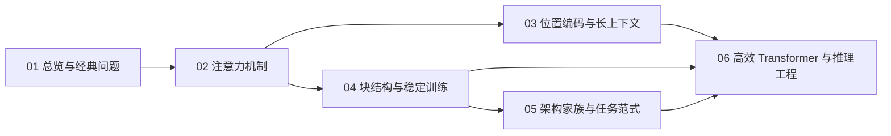

---
tags:
  - LLM/架构
  - LLM/训练
aliases:
  - Transformer 核心
  - Transformer Core
created: 2026-03-28
updated: 2026-03-29
---

# Transformer 核心结构：索引

> [!abstract] 模块总览
> 这一组笔记把 Transformer 拆成四层来学：总索引负责定地图，子模块索引负责定阅读顺序，主笔记负责给出最短闭环，子概念页负责把关键概念、公式和工程含义讲透。目标不是记术语，而是建立从“结构直觉 -> 形式化推导 -> 工程实现”的连续理解。

## 你会在这里反复回答的核心问题

> [!question] 核心问题
> - 为什么 Transformer 能让远距离信息交换变短路径，但默认又不懂顺序？
> - 为什么 attention 选择点积、softmax 和缩放，而不是别的组合？
> - 为什么位置编码不是“补一个 embedding”那么简单，而是在改注意力几何？
> - 为什么 Pre-Norm、RMSNorm、SwiGLU、[[06_分组注意力GQA|GQA]]、FlashAttention 会成为现代大模型的高频配置？
> - 为什么很多“高效 attention”论文没有真正取代 dense attention？

## 知识地图

```text
Transformer 核心结构
├── 01 总览与经典问题
│   ├── 为什么需要 Transformer
│   │   ├── 信息路径为什么更短
│   │   ├── 并行化为什么不是唯一优势
│   │   └── 局部性与顺序归纳偏置到底失去了什么
│   ├── 顺序失明与置换性
│   │   ├── 置换等变性形式化证明
│   │   ├── Pooling 与 CLS 为何导致置换不变
│   │   └── 位置编码到底补回了什么
│   ├── 整体数据流与张量形状
│   │   ├── Decoder-Only 数据流与张量形状
│   │   └── Encoder-Decoder 数据流与 Cross-Attention 位置
│   └── 一个 Transformer Block 在做什么
│       ├── Token Mixing 与 Channel Mixing 如何分工
│       └── 残差、Norm、FFN 在 Block 内如何串起来
├── 02 注意力机制
│   ├── 缩放点积注意力
│   │   ├── 点积相似度为什么适合 Attention
│   │   ├── 为什么除以根号 dk
│   │   └── softmax 在注意力里到底做了什么
│   ├── Attention Mask
│   ├── 多头注意力
│   └── KV Cache
├── 03 位置编码与长上下文
│   ├── 绝对位置编码
│   ├── 相对位置编码
│   ├── RoPE 与 ALiBi
│   └── 长度外推
├── 04 块结构与稳定训练
│   ├── Norm 与残差骨架
│   ├── FFN 与 GLU
│   ├── 残差路径与 DeepNorm
│   └── 训练稳定性
├── 05 架构家族与任务范式
│   ├── Encoder-Only
│   ├── Encoder-Decoder
│   ├── Decoder-Only
│   ├── MoE
│   └── 跨模态 Transformer
└── 06 高效 Transformer 与推理工程
    ├── FlashAttention
    ├── 高效注意力变体
    ├── 长上下文工程
    └── 推理优化
```

## 推荐阅读顺序

1. [[索引_总览与经典问题|01 总览与经典问题]]
   先建立“信息路径、顺序归纳偏置、Block 分工”的总框架。
2. [[索引_注意力机制|02 注意力机制]]
   把 attention 从公式变成“相似度、权重分配、缓存与带宽”的完整链条。
3. [[索引_位置编码与长上下文|03 位置编码与长上下文]]
   理解顺序是怎么重新进入模型，以及为什么扩窗会失真。
4. [[索引_块结构与稳定训练|04 块结构与稳定训练]]
   把深层可训练性和数值稳定性补齐。
5. [[索引_架构家族与任务范式|05 架构家族与任务范式]]
   看不同任务如何选择不同 Transformer 骨架。
6. [[索引_高效Transformer与推理工程|06 高效 Transformer 与推理工程]]
   把理论结构映射到 IO、cache、并行和解码系统。

## 如何使用这组笔记

| 目标 | 建议读法 |
|------|----------|
| 快速建立框架 | 只读各主笔记 landing page |
| 系统深挖原理 | 按子模块索引顺序把子概念页逐页读完 |
| 查一个具体问题 | 从主笔记进入，再沿“相关链接”跳到唯一主讲页 |

## 模块入口

- [[索引_总览与经典问题|总览与经典问题]]
- [[索引_注意力机制|注意力机制]]
- [[索引_位置编码与长上下文|位置编码与长上下文]]
- [[索引_块结构与稳定训练|块结构与稳定训练]]
- [[索引_架构家族与任务范式|架构家族与任务范式]]
- [[索引_高效Transformer与推理工程|高效 Transformer 与推理工程]]

## 模块之间的依赖关系



## 前置与延伸

**前置知识**：
- [[索引_Embedding与位置编码|Embedding 与位置编码]]
- [[01_BPE_WordPiece_Unigram|BPE、WordPiece、Unigram]]

**延伸主题**：
- [[0文本 LLM 微调|文本 LLM 微调]]
- [[索引_系统工程与部署_MLOps|系统工程与部署 MLOps]]
- [[索引_评测_安全_可靠性|评测、安全、可靠性]]
