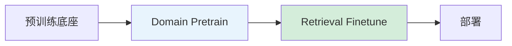

# 多阶段向量微调与进阶技术

本节覆盖向量模型的多阶段微调流程、指令向量微调以及 Matryoshka Embedding、Late Interaction 等进阶技术。

---

## 多阶段向量微调流程



### 阶段 1：Domain Pretrain

- 用领域无标注语料做对比学习预训练
- 注入领域知识和词汇
- 数据：领域文档的相邻句对、标题-内容对

### 阶段 2：Retrieval Finetune

- 用标注的 query-document 对做对比学习
- Hard Negative Mining 极其重要
- 数据：业务检索对 + hard negatives

---

## 指令向量微调（Instructor Embedding）

给向量模型加上任务指令，让同一模型根据指令生成不同用途的向量：

```
指令: "用于检索相关文档"
输入: "什么是 LoRA"
→ 生成检索优化的向量

指令: "用于语义相似度计算"
输入: "什么是 LoRA"
→ 生成语义相似度优化的向量
```

- 代表：Instructor、E5-Mistral、BGE-M3
- 多任务共用一个模型，降低部署成本

---

## Matryoshka Embedding

**俄罗斯套娃嵌入**：训练时同时优化多个维度截断，部署时可灵活选择向量维度。

$$
\mathcal{L}_{\text{MRL}} = \sum_{d \in \mathcal{D}} w_d \cdot \mathcal{L}_{\text{contrastive}}(\text{trunc}(v, d))
$$

- $\mathcal{D}$ = {64, 128, 256, 512, 768, ...}，一组维度截断点
- $\text{trunc}(v, d)$ 取向量前 $d$ 维
- 部署时可根据延迟/存储需求选择维度
- 如：先用 256 维做粗筛，再用 768 维做精排

---

## Late Interaction（ColBERT 类）

保留 **token 级别** 的向量，而不是压缩为单个向量：

$$
\text{Score}(q, d) = \sum_{i=1}^{|q|} \max_{j=1}^{|d|} \text{sim}(q_i, d_j)
$$

- 每个 query token 找到最相似的 document token，求和
- 比单向量更精确，比 cross-encoder 更快
- 但索引体积更大（存每个 token 的向量）

---

## 蒸馏：Teacher → Student

用强模型（reranker / 大向量模型）的输出监督训练小模型：

- **Reranker 蒸馏**：用 cross-encoder 打分作为监督，训练 bi-encoder
- **大模型蒸馏**：用大向量模型的向量做 teacher，训练小向量模型

---

## 📂 子页面（叶子层，含代码示例）

`子页面创建后补充`