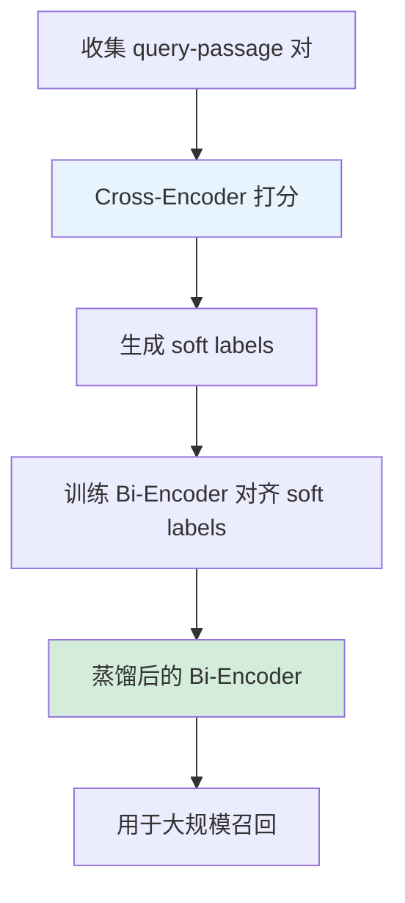

# Cross-Encoder 与 Reranker 微调实战

Cross-Encoder 重排模型的完整微调实战，含训练代码和蒸馏到 Bi-Encoder 的方法。

---

## Cross-Encoder 训练代码

```python
from sentence_transformers import CrossEncoder
from sentence_transformers.cross_encoder import (
    CrossEncoderTrainer,
    CrossEncoderTrainingArguments,
)
from datasets import Dataset

# 1. 加载 Cross-Encoder
model = CrossEncoder("cross-encoder/ms-marco-MiniLM-L-6-v2")

# 2. 准备数据
# 格式：{"query": str, "passage": str, "label": float}
train_data = Dataset.from_dict({
    "query": [
        "什么是 LoRA",
        "什么是 LoRA",
        "Python 读取文件",
    ],
    "passage": [
        "LoRA 是一种参数高效微调方法...",      # 相关
        "QLoRA 使用 4bit 量化加速训练...",      # 部分相关
        "用 open() 函数可以读取文件...",        # 不相关
    ],
    "label": [1.0, 0.3, 0.0],  # 相关性分数
})

# 3. 训练
args = CrossEncoderTrainingArguments(
    output_dir="./reranker-ft",
    num_train_epochs=3,
    per_device_train_batch_size=32,
    learning_rate=2e-5,
    warmup_ratio=0.1,
    bf16=True,
)

trainer = CrossEncoderTrainer(
    model=model,
    args=args,
    train_dataset=train_data,
)
trainer.train()
model.save("./finetuned-reranker")
```

---

## 使用 Ranking Loss 训练

```python
# Pairwise 格式：每个样本包含 query + 正文档 + 负文档
train_data = Dataset.from_dict({
    "query": ["什么是 LoRA"] * 2,
    "positive": [
        "LoRA 是一种参数高效微调方法...",
        "LoRA 通过低秩矩阵分解减少可训练参数...",
    ],
    "negative": [
        "Transformer 是一种注意力机制架构...",
        "BERT 是一种预训练语言模型...",
    ],
})

# Preference-style ranking loss: -log σ(s+ - s-)
# 这在 sentence-transformers 中可通过 pairwise 数据自动使用
```

---

## 蒸馏 Cross-Encoder → Bi-Encoder

```python
from sentence_transformers import SentenceTransformer, CrossEncoder, losses

# 1. 加载 Teacher (Cross-Encoder) 和 Student (Bi-Encoder)
teacher = CrossEncoder("./finetuned-reranker")
student = SentenceTransformer("BAAI/bge-base-en-v1.5")

# 2. 用 Teacher 给训练数据打分
def get_teacher_scores(queries, passages):
    pairs = list(zip(queries, passages))
    scores = teacher.predict(pairs)
    return scores

# 3. 准备蒸馏数据
# 每个 query 有多个候选文档，Teacher 已打分
train_data = Dataset.from_dict({
    "anchor": queries,
    "positive": passages,
    # Teacher 分数作为 soft label
})

# 4. 蒸馏损失
# MarginMSELoss: 对齐 Teacher 和 Student 的分数差
loss = losses.MarginMSELoss(student)

# 5. 训练 Student 对齐 Teacher
# ... (同标准 SentenceTransformer 训练流程)
```

### 完整蒸馏流程



---

## 推理使用

```python
# Cross-Encoder 推理（精排）
reranker = CrossEncoder("./finetuned-reranker")

query = "什么是 LoRA"
candidates = [
    "LoRA 是参数高效微调方法...",
    "Transformer 架构的核心是注意力...",
    "QLoRA 在 LoRA 基础上加入量化...",
]

# 打分
pairs = [(query, c) for c in candidates]
scores = reranker.predict(pairs)

# 按分数排序
ranked = sorted(zip(candidates, scores), key=lambda x: x[1], reverse=True)
for doc, score in ranked:
    print(f"Score: {score:.4f} | {doc[:50]}")
```

---

## 性能对比

| 方法 | 精度 | 速度（1000 对） | 适用 |
| --- | --- | --- | --- |
| Cross-Encoder | 最高 | ~10s | 精排 top-20 |
| Bi-Encoder | 较低 | ~0.01s | 大规模召回 |
| 蒸馏 Bi-Encoder | 中高 | ~0.01s | 兼顾精度和速度 |