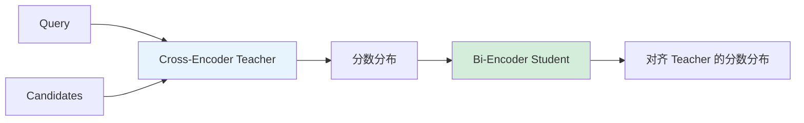

# Cross-Encoder 微调与蒸馏详解

Cross-Encoder 是重排的核心模型。本节详解其微调方法、损失函数以及如何蒸馏为轻量的 Bi-Encoder。

---

## Cross-Encoder 微调原理

将 query 和 document 拼接后联合编码：

$$
\text{score} = f_{\theta}([\text{CLS}] \oplus q \oplus [\text{SEP}] \oplus d)
$$

- 用 `[CLS]` token 的表示过一个线性层得到相关性分数
- 能看到 query 和 document 之间的完整交互，精度最高

---

## 损失函数选择

| 损失类型 | 公式 | 适用场景 |
| --- | --- | --- |
| **Pointwise** | BCE / MSE（回归到相关性分数） | 有精确相关性分数 |
| **Pairwise** | $\max(0, s^- - s^+ + m)$ | 有正负文档对 |
| **Listwise** | Softmax cross-entropy over candidates | 有完整候选列表 |
| **Preference-style** | $-\log \sigma(s^+ - s^-)$ | 偏序对数据 |

---

## 蒸馏为 Bi-Encoder

Cross-Encoder 精度高但慢，Bi-Encoder 快但精度低。**蒸馏**兼顾两者：

### 流程

### 具体做法

1. 用训练好的 Cross-Encoder 给 (query, document) 对打分
2. 将这些分数作为 soft label
3. 训练 Bi-Encoder 对齐 Teacher 的分数分布：

$$
\mathcal{L} = \text{KL}(P_{\text{CE}} \| P_{\text{BE}}) + \lambda \cdot \mathcal{L}_{\text{contrastive}}
$$

- 结合 KL 散度和对比损失效果最佳
- 蒸馏后的 Bi-Encoder 可用于大规模召回

---

## 📂 子页面（叶子层，含代码示例）

- [Cross-Encoder 与 Reranker 微调实战](Cross-Encoder%20%E4%B8%8E%20Reranker%20%E5%BE%AE%E8%B0%83%E5%AE%9E%E6%88%98%2098922a9b4a654d2e9081c0a314748c4d.md) — CE 训练代码 + Ranking Loss + 蒸馏到 Bi-Encoder

**相关页面**：[重排模型微调](%E9%87%8D%E6%8E%92%E6%A8%A1%E5%9E%8B%E5%BE%AE%E8%B0%83%206d652fa8de814c838611ed64426f8b7f.md) · [向量模型微调](%E5%90%91%E9%87%8F%E6%A8%A1%E5%9E%8B%E5%BE%AE%E8%B0%83%20597c9753287d447692d22631143bbce0.md) · [对比学习与损失函数详解](对比学习与损失函数详解.md) · [LLM 微调技术全景指南](LLM%20微调技术全景指南.md)

[Cross-Encoder 与 Reranker 微调实战](Cross-Encoder%20%E4%B8%8E%20Reranker%20%E5%BE%AE%E8%B0%83%E5%AE%9E%E6%88%98%2098922a9b4a654d2e9081c0a314748c4d.md)