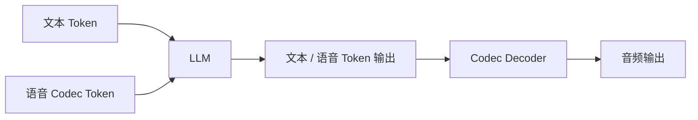

# Codec Token LM 与语音生成微调

离散语音 Token 方案将音频编码为离散 token，让 LLM 直接在统一的 token 空间中处理文本和语音。同时本节覆盖 TTS / 语音生成的微调方法。

---

## Neural Audio Codec 原理

**RVQ**（Residual Vector Quantization）：

- 将连续特征量化为多层离散 token
- 第 1 层捕获主要信息（语义），后续层捕获残差（声学细节）
- 代表：**EnCodec**（Meta）、**SoundStream**（Google）

---

## 主流 Codec 对比

| Codec | 量化方式 | 码率 | 特点 |
| --- | --- | --- | --- |
| **EnCodec** | RVQ 8 层 | 1.5-24 kbps | Meta 开源，广泛使用 |
| **SoundStream** | RVQ | 3-18 kbps | Google，AudioLM 底座 |
| **DAC** | RVQ + 改进量化 | 高保真 | 音乐/通用音频 |

---

## Codec Token LM 架构

将离散语音 token 与文本 token 统一输入 LLM：

- 代表模型：SpeechGPT、VALL-E、AudioLM
- 优势：统一架构，可同时理解和生成语音

---

## TTS / 语音生成微调点

### Speaker Adapter

适配新说话人音色，只需少量说话人样本（few-shot voice cloning）：

- 训练一个 speaker embedding layer
- 或用 LoRA 微调解码器的部分层

### Style / Emotion Adapter

控制语音风格、情感、语速等：

- 插入 style embedding 作为条件输入
- 或在解码器中加 adapter 模块

### Acoustic Decoder Finetune

微调声学解码器（将中间表示转为音频波形）：

- 通常用于适配新语言或新声学环境
- 可全量或 LoRA 微调

### Codec LM Finetune

微调离散语音 token 的语言模型部分：

- 改善语音质量、自然度、韵律
- 可用 LoRA 节省资源

---

## 📂 子页面（叶子层，含代码示例）

`子页面创建后补充`