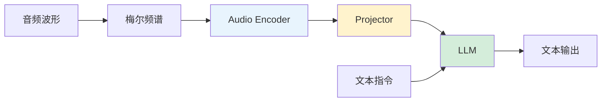

# 语音理解：连续编码器 + Projector + LLM

语音理解的主流方案：用预训练的音频编码器提取特征，通过 Projector 映射到 LLM 空间，让 LLM 处理语音输入。

---

## 架构详解

---

## 主流 Audio Encoder 对比

### Whisper Encoder

- 基于 Transformer encoder
- 在 68 万小时多语言 ASR 数据上预训练
- 输入：80-bin 梅尔频谱，输出：1500 个 token（30s 音频）
- 语音理解能力强，是当前最常用的选择

### Conformer

- CNN + Transformer 混合结构
- CNN 捕获局部声学特征，Transformer 建模全局依赖
- 在 ASR 领域表现优异

### w2v-BERT / HuBERT

- 自监督预训练（掩码预测）
- 学到的表示语义性强
- 适合做通用语音表示

---

## Projector 设计

语音 Projector 与视觉的类似，但需处理**长度压缩**（30s 音频可产生 1500 个 token）：

### 简单 MLP

$$
h_{\text{LLM}} = \text{MLP}(h_{\text{audio}})
$$

维度映射，不做压缩。

### Downsample + MLP

先用步长卷积或平均池化将 token 数降低 2-4 倍，再做 MLP 映射。

### Q-Former / Cross-Attention

用可学习 query 从音频特征中采样固定数量 token。

---

## 微调策略

### 策略一：冻结 LLM，训练 Encoder + Projector

- 最安全，不损害 LLM 语言能力
- 适合 LLM 能力已经很强的情况

### 策略二：冻结 Encoder，训练 Projector + LoRA on LLM

- Encoder 已有好的语音表示
- LLM 需要适应新的输入模态

### 策略三：多任务联合微调

- 同时在 ASR / AST（语音翻译）/ QA / Caption / Chat 任务上训练
- 共享 Encoder 和 Projector，LLM 用 LoRA
- 多任务互相增强

---

## 📂 子页面（叶子层，含代码示例）

`子页面创建后补充`