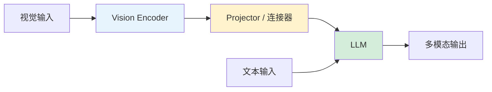

# 多模态 LLM 微调

多模态 LLM 微调的核心是：让一个文本 LLM **理解和处理图像、视频等视觉信息**。关键在于如何将视觉表示映射到 LLM 的文本空间。

---

## 核心架构

**三大组件**：

- **Vision Encoder**：提取视觉特征（如 CLIP ViT、SigLIP、EVA-CLIP）
- **Projector / 连接器**：将视觉特征映射到 LLM 的 token 空间
- **LLM**：接收视觉 + 文本 token，生成回答

---

## 主流连接器类型

| 连接器类型 | 原理 | 代表模型 |
| --- | --- | --- |
| MLP Projector | 简单的多层感知机映射 | LLaVA |
| Q-Former | 用可学习 query 从视觉特征中提取固定数量 token | BLIP-2, InstructBLIP |
| Perceiver Resampler | 类似 Q-Former 的交叉注意力采样器 | Flamingo, Qwen-VL |
| Linear Projection | 单层线性映射 | 早期方案 |

---

## 分阶段训练策略

典型的多模态 LLM 微调分为 **2-3 个阶段**：

### 阶段 1：对齐预训练（Alignment Pre-training）

- **冻结** Vision Encoder 和 LLM
- **只训练** Projector
- 用大量 image-text 对让连接器学会将视觉特征映射到文本空间

### 阶段 2：指令微调（Visual Instruction Tuning）

- **冻结** Vision Encoder
- **训练** Projector + LLM（或 LLM 用 LoRA）
- 用多模态指令数据训练

### 阶段 3（可选）：联合微调

- **部分解冻** Vision Encoder（如后几层）
- 全链路联合训练以提升性能

---

## 当前流行方案

- 冻结视觉编码器 + 训练 projector + LoRA on LLM
- 视觉编码器局部解冻（后几层参与训练）
- 视频场景：temporal adapter / frame sampler tuning

---

## 视频多模态的特殊处理

视频比图像多了**时间维度**，常见策略：

- **帧采样**：均匀或关键帧采样，每帧走 Vision Encoder
- **Temporal Adapter**：在帧级特征间加时序建模模块
- **Token 压缩**：合并/池化多帧 token，控制 LLM 输入长度

---

## 📂 子页面导航

- [多模态架构与连接器详解](%E5%A4%9A%E6%A8%A1%E6%80%81%E6%9E%B6%E6%9E%84%E4%B8%8E%E8%BF%9E%E6%8E%A5%E5%99%A8%E8%AF%A6%E8%A7%A3%2024df6bd2dc7e417f939708b5ed7b5f21.md) — MLP Projector / Q-Former / Perceiver Resampler
- [多模态分阶段训练与视频微调](%E5%A4%9A%E6%A8%A1%E6%80%81%E5%88%86%E9%98%B6%E6%AE%B5%E8%AE%AD%E7%BB%83%E4%B8%8E%E8%A7%86%E9%A2%91%E5%BE%AE%E8%B0%83%2028b0dbec49b34e4c8ddf9246d80be519.md) — 对齐预训练 → 指令微调 → 联合微调

**相关页面**：[语音与音频 LLM 微调](%E8%AF%AD%E9%9F%B3%E4%B8%8E%E9%9F%B3%E9%A2%91%20LLM%20%E5%BE%AE%E8%B0%83%20aaabeb9fa5df46c6874da7e93b4fd873.md) · [PEFT 参数高效微调方案族](PEFT%20%E5%8F%82%E6%95%B0%E9%AB%98%E6%95%88%E5%BE%AE%E8%B0%83%E6%96%B9%E6%A1%88%E6%97%8F%2007bcd7a7aa894f4984c232d57a0e7376.md) · [LLM 微调技术全景指南](LLM%20微调技术全景指南.md)

[多模态架构与连接器详解](%E5%A4%9A%E6%A8%A1%E6%80%81%E6%9E%B6%E6%9E%84%E4%B8%8E%E8%BF%9E%E6%8E%A5%E5%99%A8%E8%AF%A6%E8%A7%A3%2024df6bd2dc7e417f939708b5ed7b5f21.md)

[多模态分阶段训练与视频微调](%E5%A4%9A%E6%A8%A1%E6%80%81%E5%88%86%E9%98%B6%E6%AE%B5%E8%AE%AD%E7%BB%83%E4%B8%8E%E8%A7%86%E9%A2%91%E5%BE%AE%E8%B0%83%2028b0dbec49b34e4c8ddf9246d80be519.md)