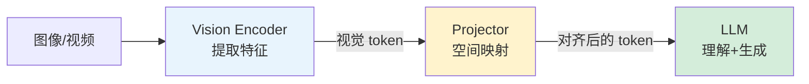

# 多模态架构与连接器详解

多模态 LLM 的核心问题：如何将视觉信息"翻译"成 LLM 能理解的 token。本节详解各类连接器（Projector）的原理。

---

## 三大组件角色

---

## 主流 Vision Encoder

| 编码器 | 预训练方式 | 输出 | 代表使用 |
| --- | --- | --- | --- |
| **CLIP ViT** | 图文对比学习 | patch tokens + CLS token | LLaVA, OpenFlamingo |
| **SigLIP** | Sigmoid 对比学习 | patch tokens | PaLI, Gemma |
| **EVA-CLIP** | 蒸馏增强的 CLIP | patch tokens | InternVL |
| **DINOv2** | 自监督（非对比） | 局部特征好 | 细粒度理解 |

---

## 连接器类型详解

### MLP Projector

最简单的方案，1-2 层 MLP 直接映射维度：

$$
h_{\text{LLM}} = \text{MLP}(h_{\text{vision}}) = W_2 \cdot \text{GELU}(W_1 \cdot h_{\text{vision}})
$$

- 优点：简单高效，训练快
- 缺点：不做 token 数压缩，视觉 token 数量多（如 ViT-L 输出 576 个 token）
- 代表：**LLaVA**

### Q-Former

用一组**可学习的 query token** 通过交叉注意力从视觉特征中提取信息：

$$
\text{Output} = \text{CrossAttn}(Q_{\text{learnable}}, K_{\text{vision}}, V_{\text{vision}})
$$

- 固定输出 token 数（如 32/64 个），不论图像复杂度
- 训练复杂度较高
- 代表：**BLIP-2, InstructBLIP**

### Perceiver Resampler

类似 Q-Former，用可学习的 latent token 做交叉注意力采样：

$$
z = \text{CrossAttn}(z_{\text{latent}}, h_{\text{vision}}, h_{\text{vision}})
$$

- 代表：**Flamingo, Qwen-VL**

---

## Unified Token Space / Dual-stream Fusion

- **统一 Token 空间**：将视觉特征 VQ 离散化为 token，与文本 token 混合输入
- **双流融合**：视觉和文本各自有 Transformer 分支，通过交叉注意力融合

---

## 📂 子页面（叶子层，含代码示例）

`子页面创建后补充`