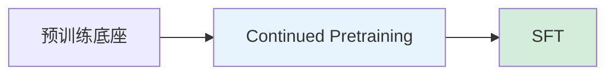

# 训练范式与多阶段流程

不同任务和模型类型对应不同的训练范式。核心决策：**几个阶段、每阶段训什么、冻什么**。

---

## 训练范式总览

### 单阶段 SFT

直接在预训练模型上做一轮监督微调。最简单，适合任务明确、数据充足的场景。

### 两阶段：CPT → SFT

先用领域语料做连续预训练（注入知识），再用指令数据 SFT（注入能力）。**当前文本 LLM 最推荐的范式**。

### 三阶段：Domain Pretrain → Instruction SFT → Task Specialization

在两阶段基础上，再加一步针对具体任务的精调。适合需要极致任务性能的场景。

### 多任务联合训练

混合多种任务的数据同时训练。常用于语音/音频 LLM（ASR + 翻译 + QA + Chat 联合训练）。

### 分模块分阶段

多模态/语音模型的典型模式：

1. 先训练 projector / adapter
2. 再 LoRA / 部分解冻 LLM
3. 可选：联合微调全链路

### 蒸馏微调

Teacher → Student：用大模型的输出监督训练小模型。可用于模型压缩、或将 reranker 知识迁移到向量模型。

---

## 各模型类型的推荐范式

| 模型类型 | 推荐范式 | 细节 |
| --- | --- | --- |
| 文本 LLM | CPT（可选）→ QLoRA SFT | 最稳、资源友好 |
| 垂域文本 | DAPT/TAPT → LoRA SFT | 领域知识注入很重要 |
| 多模态 LLM | 冻结 encoder → 训 projector → LoRA on LLM | 分阶段逐步放开 |
| 语音 LLM | Audio encoder/projector tuning + LoRA | 可多任务联合 |
| 向量模型 | Domain pretrain → Contrastive finetune | Hard negatives 关键 |
| 重排模型 | Cross-encoder finetune → 蒸馏 bi-encoder | 先精后快 |

---

## 📂 子页面导航

`子页面创建后补充`