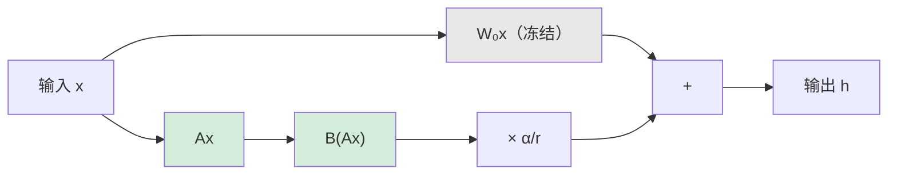

# LoRA 详解与实战

LoRA（Low-Rank Adaptation of Large Language Models）是当前最主流的参数高效微调方法。本文从原理到实战完整解析。

---

## 核心原理

### 动机

预训练模型的权重矩阵虽然是高维的，但微调时的**权重变化量** $\Delta W$ **实际上是低秩的**——即大部分信息集中在少数几个方向上。因此可以用低秩矩阵来近似 $Delta W$。

### 数学形式

对于预训练权重 $W_0 in mathbb{R}^{d times k}$，LoRA 将权重更新分解为：

$$
W = W_0 + \Delta W = W_0 + \frac{\alpha}{r} \cdot BA
$$

其中：

- $B in mathbb{R}^{d times r}$，$A in mathbb{R}^{r times k}$
- $r \ll \min(d, k)$ 是秩（rank），通常取 8-64
- $\alpha$ 是缩放因子，控制 LoRA 的影响强度
- 初始化：$A$ 用高斯随机初始化，$B$ 初始化为零（保证训练开始时 $Delta W = 0$）

### 前向传播

$$
h = W_0 x + \frac{\alpha}{r} \cdot B(Ax)
$$



### 参数量对比

| 方法 | 7B 模型可训练参数 | 显存需求 |
| --- | --- | --- |
| Full Fine-tuning | 7B (100%) | ~100+ GB |
| LoRA (r=16) | ~20M (0.3%) | ~16 GB |
| LoRA (r=64) | ~80M (1.1%) | ~18 GB |

---

## 关键超参数

| 超参数 | 推荐值 | 说明 |
| --- | --- | --- |
| `r`（秩） | 8-64 | 越大表达力越强，但参数越多。通常 16 或 32 够用 |
| `alpha` | r 或 2r | 缩放因子。常见做法：alpha = r（等效缩放为 1） |
| `target_modules` | q_proj, v_proj 或全部线性层 | 作用于哪些层。全部线性层效果通常更好 |
| `dropout` | 0.05-0.1 | LoRA 层的 dropout，防过拟合 |
| 学习率 | 1e-4 ~ 3e-4 | 比全参数微调高 5-10 倍 |

---

## Python 实战代码

### 基础 LoRA 微调

```python
from transformers import AutoModelForCausalLM, AutoTokenizer, TrainingArguments
from peft import LoraConfig, get_peft_model, TaskType
from trl import SFTTrainer

# 1. 加载模型
model_name = "meta-llama/Llama-3.1-8B"
model = AutoModelForCausalLM.from_pretrained(
    model_name,
    torch_dtype="auto",
    device_map="auto",
)
tokenizer = AutoTokenizer.from_pretrained(model_name)
tokenizer.pad_token = tokenizer.eos_token

# 2. 配置 LoRA
lora_config = LoraConfig(
    task_type=TaskType.CAUSAL_LM,
    r=16,                          # 秩
    lora_alpha=32,                 # 缩放因子
    lora_dropout=0.05,             # dropout
    target_modules=[               # 作用目标
        "q_proj", "k_proj", "v_proj", "o_proj",
        "gate_proj", "up_proj", "down_proj",
    ],
    bias="none",
)

# 3. 创建 PEFT 模型
model = get_peft_model(model, lora_config)
model.print_trainable_parameters()
# 输出: trainable params: 20,971,520 || all params: 8,030,261,248 || 0.26%

# 4. 训练配置
training_args = TrainingArguments(
    output_dir="./lora-output",
    per_device_train_batch_size=4,
    gradient_accumulation_steps=8,  # 有效 batch = 4 * 8 = 32
    num_train_epochs=3,
    learning_rate=2e-4,
    lr_scheduler_type="cosine",
    warmup_ratio=0.03,
    bf16=True,                     # 混合精度
    logging_steps=10,
    save_strategy="epoch",
    gradient_checkpointing=True,   # 节省显存
)

# 5. 启动训练
trainer = SFTTrainer(
    model=model,
    args=training_args,
    train_dataset=train_dataset,   # 你的数据集
    tokenizer=tokenizer,
    max_seq_length=2048,
)
trainer.train()

# 6. 保存 LoRA adapter
model.save_pretrained("./lora-adapter")
```

### 权重合并与推理

```python
from peft import PeftModel

# 加载基础模型
base_model = AutoModelForCausalLM.from_pretrained(
    "meta-llama/Llama-3.1-8B",
    torch_dtype="auto",
    device_map="auto",
)

# 加载 LoRA adapter
model = PeftModel.from_pretrained(base_model, "./lora-adapter")

# 合并权重（可选，合并后无额外推理开销）
model = model.merge_and_unload()

# 保存合并后的模型
model.save_pretrained("./merged-model")

# 推理
inputs = tokenizer("Hello, how are you?", return_tensors="pt").to(model.device)
outputs = model.generate(**inputs, max_new_tokens=100)
print(tokenizer.decode(outputs[0], skip_special_tokens=True))
```

---

## LoRA 的数学直觉

<aside>
💡

想象一个 $4096 \times 4096$ 的权重矩阵（1600万参数）。LoRA 用两个小矩阵 $B_{4096 \times 16}$ 和 $A_{16 \times 4096}$ 来近似权重变化（只有 13万参数）。这就像用 16 个"方向"来总结所有的权重调整，而不是逐个调整每个参数。

</aside>

---

## 常见问题与最佳实践

- **r 选多大？** 大多数任务 r=16 或 r=32 即可。如果效果不够，先增加 target_modules 再增加 r
- **alpha 和 r 的关系？** 实际缩放 = alpha/r。保持这个比值不变时效果相近。常见做法 alpha=2r
- **target_modules 选哪些？** 全部线性层（包括 FFN）效果通常比只选 QV 更好
- **学习率？** LoRA 的学习率通常比全参数微调高 5-10 倍（因为只更新少量参数）
- **能否叠加多个 LoRA？** 可以，通过 LoRA 合并或 LoRA 切换实现多任务