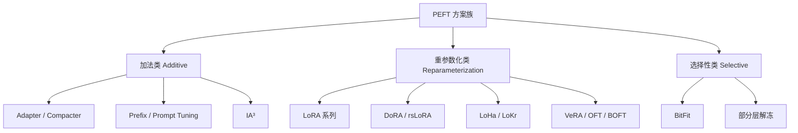

PEFT（Parameter-Efficient Fine-Tuning）是一类**只训练极少量参数**即可适配下游任务的微调方法。核心思想：冻结预训练模型大部分权重，只更新/新增少量参数，以极低成本获得接近全参数微调的效果。

---

## 为什么需要 PEFT

- 全参数微调一个 7B 模型需要 ~56GB 显存（fp16），70B 则需要 ~560GB
- PEFT 方法通常只训练 **0.1%–1%** 的参数
- 可以在单卡上微调大模型，且支持多任务快速切换（只需切换小的 adapter 权重）

---

## PEFT 方案总览

|方案|核心思路|可训练参数位置|热度|
|---|---|---|---|
|**LoRA**|低秩增量矩阵插入线性层|注意力/前馈层旁路|⭐⭐⭐⭐⭐|
|**QLoRA**|4-bit 量化底座 + LoRA|同 LoRA|⭐⭐⭐⭐⭐|
|**DoRA**|分解权重为方向+幅度再做 LoRA|同 LoRA|⭐⭐⭐⭐|
|**rsLoRA**|LoRA + rank-stabilized scaling|同 LoRA|⭐⭐⭐⭐|
|**AdaLoRA**|自适应分配秩给不同层|同 LoRA|⭐⭐⭐|
|**Adapter**|在 Transformer 层间插入小型前馈模块|新增 bottleneck 模块|⭐⭐⭐|
|**Prefix Tuning**|在每层注意力前拼接可训练的连续前缀|每层前缀向量|⭐⭐⭐|
|**Prompt Tuning**|只在输入层拼接可训练 soft token|输入嵌入层|⭐⭐⭐|
|**P-Tuning v2**|多层连续提示（Prefix Tuning 变体）|每层前缀|⭐⭐⭐|
|**IA³**|学习激活值的缩放因子|K/V/FFN 缩放向量|⭐⭐|
|**BitFit**|只训练 bias 项|所有 bias 参数|⭐⭐|
|**LoHa / LoKr**|Hadamard / Kronecker 积做低秩分解|类似 LoRA|⭐⭐|
|**Compacter**|Kronecker 积压缩 Adapter|压缩的 Adapter 模块|⭐⭐|
|**VeRA / FourierFT / OFT / BOFT**|各类更前沿的低秩/正交变换方法|各异|⭐（研究向）|

---

## PEFT 方法分类视角

- **加法类**：在模型中新增可训练模块（Adapter）或可训练 token（Prompt/Prefix）
- **重参数化类**：将权重更新分解为低秩/结构化形式（LoRA 家族）
- **选择性类**：只选择原模型中的部分参数训练（BitFit、部分层解冻）

---

## 📂 子页面导航

- [[LoRA 系列详解]]— LoRA / QLoRA / DoRA / rsLoRA / AdaLoRA 等
- [[Prompt 与 Prefix Tuning 系列]] — Soft Prompt / Prefix / P-Tuning v2
- [[Adapter 系列与其他 PEFT 方法]] — Adapter / Compacter / IA³ / BitFit 等