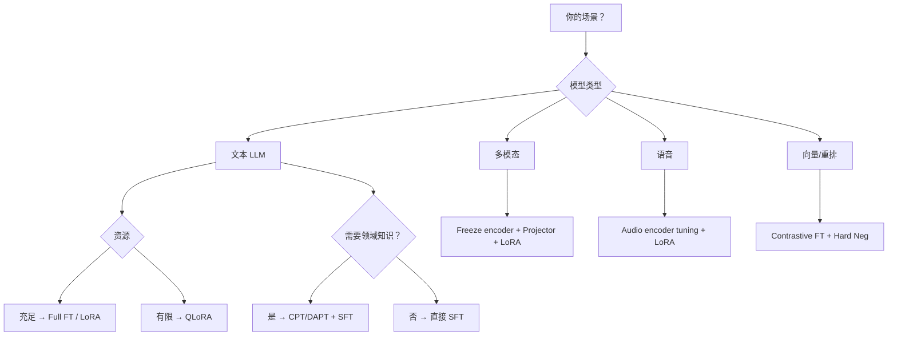

# 工程实践：选型、资源优化与部署
微调的最后一公里：如何选对方案、用好资源、避开常见坑。

---

## 选型决策树

---

## 资源优化技巧

| 技术 | 作用 | 节省 |
| --- | --- | --- |
| **Mixed Precision**（bf16/fp16） | 用半精度计算 | 显存 ~50%，速度 ~2× |
| **4-bit / 8-bit 量化** | 量化底座权重 | 显存 ~75%（QLoRA） |
| **Gradient Checkpointing** | 用计算换显存 | 显存 ~30-50% |
| **Flash Attention** | IO 优化的注意力计算 | 速度 2-4×，显存降低 |
| **Gradient Accumulation** | 多步累积梯度模拟大 batch | 无需更多 GPU |
| **FSDP / DeepSpeed ZeRO** | 分布式分片模型/优化器状态 | 多卡线性扩展 |

---

## 导出与部署

### Adapter 导出

- 只保存 LoRA/Adapter 权重（通常几十 MB）
- 推理时动态加载，支持多任务切换

### 权重合并

- 将 LoRA 权重合并回基座模型
- 合并后与原模型推理速度一致
- ⚠️ 合并后必须做回归测试

### 量化部署

- GPTQ / AWQ / GGUF 等量化格式
- 4-bit 量化可让 7B 模型在消费级 GPU 上运行

---

## ⚠️ 常见失败点

<aside>
🚫

- **只做 SFT 不做领域继续预训练** → 领域知识不足
- **数据脏、重复、模板泄漏** → 过拟合 / 虚假性能
- **负样本太弱** → 向量模型/重排模型区分度差
- **多模态对齐层太小或训练不足** → 视觉信息丢失
- **语音文本时长/转写质量差** → 语音模型学到噪声
- **向量模型只看 MTEB 不看业务召回** → 评测与实际脱节
- **合并 adapter 后未回归测试** → 能力退化未被发现
</aside>

---

## 📂 子页面导航

- [资源优化与量化部署详解](%E8%B5%84%E6%BA%90%E4%BC%98%E5%8C%96%E4%B8%8E%E9%87%8F%E5%8C%96%E9%83%A8%E7%BD%B2%E8%AF%A6%E8%A7%A3%20ebdbd07e69854b00a56903b10f5df11f.md)

**相关页面**：[PEFT 参数高效微调方案族](PEFT%20%E5%8F%82%E6%95%B0%E9%AB%98%E6%95%88%E5%BE%AE%E8%B0%83%E6%96%B9%E6%A1%88%E6%97%8F%2007bcd7a7aa894f4984c232d57a0e7376.md) · [训练范式与多阶段流程](%E8%AE%AD%E7%BB%83%E8%8C%83%E5%BC%8F%E4%B8%8E%E5%A4%9A%E9%98%B6%E6%AE%B5%E6%B5%81%E7%A8%8B%20b728c66d7df84592a6de5c2627698be7.md) · [LLM 微调技术全景指南](LLM%20微调技术全景指南.md)

[资源优化与量化部署详解](%E8%B5%84%E6%BA%90%E4%BC%98%E5%8C%96%E4%B8%8E%E9%87%8F%E5%8C%96%E9%83%A8%E7%BD%B2%E8%AF%A6%E8%A7%A3%20ebdbd07e69854b00a56903b10f5df11f.md)