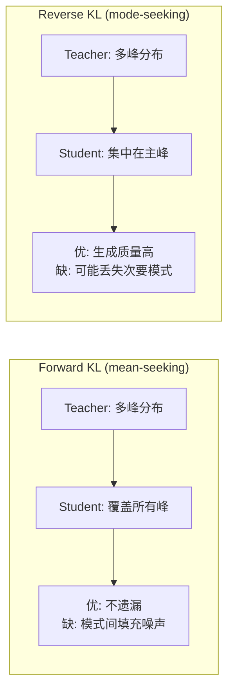

本页面严谨分析三种 KL 散度在 LLM 蒸馏中的数学性质和实际行为差异。

---

## 1. 数学定义

给定 teacher 分布 $p_T$ 和 student 分布 $p_S$ 在词表 $V$ 上：

**Forward KL**（mode-covering / mean-seeking）：

$$KL_f(p_T \| p_S) = \sum_{v \in V} p_T(v) \log \frac{p_T(v)}{p_S(v)}$$

**Reverse KL**（mode-seeking）：

$$KL_r(p_S \| p_T) = \sum_{v \in V} p_S(v) \log \frac{p_S(v)}{p_T(v)}$$

**Mixed KL**：

$$KL_m = \beta \cdot KL_f + (1 - \beta) \cdot KL_r, \quad \beta \in [0, 1]$$

---

## 2. 行为差异分析

### 2.1 Forward KL 的 mean-seeking 性质

$KL_f$ 对 $p_T(v) > 0$ 但 $p_S(v) \approx 0$ 的位置惩罚极大（$log frac{p_T}{p_S} to infty$）。

**结果**：student 被迫在 teacher 有概率的**所有**位置都分配一定概率 → **覆盖全部模式**。

> [!important] Forward KL 的问题

> 为了覆盖 teacher 的所有模式，student 可能在 teacher 低概率区域也分配概率 → 生成中出现低质量 token（"hallucination-prone"）。

### 2.2 Reverse KL 的 mode-seeking 性质

$KL_r$ 对 $p_S(v) > 0$ 但 $p_T(v) \approx 0$ 的位置惩罚极大。

**结果**：student 避免在 teacher 低概率位置分配概率 → **集中在高概率模式**。

> [!important] MiniLLM（ICLR 2024）核心发现

> 在 LLM 生成中，reverse KL 显著优于 forward KL：

> - student 不会在 teacher 认为不好的 token 上浪费概率

> - 生成质量更高，幻觉更少

> - 但可能损失多样性

### 2.3 对比图示



---

## 3. 梯度分析

### Forward KL 梯度

$$\nabla_{\theta} KL_f = -\sum_v p_T(v) \nabla_{\theta} \log p_S(v; \theta)$$

- 由 teacher 分布加权 → teacher 高概率 token 贡献大

- 等价于 teacher 分布下的最大似然

### Reverse KL 梯度

$$\nabla_{\theta} KL_r = \sum_v \nabla_{\theta} p_S(v; \theta) \left[\log \frac{p_S(v; \theta)}{p_T(v)} + 1\right]$$

- 由 student 分布加权 → student 当前输出区域贡献大

- 自然避免 student 探索 teacher 低概率区域

> [!tip] 直觉总结

> - Forward KL："student 必须在 teacher 说 yes 的地方也说 yes"

> - Reverse KL："student 不能在 teacher 说 no 的地方说 yes"

---

## 4. Python 实现

```Python
import torch
import torch.nn.functional as F


def forward_kl_loss(student_logits, teacher_logits, temperature=1.0):
    """Forward KL: KL(p_T || p_S)"""
    s_log_probs = F.log_softmax(student_logits / temperature, dim=-1)
    t_probs = F.softmax(teacher_logits / temperature, dim=-1)
    # KL(t || s) = sum t * (log t - log s)
    return F.kl_div(s_log_probs, t_probs, reduction="batchmean") * (temperature ** 2)


def reverse_kl_loss(student_logits, teacher_logits, temperature=1.0):
    """Reverse KL: KL(p_S || p_T)"""
    s_probs = F.softmax(student_logits / temperature, dim=-1)
    s_log_probs = F.log_softmax(student_logits / temperature, dim=-1)
    t_log_probs = F.log_softmax(teacher_logits / temperature, dim=-1)
    # KL(s || t) = sum s * (log s - log t)
    return (s_probs * (s_log_probs - t_log_probs)).sum(dim=-1).mean() * (temperature ** 2)


def mixed_kl_loss(student_logits, teacher_logits, temperature=1.0, beta=0.5):
    """Mixed KL: beta * KL_f + (1 - beta) * KL_r"""
    fkl = forward_kl_loss(student_logits, teacher_logits, temperature)
    rkl = reverse_kl_loss(student_logits, teacher_logits, temperature)
    return beta * fkl + (1 - beta) * rkl


# --- Comparison ---
B, V = 4, 32000
student_logits = torch.randn(B, V)
teacher_logits = torch.randn(B, V)

print(f"Forward KL: {forward_kl_loss(student_logits, teacher_logits, T=4.0):.4f}")
print(f"Reverse KL: {reverse_kl_loss(student_logits, teacher_logits, T=4.0):.4f}")
print(f"Mixed KL:   {mixed_kl_loss(student_logits, teacher_logits, T=4.0, beta=0.5):.4f}")
```

---

## 5. 工程选择指南

|场景|推荐|原因|
|---|---|---|
|通用预训练蒸馏|Forward KL 或 Mixed KL|保留通用能力的多样性|
|生成质量优先|Reverse KL|避免幻觉，集中在高质量输出|
|不确定 / 通用推荐|Mixed KL（$beta=0.5$）|平衡覆盖度和集中度|
|On-policy 蒸馏（GKD）|Reverse KL|配合 student 自生成轨迹效果最佳|
