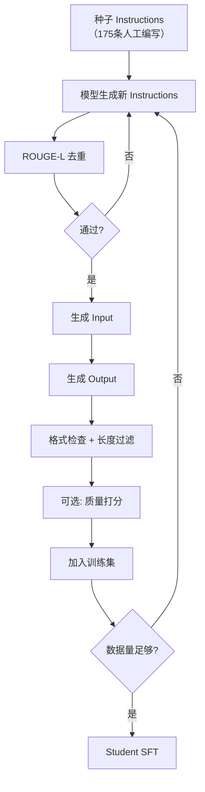

本页面给出 Self-Instruct pipeline 的完整实现，包括数据生成、过滤和质量控制。

---

## 1. 完整 Pipeline



---

## 2. Python 实现

```Python
import json
import re
from typing import List, Dict
from rouge_score import rouge_scorer


class SelfInstructPipeline:
    """Self-Instruct data generation pipeline."""

    def __init__(self, model_client, seed_instructions: List[str]):
        self.client = model_client  # LLM API client
        self.seed_instructions = seed_instructions
        self.generated_data = []
        self.scorer = rouge_scorer.RougeScorer(['rougeL'], use_stemmer=True)

    def generate_instructions(self, n: int = 8) -> List[str]:
        """Generate new instructions from seeds + existing."""
        # Sample 8 existing instructions as few-shot examples
        import random
        pool = self.seed_instructions + [
            d['instruction'] for d in self.generated_data
        ]
        examples = random.sample(pool, min(8, len(pool)))

        prompt = "Generate a diverse set of task instructions.\n\n"
        for i, ex in enumerate(examples, 1):
            prompt += f"{i}. {ex}\n"
        prompt += f"{len(examples)+1}."

        response = self.client.generate(prompt, n=n, temperature=0.8)
        return self._parse_instructions(response)

    def _parse_instructions(self, text: str) -> List[str]:
        """Parse numbered instructions from model output."""
        lines = text.strip().split('\n')
        instructions = []
        for line in lines:
            match = re.match(r'^\d+\.\s*(.+)', line.strip())
            if match:
                instructions.append(match.group(1).strip())
        return instructions

    def is_duplicate(self, instruction: str, threshold: float = 0.7) -> bool:
        """Check ROUGE-L similarity against existing instructions."""
        all_instructions = self.seed_instructions + [
            d['instruction'] for d in self.generated_data
        ]
        for existing in all_instructions:
            score = self.scorer.score(existing, instruction)
            if score['rougeL'].fmeasure > threshold:
                return True
        return False

    def generate_io(self, instruction: str) -> Dict:
        """Generate input and output for an instruction."""
        # Determine if instruction needs input
        classify_prompt = (
            f'Does this instruction require an additional input? '
            f'Answer "yes" or "no".\n\nInstruction: {instruction}'
        )
        needs_input = 'yes' in self.client.generate(
            classify_prompt, temperature=0
        ).lower()

        if needs_input:
            input_prompt = (
                f"Generate a realistic input for this instruction:\n"
                f"Instruction: {instruction}\nInput:"
            )
            input_text = self.client.generate(input_prompt, temperature=0.5)

            output_prompt = (
                f"Instruction: {instruction}\n"
                f"Input: {input_text}\nOutput:"
            )
        else:
            input_text = ""
            output_prompt = f"Instruction: {instruction}\nOutput:"

        output_text = self.client.generate(output_prompt, temperature=0.3)

        return {
            'instruction': instruction,
            'input': input_text,
            'output': output_text,
        }

    def quality_filter(self, data: Dict) -> bool:
        """Basic quality filters."""
        # Length filters
        if len(data['instruction']) < 10 or len(data['instruction']) > 500:
            return False
        if len(data['output']) < 5 or len(data['output']) > 2000:
            return False

        # Format checks
        if data['instruction'].startswith('Write a program'):
            if '```' not in data['output']:  # code should have code blocks
                return False

        # Avoid instructions that are too similar to "generate/write"
        low_diversity_starts = ['write', 'generate', 'create', 'make']
        first_word = data['instruction'].split()[0].lower()
        # Allow but track diversity

        return True

    def run(self, target_count: int = 10000, batch_size: int = 20):
        """Run the full pipeline."""
        while len(self.generated_data) < target_count:
            # Generate new instructions
            new_instructions = self.generate_instructions(n=batch_size)

            for inst in new_instructions:
                # Dedup check
                if self.is_duplicate(inst):
                    continue

                # Generate I/O
                data = self.generate_io(inst)

                # Quality filter
                if not self.quality_filter(data):
                    continue

                self.generated_data.append(data)

                if len(self.generated_data) >= target_count:
                    break

            print(f"Progress: {len(self.generated_data)}/{target_count}")

        return self.generated_data
```

---

## 3. 高级过滤策略

> [!important] 数据质量决定蒸馏效果上限

```Python
def advanced_quality_scoring(data: Dict, judge_client) -> float:
    """Use a strong LLM as judge for quality scoring."""
    prompt = f"""Rate the quality of this instruction-response pair on a scale of 1-10.

Instruction: {data['instruction']}
Input: {data['input']}
Output: {data['output']}

Criteria:
- Instruction clarity (1-10)
- Output correctness (1-10)
- Output completeness (1-10)

Overall score (1-10):"""

    response = judge_client.generate(prompt, temperature=0)
    # Parse score from response
    import re
    match = re.search(r'(\d+)', response.split('Overall')[-1])
    return int(match.group(1)) if match else 5


def self_consistency_filter(
    data: Dict, model_client, n_samples: int = 5, threshold: float = 0.6
) -> bool:
    """Keep only instructions where model gives consistent outputs."""
    prompt = f"Instruction: {data['instruction']}\n"
    if data['input']:
        prompt += f"Input: {data['input']}\n"
    prompt += "Output:"

    outputs = [
        model_client.generate(prompt, temperature=0.7)
        for _ in range(n_samples)
    ]

    # Check consistency via ROUGE-L between all pairs
    scorer = rouge_scorer.RougeScorer(['rougeL'], use_stemmer=True)
    scores = []
    for i in range(len(outputs)):
        for j in range(i+1, len(outputs)):
            score = scorer.score(outputs[i], outputs[j])
            scores.append(score['rougeL'].fmeasure)

    avg_consistency = sum(scores) / len(scores) if scores else 0
    return avg_consistency >= threshold
```
