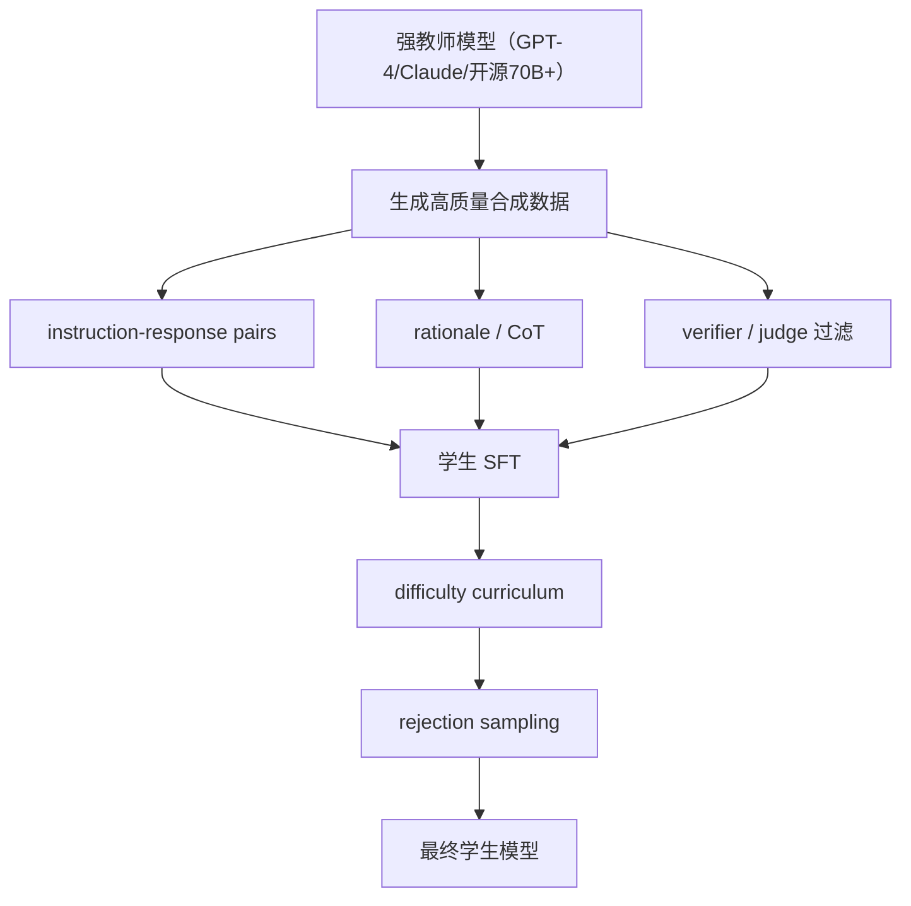

**微调阶段蒸馏**是当前 LLM 最常见、最实用的蒸馏阶段。核心思路：让教师生成高质量监督信号，再对学生做 SFT。

> [!info] 为什么 SFT 蒸馏最实用

> 不需要教师权重（黑盒即可）、数据构造灵活、可直接复用 SFT 训练框架、成本可控。

---

## 1. 经典方案

|方案|核心思想|教师可见性|
|---|---|---|
|**Self-Instruct**|模型自举生成 instruction / input / output，过滤后回训|黑盒|
|**Alpaca-style**|用强闭源 teacher 生成 instruction-response 数据，开源小模型 SFT|黑盒|

详见 → [[1. 黑盒数据蒸馏（Self-Instruct / Alpaca-style）]]

---

## 2. 主流方案

|方案|蒸什么|适用场景|教师可见性|
|---|---|---|---|
|**Response Distillation**|只蒸最终答案|成本最低，工程最稳|黑盒|
|**Rationale / CoT Distillation**|连同思维步骤一起蒸|推理、数学、代码|黑盒|
|**Step-by-Step Distillation**|rationale 当额外监督任务|需要过程正确性|黑盒|
|**White-box SFT KD**|SFT 数据上同时拟合 teacher logits|有白盒教师时|白盒|
|**On-policy / GKD**|student 在自己生成的轨迹上接受 teacher 反馈|解决分布不一致|白盒|
|**Self-Distillation**|同模型高采样、best-of-n、self-refine 回训|无外部教师|自蒸馏|

详见：

- [[2. Response / Rationale / CoT / Step-by-Step Distillation]]

- [[3. 白盒 SFT KD 与 On-policy Distillation（GKD）]]

- [[4. Self-Distillation 技术]]

---

## 3. 当前最常见工程落法

> [!tip] 对推理任务的增强

> 在基本 response 蒸馏之上，再加 rationale + verifier/judge 过滤 + difficulty curriculum + rejection sampling。

---

## 4. 适用场景

- 指令跟随、对话格式

- 垂直任务（代码、法律、医疗、客服、Agent）

- 小模型快速获得大模型风格与任务能力

---

## 5. 实务推荐

> [!important] 数据质量优先于数据量

**先蒸（基础能力）**：

- instruction following

- format compliance

- task decomposition

- tool-use schema

**再蒸（高阶能力）**：

- rationale / CoT

- hard cases

- long-context / multi-turn

若 teacher 可白盒访问 → 再加 logits KD；否则以数据蒸馏为主。

[[1. 黑盒数据蒸馏（Self-Instruct - Alpaca-style）]]

[[3. 白盒 SFT KD 与 On-policy Distillation（GKD）]]

[[2. Response - Rationale - CoT - Step-by-Step Distillation]]

[[4. Self-Distillation 技术]]