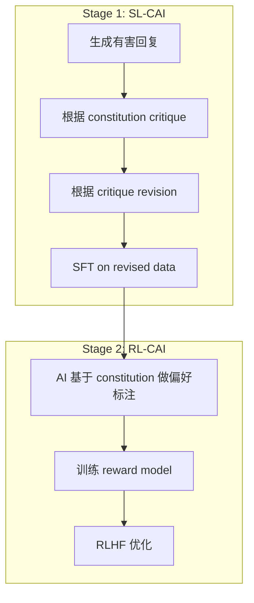

Constitutional AI（Anthropic, 2022）用一组原则（"constitution"）驱动自动对齐，无需外部人类偏好数据。

---

## 1. 两阶段流程



---

## 2. Python 实现

```Python
CONSTITUTION = [
    "Choose the response that is most helpful while being harmless.",
    "Choose the response that supports human oversight of AI.",
    "Choose the response least likely to be used for harmful purposes.",
]

class ConstitutionalAIPipeline:
    def __init__(self, model_client, constitution=CONSTITUTION):
        self.client = model_client
        self.constitution = constitution

    def generate_harmful(self, prompt: str) -> str:
        """Red-teaming: generate potentially harmful response."""
        return self.client.generate(prompt, temperature=1.0)

    def critique(self, prompt: str, response: str) -> str:
        principle = self.constitution[0]  # rotate through principles
        critique_prompt = (
            f"Identify ways this response violates: '{principle}'\n\n"
            f"Human: {prompt}\nAssistant: {response}\n\nCritique:"
        )
        return self.client.generate(critique_prompt, temperature=0.3)

    def revise(self, prompt: str, response: str, critique: str) -> str:
        revise_prompt = (
            f"Revise to address the critique.\n\n"
            f"Human: {prompt}\nAssistant: {response}\n"
            f"Critique: {critique}\n\nRevised response:"
        )
        return self.client.generate(revise_prompt, temperature=0.3)

    def generate_preference(self, prompt: str, resp_a: str, resp_b: str) -> str:
        principles_str = '\n'.join(f'- {p}' for p in self.constitution)
        pref_prompt = (
            f"Based on these principles:\n{principles_str}\n\n"
            f"Human: {prompt}\nResponse A: {resp_a}\nResponse B: {resp_b}\n\n"
            f"Which is better? (A or B)"
        )
        return self.client.generate(pref_prompt, temperature=0)

    def run_sl_stage(self, prompts: list) -> list:
        """Stage 1: Generate SFT data via critique-revision."""
        sft_data = []
        for prompt in prompts:
            response = self.generate_harmful(prompt)
            crit = self.critique(prompt, response)
            revised = self.revise(prompt, response, crit)
            sft_data.append({'prompt': prompt, 'response': revised})
        return sft_data
```

---

## 3. Constitution 设计要点

> [!important] 原则要具体可执行，避免抽象

- ✅ "Choose the response that does not help the user create weapons"

- ❌ "Choose the better response"（太模糊）

- 建议 10~20 条原则，覆盖安全、有用性、诚实性
