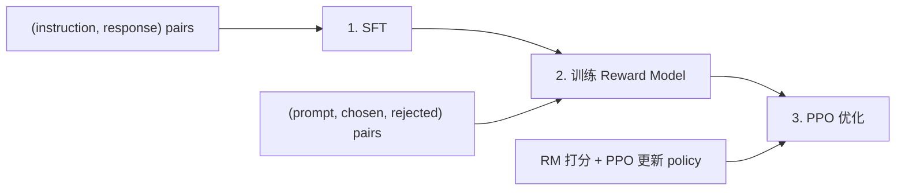

RLHF 是对齐蒸馏的经典范式，RLAIF/Constitutional AI 是其低成本替代方案。

---

## 1. RLHF（Reinforcement Learning from Human Feedback）

> [!info] 最经典的对齐流水线

> SFT → Reward Model → PPO/RL

**三阶段流程**：

**Stage 1 — SFT**：

- 用人工标注或蒸馏数据做标准 SFT

- 得到初始 policy $\pi_{SFT}$

**Stage 2 — Reward Model**：

- 收集 (prompt, chosen response, rejected response) 三元组

- 训练 Bradley-Terry 模型：$P(y_w succ y_l | x) = sigma(r(x, y_w) - r(x, y_l))$

**Stage 3 — PPO**：

- 目标：$max_{pi} mathbb{E}_{x sim D, y sim pi}[r(x, y)] - beta cdot KL(pi | pi_{SFT})$

- KL 正则化防止 policy 偏离太远

> [!faq] PPO 训练为什么困难？

> - reward hacking：模型学会利用 RM 漏洞获取高分

> - 训练不稳定：需要精细调参（clip ratio、KL 系数、learning rate）

> - 计算成本高：需同时维护 policy、reference、reward model、value model 四个模型

详见 → [[1. PPO 训练与 Reward Model 实现]]

---

## 2. RLAIF（RL from AI Feedback）

> [!info] 用 AI 替代人类标注偏好

> 核心思想：让强 AI 模型（如 GPT-4）代替人类标注者生成偏好数据。

**流程**：

1. 对同一 prompt 生成多个候选 response

1. 用 AI judge 进行 pairwise comparison 或打分

1. 用 AI 生成的偏好数据训练 reward model 或直接用于 DPO

**优势**：

- 成本极低（API 调用 vs 人工标注）

- 可大规模扩展

- 一致性高于人类标注者之间的一致性

---

## 3. Constitutional AI（Anthropic, 2022）

> [!important] 用规则/宪法驱动的自动对齐

> 不依赖外部人类偏好数据，而是用一组预定义的原则（"constitution"）引导模型自我改进。

**两阶段流程**：

**Stage 1 — Supervised（SL-CAI）**：

1. 模型生成有害回复（red-teaming response）

1. 模型根据 constitution 原则 critique 自己的回复

1. 模型根据 critique 修改回复（revision）

1. 用 (prompt, revised response) 做 SFT

**Stage 2 — RL（RL-CAI）**：

1. AI 模型基于 constitution 对 response pairs 做偏好标注

1. 用 AI 偏好数据训练 reward model

1. 用 RLHF 流程优化

**Constitution 示例原则**：

- "Choose the response that is most helpful while being harmless"

- "Choose the response that most supports human oversight of AI"

- "Choose the response that is least likely to be used for harmful purposes"

详见 → [[2. Constitutional AI Pipeline 实现]]

[[1. PPO 训练与 Reward Model 实现]]

[[2. Constitutional AI Pipeline 实现]]
