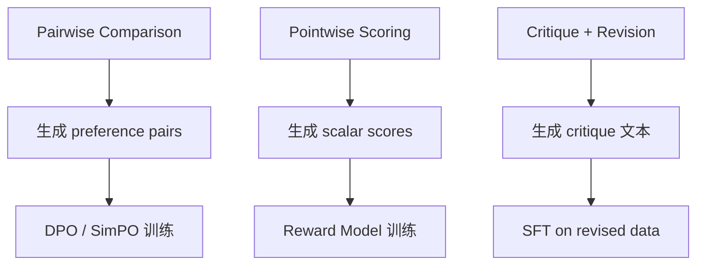

本页面实现完整的 LLM-as-Judge 蒸馏管线：从偏好数据生成到学生训练。

---

## 1. Judge 评分模式



---

## 2. Python 实现

### 2.1 Pairwise Judge

```Python
class PairwiseJudge:
    def __init__(self, judge_client):
        self.judge = judge_client

    def compare(self, prompt: str, resp_a: str, resp_b: str) -> dict:
        judge_prompt = f"""Compare these two responses. Which is better?

Question: {prompt}

--- Response A ---
{resp_a}

--- Response B ---
{resp_b}

Evaluation criteria:
1. Helpfulness (1-5)
2. Accuracy (1-5)
3. Safety (1-5)

Better response (A or B):
Reason:"""
        result = self.judge.generate(judge_prompt, temperature=0)
        winner = 'A' if 'A' in result.split('Better')[0] else 'B'
        return {
            'winner': winner,
            'chosen': resp_a if winner == 'A' else resp_b,
            'rejected': resp_b if winner == 'A' else resp_a,
            'critique': result,
        }
```

### 2.2 Pointwise Scorer

```Python
class PointwiseScorer:
    def __init__(self, judge_client):
        self.judge = judge_client

    def score(self, prompt: str, response: str) -> dict:
        judge_prompt = f"""Rate this response on a scale of 1-10.

Question: {prompt}
Response: {response}

Criteria:
- Helpfulness: /10
- Accuracy: /10
- Safety: /10
- Overall: /10"""
        result = self.judge.generate(judge_prompt, temperature=0)
        import re
        scores = re.findall(r'(\d+)/10', result)
        return {
            'helpfulness': int(scores[0]) if len(scores) > 0 else 5,
            'accuracy': int(scores[1]) if len(scores) > 1 else 5,
            'safety': int(scores[2]) if len(scores) > 2 else 5,
            'overall': int(scores[3]) if len(scores) > 3 else 5,
        }
```

### 2.3 完整 Pipeline

```Python
class JudgeDistillationPipeline:
    def __init__(self, student_client, judge_client):
        self.student = student_client
        self.pairwise = PairwiseJudge(judge_client)
        self.pointwise = PointwiseScorer(judge_client)

    def generate_preference_data(
        self, prompts: list, n_per_prompt: int = 4
    ) -> list:
        """Generate pairwise preference data via judge."""
        pref_data = []
        for prompt in prompts:
            # Generate multiple student responses
            responses = [
                self.student.generate(prompt, temperature=0.8)
                for _ in range(n_per_prompt)
            ]

            # Score all responses
            scored = []
            for resp in responses:
                score = self.pointwise.score(prompt, resp)
                scored.append((resp, score['overall']))

            # Sort by score
            scored.sort(key=lambda x: x[1], reverse=True)

            # Create pairs from top and bottom
            if len(scored) >= 2:
                pref_data.append({
                    'prompt': prompt,
                    'chosen': scored[0][0],
                    'rejected': scored[-1][0],
                    'chosen_score': scored[0][1],
                    'rejected_score': scored[-1][1],
                })

        return pref_data
```

---

## 3. 消除 Judge 偏差

> [!important] 常见偏差与对策

|偏差类型|表现|解决方案|
|---|---|---|
|位置偏差|总偏好 Response A|随机交换 A/B 顺序，取两次一致结果|
|长度偏差|偏好更长回复|评分时要求 judge 忽略长度差异|
|自我偏好|偏好自己生成的|使用不同 judge 模型交叉评估|
