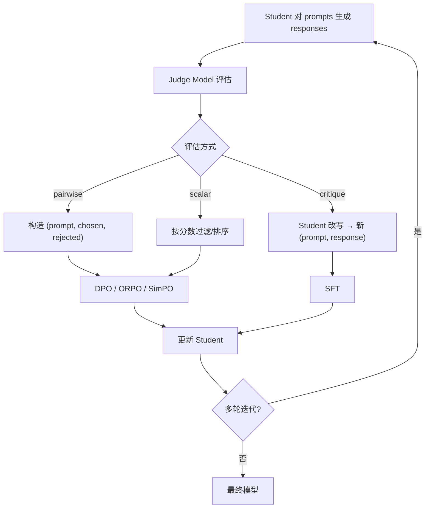

Judge Distillation 是对齐蒸馏中最灵活的方案：用强模型作裁判生成偏好信号，学生通过偏好优化方法学习。

---

## 1. 核心思想

> [!info] LLM-as-Judge

> 强模型（如 GPT-4）充当裁判，对学生模型的输出进行评估，产生偏好/打分/critique 信号。学生模型再用这些信号做 DPO/ORPO/SimPO/RL 训练。

**本质**：把"人类偏好标注"替换为"强模型偏好标注"，是 RLAIF 思想的延伸。

---

## 2. Judge 输出类型

|输出类型|格式|用于|优缺点|
|---|---|---|---|
|**Pairwise preference**|"Response A is better than B"|DPO / ORPO / SimPO|最直接，但需要两个候选|
|**Scalar score**|1~10 分|reward model 训练 / 数据过滤|灵活，但打分一致性需校验|
|**Critique + Revision**|"Issue: ... → Fix: ..."|Self-refine / Constitutional AI|信号最丰富，但成本最高|
|**Binary**|"Good" / "Bad"|KTO / 数据过滤|最简单，适合大规模|

---

## 3. 完整 Pipeline

---

## 4. Judge 质量保障

> [!important] Judge 不可靠会导致 reward hacking

**常见问题与对策**：

- **Position bias**：Judge 偏好第一个/第二个 response → 随机化顺序 + 两次评判取交集

- **Length bias**：偏好更长的 response → 长度归一化或明确指令

- **Self-enhancement bias**：Judge 偏好自己风格的输出 → 用多个不同 Judge

- **Verbosity bias**：偏好更详细的回答 → 明确评分标准

**最佳实践**：

- 用 rubric-based 评分（明确的评分标准）

- 多 Judge 集成（至少 2-3 个不同的 Judge 模型）

- 定期用人类标注 calibration set 校验 Judge 一致性

- 记录 Judge inter-agreement rate

详见 → [[1. LLM-as-Judge Pipeline 实现]]

[[1. LLM-as-Judge Pipeline 实现]]