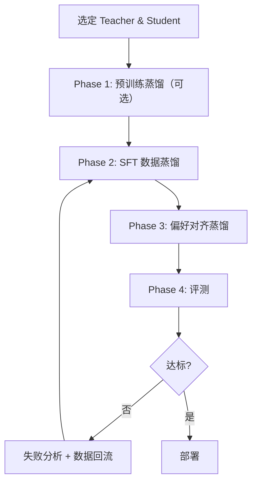

本页面给出从零到部署的完整 LLM 蒸馏工程实战框架。

---

## 1. 端到端流程



---

## 2. Phase 1: 预训练蒸馏

```Python
# Config
PRETRAIN_CONFIG = {
    'teacher': 'Qwen2.5-72B',
    'student': 'Qwen2.5-7B',
    'data': 'domain_corpus_100B_tokens',
    'loss': 'LM + KD(topk=256, T=2.0) + cosine(last_layer)',
    'lr': 3e-5,
    'batch_size': 2048,
    'steps': 50000,
}
```

> [!tip] 跳过预训练蒸馏的条件

> - 基座模型已够强

> - 目标域与预训练域重叠大

> - 显存/时间不够

---

## 3. Phase 2: SFT 数据蒸馏

```Python
def generate_sft_data(teacher, prompts, strategies):
    """Multi-strategy SFT data generation."""
    data = []
    for prompt in prompts:
        # Strategy 1: Direct response
        resp = teacher.generate(prompt, temperature=0.3)
        data.append({'prompt': prompt, 'response': resp, 'type': 'direct'})

        # Strategy 2: CoT for reasoning tasks
        if is_reasoning_task(prompt):
            cot = teacher.generate(f"{prompt}\nLet's think step by step.", temperature=0.3)
            data.append({'prompt': prompt, 'response': cot, 'type': 'cot'})

        # Strategy 3: Best-of-N for hard tasks
        if is_hard_task(prompt):
            candidates = [teacher.generate(prompt, temperature=0.8) for _ in range(8)]
            best = max(candidates, key=lambda c: score(prompt, c))
            data.append({'prompt': prompt, 'response': best, 'type': 'bon'})

    return data

# SFT training config
SFT_CONFIG = {
    'data_size': '50K~200K high-quality samples',
    'lr': 2e-5,
    'epochs': 3,
    'warmup_ratio': 0.1,
    'max_length': 4096,
}
```

---

## 4. Phase 3: 偏好对齐

```Python
def generate_preference_data(model, judge, prompts, n_pairs=2):
    """Generate preference pairs using judge."""
    pref_data = []
    for prompt in prompts:
        responses = [model.generate(prompt, temperature=0.8) for _ in range(n_pairs * 2)]
        scores = [judge.score(prompt, r) for r in responses]

        # Pair highest with lowest
        sorted_idx = sorted(range(len(scores)), key=lambda i: scores[i], reverse=True)
        for i in range(min(n_pairs, len(sorted_idx) // 2)):
            pref_data.append({
                'prompt': prompt,
                'chosen': responses[sorted_idx[i]],
                'rejected': responses[sorted_idx[-(i+1)]],
            })
    return pref_data

ALIGN_CONFIG = {
    'method': 'SimPO',  # or DPO/ORPO
    'beta': 2.5,
    'gamma': 0.5,
    'lr': 5e-7,
    'epochs': 1,
}
```

---

## 5. Phase 4: 失败回流

```Python
def failure_analysis_and_reflow(model, test_set, teacher, judge):
    """Identify failures, generate improved data, retrain."""
    failures = []
    for item in test_set:
        pred = model.generate(item['prompt'])
        score = judge.score(item['prompt'], pred)
        if score < 6:  # threshold
            failures.append({
                'prompt': item['prompt'],
                'student_response': pred,
                'score': score,
            })

    # Teacher rewrites
    reflow_data = []
    for f in failures:
        improved = teacher.generate(
            f"Improve this response:\nQ: {f['prompt']}\nBad answer: {f['student_response']}\nBetter answer:",
            temperature=0.3
        )
        reflow_data.append({'prompt': f['prompt'], 'response': improved})

    return reflow_data  # Add to next SFT round
```

---

## 6. 工程检查清单

- [ ] Teacher 和 Student 的 tokenizer 是否兼容

- [ ] SFT 数据是否覆盖目标任务分布

- [ ] 偏好数据中 chosen/rejected 差距是否足够大

- [ ] 评测集是否包含 safety / edge case

- [ ] 推理延迟是否满足线上要求

- [ ] 量化后精度损失是否可接受
