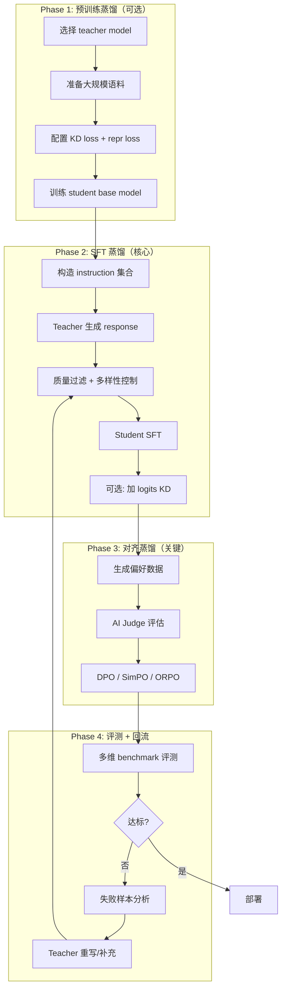

本页面将预训练蒸馏、SFT 蒸馏、对齐蒸馏串联为完整的工程 pipeline，给出具体配置建议。

---

## 1. 全流程总览

---

## 2. Phase 1: 预训练蒸馏配置

> [!tip] 何时需要预训练蒸馏？

> - 需要从大模型（70B+）压缩到小模型（7B 以下）

> - 需要保留通用语言能力（不只是任务能力）

> - 如果只做垂直任务，可跳过此阶段

**推荐配置**：

- Loss：$L_{LM} + 0.5 cdot L_{KD} + 0.1 cdot L_{repr}$

- Temperature：$T = 2 sim 4$

- 数据：至少 50B tokens，覆盖目标使用域

- Logits 存储：top-k=256，offline

---

## 3. Phase 2: SFT 蒸馏配置

**数据构造清单**：

|数据类型|规模建议|优先级|
|---|---|---|
|基础指令跟随|10K~50K|⭐⭐⭐⭐⭐|
|格式遵从|5K~20K|⭐⭐⭐⭐⭐|
|领域知识|10K~100K|⭐⭐⭐⭐|
|CoT / Rationale|5K~30K|⭐⭐⭐⭐（推理任务）|
|Multi-turn 对话|5K~20K|⭐⭐⭐|
|Tool-use|2K~10K|⭐⭐⭐（Agent 场景）|

---

## 4. Phase 3: 对齐蒸馏配置

**推荐**：

- 首选：SimPO（reference-free，简单高效）

- 备选：DPO（最成熟，生态最好）

- 偏好数据量：5K~20K pairs

- Judge：GPT-4 或同级别开源 judge（如 Llama-3.1-405B）

---

## 5. Phase 4: 评测闭环配置

**评测维度**：

- **通用能力**：MMLU, HellaSwag, ARC, WinoGrande

- **推理能力**：GSM8K, MATH, HumanEval, MBPP

- **安全性**：ToxiGen, BBQ, TruthfulQA

- **领域能力**：根据具体任务定制

- **工程指标**：latency, throughput, memory, cost

详见 → [[1. 完整蒸馏工程实战]]

[[1. 完整蒸馏工程实战]]
