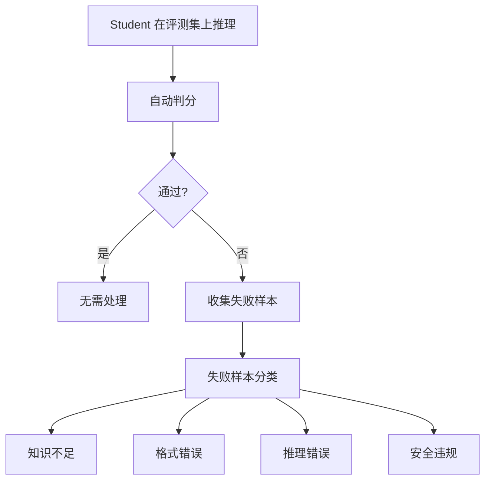

蒸馏不是一次性的，而是需要 **评测 → 分析 → 回流 → 再蒸馏** 的迭代闭环。

---

## 1. 评测体系设计

### 1.1 多维度评测矩阵

|维度|评测方法|指标|工具|
|---|---|---|---|
|**通用能力**|标准 benchmark|MMLU acc, HellaSwag acc|lm-eval-harness|
|**推理能力**|数学/代码 benchmark|GSM8K acc, HumanEval pass@1|lm-eval-harness, bigcode-eval|
|**安全性**|对抗测试|ToxiGen %, refusal rate|自定义 pipeline|
|**格式遵从**|结构化输出测试|JSON 合规率, 格式 pass rate|自定义 test suite|
|**Judge 一致性**|AI Judge 评估|win rate vs teacher|MT-Bench, AlpacaEval|
|**工程指标**|性能测试|latency(p50/p99), throughput, memory|vLLM benchmark|

### 1.2 Teacher-Student Gap 分析

> [!important] 不要只看总分，要看维度差距

**分析维度**：

- 哪些任务类型 gap 最大？

- 哪些难度层级 gap 最大？

- 哪些输出格式 gap 最大？

- student 的典型失败模式是什么？

---

## 2. 迭代回流机制

### 2.1 失败样本收集

### 2.2 按类型回流

|失败类型|回流策略|蒸馏阶段|
|---|---|---|
|知识不足|Teacher 生成相关知识 QA → SFT|SFT 蒸馏|
|格式错误|增加格式约束训练数据 → SFT|SFT 蒸馏|
|推理错误|Teacher 生成 CoT 纠正 → CoT 蒸馏|SFT 蒸馏|
|安全违规|构造对抗 preference pairs → DPO/SimPO|对齐蒸馏|
|风格偏移|Judge 生成 preference → DPO/SimPO|对齐蒸馏|

### 2.3 迭代策略

> [!tip] 推荐迭代节奏

> - 第 1 轮：全量 SFT 蒸馏 + 基础对齐

> - 第 2 轮：失败样本回流 + 强化对齐

> - 第 3 轮：难例 curriculum + 自蒸馏迭代

> - 通常 2~3 轮后收益递减

**停止条件**：

- student 在目标 benchmark 上达到预设阈值

- 连续两轮迭代提升 < 1%

- 计算预算耗尽

详见 → [[1. 蒸馏质量评测与自动化实现]]

[[1. 蒸馏质量评测与自动化实现]]
