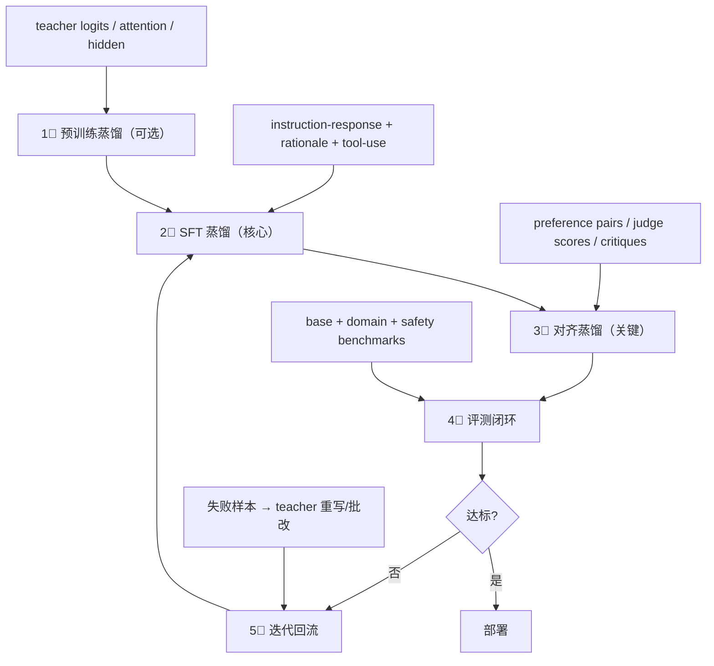

本页面将三个蒸馏阶段串联为完整的工程 pipeline，并给出不同场景下的方案选择指南。

---

## 1. 目标拆分

先分清要蒸什么：

- **通用语言能力** → [[1. 预训练阶段蒸馏（Pre-training Distillation）]]

- **指令/任务能力** → [[2. 微调阶段蒸馏（SFT Distillation）]]

- **偏好/安全/风格** → [[3. 对齐阶段蒸馏（Alignment Distillation）]]

---

## 2. 标准组合流程

### 各阶段详解

**① 预训练蒸馏**

- teacher logits / attention / hidden states

- 学生获得基础语言能力

**② SFT 蒸馏**

- teacher 生成 instruction-response

- 对关键任务加入 rationale / tool-use / format constraints

**③ 对齐蒸馏**

- 生成 preference pairs / judge scores / critiques

- 用 DPO/ORPO/SimPO 或 RLHF/RLAIF 做偏好对齐

**④ 评测闭环**

- base benchmarks（MMLU, HellaSwag 等）

- domain benchmarks（垂直领域指标）

- safety benchmarks（ToxiGen, BBQ 等）

- judge consistency / calibration / latency / cost

**⑤ 迭代回流**

- 失败样本 → teacher 重写/批改 → 再蒸馏

详见 → [[1. 端到端蒸馏 Pipeline 设计]] / [[2. 评测闭环与迭代回流]]

---

## 3. 工程上最稳的一条线

> [!important] 推荐默认范式

> 1. **继续预训练蒸馏（可选）**

> 2. **高质量合成 SFT 数据蒸馏（必选）**

> 3. **偏好对齐蒸馏：DPO/ORPO/SimPO（常用）**

> 4. **难例回流 + judge 过滤 + 自蒸馏迭代（增强）**

---

## 4. 方案选择速查表

|场景|推荐方案|关键要点|
|---|---|---|
|**只有闭源 API 教师**|黑盒数据蒸馏 → SFT + DPO/SimPO|instruction-response + rationale + self-consistency + AI judge|
|**有开源白盒教师**|logits KD + hidden KD + response KD + on-policy KD|效果上限通常更高|
|**压缩基础模型**|预训练蒸馏优先|保留通用语言能力|
|**快速做垂直小模型**|SFT 蒸馏 + 对齐蒸馏|跳过预训练蒸馏，速度最快|
|**做推理小模型**|rationale + verifier + hard-example + on-policy|必须加入过程监督|

[[1. 端到端蒸馏 Pipeline 设计]]

[[2. 评测闭环与迭代回流]]