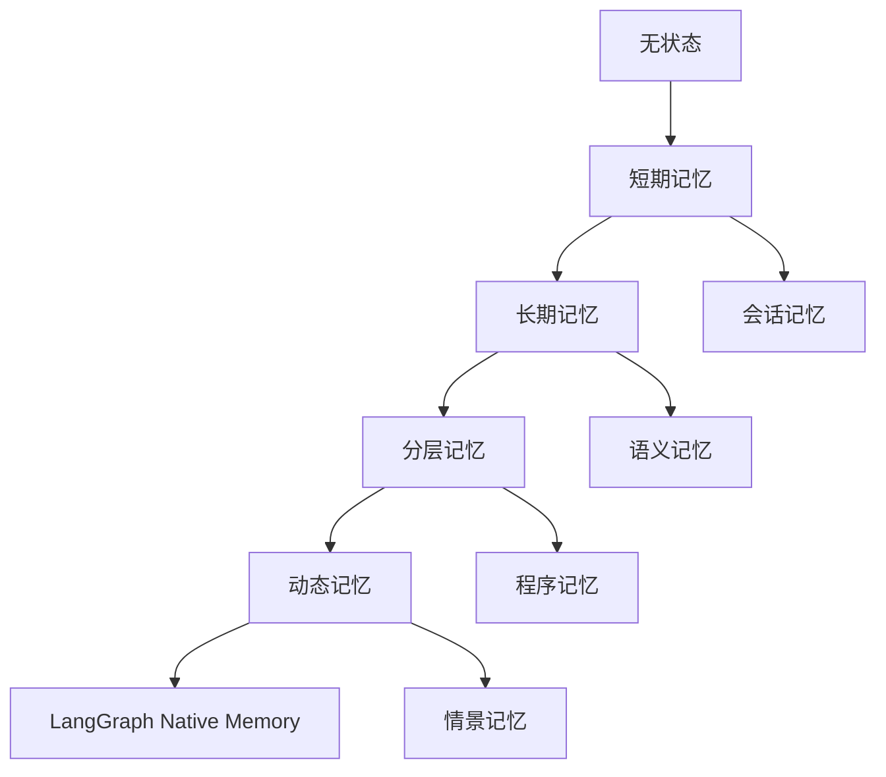

# LangGraph 记忆与状态管理

## 概述

记忆与状态管理是构建智能 Agent 的核心技术。LangGraph 提供了强大的状态图机制，支持多种记忆模式和状态管理策略，使 Agent 能够在对话中保持上下文、学习经验并做出连贯的决策。

## 前沿技术路线

### 1. 记忆架构演进



### 2. 核心技术栈

- **LangGraph State**: 状态图状态管理
- **Memory Layers**: 多层记忆架构
- **Vector Storage**: 向量存储和检索
- **State Persistence**: 状态持久化
- **Context Management**: 上下文管理

## 基础状态管理

### 1. 简单状态管理

```python
from langgraph import StateGraph, START, END
from langchain_core.messages import BaseMessage, HumanMessage, AIMessage
from typing import TypedDict, List, Dict, Any
import json

# 定义基础状态
class BasicState(TypedDict):
    messages: List[BaseMessage]
    user_context: Dict[str, Any]
    session_id: str
    step_count: int

def update_context(state: BasicState) -> BasicState:
    """更新用户上下文"""
    messages = state["messages"]
    user_context = state["user_context"]

    # 分析最新消息
    if messages:
        last_message = messages[-1]

        # 提取用户信息
        if isinstance(last_message, HumanMessage):
            content = last_message.content.lower()

            # 检测用户偏好
            if "详细" in content or "具体" in content:
                user_context["detail_preference"] = "high"
            elif "简单" in content or "简洁" in content:
                user_context["detail_preference"] = "low"

            # 检测话题兴趣
            topics = ["技术", "商业", "教育", "娱乐"]
            for topic in topics:
                if topic in content:
                    if "interests" not in user_context:
                        user_context["interests"] = []
                    if topic not in user_context["interests"]:
                        user_context["interests"].append(topic)

    # 增加步数
    state["step_count"] += 1

    return state

def generate_response(state: BasicState) -> BasicState:
    """生成响应"""
    messages = state["messages"]
    user_context = state["user_context"]
    step_count = state["step_count"]

    # 根据上下文生成个性化响应
    detail_level = user_context.get("detail_preference", "medium")
    interests = user_context.get("interests", [])

    base_response = f"这是第 {step_count} 步的响应。"

    if detail_level == "high":
        base_response += " 我为您提供详细的信息..."
    elif detail_level == "low":
        base_response += " 简要回答如下..."

    if interests:
        base_response += f" 我注意到您对 {', '.join(interests)} 感兴趣。"

    response_message = AIMessage(content=base_response)
    state["messages"].append(response_message)

    return state

# 构建基础状态管理图
basic_workflow = StateGraph(BasicState)

# 添加节点
basic_workflow.add_node("update_context", update_context)
basic_workflow.add_node("generate_response", generate_response)

# 添加边
basic_workflow.add_edge(START, "update_context")
basic_workflow.add_edge("update_context", "generate_response")
basic_workflow.add_edge("generate_response", END)

# 编译图
basic_app = basic_workflow.compile()

# 使用示例
def basic_state_example():
    """基础状态管理示例"""

    initial_state = {
        "messages": [HumanMessage(content="请详细介绍人工智能技术")],
        "user_context": {},
        "session_id": "session_001",
        "step_count": 0
    }

    result = basic_app.invoke(initial_state)

    print("用户上下文:", result["user_context"])
    print("步数:", result["step_count"])
    print("响应:", result["messages"][-1].content)

basic_state_example()
```

### 2. 复杂状态管理

```python
from langgraph import StateGraph, START, END
from typing import TypedDict, List, Dict, Any, Optional
from dataclasses import dataclass, field
from datetime import datetime
import uuid

@dataclass
class ConversationContext:
    """对话上下文"""
    user_id: str
    session_id: str
    start_time: datetime = field(default_factory=datetime.now)
    last_activity: datetime = field(default_factory=datetime.now)
    topic_history: List[str] = field(default_factory=list)
    user_preferences: Dict[str, Any] = field(default_factory=dict)
    emotional_state: str = "neutral"
    satisfaction_score: float = 0.0

@dataclass
class TaskState:
    """任务状态"""
    task_id: str
    task_type: str
    status: str = "pending"
    progress: float = 0.0
    result: Optional[Dict[str, Any]] = None
    error_message: Optional[str] = None
    created_at: datetime = field(default_factory=datetime.now)

class AdvancedState(TypedDict):
    messages: List[BaseMessage]
    conversation_context: ConversationContext
    active_tasks: List[TaskState]
    completed_tasks: List[TaskState]
    knowledge_base: Dict[str, Any]
    memory_store: Dict[str, Any]

def analyze_emotional_state(state: AdvancedState) -> AdvancedState:
    """分析情感状态"""
    messages = state["messages"]
    context = state["conversation_context"]

    if messages:
        last_message = messages[-1]
        content = last_message.content.lower()

        # 简单情感分析
        positive_words = ["好", "棒", "优秀", "满意", "喜欢"]
        negative_words = ["差", "糟糕", "失望", "不满", "讨厌"]

        positive_count = sum(1 for word in positive_words if word in content)
        negative_count = sum(1 for word in negative_words if word in content)

        if positive_count > negative_count:
            context.emotional_state = "positive"
        elif negative_count > positive_count:
            context.emotional_state = "negative"
        else:
            context.emotional_state = "neutral"

    return state

def update_topic_history(state: AdvancedState) -> AdvancedState:
    """更新话题历史"""
    messages = state["messages"]
    context = state["conversation_context"]

    if messages:
        last_message = messages[-1]
        content = last_message.content

        # 简单的话题提取
        topics = ["技术", "产品", "服务", "价格", "支持"]
        current_topics = []

        for topic in topics:
            if topic in content:
                current_topics.append(topic)

        # 更新话题历史
        if current_topics:
            context.topic_history.extend(current_topics)
            # 保持最近10个话题
            context.topic_history = context.topic_history[-10:]

    return state

def manage_tasks(state: AdvancedState) -> AdvancedState:
    """管理任务"""
    messages = state["messages"]
    active_tasks = state["active_tasks"]
    completed_tasks = state["completed_tasks"]

    if messages:
        last_message = messages[-1]
        content = last_message.content.lower()

        # 检测新任务
        if "帮助" in content or "协助" in content:
            new_task = TaskState(
                task_id=str(uuid.uuid4()),
                task_type="help_request",
                status="in_progress"
            )
            active_tasks.append(new_task)

        # 检测任务完成
        if "谢谢" in content or "完成" in content:
            if active_tasks:
                completed_task = active_tasks.pop(0)
                completed_task.status = "completed"
                completed_task.progress = 1.0
                completed_tasks.append(completed_task)

    return state

def update_knowledge_base(state: AdvancedState) -> AdvancedState:
    """更新知识库"""
    messages = state["messages"]
    knowledge_base = state["knowledge_base"]
    context = state["conversation_context"]

    if messages:
        last_message = messages[-1]

        # 从对话中学习
        if isinstance(last_message, AIMessage):
            # 记录成功的响应模式
            response_pattern = {
                "topic": context.topic_history[-1] if context.topic_history else "general",
                "emotional_state": context.emotional_state,
                "response": last_message.content,
                "timestamp": datetime.now().isoformat()
            }

            if "successful_responses" not in knowledge_base:
                knowledge_base["successful_responses"] = []

            knowledge_base["successful_responses"].append(response_pattern)

            # 限制知识库大小
            if len(knowledge_base["successful_responses"]) > 100:
                knowledge_base["successful_responses"] = knowledge_base["successful_responses"][-50:]

    return state

def generate_contextual_response(state: AdvancedState) -> AdvancedState:
    """生成上下文感知的响应"""
    context = state["conversation_context"]
    active_tasks = state["active_tasks"]
    knowledge_base = state["knowledge_base"]

    # 基于上下文生成响应
    response_parts = []

    # 情感感知
    if context.emotional_state == "positive":
        response_parts.append("很高兴能帮助您！")
    elif context.emotional_state == "negative":
        response_parts.append("我理解您的困扰，让我来帮助您。")

    # 任务感知
    if active_tasks:
        response_parts.append(f"您有 {len(active_tasks)} 个任务正在进行中。")

    # 话题感知
    if context.topic_history:
        recent_topics = context.topic_history[-3:]
        response_parts.append(f"我们最近讨论了 {', '.join(recent_topics)}。")

    # 知识库感知
    if "successful_responses" in knowledge_base:
        response_parts.append("基于我们的对话历史，我为您提供个性化的建议。")

    final_response = " ".join(response_parts)

    response_message = AIMessage(content=final_response)
    state["messages"].append(response_message)

    return state

# 构建复杂状态管理图
advanced_workflow = StateGraph(AdvancedState)

# 添加节点
advanced_workflow.add_node("analyze_emotion", analyze_emotional_state)
advanced_workflow.add_node("update_topics", update_topic_history)
advanced_workflow.add_node("manage_tasks", manage_tasks)
advanced_workflow.add_node("update_knowledge", update_knowledge_base)
advanced_workflow.add_node("generate_response", generate_contextual_response)

# 添加边
advanced_workflow.add_edge(START, "analyze_emotion")
advanced_workflow.add_edge("analyze_emotion", "update_topics")
advanced_workflow.add_edge("update_topics", "manage_tasks")
advanced_workflow.add_edge("manage_tasks", "update_knowledge")
advanced_workflow.add_edge("update_knowledge", "generate_response")
advanced_workflow.add_edge("generate_response", END)

# 编译图
advanced_app = advanced_workflow.compile()

# 使用示例
def advanced_state_example():
    """复杂状态管理示例"""

    # 创建初始上下文
    context = ConversationContext(
        user_id="user_001",
        session_id="session_001"
    )

    initial_state = {
        "messages": [HumanMessage(content="我很喜欢你们的产品，能帮助我了解更多技术细节吗？")],
        "conversation_context": context,
        "active_tasks": [],
        "completed_tasks": [],
        "knowledge_base": {},
        "memory_store": {}
    }

    result = advanced_app.invoke(initial_state)

    print("情感状态:", result["conversation_context"].emotional_state)
    print("话题历史:", result["conversation_context"].topic_history)
    print("活跃任务数:", len(result["active_tasks"]))
    print("响应:", result["messages"][-1].content)

advanced_state_example()
```

## 多层记忆架构

### 1. 分层记忆系统

```python
from langgraph import StateGraph, START, END
from typing import TypedDict, List, Dict, Any, Optional
from dataclasses import dataclass, field
from datetime import datetime, timedelta
import pickle
import hashlib

@dataclass
class MemoryItem:
    """记忆项"""
    id: str
    content: str
    timestamp: datetime
    importance: float = 0.5
    access_count: int = 0
    last_accessed: datetime = field(default_factory=datetime.now)
    tags: List[str] = field(default_factory=list)
    embedding: Optional[List[float]] = None

class MemoryLayer:
    """记忆层基类"""

    def __init__(self, capacity: int, retention_period: timedelta):
        self.capacity = capacity
        self.retention_period = retention_period
        self.memories: Dict[str, MemoryItem] = {}

    def add_memory(self, content: str, importance: float = 0.5, tags: List[str] = None) -> str:
        """添加记忆"""
        memory_id = hashlib.md5(f"{content}{datetime.now()}".encode()).hexdigest()

        memory = MemoryItem(
            id=memory_id,
            content=content,
            timestamp=datetime.now(),
            importance=importance,
            tags=tags or []
        )

        self.memories[memory_id] = memory
        self._cleanup_old_memories()

        return memory_id

    def get_memory(self, memory_id: str) -> Optional[MemoryItem]:
        """获取记忆"""
        memory = self.memories.get(memory_id)
        if memory:
            memory.access_count += 1
            memory.last_accessed = datetime.now()
        return memory

    def search_memories(self, query: str, limit: int = 5) -> List[MemoryItem]:
        """搜索记忆"""
        results = []
        query_lower = query.lower()

        for memory in self.memories.values():
            if query_lower in memory.content.lower():
                results.append(memory)

        # 按重要性和最近访问排序
        results.sort(key=lambda m: (m.importance, m.last_accessed), reverse=True)

        return results[:limit]

    def _cleanup_old_memories(self):
        """清理旧记忆"""
        now = datetime.now()

        # 删除过期记忆
        expired_ids = [
            memory_id for memory_id, memory in self.memories.items()
            if now - memory.timestamp > self.retention_period
        ]

        for memory_id in expired_ids:
            del self.memories[memory_id]

        # 如果超过容量，删除最不重要的记忆
        if len(self.memories) > self.capacity:
            sorted_memories = sorted(
                self.memories.items(),
                key=lambda x: (x[1].importance, x[1].access_count)
            )

            excess = len(self.memories) - self.capacity
            for memory_id, _ in sorted_memories[:excess]:
                del self.memories[memory_id]

class WorkingMemory(MemoryLayer):
    """工作记忆（短期）"""

    def __init__(self):
        super().__init__(capacity=10, retention_period=timedelta(hours=1))

class EpisodicMemory(MemoryLayer):
    """情景记忆（中期）"""

    def __init__(self):
        super().__init__(capacity=100, retention_period=timedelta(days=30))

class SemanticMemory(MemoryLayer):
    """语义记忆（长期）"""

    def __init__(self):
        super().__init__(capacity=1000, retention_period=timedelta(days=365))

class LongTermMemory(MemoryLayer):
    """长期记忆"""

    def __init__(self):
        super().__init__(capacity=10000, retention_period=timedelta(days=3650))

class MultiLayerMemoryState(TypedDict):
    messages: List[BaseMessage]
    working_memory: WorkingMemory
    episodic_memory: EpisodicMemory
    semantic_memory: SemanticMemory
    long_term_memory: LongTermMemory
    current_context: Dict[str, Any]

def process_working_memory(state: MultiLayerMemoryState) -> MultiLayerMemoryState:
    """处理工作记忆"""
    messages = state["messages"]
    working_memory = state["working_memory"]

    if messages:
        last_message = messages[-1]

        # 将最新消息添加到工作记忆
        working_memory.add_memory(
            content=last_message.content,
            importance=0.8,
            tags=["current", "conversation"]
        )

    return state

def consolidate_to_episodic(state: MultiLayerMemoryState) -> MultiLayerMemoryState:
    """整合到情景记忆"""
    working_memory = state["working_memory"]
    episodic_memory = state["episodic_memory"]

    # 将重要的工作记忆转移到情景记忆
    for memory in working_memory.memories.values():
        if memory.importance > 0.7:
            episodic_memory.add_memory(
                content=memory.content,
                importance=memory.importance,
                tags=memory.tags + ["consolidated"]
            )

    return state

def extract_semantic_knowledge(state: MultiLayerMemoryState) -> MultiLayerMemoryState:
    """提取语义知识"""
    episodic_memory = state["episodic_memory"]
    semantic_memory = state["semantic_memory"]

    # 从情景记忆中提取语义知识
    for memory in episodic_memory.memories.values():
        # 简单的语义提取规则
        if "定义" in memory.content or "概念" in memory.content:
            semantic_memory.add_memory(
                content=memory.content,
                importance=0.9,
                tags=["definition", "concept"]
            )
        elif "规则" in memory.content or "原理" in memory.content:
            semantic_memory.add_memory(
                content=memory.content,
                importance=0.85,
                tags=["rule", "principle"]
            )

    return state

def archive_to_long_term(state: MultiLayerMemoryState) -> MultiLayerMemoryState:
    """归档到长期记忆"""
    semantic_memory = state["semantic_memory"]
    long_term_memory = state["long_term_memory"]

    # 将最重要的语义知识归档到长期记忆
    for memory in semantic_memory.memories.values():
        if memory.importance > 0.9 and memory.access_count > 5:
            long_term_memory.add_memory(
                content=memory.content,
                importance=memory.importance,
                tags=memory.tags + ["archived"]
            )

    return state

def memory_retrieval(state: MultiLayerMemoryState) -> MultiLayerMemoryState:
    """记忆检索"""
    messages = state["messages"]
    current_context = state["current_context"]

    if messages:
        last_message = messages[-1]
        query = last_message.content

        # 从各层记忆中检索相关信息
        working_results = state["working_memory"].search_memories(query, limit=3)
        episodic_results = state["episodic_memory"].search_memories(query, limit=5)
        semantic_results = state["semantic_memory"].search_memories(query, limit=5)
        long_term_results = state["long_term_memory"].search_memories(query, limit=3)

        # 合并检索结果
        all_results = working_results + episodic_results + semantic_results + long_term_results

        # 按重要性排序
        all_results.sort(key=lambda m: m.importance, reverse=True)

        current_context["retrieved_memories"] = all_results[:10]  # 保留前10个结果

    return state

def generate_memory_aware_response(state: MultiLayerMemoryState) -> MultiLayerMemoryState:
    """生成记忆感知的响应"""
    current_context = state["current_context"]
    retrieved_memories = current_context.get("retrieved_memories", [])

    response_parts = ["基于我的记忆，"]

    if retrieved_memories:
        # 使用检索到的记忆生成响应
        relevant_memories = retrieved_memories[:3]  # 使用最相关的3个记忆

        for memory in relevant_memories:
            response_parts.append(f"我记得：{memory.content[:50]}...")

        response_parts.append("这些信息可能对您有帮助。")
    else:
        response_parts.append("我没有找到相关的历史信息，但我会尽力帮助您。")

    final_response = " ".join(response_parts)

    response_message = AIMessage(content=final_response)
    state["messages"].append(response_message)

    return state

# 构建多层记忆图
memory_workflow = StateGraph(MultiLayerMemoryState)

# 添加节点
memory_workflow.add_node("working_memory", process_working_memory)
memory_workflow.add_node("episodic_consolidation", consolidate_to_episodic)
memory_workflow.add_node("semantic_extraction", extract_semantic_knowledge)
memory_workflow.add_node("long_term_archival", archive_to_long_term)
memory_workflow.add_node("memory_retrieval", memory_retrieval)
memory_workflow.add_node("generate_response", generate_memory_aware_response)

# 添加边
memory_workflow.add_edge(START, "working_memory")
memory_workflow.add_edge("working_memory", "episodic_consolidation")
memory_workflow.add_edge("episodic_consolidation", "semantic_extraction")
memory_workflow.add_edge("semantic_extraction", "long_term_archival")
memory_workflow.add_edge("long_term_archival", "memory_retrieval")
memory_workflow.add_edge("memory_retrieval", "generate_response")
memory_workflow.add_edge("generate_response", END)

# 编译图
memory_app = memory_workflow.compile()

# 使用示例
def multi_layer_memory_example():
    """多层记忆示例"""

    # 初始化记忆层
    working_memory = WorkingMemory()
    episodic_memory = EpisodicMemory()
    semantic_memory = SemanticMemory()
    long_term_memory = LongTermMemory()

    initial_state = {
        "messages": [HumanMessage(content="请解释机器学习的基本概念")],
        "working_memory": working_memory,
        "episodic_memory": episodic_memory,
        "semantic_memory": semantic_memory,
        "long_term_memory": long_term_memory,
        "current_context": {}
    }

    result = memory_app.invoke(initial_state)

    print("工作记忆大小:", len(result["working_memory"].memories))
    print("情景记忆大小:", len(result["episodic_memory"].memories))
    print("语义记忆大小:", len(result["semantic_memory"].memories))
    print("长期记忆大小:", len(result["long_term_memory"].memories))
    print("响应:", result["messages"][-1].content)

multi_layer_memory_example()
```

## 状态持久化

### 1. 状态序列化和反序列化

```python
import json
import pickle
from pathlib import Path
from typing import Dict, Any, Optional
from datetime import datetime

class StatePersistence:
    """状态持久化管理器"""

    def __init__(self, storage_path: str = "agent_states"):
        self.storage_path = Path(storage_path)
        self.storage_path.mkdir(exist_ok=True)

    def save_state(self, state: Dict[str, Any], session_id: str) -> bool:
        """保存状态"""
        try:
            state_file = self.storage_path / f"{session_id}.json"

            # 准备可序列化的状态
            serializable_state = self._prepare_for_serialization(state)

            with open(state_file, 'w', encoding='utf-8') as f:
                json.dump(serializable_state, f, ensure_ascii=False, indent=2, default=str)

            return True
        except Exception as e:
            print(f"保存状态失败: {e}")
            return False

    def load_state(self, session_id: str) -> Optional[Dict[str, Any]]:
        """加载状态"""
        try:
            state_file = self.storage_path / f"{session_id}.json"

            if not state_file.exists():
                return None

            with open(state_file, 'r', encoding='utf-8') as f:
                serializable_state = json.load(f)

            # 恢复状态
            state = self._restore_from_serialization(serializable_state)

            return state
        except Exception as e:
            print(f"加载状态失败: {e}")
            return None

    def _prepare_for_serialization(self, state: Dict[str, Any]) -> Dict[str, Any]:
        """准备序列化"""
        serializable = {}

        for key, value in state.items():
            if hasattr(value, '__dict__'):
                # 对象转换为字典
                serializable[key] = self._object_to_dict(value)
            elif isinstance(value, (list, tuple)):
                # 列表/元组处理
                serializable[key] = [
                    self._object_to_dict(item) if hasattr(item, '__dict__') else item
                    for item in value
                ]
            else:
                serializable[key] = value

        return serializable

    def _object_to_dict(self, obj: Any) -> Dict[str, Any]:
        """对象转字典"""
        if hasattr(obj, '__dict__'):
            result = {}
            for key, value in obj.__dict__.items():
                if isinstance(value, datetime):
                    result[key] = value.isoformat()
                elif hasattr(value, '__dict__'):
                    result[key] = self._object_to_dict(value)
                else:
                    result[key] = value
            return result
        else:
            return obj

    def _restore_from_serialization(self, serializable_state: Dict[str, Any]) -> Dict[str, Any]:
        """从序列化恢复状态"""
        # 这里需要根据具体的状态类型进行恢复
        # 简化处理，直接返回
        return serializable_state

    def list_sessions(self) -> List[str]:
        """列出所有会话"""
        sessions = []
        for state_file in self.storage_path.glob("*.json"):
            sessions.append(state_file.stem)
        return sessions

    def delete_session(self, session_id: str) -> bool:
        """删除会话"""
        try:
            state_file = self.storage_path / f"{session_id}.json"
            if state_file.exists():
                state_file.unlink()
                return True
            return False
        except Exception as e:
            print(f"删除会话失败: {e}")
            return False

# 使用持久化的状态管理
class PersistentStateManager:
    """持久化状态管理器"""

    def __init__(self, persistence: StatePersistence):
        self.persistence = persistence
        self.active_sessions: Dict[str, Dict[str, Any]] = {}

    def get_or_create_session(self, session_id: str) -> Dict[str, Any]:
        """获取或创建会话"""
        # 尝试从内存获取
        if session_id in self.active_sessions:
            return self.active_sessions[session_id]

        # 尝试从持久化存储加载
        saved_state = self.persistence.load_state(session_id)
        if saved_state:
            self.active_sessions[session_id] = saved_state
            return saved_state

        # 创建新会话
        new_state = self._create_default_state(session_id)
        self.active_sessions[session_id] = new_state
        return new_state

    def update_session(self, session_id: str, state: Dict[str, Any]) -> bool:
        """更新会话"""
        try:
            # 更新内存中的状态
            self.active_sessions[session_id] = state

            # 持久化到存储
            return self.persistence.save_state(state, session_id)
        except Exception as e:
            print(f"更新会话失败: {e}")
            return False

    def _create_default_state(self, session_id: str) -> Dict[str, Any]:
        """创建默认状态"""
        return {
            "session_id": session_id,
            "messages": [],
            "user_context": {},
            "created_at": datetime.now().isoformat(),
            "last_updated": datetime.now().isoformat()
        }

# 使用示例
def persistence_example():
    """持久化示例"""

    # 创建持久化管理器
    persistence = StatePersistence("agent_states")
    state_manager = PersistentStateManager(persistence)

    # 获取或创建会话
    session_id = "user_session_001"
    state = state_manager.get_or_create_session(session_id)

    print("初始状态:", state)

    # 更新状态
    state["messages"].append(HumanMessage(content="测试消息"))
    state["user_context"]["preference"] = "detailed"

    # 保存更新
    success = state_manager.update_session(session_id, state)
    print(f"保存状态: {'成功' if success else '失败'}")

    # 重新加载状态
    reloaded_state = state_manager.get_or_create_session(session_id)
    print("重新加载的状态:", reloaded_state)

    # 列出所有会话
    sessions = persistence.list_sessions()
    print("所有会话:", sessions)

persistence_example()
```

## 动态记忆管理

### 1. 自适应记忆系统

```python
from langgraph import StateGraph, START, END
from typing import TypedDict, List, Dict, Any, Optional
import numpy as np
from dataclasses import dataclass

@dataclass
class MemoryMetrics:
    """记忆指标"""
    recall_accuracy: float = 0.0
    retrieval_speed: float = 0.0
    relevance_score: float = 0.0
    usage_frequency: float = 0.0

class AdaptiveMemoryManager:
    """自适应记忆管理器"""

    def __init__(self):
        self.memory_metrics = MemoryMetrics()
        self.access_patterns: Dict[str, List[datetime]] = {}
        self.relevance_feedback: Dict[str, List[float]] = []

    def update_metrics(self, query: str, retrieved_memories: List[MemoryItem],
                       user_feedback: Optional[float] = None):
        """更新记忆指标"""
        if not retrieved_memories:
            return

        # 计算检索速度
        retrieval_speed = self._calculate_retrieval_speed(query, retrieved_memories)
        self.memory_metrics.retrieval_speed = (
            self.memory_metrics.retrieval_speed * 0.9 + retrieval_speed * 0.1
        )

        # 计算相关性分数
        relevance_score = self._calculate_relevance(query, retrieved_memories)
        self.memory_metrics.relevance_score = (
            self.memory_metrics.relevance_score * 0.9 + relevance_score * 0.1
        )

        # 更新使用频率
        self._update_usage_frequency(retrieved_memories)

        # 处理用户反馈
        if user_feedback is not None:
            self._process_relevance_feedback(retrieved_memories, user_feedback)

    def _calculate_retrieval_speed(self, query: str, memories: List[MemoryItem]) -> float:
        """计算检索速度"""
        # 简化处理：基于记忆数量和相关性
        if not memories:
            return 0.0

        # 假设检索时间与记忆数量成正比
        base_speed = 1.0 / (1 + len(memories) * 0.1)

        # 相关性越高，感知速度越快
        avg_relevance = np.mean([m.importance for m in memories])
        adjusted_speed = base_speed * (1 + avg_relevance)

        return min(adjusted_speed, 1.0)

    def _calculate_relevance(self, query: str, memories: List[MemoryItem]) -> float:
        """计算相关性分数"""
        if not memories:
            return 0.0

        query_words = set(query.lower().split())
        relevance_scores = []

        for memory in memories:
            memory_words = set(memory.content.lower().split())
            intersection = query_words.intersection(memory_words)
            union = query_words.union(memory_words)

            if union:
                jaccard_similarity = len(intersection) / len(union)
                relevance_scores.append(jaccard_similarity)

        return np.mean(relevance_scores) if relevance_scores else 0.0

    def _update_usage_frequency(self, memories: List[MemoryItem]):
        """更新使用频率"""
        now = datetime.now()

        for memory in memories:
            if memory.id not in self.access_patterns:
                self.access_patterns[memory.id] = []

            self.access_patterns[memory.id].append(now)

            # 保持最近100次访问记录
            if len(self.access_patterns[memory.id]) > 100:
                self.access_patterns[memory.id] = self.access_patterns[memory.id][-50:]

    def _process_relevance_feedback(self, memories: List[MemoryItem], feedback: float):
        """处理相关性反馈"""
        for memory in memories:
            if memory.id not in self.relevance_feedback:
                self.relevance_feedback[memory.id] = []

            self.relevance_feedback[memory.id].append(feedback)

            # 保持最近50次反馈
            if len(self.relevance_feedback[memory.id]) > 50:
                self.relevance_feedback[memory.id] = self.relevance_feedback[memory.id][-25:]

            # 调整记忆重要性
            avg_feedback = np.mean(self.relevance_feedback[memory.id])
            memory.importance = memory.importance * 0.8 + avg_feedback * 0.2

    def get_memory_insights(self) -> Dict[str, Any]:
        """获取记忆洞察"""
        insights = {
            "total_memories": len(self.access_patterns),
            "average_retrieval_speed": self.memory_metrics.retrieval_speed,
            "average_relevance": self.memory_metrics.relevance_score,
            "most_accessed": self._get_most_accessed_memories(),
            "least_relevant": self._get_least_relevant_memories()
        }

        return insights

    def _get_most_accessed_memories(self, limit: int = 5) -> List[str]:
        """获取最常访问的记忆"""
        access_counts = {
            memory_id: len(access_times)
            for memory_id, access_times in self.access_patterns.items()
        }

        sorted_memories = sorted(access_counts.items(), key=lambda x: x[1], reverse=True)
        return [memory_id for memory_id, _ in sorted_memories[:limit]]

    def _get_least_relevant_memories(self, limit: int = 5) -> List[str]:
        """获取最不相关的记忆"""
        relevance_scores = {}

        for memory_id, feedbacks in self.relevance_feedback.items():
            if feedbacks:
                relevance_scores[memory_id] = np.mean(feedbacks)

        sorted_memories = sorted(relevance_scores.items(), key=lambda x: x[1])
        return [memory_id for memory_id, _ in sorted_memories[:limit]]

class AdaptiveMemoryState(TypedDict):
    messages: List[BaseMessage]
    memory_manager: AdaptiveMemoryManager
    memory_layers: Dict[str, MemoryLayer]
    performance_metrics: Dict[str, float]
    optimization_suggestions: List[str]

def adaptive_memory_processing(state: AdaptiveMemoryState) -> AdaptiveMemoryState:
    """自适应记忆处理"""
    messages = state["messages"]
    memory_manager = state["memory_manager"]

    if messages:
        last_message = messages[-1]
        query = last_message.content

        # 从各层记忆检索
        all_memories = []
        for layer_name, memory_layer in state["memory_layers"].items():
            memories = memory_layer.search_memories(query, limit=3)
            all_memories.extend(memories)

        # 更新记忆指标
        memory_manager.update_metrics(query, all_memories)

        # 生成优化建议
        suggestions = memory_manager.get_memory_insights()
        state["optimization_suggestions"] = [
            f"检索速度: {suggestions['average_retrieval_speed']:.2f}",
            f"相关性: {suggestions['average_relevance']:.2f}",
            f"总记忆数: {suggestions['total_memories']}"
        ]

    return state

def memory_optimization(state: AdaptiveMemoryState) -> AdaptiveMemoryState:
    """记忆优化"""
    memory_manager = state["memory_manager"]
    memory_layers = state["memory_layers"]

    # 获取记忆洞察
    insights = memory_manager.get_memory_insights()

    # 优化建议
    optimization_actions = []

    # 如果检索速度太慢，建议清理记忆
    if insights["average_retrieval_speed"] < 0.5:
        optimization_actions.append("建议清理不常用的记忆以提高检索速度")

    # 如果相关性太低，建议改进记忆组织
    if insights["average_relevance"] < 0.6:
        optimization_actions.append("建议改进记忆标签和分类以提高相关性")

    # 如果记忆太多，建议归档
    if insights["total_memories"] > 1000:
        optimization_actions.append("建议将旧记忆归档到长期存储")

    state["optimization_suggestions"] = optimization_actions

    return state

# 构建自适应记忆图
adaptive_memory_workflow = StateGraph(AdaptiveMemoryState)

# 添加节点
adaptive_memory_workflow.add_node("adaptive_processing", adaptive_memory_processing)
adaptive_memory_workflow.add_node("optimization", memory_optimization)

# 添加边
adaptive_memory_workflow.add_edge(START, "adaptive_processing")
adaptive_memory_workflow.add_edge("adaptive_processing", "optimization")
adaptive_memory_workflow.add_edge("optimization", END)

# 编译图
adaptive_memory_app = adaptive_memory_workflow.compile()

# 使用示例
def adaptive_memory_example():
    """自适应记忆示例"""

    # 创建自适应记忆管理器
    memory_manager = AdaptiveMemoryManager()

    # 创建记忆层
    memory_layers = {
        "working": WorkingMemory(),
        "episodic": EpisodicMemory()
    }

    initial_state = {
        "messages": [HumanMessage(content="我想了解人工智能的最新发展")],
        "memory_manager": memory_manager,
        "memory_layers": memory_layers,
        "performance_metrics": {},
        "optimization_suggestions": []
    }

    result = adaptive_memory_app.invoke(initial_state)

    print("优化建议:")
    for suggestion in result["optimization_suggestions"]:
        print(f"- {suggestion}")

adaptive_memory_example()
```

## 实际应用案例

### 1. 智能客服记忆系统

```python
class CustomerServiceMemory:
    """客服记忆系统"""

    def __init__(self):
        self.customer_profiles: Dict[str, Dict[str, Any]] = {}
        self.conversation_history: Dict[str, List[Dict[str, Any]]] = {}
        self.knowledge_base: Dict[str, Any] = {}

    def update_customer_profile(self, customer_id: str, interaction_data: Dict[str, Any]):
        """更新客户档案"""
        if customer_id not in self.customer_profiles:
            self.customer_profiles[customer_id] = {
                "first_contact": datetime.now(),
                "total_interactions": 0,
                "preferences": {},
                "issues": [],
                "satisfaction_score": 0.0
            }

        profile = self.customer_profiles[customer_id]
        profile["last_contact"] = datetime.now()
        profile["total_interactions"] += 1

        # 更新偏好
        if "preferences" in interaction_data:
            profile["preferences"].update(interaction_data["preferences"])

        # 记录问题
        if "issue" in interaction_data:
            profile["issues"].append({
                "issue": interaction_data["issue"],
                "timestamp": datetime.now(),
                "resolution": interaction_data.get("resolution", "pending")
            })

        # 更新满意度
        if "satisfaction" in interaction_data:
            current_score = profile["satisfaction_score"]
            new_score = interaction_data["satisfaction"]
            profile["satisfaction_score"] = (current_score * 0.8 + new_score * 0.2)

    def get_customer_context(self, customer_id: str) -> Dict[str, Any]:
        """获取客户上下文"""
        if customer_id not in self.customer_profiles:
            return {"new_customer": True}

        profile = self.customer_profiles[customer_id]

        context = {
            "new_customer": False,
            "total_interactions": profile["total_interactions"],
            "preferences": profile["preferences"],
            "recent_issues": profile["issues"][-3:],  # 最近3个问题
            "satisfaction_score": profile["satisfaction_score"],
            "days_since_last_contact": (
                datetime.now() - profile["last_contact"]
            ).days if "last_contact" in profile else None
        }

        return context

# 使用示例
def customer_service_memory_example():
    """客服记忆示例"""

    memory_system = CustomerServiceMemory()

    # 模拟客户交互
    customer_id = "customer_001"

    # 第一次交互
    interaction_1 = {
        "preferences": {"language": "中文", "detail_level": "high"},
        "issue": "产品使用问题",
        "satisfaction": 0.8
    }

    memory_system.update_customer_profile(customer_id, interaction_1)

    # 第二次交互
    interaction_2 = {
        "preferences": {"contact_method": "email"},
        "issue": "账单查询",
        "resolution": "completed",
        "satisfaction": 0.9
    }

    memory_system.update_customer_profile(customer_id, interaction_2)

    # 获取客户上下文
    context = memory_system.get_customer_context(customer_id)

    print("客户上下文:")
    for key, value in context.items():
        print(f"{key}: {value}")

customer_service_memory_example()
```

## 总结

LangGraph 的记忆与状态管理提供了：

1. **多层记忆架构**: 工作、情景、语义、长期记忆分层管理
2. **智能状态管理**: 上下文感知、任务跟踪、知识积累
3. **持久化支持**: 状态序列化、会话管理、数据恢复
4. **自适应优化**: 性能监控、记忆优化、动态调整
5. **实际应用**: 客服系统、个性化推荐、智能助手

这些技术为构建具有长期记忆和学习能力的智能 Agent 提供了完整的解决方案。

## 相关链接

- [[LangGraph 函数调用与 JSON Schema]]
- [[LangGraph 思考链与自一致性]]
- [[LangGraph Agent 模式与反思]]
- [[记忆系统架构设计]]
