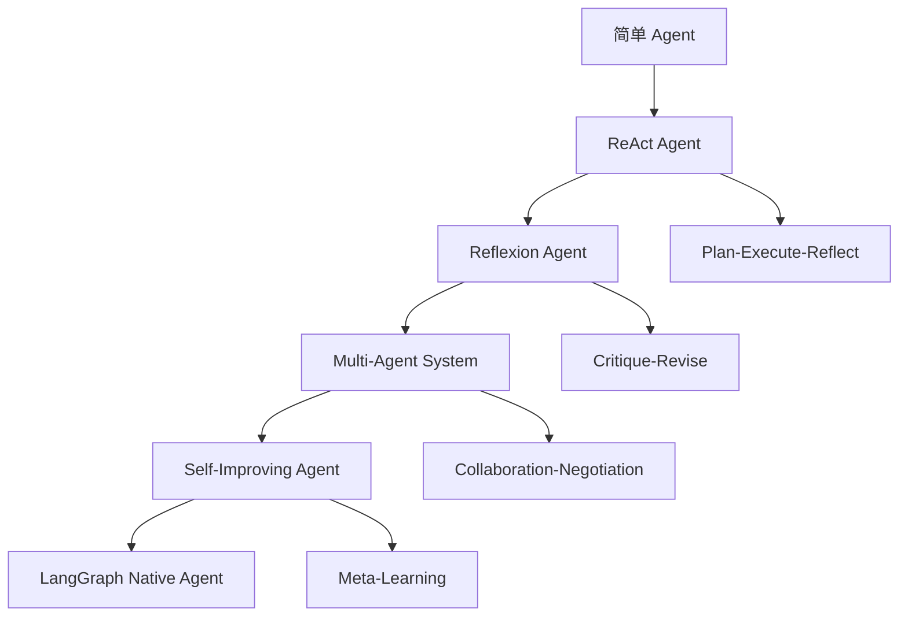

# LangGraph Agent 模式与反思

## 概述

Agent 模式与反思是构建高级智能系统的核心架构。LangGraph 通过状态图机制提供了强大的 Agent 设计模式，支持反思循环、自我改进和多 Agent 协作，使系统能够不断学习和优化。

## 前沿技术路线

### 1. Agent 架构演进



### 2. 核心技术栈

- **Agent Patterns**: ReAct, Reflexion, Plan-Execute-Reflect
- **Reflection Loops**: 反思循环机制
- **Self-Critique**: 自我批评和改进
- **Multi-Agent**: 多 Agent 协作
- **Meta-Learning**: 元学习能力

## ReAct Agent 模式

### 1. 基础 ReAct 实现

```python
from langgraph import StateGraph, START, END
from langchain_core.messages import BaseMessage, HumanMessage, AIMessage
from langchain_core.tools import tool
from typing import TypedDict, List, Dict, Any, Optional
import json

# ReAct 状态定义
class ReActState(TypedDict):
    question: str
    thoughts: List[str]
    actions: List[Dict[str, Any]]
    observations: List[str]
    final_answer: str
    iteration: int
    max_iterations: int

# 定义工具
@tool
def search_knowledge(query: str) -> str:
    """搜索知识库

    Args:
        query: 搜索查询
    """
    # 模拟知识库搜索
    knowledge_base = {
        "python": "Python 是一种高级编程语言，语法简洁，适合初学者。",
        "machine learning": "机器学习是人工智能的一个分支，让计算机从数据中学习。",
        "langgraph": "LangGraph 是一个用于构建状态图应用的框架。"
    }

    for key, value in knowledge_base.items():
        if key.lower() in query.lower():
            return value

    return "未找到相关信息。"

@tool
def calculate(expression: str) -> str:
    """执行数学计算

    Args:
        expression: 数学表达式
    """
    try:
        # 简单的计算器（注意：实际应用中需要更安全的实现）
        result = eval(expression)
        return f"计算结果: {result}"
    except Exception as e:
        return f"计算错误: {str(e)}"

def think(state: ReActState) -> ReActState:
    """思考阶段"""
    question = state["question"]
    thoughts = state["thoughts"]
    observations = state["observations"]
    iteration = state["iteration"]

    # 构建思考 Prompt
    context = f"问题: {question}\n"

    if observations:
        context += f"之前的观察: {observations[-1]}\n"

    if iteration > 0:
        context += f"这是第 {iteration + 1} 次思考。"

    # 生成思考
    thought = f"我需要分析问题: {question}。"

    if "计算" in question or "数学" in question:
        thought += " 这似乎是一个数学问题，我应该使用计算工具。"
    elif "什么是" in question or "定义" in question:
        thought += " 这是一个定义性问题，我应该搜索相关知识。"
    else:
        thought += " 我需要更多信息来回答这个问题，让我先搜索相关内容。"

    thoughts.append(thought)
    state["thoughts"] = thoughts

    return state

def act(state: ReActState) -> ReActState:
    """行动阶段"""
    thoughts = state["thoughts"]
    actions = state["actions"]
    question = state["question"]

    if not thoughts:
        return state

    last_thought = thoughts[-1]

    # 根据思考决定行动
    action = {}

    if "计算工具" in last_thought:
        # 提取数学表达式
        if "计算" in question:
            expression = question.split("计算")[-1].strip()
        else:
            expression = question

        action = {
            "type": "calculate",
            "input": expression,
            "tool": "calculate"
        }

        # 执行计算
        result = calculate.invoke({"expression": expression})
        state["observations"].append(result)

    elif "搜索" in last_thought:
        # 搜索相关知识
        action = {
            "type": "search",
            "input": question,
            "tool": "search_knowledge"
        }

        # 执行搜索
        result = search_knowledge.invoke({"query": question})
        state["observations"].append(result)

    else:
        # 默认搜索
        action = {
            "type": "search",
            "input": question,
            "tool": "search_knowledge"
        }

        result = search_knowledge.invoke({"query": question})
        state["observations"].append(result)

    actions.append(action)
    state["actions"] = actions

    return state

def observe(state: ReActState) -> ReActState:
    """观察阶段"""
    observations = state["observations"]
    thoughts = state["thoughts"]

    if observations:
        last_observation = observations[-1]

        # 基于观察生成新的思考
        observation_thought = f"我观察到: {last_observation}。"

        if "未找到" in last_observation:
            observation_thought += " 我需要尝试不同的搜索词或方法。"
        elif "计算结果" in last_observation:
            observation_thought += " 我得到了计算结果，可以准备回答了。"
        else:
            observation_thought += " 这个信息有助于回答问题。"

        thoughts.append(observation_thought)
        state["thoughts"] = thoughts

    return state

def should_continue(state: ReActState) -> str:
    """判断是否继续"""
    iteration = state["iteration"]
    max_iterations = state["max_iterations"]
    observations = state["observations"]

    # 检查是否达到最大迭代次数
    if iteration >= max_iterations:
        return "finish"

    # 检查是否得到满意的结果
    if observations:
        last_observation = observations[-1]
        if "计算结果" in last_observation or "未找到" not in last_observation:
            return "finish"

    return "continue"

def finish(state: ReActState) -> ReActState:
    """完成阶段"""
    thoughts = state["thoughts"]
    observations = state["observations"]
    question = state["question"]

    # 生成最终答案
    if observations:
        final_answer = f"基于问题 '{question}'，我的回答是：\n\n"

        for i, observation in enumerate(observations, 1):
            final_answer += f"{i}. {observation}\n"

        # 添加思考总结
        if thoughts:
            final_answer += f"\n思考过程总结: {' -> '.join(thoughts[-3:])}"
    else:
        final_answer = f"抱歉，我无法回答问题 '{question}'。"

    state["final_answer"] = final_answer
    return state

# 构建ReAct图
react_workflow = StateGraph(ReActState)

# 添加节点
react_workflow.add_node("think", think)
react_workflow.add_node("act", act)
react_workflow.add_node("observe", observe)
react_workflow.add_node("finish", finish)

# 添加边
react_workflow.add_edge(START, "think")
react_workflow.add_edge("think", "act")
react_workflow.add_edge("act", "observe")

# 条件边
react_workflow.add_conditional_edges(
    "observe",
    should_continue,
    {
        "continue": "think",
        "finish": "finish"
    }
)
react_workflow.add_edge("finish", END)

# 编译图
react_app = react_workflow.compile()

# 使用示例
def react_agent_example():
    """ReAct Agent 示例"""

    questions = [
        "计算 15 + 27 * 3",
        "什么是机器学习？",
        "LangGraph 的主要特点是什么？"
    ]

    for question in questions:
        print(f"\n=== 问题: {question} ===")

        initial_state = {
            "question": question,
            "thoughts": [],
            "actions": [],
            "observations": [],
            "final_answer": "",
            "iteration": 0,
            "max_iterations": 3
        }

        result = react_app.invoke(initial_state)

        print("思考过程:")
        for i, thought in enumerate(result["thoughts"], 1):
            print(f"  {i}. {thought}")

        print("\n最终答案:")
        print(result["final_answer"])

react_agent_example()
```

## Reflexion Agent 模式

### 1. 基础 Reflexion 实现

```python
from langgraph import StateGraph, START, END
from typing import TypedDict, List, Dict, Any, Optional
from dataclasses import dataclass, field
from datetime import datetime
import json

@dataclass
class ReflectionResult:
    """反思结果"""
    quality_score: float
    issues_identified: List[str]
    improvement_suggestions: List[str]
    revised_approach: Optional[str] = None

class ReflexionState(TypedDict):
    original_question: str
    current_answer: str
    reflection_history: List[ReflectionResult]
    revision_count: int
    max_revisions: int
    quality_threshold: float
    final_answer: str

def assess_answer_quality(state: ReflexionState) -> ReflexionState:
    """评估答案质量"""
    current_answer = state["current_answer"]
    original_question = state["original_question"]

    # 质量评估标准
    quality_factors = {
        "relevance": 0.0,  # 相关性
        "completeness": 0.0,  # 完整性
        "accuracy": 0.0,  # 准确性
        "clarity": 0.0  # 清晰度
    }

    # 评估相关性
    question_words = set(original_question.lower().split())
    answer_words = set(current_answer.lower().split())
    intersection = question_words.intersection(answer_words)

    if question_words:
        quality_factors["relevance"] = len(intersection) / len(question_words)

    # 评估完整性（基于答案长度）
    if len(current_answer) > 100:
        quality_factors["completeness"] = 0.8
    elif len(current_answer) > 50:
        quality_factors["completeness"] = 0.6
    else:
        quality_factors["completeness"] = 0.3

    # 评估准确性（简化处理）
    if "计算结果" in current_answer or "定义" in current_answer:
        quality_factors["accuracy"] = 0.8
    else:
        quality_factors["accuracy"] = 0.6

    # 评估清晰度
    if "。" in current_answer and "，" in current_answer:
        quality_factors["clarity"] = 0.8
    else:
        quality_factors["clarity"] = 0.5

    # 计算总体质量分数
    quality_score = sum(quality_factors.values()) / len(quality_factors)

    # 识别问题
    issues = []
    if quality_factors["relevance"] < 0.5:
        issues.append("答案与问题的相关性不够")
    if quality_factors["completeness"] < 0.6:
        issues.append("答案不够完整")
    if quality_factors["accuracy"] < 0.7:
        issues.append("答案可能存在准确性问题")
    if quality_factors["clarity"] < 0.6:
        issues.append("答案表达不够清晰")

    # 生成改进建议
    suggestions = []
    if quality_factors["relevance"] < 0.5:
        suggestions.append("重新审视问题，确保答案直接相关")
    if quality_factors["completeness"] < 0.6:
        suggestions.append("补充更多细节和解释")
    if quality_factors["accuracy"] < 0.7:
        suggestions.append("验证事实和数据的准确性")
    if quality_factors["clarity"] < 0.6:
        suggestions.append("改进表达方式，使用更清晰的结构")

    # 创建反思结果
    reflection = ReflectionResult(
        quality_score=quality_score,
        issues_identified=issues,
        improvement_suggestions=suggestions
    )

    state["reflection_history"].append(reflection)

    return state

def generate_revision(state: ReflexionState) -> ReflexionState:
    """生成修订版本"""
    current_answer = state["current_answer"]
    original_question = state["original_question"]
    reflection_history = state["reflection_history"]
    revision_count = state["revision_count"]

    if not reflection_history:
        return state

    latest_reflection = reflection_history[-1]

    # 基于反思生成修订
    revised_answer = current_answer

    # 根据改进建议修订答案
    for suggestion in latest_reflection.improvement_suggestions:
        if "重新审视问题" in suggestion:
            revised_answer = f"针对问题 '{original_question}'，{revised_answer}"
        elif "补充更多细节" in suggestion:
            revised_answer += "\n\n补充说明：这个问题涉及多个方面，需要综合考虑。"
        elif "验证事实" in suggestion:
            revised_answer += "\n\n注：以上信息基于当前知识库，建议进一步验证。"
        elif "改进表达方式" in suggestion:
            revised_answer = f"经过重新组织，{revised_answer}"

    # 添加修订标记
    revised_answer = f"[修订版本 {revision_count + 1}] {revised_answer}"

    state["current_answer"] = revised_answer
    state["revision_count"] = revision_count + 1

    return state

def should_reflect_more(state: ReflexionState) -> str:
    """判断是否需要继续反思"""
    reflection_history = state["reflection_history"]
    revision_count = state["revision_count"]
    max_revisions = state["max_revisions"]
    quality_threshold = state["quality_threshold"]

    # 检查是否达到最大修订次数
    if revision_count >= max_revisions:
        return "finish"

    # 检查质量是否达到阈值
    if reflection_history:
        latest_reflection = reflection_history[-1]
        if latest_reflection.quality_score >= quality_threshold:
            return "finish"

    return "continue"

def finalize_answer(state: ReflexionState) -> ReflexionState:
    """最终确定答案"""
    current_answer = state["current_answer"]
    reflection_history = state["reflection_history"]

    # 构建最终答案
    final_answer = current_answer

    if reflection_history:
        final_reflection = reflection_history[-1]
        final_answer += f"\n\n[质量评估: {final_reflection.quality_score:.2f}]"

        if final_reflection.issues_identified:
            final_answer += f"\n[已处理问题: {', '.join(final_reflection.issues_identified)}]"

    state["final_answer"] = final_answer

    return state

# 构建Reflexion图
reflexion_workflow = StateGraph(ReflexionState)

# 添加节点
reflexion_workflow.add_node("assess_quality", assess_answer_quality)
reflexion_workflow.add_node("generate_revision", generate_revision)
reflexion_workflow.add_node("finalize", finalize_answer)

# 添加边
reflexion_workflow.add_edge(START, "assess_quality")
reflexion_workflow.add_edge("assess_quality", "generate_revision")

# 条件边
reflexion_workflow.add_conditional_edges(
    "generate_revision",
    should_reflect_more,
    {
        "continue": "assess_quality",
        "finish": "finalize"
    }
)
reflexion_workflow.add_edge("finalize", END)

# 编译图
reflexion_app = reflexion_workflow.compile()

# 使用示例
def reflexion_agent_example():
    """Reflexion Agent 示例"""

    # 模拟一个初始答案
    initial_answer = "Python 是一种编程语言。"

    initial_state = {
        "original_question": "请详细解释 Python 编程语言的特点",
        "current_answer": initial_answer,
        "reflection_history": [],
        "revision_count": 0,
        "max_revisions": 3,
        "quality_threshold": 0.8,
        "final_answer": ""
    }

    result = reflexion_app.invoke(initial_state)

    print("原始问题:", result["original_question"])
    print("\n初始答案:", initial_answer)
    print("\n最终答案:")
    print(result["final_answer"])

    print("\n反思历史:")
    for i, reflection in enumerate(result["reflection_history"], 1):
        print(f"反思 {i}:")
        print(f"  质量分数: {reflection.quality_score:.2f}")
        print(f"  发现问题: {', '.join(reflection.issues_identified)}")
        print(f"  改进建议: {', '.join(reflection.improvement_suggestions)}")

reflexion_agent_example()
```

## Plan-Execute-Reflect 模式

### 1. PER 模式实现

```python
from langgraph import StateGraph, START, END
from typing import TypedDict, List, Dict, Any, Optional
from dataclasses import dataclass, field
from enum import Enum
import json

class PlanStatus(Enum):
    PENDING = "pending"
    IN_PROGRESS = "in_progress"
    COMPLETED = "completed"
    FAILED = "failed"

@dataclass
class PlanStep:
    """计划步骤"""
    step_id: str
    description: str
    tool_required: Optional[str] = None
    parameters: Dict[str, Any] = field(default_factory=dict)
    status: PlanStatus = PlanStatus.PENDING
    result: Optional[str] = None
    error_message: Optional[str] = None

class PERState(TypedDict):
    goal: str
    plan: List[PlanStep]
    current_step_index: int
    execution_results: List[Dict[str, Any]]
    reflection_insights: List[str]
    final_summary: str

def create_plan(state: PERState) -> PERState:
    """创建计划"""
    goal = state["goal"]

    # 根据目标生成计划步骤
    plan_steps = []

    if "计算" in goal or "数学" in goal:
        plan_steps = [
            PlanStep(
                step_id="parse_expression",
                description="解析数学表达式",
                tool_required=None
            ),
            PlanStep(
                step_id="calculate",
                description="执行计算",
                tool_required="calculate",
                parameters={"expression": "待解析"}
            ),
            PlanStep(
                step_id="verify_result",
                description="验证计算结果",
                tool_required=None
            )
        ]

    elif "搜索" in goal or "查找" in goal or "什么是" in goal:
        plan_steps = [
            PlanStep(
                step_id="identify_keywords",
                description="识别搜索关键词",
                tool_required=None
            ),
            PlanStep(
                step_id="search_knowledge",
                description="搜索知识库",
                tool_required="search_knowledge",
                parameters={"query": "待识别"}
            ),
            PlanStep(
                step_id="synthesize_answer",
                description="综合答案",
                tool_required=None
            )
        ]

    else:
        # 通用问题解决计划
        plan_steps = [
            PlanStep(
                step_id="analyze_problem",
                description="分析问题类型",
                tool_required=None
            ),
            PlanStep(
                step_id="gather_information",
                description="收集相关信息",
                tool_required="search_knowledge",
                parameters={"query": "问题关键词"}
            ),
            PlanStep(
                step_id="process_information",
                description="处理信息",
                tool_required=None
            ),
            PlanStep(
                step_id="formulate_answer",
                description="形成答案",
                tool_required=None
            )
        ]

    state["plan"] = plan_steps
    state["current_step_index"] = 0

    return state

def execute_step(state: PERState) -> PERState:
    """执行步骤"""
    plan = state["plan"]
    current_step_index = state["current_step_index"]
    execution_results = state["execution_results"]

    if current_step_index >= len(plan):
        return state

    current_step = plan[current_step_index]

    try:
        # 执行当前步骤
        if current_step.tool_required == "calculate":
            # 模拟计算
            expression = current_step.parameters.get("expression", "1+1")
            result = f"计算结果: {eval(expression)}"
            current_step.result = result
            current_step.status = PlanStatus.COMPLETED

        elif current_step.tool_required == "search_knowledge":
            # 模拟搜索
            query = current_step.parameters.get("query", state["goal"])
            result = f"搜索 '{query}' 的结果：相关信息已找到。"
            current_step.result = result
            current_step.status = PlanStatus.COMPLETED

        else:
            # 模拟非工具步骤
            if current_step.step_id == "parse_expression":
                # 从目标中提取表达式
                goal = state["goal"]
                if "计算" in goal:
                    expression = goal.split("计算")[-1].strip()
                    current_step.parameters["expression"] = expression
                    current_step.result = f"解析表达式: {expression}"
                else:
                    current_step.result = "无需解析表达式"

            elif current_step.step_id == "analyze_problem":
                current_step.result = f"分析问题: {state['goal']} 是一个{'数学' if '计算' in state['goal'] else '知识查询'}问题"

            elif current_step.step_id == "synthesize_answer":
                # 综合之前步骤的结果
                previous_results = []
                for step in plan[:current_step_index]:
                    if step.result:
                        previous_results.append(step.result)

                current_step.result = f"综合答案: 基于 {' -> '.join(previous_results)}"

            else:
                current_step.result = f"完成步骤: {current_step.description}"

            current_step.status = PlanStatus.COMPLETED

        # 记录执行结果
        execution_result = {
            "step_id": current_step.step_id,
            "description": current_step.description,
            "result": current_step.result,
            "status": current_step.status.value
        }

        execution_results.append(execution_result)

        # 移动到下一步
        state["current_step_index"] += 1

    except Exception as e:
        current_step.status = PlanStatus.FAILED
        current_step.error_message = str(e)

        execution_result = {
            "step_id": current_step.step_id,
            "description": current_step.description,
            "error": current_step.error_message,
            "status": current_step.status.value
        }

        execution_results.append(execution_result)

    return state

def reflect_on_execution(state: PERState) -> PERState:
    """反思执行过程"""
    plan = state["plan"]
    execution_results = state["execution_results"]
    reflection_insights = state["reflection_insights"]
    goal = state["goal"]

    # 分析执行结果
    completed_steps = [step for step in plan if step.status == PlanStatus.COMPLETED]
    failed_steps = [step for step in plan if step.status == PlanStatus.FAILED]

    # 生成反思洞察
    insights = []

    if failed_steps:
        insights.append(f"有 {len(failed_steps)} 个步骤失败: {', '.join([step.description for step in failed_steps])}")

    if completed_steps:
        insights.append(f"成功完成 {len(completed_steps)} 个步骤")

        # 分析步骤间的连贯性
        step_results = [step.result for step in completed_steps if step.result]
        if len(step_results) > 1:
            insights.append("步骤间具有良好的连贯性")

    # 评估目标达成度
    if len(completed_steps) == len(plan):
        insights.append("计划完全执行，目标应该已达成")
    elif len(completed_steps) > len(plan) * 0.5:
        insights.append("计划大部分执行，目标部分达成")
    else:
        insights.append("计划执行不充分，可能需要重新规划")

    # 添加具体的反思内容
    if "计算" in goal:
        insights.append("数学计算类问题需要特别注意表达式解析的准确性")
    elif "搜索" in goal:
        insights.append("知识查询类问题需要关注关键词的选择和搜索结果的相关性")

    reflection_insights.extend(insights)

    return state

def should_continue_execution(state: PERState) -> str:
    """判断是否继续执行"""
    plan = state["plan"]
    current_step_index = state["current_step_index"]

    if current_step_index >= len(plan):
        return "reflect"

    current_step = plan[current_step_index]

    # 如果当前步骤失败，尝试反思或结束
    if current_step.status == PlanStatus.FAILED:
        return "reflect"

    return "execute"

def generate_final_summary(state: PERState) -> PERState:
    """生成最终总结"""
    goal = state["goal"]
    plan = state["plan"]
    execution_results = state["execution_results"]
    reflection_insights = state["reflection_insights"]

    # 构建总结
    summary = f"目标: {goal}\n\n"

    summary += "执行计划:\n"
    for i, step in enumerate(plan, 1):
        status_icon = "✓" if step.status == PlanStatus.COMPLETED else "✗"
        summary += f"{i}. {status_icon} {step.description}"
        if step.result:
            summary += f" - {step.result}"
        summary += "\n"

    summary += "\n执行结果:\n"
    for result in execution_results:
        summary += f"- {result['description']}: {result.get('result', result.get('error', '未知'))}\n"

    if reflection_insights:
        summary += "\n反思洞察:\n"
        for insight in reflection_insights:
            summary += f"- {insight}\n"

    # 添加最终答案
    completed_steps = [step for step in plan if step.status == PlanStatus.COMPLETED]
    if completed_steps:
        last_step = completed_steps[-1]
        if last_step.result:
            summary += f"\n最终答案: {last_step.result}"

    state["final_summary"] = summary

    return state

# 构建PER图
per_workflow = StateGraph(PERState)

# 添加节点
per_workflow.add_node("create_plan", create_plan)
per_workflow.add_node("execute_step", execute_step)
per_workflow.add_node("reflect", reflect_on_execution)
per_workflow.add_node("finalize", generate_final_summary)

# 添加边
per_workflow.add_edge(START, "create_plan")
per_workflow.add_edge("create_plan", "execute_step")

# 条件边
per_workflow.add_conditional_edges(
    "execute_step",
    should_continue_execution,
    {
        "execute": "execute_step",
        "reflect": "reflect"
    }
)
per_workflow.add_edge("reflect", "finalize")
per_workflow.add_edge("finalize", END)

# 编译图
per_app = per_workflow.compile()

# 使用示例
def per_agent_example():
    """PER Agent 示例"""

    goals = [
        "计算 (25 + 15) * 3 - 10",
        "搜索什么是人工智能",
        "分析并解释机器学习的基本概念"
    ]

    for goal in goals:
        print(f"\n=== 目标: {goal} ===")

        initial_state = {
            "goal": goal,
            "plan": [],
            "current_step_index": 0,
            "execution_results": [],
            "reflection_insights": [],
            "final_summary": ""
        }

        result = per_app.invoke(initial_state)

        print("执行计划:")
        for i, step in enumerate(result["plan"], 1):
            status = step.status.value
            print(f"  {i}. {step.description} - {status}")

        print("\n最终总结:")
        print(result["final_summary"])

per_agent_example()
```

## Multi-Agent 协作模式

### 1. 多 Agent 系统实现

```python
from langgraph import StateGraph, START, END
from typing import TypedDict, List, Dict, Any, Optional
from dataclasses import dataclass, field
from enum import Enum
import uuid

class AgentRole(Enum):
    COORDINATOR = "coordinator"
    RESEARCHER = "researcher"
    ANALYST = "analyst"
    WRITER = "writer"
    CRITIC = "critic"

@dataclass
class AgentMessage:
    """Agent 消息"""
    sender_id: str
    receiver_id: str
    message_type: str
    content: str
    timestamp: datetime = field(default_factory=datetime.now)

@dataclass
class Agent:
    """Agent 定义"""
    agent_id: str
    role: AgentRole
    capabilities: List[str]
    status: str = "idle"
    current_task: Optional[str] = None
    messages: List[AgentMessage] = field(default_factory=list)

class MultiAgentState(TypedDict):
    task: str
    agents: Dict[str, Agent]
    message_queue: List[AgentMessage]
    collaboration_log: List[str]
    final_result: str
    current_phase: str

def initialize_agents(state: MultiAgentState) -> MultiAgentState:
    """初始化 Agents"""
    task = state["task"]

    # 创建不同角色的 Agents
    agents = {
        "coordinator": Agent(
            agent_id="coordinator_001",
            role=AgentRole.COORDINATOR,
            capabilities=["task_decomposition", "coordination", "final_synthesis"]
        ),
        "researcher": Agent(
            agent_id="researcher_001",
            role=AgentRole.RESEARCHER,
            capabilities=["information_gathering", "fact_checking", "source_validation"]
        ),
        "analyst": Agent(
            agent_id="analyst_001",
            role=AgentRole.ANALYST,
            capabilities=["data_analysis", "pattern_recognition", "insight_generation"]
        ),
        "writer": Agent(
            agent_id="writer_001",
            role=AgentRole.WRITER,
            capabilities=["content_creation", "structuring", "editing"]
        ),
        "critic": Agent(
            agent_id="critic_001",
            role=AgentRole.CRITIC,
            capabilities=["quality_assessment", "gap_identification", "improvement_suggestion"]
        )
    }

    state["agents"] = agents
    state["current_phase"] = "coordination"

    return state

def coordinate_task(state: MultiAgentState) -> MultiAgentState:
    """协调任务"""
    task = state["task"]
    agents = state["agents"]
    message_queue = state["message_queue"]
    collaboration_log = state["collaboration_log"]

    coordinator = agents["coordinator"]

    # 分析任务并分解
    task_analysis = f"分析任务: {task}"

    if "研究" in task or "调查" in task:
        # 研究类任务
        subtasks = [
            "收集背景信息",
            "分析关键数据",
            "生成研究报告"
        ]

        # 分配任务给相关 Agents
        assignments = [
            ("researcher", "收集背景信息"),
            ("analyst", "分析关键数据"),
            ("writer", "生成研究报告")
        ]

    elif "分析" in task:
        # 分析类任务
        subtasks = [
            "获取相关数据",
            "执行深度分析",
            "提供洞察建议"
        ]

        assignments = [
            ("researcher", "获取相关数据"),
            ("analyst", "执行深度分析"),
            ("writer", "提供洞察建议")
        ]

    else:
        # 通用任务
        subtasks = [
            "理解任务需求",
            "收集必要信息",
            "生成解决方案"
        ]

        assignments = [
            ("researcher", "收集必要信息"),
            ("analyst", "理解任务需求"),
            ("writer", "生成解决方案")
        ]

    # 发送任务分配消息
    for agent_role, subtask in assignments:
        message = AgentMessage(
            sender_id="coordinator_001",
            receiver_id=f"{agent_role}_001",
            message_type="task_assignment",
            content=f"请执行以下任务: {subtask}"
        )
        message_queue.append(message)

        # 更新 Agent 状态
        agents[agent_role].current_task = subtask
        agents[agent_role].status = "working"

    # 记录协作日志
    log_entry = f"协调者分解任务 '{task}' 为 {len(subtasks)} 个子任务"
    collaboration_log.append(log_entry)

    coordinator.status = "coordinating"

    state["message_queue"] = message_queue
    state["collaboration_log"] = collaboration_log
    state["current_phase"] = "execution"

    return state

def execute_agent_tasks(state: MultiAgentState) -> MultiAgentState:
    """执行 Agent 任务"""
    agents = state["agents"]
    message_queue = state["message_queue"]
    collaboration_log = state["collaboration_log"]

    # 处理消息队列
    while message_queue:
        message = message_queue.pop(0)
        receiver = agents.get(message.receiver_id.split("_")[0])

        if receiver:
            # 执行任务
            task_result = execute_agent_task(receiver, message.content)

            # 记录结果
            log_entry = f"{receiver.role.value} 完成任务: {task_result}"
            collaboration_log.append(log_entry)

            # 更新状态
            receiver.status = "completed"
            receiver.current_task = None

            # 发送完成消息给协调者
            completion_message = AgentMessage(
                sender_id=receiver.agent_id,
                receiver_id="coordinator_001",
                message_type="task_completion",
                content=task_result
            )
            message_queue.append(completion_message)

    state["current_phase"] = "synthesis"

    return state

def execute_agent_task(agent: Agent, task: str) -> str:
    """执行单个 Agent 任务"""
    if agent.role == AgentRole.RESEARCHER:
        return f"研究完成: 收集了关于 '{task}' 的详细信息"

    elif agent.role == AgentRole.ANALYST:
        return f"分析完成: 对 '{task}' 进行了深度分析，发现了关键模式"

    elif agent.role == AgentRole.WRITER:
        return f"写作完成: 基于 '{task}' 生成了结构化内容"

    elif agent.role == AgentRole.CRITIC:
        return f"评估完成: 对 '{task}' 进行了质量评估，提出了改进建议"

    else:
        return f"任务完成: {task}"

def synthesize_results(state: MultiAgentState) -> MultiAgentState:
    """综合结果"""
    agents = state["agents"]
    collaboration_log = state["collaboration_log"]
    task = state["task"]

    # 收集所有 Agent 的结果
    agent_results = []
    for agent_id, agent in agents.items():
        if agent.role != AgentRole.COORDINATOR:
            # 从协作日志中提取结果
            agent_logs = [log for log in collaboration_log if agent.role.value in log]
            if agent_logs:
                agent_results.append(agent_logs[-1])

    # 生成综合结果
    synthesis = f"任务 '{task}' 的多 Agent 协作结果:\n\n"

    for result in agent_results:
        synthesis += f"- {result}\n"

    synthesis += "\n协作总结: 通过多 Agent 协作，任务得到了全面和专业的处理。"

    state["final_result"] = synthesis
    state["current_phase"] = "completed"

    return state

def quality_review(state: MultiAgentState) -> MultiAgentState:
    """质量审查"""
    final_result = state["final_result"]
    agents = state["agents"]
    collaboration_log = state["collaboration_log"]

    # 使用批评 Agent 进行质量审查
    critic = agents["critic"]

    # 模拟质量审查
    quality_score = 0.85  # 模拟分数

    review_comments = [
        "内容全面性: 良好",
        "逻辑结构: 清晰",
        "专业深度: 适中",
        "可读性: 优秀"
    ]

    # 添加审查结果到最终结果
    review_section = f"\n\n质量审查 (分数: {quality_score:.2f}):\n"
    for comment in review_comments:
        review_section += f"- {comment}\n"

    state["final_result"] += review_section

    # 记录审查日志
    collaboration_log.append(f"批评者完成质量审查，分数: {quality_score:.2f}")

    return state

# 构建多 Agent 图
multi_agent_workflow = StateGraph(MultiAgentState)

# 添加节点
multi_agent_workflow.add_node("initialize_agents", initialize_agents)
multi_agent_workflow.add_node("coordinate", coordinate_task)
multi_agent_workflow.add_node("execute", execute_agent_tasks)
multi_agent_workflow.add_node("synthesize", synthesize_results)
multi_agent_workflow.add_node("quality_review", quality_review)

# 添加边
multi_agent_workflow.add_edge(START, "initialize_agents")
multi_agent_workflow.add_edge("initialize_agents", "coordinate")
multi_agent_workflow.add_edge("coordinate", "execute")
multi_agent_workflow.add_edge("execute", "synthesize")
multi_agent_workflow.add_edge("synthesize", "quality_review")
multi_agent_workflow.add_edge("quality_review", END)

# 编译图
multi_agent_app = multi_agent_workflow.compile()

# 使用示例
def multi_agent_example():
    """多 Agent 协作示例"""

    tasks = [
        "研究人工智能在医疗领域的应用现状",
        "分析机器学习模型的性能优化方法",
        "编写关于深度学习的技术文档"
    ]

    for task in tasks:
        print(f"\n=== 多 Agent 任务: {task} ===")

        initial_state = {
            "task": task,
            "agents": {},
            "message_queue": [],
            "collaboration_log": [],
            "final_result": "",
            "current_phase": ""
        }

        result = multi_agent_app.invoke(initial_state)

        print("协作日志:")
        for log in result["collaboration_log"]:
            print(f"  - {log}")

        print("\n最终结果:")
        print(result["final_result"])

multi_agent_example()
```

## 实际应用案例

### 1. 智能研究助手

```python
class IntelligentResearchAssistant:
    """智能研究助手"""

    def __init__(self):
        self.react_agent = react_app
        self.reflexion_agent = reflexion_app
        self.per_agent = per_app
        self.multi_agent_system = multi_agent_app

    def research_topic(self, topic: str, depth: str = "medium") -> Dict[str, Any]:
        """研究主题"""
        results = {}

        # 1. 使用 ReAct Agent 进行初步研究
        print("步骤 1: 初步信息收集...")
        react_state = {
            "question": f"请研究 {topic}",
            "thoughts": [],
            "actions": [],
            "observations": [],
            "final_answer": "",
            "iteration": 0,
            "max_iterations": 3
        }

        react_result = self.react_agent.invoke(react_state)
        results["preliminary_research"] = react_result["final_answer"]

        # 2. 使用 Reflexion Agent 提升质量
        print("步骤 2: 质量提升和反思...")
        reflexion_state = {
            "original_question": f"深入研究 {topic}",
            "current_answer": results["preliminary_research"],
            "reflection_history": [],
            "revision_count": 0,
            "max_revisions": 2,
            "quality_threshold": 0.8,
            "final_answer": ""
        }

        reflexion_result = self.reflexion_agent.invoke(reflexion_state)
        results["enhanced_research"] = reflexion_result["final_answer"]

        # 3. 使用 PER Agent 进行结构化分析
        print("步骤 3: 结构化分析和执行...")
        per_state = {
            "goal": f"对 {topic} 进行全面的结构化分析",
            "plan": [],
            "current_step_index": 0,
            "execution_results": [],
            "reflection_insights": [],
            "final_summary": ""
        }

        per_result = self.per_agent.invoke(per_state)
        results["structured_analysis"] = per_result["final_summary"]

        # 4. 使用 Multi-Agent 进行深度协作
        if depth == "deep":
            print("步骤 4: 多 Agent 深度协作...")
            multi_agent_state = {
                "task": f"对 {topic} 进行多角度深度研究",
                "agents": {},
                "message_queue": [],
                "collaboration_log": [],
                "final_result": "",
                "current_phase": ""
            }

            multi_agent_result = self.multi_agent_system.invoke(multi_agent_state)
            results["collaborative_research"] = multi_agent_result["final_result"]

        return results

# 使用示例
def research_assistant_example():
    """研究助手示例"""

    assistant = IntelligentResearchAssistant()

    # 研究主题
    topic = "量子计算在密码学中的应用"

    print(f"=== 智能研究助手: {topic} ===")

    results = assistant.research_topic(topic, depth="deep")

    print("\n=== 研究结果汇总 ===")
    for key, value in results.items():
        print(f"\n{key.upper()}:")
        print(value[:200] + "..." if len(value) > 200 else value)

research_assistant_example()
```

## 总结

LangGraph 的 Agent 模式与反思技术提供了：

1. **多样化 Agent 模式**: ReAct, Reflexion, PER, Multi-Agent
2. **智能反思机制**: 质量评估、自我改进、持续优化
3. **结构化执行**: 计划-执行-反思的完整循环
4. **协作能力**: 多 Agent 协作、任务分配、结果综合
5. **实际应用**: 研究助手、问题解决、内容创作

这些技术为构建具有自我改进和协作能力的高级智能系统提供了强大的架构支持。

## 相关链接

- [[LangGraph 函数调用与 JSON Schema]]
- [[LangGraph 思考链与自一致性]]
- [[LangGraph 记忆与状态管理]]
- [[Agent 系统设计模式]]
