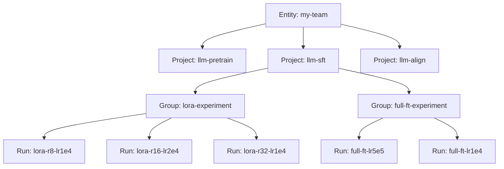

# Project-Run-Group 组织架构

大规模 LLM 实验会产生数百个 Run，合理的组织架构是高效管理的关键。

---

## 层级结构



## Project 划分策略

| **策略** | **示例** | **适用场景** |
| --- | --- | --- |
| 按训练阶段 | `pretrain` / `sft` / `dpo` / `eval` | LLM 多阶段训练流水线 |
| 按模型 | `llama3-8b` / `qwen2-7b` / `mistral-7b` | 同方法不同模型对比 |
| 按任务 | `chat` / `code-gen` / `tts` | 多任务/多场景 |
| 按阶段+模型（推荐） | `sft-llama3-8b` / `dpo-qwen2-7b` | **大多数 LLM 项目** |

## Group 使用场景
Group 将多个 Run 聚合为逻辑单元，Dashboard 上可展开/折叠查看。
### 场景一：分布式训练
多 GPU/节点训练时，每个 rank 独立上报但归为一组：
```python
import os

wandb.init(
    project="llm-pretrain",
    group="8xA100-run1",           # 同一训练任务
    name=f"rank-{os.environ['RANK']}",  # 区分 rank
    job_type="train",
)
```

### 场景二：消融实验
将同一批消融实验归组：
```python
wandb.init(
    project="llm-sft",
    group="ablation-lora-rank",
    name=f"r{lora_rank}-lr{lr}",
    tags=["ablation", f"r{lora_rank}"],
)
```

### 场景三：交叉验证
```python
for fold in range(5):
    wandb.init(
        project="llm-eval",
        group="5-fold-cv",
        name=f"fold-{fold}",
        job_type="eval",
        reinit=True,  # 同一进程多次 init
    )
    # ... 评估 ...
    wandb.finish()
```

## Job Type 分类
```python
# 数据准备阶段
wandb.init(job_type="data-prep")

# 训练阶段
wandb.init(job_type="train")

# 评估阶段
wandb.init(job_type="eval")

# 推理/部署阶段
wandb.init(job_type="inference")
```
在 W&B UI 中可按 Job Type 过滤，快速找到特定阶段的 Run。
## Tags 标签体系
建议建立统一的标签规范：
```python
tags = [
    "lora",          # 方法
    "r16",           # 关键超参
    "llama3-8b",     # 基座模型
    "alpaca-52k",    # 数据集
    "baseline",      # 用途标记
    "v2",            # 版本
]

wandb.init(tags=tags)
```

## Run 筛选与对比
### UI 筛选
在 Dashboard 中使用过滤器：
- `tags: baseline` → 所有 baseline 实验
- `config.lr: >1e-4` → 学习率大于 1e-4
- `summary.val/loss: <0.5` → 最终 val loss 低于 0.5
- `group: ablation-*` → 所有消融实验

### API 筛选
```python
api = wandb.Api()

# 筛选特定 tag 的 Runs
runs = api.runs(
    "my-team/llm-sft",
    filters={
        "tags": "baseline",
        "config.lr": {"$gt": 1e-4},
        "summary_metrics.val/loss": {"$lt": 0.5},
    },
    order="-summary_metrics.val/loss",  # 按 val loss 降序
)

for run in runs:
    print(f"{run.name}: val_loss={run.summary['val/loss']:.4f}")
```

## 大规模实验管理建议
📐**组织原则**：
1. **Project = 一个可独立比较的实验集**（如 SFT 实验）
2. **Group = 一个逻辑上的实验单元**（如一次消融、一次分布式训练）
3. **Tags = 可跨 Project 检索的元信息**（如方法、模型、数据集）
4. **Job Type = 流水线阶段**（不超过 5 种）
5. **Name = 人能一眼看懂的标识**（包含关键差异参数）
---

*← 返回：[[W&B 核心概念与环境搭建]]*
