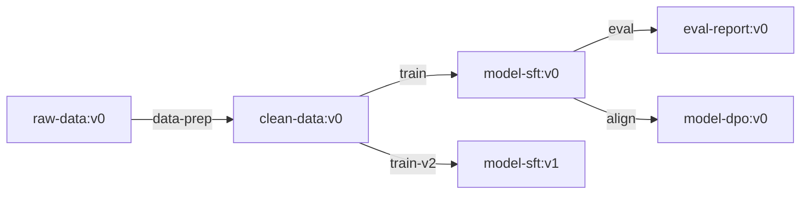

# Artifact 版本管理与血缘追踪

深入 Artifact 的版本控制机制、增量更新策略和完整的血缘追踪实现。

---

## 版本管理机制

### 版本号与别名

```python
import wandb

run = wandb.init(project="llm-sft", job_type="data-prep")

# 每次 log_artifact 自动递增版本
artifact_v0 = wandb.Artifact("sft-data", type="dataset")
artifact_v0.add_file("data/v1.jsonl")
run.log_artifact(artifact_v0)  # → sft-data:v0

# 下次更新
artifact_v1 = wandb.Artifact("sft-data", type="dataset")
artifact_v1.add_file("data/v2.jsonl")
run.log_artifact(artifact_v1)  # → sft-data:v1

# 别名管理
run.log_artifact(artifact_v1, aliases=["latest", "production"])
```

### 引用方式

```python
# 按版本号
artifact = run.use_artifact("sft-data:v0")

# 按别名
artifact = run.use_artifact("sft-data:latest")
artifact = run.use_artifact("sft-data:production")

# 完整路径（跨 entity/project）
artifact = run.use_artifact("my-team/llm-sft/sft-data:v2")
```

## 增量更新

对于大数据集，每次全量上传代价太高。使用 Reference Artifact 只记录引用：

```python
# Reference Artifact: 记录外部存储的引用而非文件本身
artifact = wandb.Artifact("large-dataset", type="dataset")

# 引用 S3 上的文件
artifact.add_reference("s3://my-bucket/data/train.jsonl")
artifact.add_reference("s3://my-bucket/data/val.jsonl")

run.log_artifact(artifact)
```

### 增量添加文件

```python
# 基于已有版本创建新版本
old_artifact = run.use_artifact("sft-data:latest")
new_artifact = wandb.Artifact("sft-data", type="dataset")

# 复制旧文件引用（不实际拷贝）
for entry in old_artifact.manifest.entries:
    new_artifact.add(old_artifact.get_path(entry), name=entry)

# 添加新文件
new_artifact.add_file("data/extra_samples.jsonl")

run.log_artifact(new_artifact)  # 只上传增量
```

## Artifact Metadata

```python
artifact = wandb.Artifact(
    "sft-data",
    type="dataset",
    description="清洗后的 SFT 训练数据",
    metadata={
        "num_samples": 50000,
        "format": "jsonl",
        "source": "alpaca + shareGPT",
        "cleaning_steps": ["dedup", "length_filter", "quality_score"],
        "avg_turns": 2.3,
        "languages": ["en", "zh"],
        "created_by": "data-pipeline-v2",
    },
)
```

Metadata 在 W&B UI 中可搜索、过滤，建议记录：

- 样本数量、格式
- 数据来源、清洗步骤
- 统计特征（平均长度、类别分布等）

## 血缘追踪（Lineage）

W&B 通过 `use_artifact`（输入）和 `log_artifact`（输出）自动构建 DAG：



### 完整流水线示例

```python
# === Stage 1: 数据预处理 ===
run1 = wandb.init(project="llm", job_type="data-prep")
raw = run1.use_artifact("raw-data:latest")       # 输入
raw_dir = raw.download()

# ... 清洗处理 ...

clean = wandb.Artifact("clean-data", type="dataset")
clean.add_dir("processed/")
run1.log_artifact(clean)                           # 输出
wandb.finish()

# === Stage 2: 训练 ===
run2 = wandb.init(project="llm", job_type="train")
data = run2.use_artifact("clean-data:latest")      # 输入
data_dir = data.download()

# ... 训练模型 ...

model = wandb.Artifact("model-sft", type="model", metadata={"val_loss": 0.85})
model.add_dir("checkpoint-best/")
run2.log_artifact(model)                           # 输出
wandb.finish()

# === Stage 3: 评估 ===
run3 = wandb.init(project="llm", job_type="eval")
m = run3.use_artifact("model-sft:latest")          # 输入
m_dir = m.download()

# ... 评估 ...

report = wandb.Artifact("eval-report", type="report", metadata={"mmlu": 0.72})
report.add_file("results.json")
run3.log_artifact(report)                          # 输出
wandb.finish()
```

在 W&B UI 的 Artifact 页面中即可查看完整的 DAG 图谱。

## API 查询血缘

```python
api = wandb.Api()

# 查看某个 Artifact 的来源 Run
artifact = api.artifact("my-team/llm/model-sft:v0")
print(f"生产者: {artifact.logged_by()}")

# 查看使用该 Artifact 的所有 Run
for run in artifact.used_by():
    print(f"消费者: {run.name} ({run.job_type})")

# 查看某个 Artifact 的输入依赖
run = api.run("my-team/llm/run-id")
for a in run.used_artifacts():
    print(f"输入: {a.name}:{a.version}")
for a in run.logged_artifacts():
    print(f"输出: {a.name}:{a.version}")
```

---

*← 返回：[[1数据与模型版本管理（Artifacts）]]*